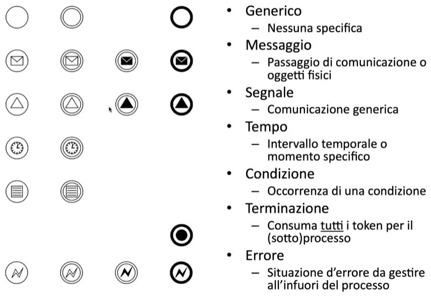
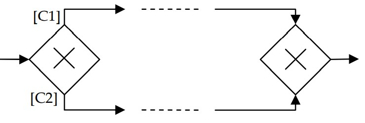
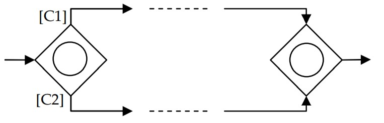
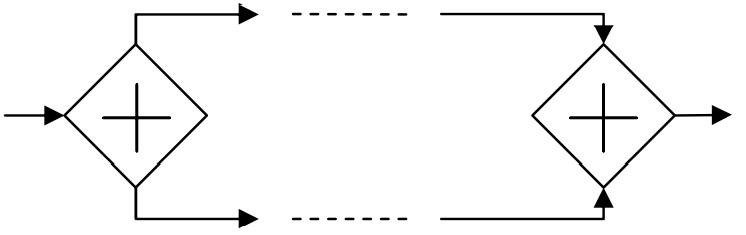
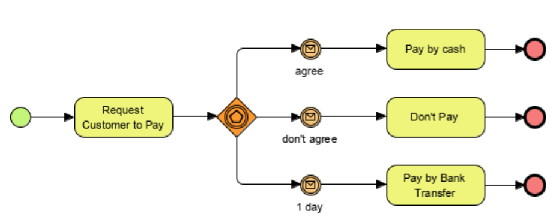
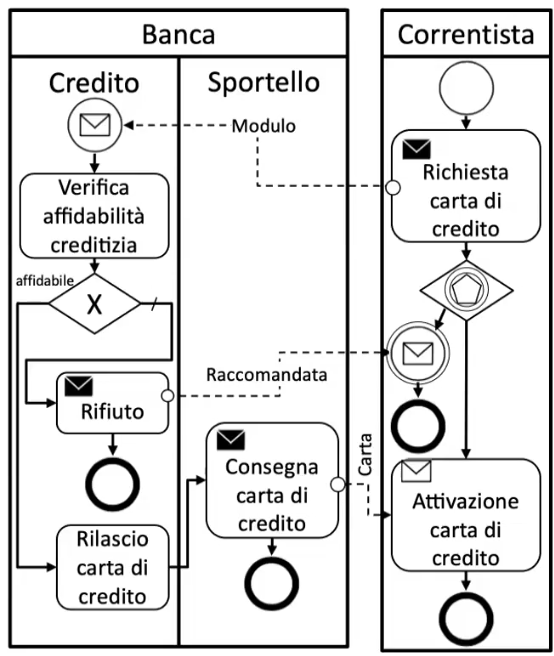
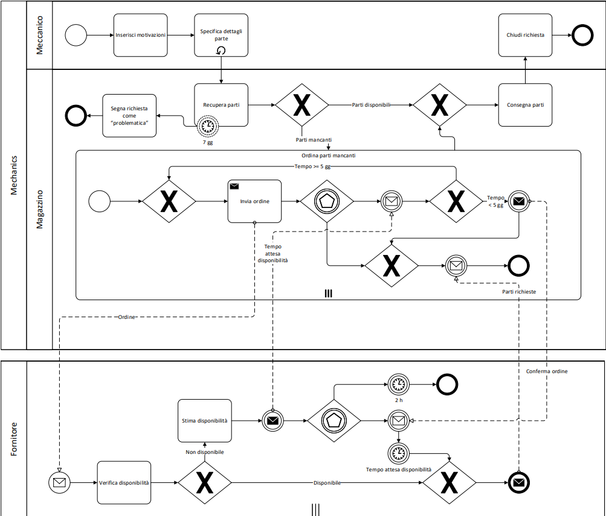

# BPMN per modellazione processi

Un processo di business è un insieme di attività eseguite secondo un ordine specifico per ottenere un certo obiettivo di business. Utilizziamo per modellare processi BPMN.  Business Process Modeling Notation (BPMN). 
Nella notazione BPMN gli eventi sono modellati con un cerchio al cui interno è disegnato un simbolo che ne definisce la tipologia.

Tipi di attività:

Tipi di Gateway:

- Gateway XOR

	
- Gateway OR

- Gateway AND

- Gateway EVENT BASED
 
 
Esempi di BPMN collaborativo, cioè con più pools e più lanes.

