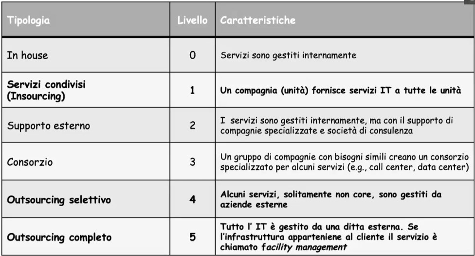

# Aspetto tecnologico dei SI 

## Tecnologie a livello applicativo 

### ERP
Enterprise Resource Process é una suite software che offre i vari moduli software per il SI riguardo il sistema operazionale interno. 
Il ruolo dei dati in un sistema ERP è fondamentale, in quanto uno degli scopi principali per cui viene installato un tale sistema in una azienda è il poter garantire l'unicità dei dati tra i vari moduli che gestiscono le diverse transazioni aziendali. È proprio l'unicità dei dati a livello operativo garantita dall'ERP che consente di ottenere unicità dei dati (e quindi eliminare ridondanze e incongruenze) anche a livello direzionale, e quindi poter considerare i dati, nel loro complesso, una risorsa aziendale.
Gli ERP sono caratterizzati da:

- unicitá dell'informazione : zero rindondanza e quindi zero incogruenza dei valori
- prescrittivitá : incorporano la logica di funzionamento dell'impresa. Norma cioé i processi. 
- modularitá : l'azienda 'sceglie' i moduli in base alle proprie esigenze.

I moduli di un ERP si possono classificare in:

- **ERP CORE**:
	- sistemi istituzionali : orizzontale, 
	- settoriali : verticali, specifici
	- direzionali : orizzontale
- **ERP ESTESO**: 	
	- SCM (Supply Chain Management)
	- PLM (Product Lifecycle Management)

### CRM 
Customer Relationship Manager:

- CRM analitico: analisi sul CRM operativo 
- CRM operativo: si divide in:
	- marketing 
	- servizio clienti 
	- vendite automatizzate
- CRM collaborativo: si occupa della fidelizzazione clienti principalmente

### Data Warehouse 

Il Data Warehouse é una grossa repository ottimizzata per analisi dei dati. Mantiene lo storico per garantire le analisi. 

#### DataMart
In un’architettura centralizzata esiste solo un grande DW mentre in caso di una soluzione distribuita abbiamo diverse sotto unità chiamate DataMart.
Il DW puó essere quindi: 

- **Centralizzato** (non compare il DM)
- **Distribuito** (DW + DM)
- **DW virtuale** (il DM lo ricopre interamente)

#### Tecniche ETL 
Extraction - Transformation - Loading
In che senso trasformazione? I dati non solo devono essere estratti da piú sorgenti e integrati nel DW, ma devono anche subire diversi trasformazioni.

- **estrazione**: statica o incrementale a seconda che i dati siano considerati per intero o solamente quelli più recentemente modificati.
- **trasformazione**: 
	- pulizia dei dati  
	- riconciliazione 
	- standardizzazione 
	- ricerca duplicati
- **caricamento**: si occupa di trasferire i dati nel DW secondo il modello multidimensionale da esso definito. 

L'ETL carica i dati in modo periodico, ad eccezioni magari di alcuni critici, i cui visualizzazione e analisi é necessaria. 

#### Modello logico del DW

##### Motori OLAP 
l data warehouse è un sistema di tipo OLAP (On Line Analytical Processing). Il paradigma OLAP è caratterizzato da poche transazioni e interrogazioni (query) complesse che richiedono aggregazione di dati. I sistemi OLAP hanno come misura di efficienza e di efficacia il tempo di risposta. Un sistema OLAP memorizza dati in formato aggregato, memorizza dati storici, archiviati secondo schemi multi-dimensionali (generalmente schemi detti a stella). Spesso, le interrogazioni accedono a grandi qualità di dati per rispondere a quesiti complessi come, per esempio, quale è stato il profitto netto realizzato dall’azienda in una certa area geografica nello scorso anno. I sistemi OLAP sono utilizzati per l’elaborazione di dati orientata al supporto decisionale, quindi sono adeguati a funzionalità collocate a livello di pianificazione e strategico della piramide di Anthony. 

###### Molap: Modello Multidimensionale 
Il fatto é l'elemento rilevante. Possiamo utilizzare un modello multidimensionale. Cioé vedere appunto le dimensioni di un fatto (dimensione temporale, spaziale, tipi di prodotto, clienti .. ecc.) come dimensioni spaziali. Possiamo quindi collocare i fatti in un ipercubo, dove ogni fatto é l'incrocio dei valori nella varie dimensioni.  

###### Rolap: Modello Relazionale
Rindondanza inversa al tempo di accesso. Diversi schemi:

- schema a stella
- schema a fiocco di neve

###### Holap: Modello Ibrido
Sia Molap (vantaggioso per tempo di risposta), sia Rolap (vantaggioso quando ci sono tanti dati). 
Utilizzo un modello Molap per gli utenti nel DM, i quali necessitano tempi di risposta molto veloci ma pochi dati. E utilizzo un modello Rolap per il DW. 

###### Operazioni Olap 
- Slice : vincoli sulle dimensioni
- Dice : selezione su piú dimensioni
- Rollup : tolgo granularitá, cioé aggrego, perdendo dettagli
- Drill Down: aggiungo granularitá

Ovviamente i dati nel DW ci sono sempre, tutte queste operazioni sono a un livello di visualizzazione. 

#### Data Mining 
Nel DW possiamo fare Data Mining. Cioé passare dalle informazioni alla conoscenza.
Due tipi di Data Mining: 
- supervised: conoscenze aggiuntive esterne
- unsupervised: non ha bisogno di conoscenze aggiuntive esterne

Tecniche di DM: 

- predittive: predicono eventi 
- descrittive: ti descrive pattern
- prescrittive: ''del futuro'', ti dice le decisioni da prendere

Regole associative. 
Analisi dei dati e si cercano elementi che compaiono piú spesso insieme. Cioé si cerca di capire pattern del tipo: $x \implies y$.
Confidenza sará: $\frac{x \implies y}{x}$
Cioé quanto é rilevante la regola. 

Regole di classificazione.  Cioé aggiungo classi ai miei dati. Un algoritmo mi aiuta a riconoscere tali classi. 
Uso l'80% dei miei dati come training set. 
Poi il 20% dei miei dati come test set. 
Possiamo definire una matrice diagonale. True Positive, True Negative, False  Positive, False Negative. Dove pos/neg si riferisce all'appartenza alla classe. 

$$precision = \frac{TP}{TP+FP}$$
$$recall = \frac{TP}{TP+FN}$$

Vogliamo precision e recall i piú alti possibili. 

Proprietá di classificazione: 
- accuratezza
- velocitá 
- scalabilitá 
- robustezza 

Algoritmo di classificazione:

- clustering: descrittiva, non supervisionata. Funzione di similaritá, cioé cerca sinergia tra i dati. 

Machine Learning, puó essere:

- supervised
- unsupervised 
- reinforcement learning 
- transfer learning 

### Approccio Make or Buy 
L’analisi Make-or-Buy prende in considerazione il fatto che sul mercato per alcuni interventi esistono dei prodotti software già pronti: i cosiddetti COTS (Commercial Off-The-Shelf o Commercially available Off-The-Shelf). L’adozione di questi software (alternativa Buy) si pone in alternativa alla possibilità di progettare e realizzare un prodotto su misura (alternativa Make).

## Livello di piattaforma 

Mentre l'ERP ha unificato i dati tra i databases risolvendo diversi problemi. Abbiamo comunque problemi per l'**integrazione** di moduli/applicazioni. 

- **Point to point**: ogni messaggio costruito per specifiche interfacce ha il suo destinatario.
	- message oriented middleware: c'è un intermediario
- **Hub and Spoke**: un hub, la cui logica sarà complessa, centralizzerà tutta la comunicazione.

## Architettura fisica 

Diversi modi per far collaborare differenti moduli. 

### Layer e tier 
Dividiamo i layer applicativi in 3 principali parti: 

- **presentazione** (front end)
- **logica applicativa** (back end)
- **gestione dei dati** (back end)

Posso dividere i diversi tiers in diversi modi a seconda dell'architettura distribuita che scelgo: 

- **Single Tiered**
- **Double tiered** = client-server :
	- **thin client** = client si preoccupa solo della parte di presentazione
	- **thick client** = client si preoccupa anche della parte applicativa.
- **Three Tiered** = teoricamente un tier per ciascun layer, anche se poi non è per forza così. Avrò quindi un middle tier. 
- **N-tiered** = ulteriore distribuzione dell'architettura. Si suddividono i layer logici in un numero arbitrario di tier fisici (eventualmente implementati come server farm invece che come singole macchine), al fine di aumentare la scalabilità e\o la sicurezza del sistema. Una tipica configurazione in ambito web è quella a cinque tier: client – web server – script engine – application server – database server.

### Scalabilità 
- Scalabilità verticale = potenzio la mia macchina, anche se spesso non è il migliore trade off e soprattutto prima o poi avrò limiti fisici. Il vantaggio è che non ho sbatti nella distribuzione delle applicazioni. 
- Scalabilità orizzontale/scale out = sfrutto il principio di **downsizing** cioè a parità di potenza di calcolo, tanti server di fascia bassa sono più convenienti di un singolo server di fascia alta. <- necessito però un sistema di load balancing per gestire tutti i servers. 

### Server Farm 
insieme di macchine fisiche che condividono il carico lavorativo. Le server farm hanno un alto lviello di downsizing proprio per loro natura. 
Possibili progettazioni di una Render Farm: 

- **RACS (Reliable Array of Cloned Services)**,cloning : a sua volta diviso 
	- Shared - nothing = dati tutti replicati, ottimo per read-only intensive applications. 
	- Cluster = shared - disk = le macchine condividono la memoria. 
- **RAPS (Reliable Array of Partitioned Service)**,partitioning : 
	cloning of the partitions: l'ibrido delle altre due, di base clono le singole partizioni per avere rindondanza. 

### Cloud Computing 
Architetture applicative accessibili da ovunque nel mondo attraverso la rete. Si basa sul concetto di **virtualizzazione** . 
Con il cloud computing abbiamo quindi un servizio on demand che ci permette di allocare - deallocare risorse in base alle nostre esigenze. E soprattutto pay as you go. 

- **Infrastructure as a Service** = completo controllo delle VM.
- **Platform as a Service** = controllo delle proprie applicazioni
- **Software as a Service** = solo applicazione, posso quindi configurare solo i parametri di tale applicazione. (ese: i vari cloud storage Dropbox, Onedrive, GDrive ecc. ecc.).

Il cloud potrà quindi essere:

- **Private Cloud** = solo una organizzazione
- **Community Cloud** = poche organizzazioni con interessi comuni
- **Public Cloud** = servizio fornite a tutto il pubblico. Costi molto limitati. 
- **Hybrid Cloud** = una combo delle precedenti. 
Ogni azienda/attività potrà scegliere se gestire l'architettura fisica del SI internamente, parzialmente fuori azienda,  esternamente affidandosi a un'offerta cloud che potrà essere Iaas, Paas, Saas.

### Insourcing e Outsourcing 

Si può anche possedere direttamente i server fisici o appoggiarsi a enti esterni (outsourcing) sempre facendo riferimento ai tipi di cloud e servizi possibili. 
Possiamo distinguere 6 livelli, dall'insourcing al outsourcing completo.

> Ricordati che l'insourcing/outsourcing è diverso da make/buy 

## Sicurezza dei sistemi informativi 

Sicurezza per i dati, la nostra risorsa piú preziosa. 
Dobbiamo proteggere i dati da minacce fisiche, logiche e accidentali (magari bug di softwares o errori umani).

### Proprietà della sicurezza
La sicurezza ha 4 proprietá fondamentali: 

- **Integralitá**: il messaggio non viene modificato nel suo tragitto mittente-destinatario. 
- **Autenticitá**: il messaggio deve dimostrarmi la sua autenticitá.
- **Riservatezza**: il messaggio deve arrivare solo al destinatario. 
- **Disponibilitá**: il sistema deve sempre garantire disponibilitá all'utente.

### Attacchi di rete 

- **Hijacking**: man in the middle (attacca l'integralitá)
- **Spoofing**: ci si finge qualcun altro (attacca l'autenticitá)
- **Sniffing**: si ascolta in modalitá passiva i messaggi (attacca riservatezza)
- **Flooding**: attacchi DOS (attacca la disponibilitá)

### Attacchi Applicativi 

- trojan 
- backdoor 
- ransomware 
- spyware

### Crittografia simmetrica e asimmetrica 

- **Chiave simmetrica**: si usa una chiave che ha sia A e B per cifrare i messaggi
- **Chiave asimmetrica**: la chiave non viene mai scambiata ma i messaggi si cifrano comunque, usando due chiavi: 
	- chiave privata
	- chiave pubblica

Solo la chiave pubblica puó decifrare un messaggio generato dalla privata. 

### Impronta e firma digitale 
La firma digitale é utilizzata per verificare l'integralitá e consiste in una funzione di hash. 
> La firma digitale é la cifratura da parte del mittente (con la sua chiave privata) del digest del messaggio. 

La firma digitale la verifico con la chiave pubblica. Il senso è che una volta verificato il messaggio con la chiave pubblica, solo l'ente che possiede la chiave privata può aver scritto quel messaggio (l'hash del messaggio è unico).

### Certificati digitale 
Garantisce l'autenticitá della chiave pubblica. I certificati vengono gestiti da sistemi detti **Public Key Infrastructure** (PKI), che si occupano di emettere e revocare i **PKC** (Certificato a Chiave Pubblica) attraverso certificate authority **CA** e registration authority **RA**.
Tali enti hanno strutture gerarchice ad albero per garantire soliditá. 
La Certification Authority rilascia certificati non la Registration Authority.

Un fattore critico dunque é come conservare tali chiavi private:

- hardware
- software
ma anche come scambiarsele, prima di utilizzarle:
- out-of-bound: si usa un canale esterno al canale utilizzato per comunicare
- ente esterno 
- crittografia asimmetrica: si usa infatti l'asimmetrica (basata sulle chiavi pubbliche) per scambiarsi il messaggio contenente le chiavi private in modo sicuro. 

### Regole e politiche d'accesso

Due possibili classificazioni dei sistemi in base a come viene gestita la sicurezza:

- **sistema aperto**: tutto ció che non é esplicitato si puó fare
- **sistema chiuso**: tutto ció che non é esplicitato non si puó fare 

Oltre a questa macro classificazione vengono anche considerati altri livelli di sicurezza.
Vengono effettuati diversi controlli d'accesso basati su **regole**. Le regole d'accesso da parte di autorità seguono tutte lo schema: (subject,object,right,constraint) . 
Oltre a queste regole d'accesso possiamo poi definire della politiche di accesso:

### Politiche d'accesso

1) **DAC** - Discrezionale, cioé il proprietario di un oggetto puó dare il permesso di modificare tale oggetto 
2) **MAC** - Mandatorio, tutto é classificato automaticamente da un ente centrale. I propentari non possono autorizzare altri proprietari. 

Le regole d'accesso coinvolgono: 

- soggetti: 
	- persone,gruppi,app
- oggetti:
	- databases, tabelle varie
- diritti: 
	- tipi di azioni consentiti
- vincoli:
	- ulteriori regole e condizioni da applicare ai diritti

#### MAC 
Mentre il DAC si basa sul concetto di proprietá, il mandatorio si basa tutto sulla classificazione di oggetti e soggetti.
Idea generale: 
Tipi di classificazione degli oggetti: 

- unclassified
- confidential 
- secret 
- top secret 

2 regole:

1) **NO READ UP**: Ogni soggetto puó vedere solo gli oggetti di livello uguale o inferiore. 
2) **NO WRITE DOWN**: Ogni soggetto puó scrivere solo nelle classi maggiori o uguali alla sua. 

Viene quindi mantenuto un database multi livello, che mostra i dati in base alla classe di appartenenza. 

### Firewall 
Fondamentale per filtrare l'unico punto di contatto con il mondo esterno. Il Firewall peró deve essere configurato correttamente:

- Packet inspection/filtering
- Application Gateway 

#### IDS - Intrusion Detection System 
sensori che continuano a monitorare attraverso log. E ulteriori analisi sui vari dati raccolti. 
Tutti gli IDS fanno funzione di **allerting and response** ma si distinguono se hanno una risposta attiva o semplicemente avvisano e basta.

## Archimate

Punto di contatto tra Archimate e BOAT: 

Il device è **fisico** . 

Attenzione i collegamenti (path) non sono linee! Stiamo ragionando a livello fisico .. la fibra è diversa dal ethernet o dallo spago! 

Esempio di DW scritto in Archimate:

 

(normalmente all'esame specifichiamo bene la struttura interna del nodo server).
Tipi di Double-Tiered:

Tipi di virtualizzazione:

Classico server virtuale: 

Struttura standard per punto di contatto internet/rete aziendale

