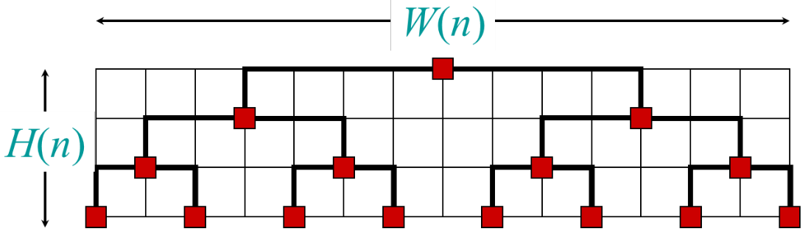
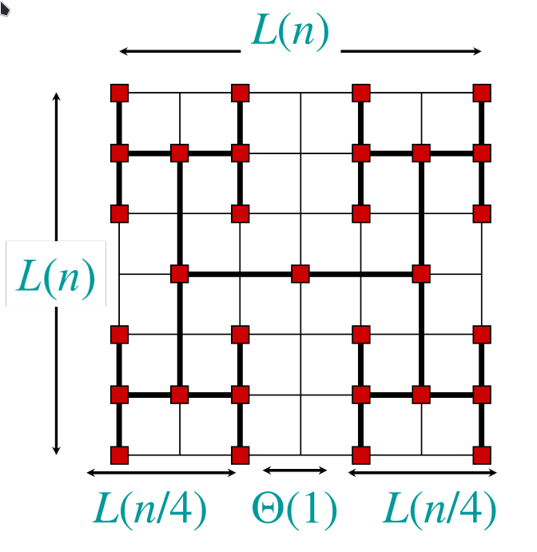

# Divide and Conquer paradigm 

Divide and conquer is just one of several powerful techniques for algorithm design, which often leads to efficient algorithms. These algorithms can generally be easily analyzed using recurrences and the Master Theorem. 
A general DandC algorithm is built by:

1. Divide problem in sub-problems
2. Conquer sub-problems
3. Combine sub-problems to solve the main problem

## Merge Sort

Merge Sort is the typical example of D&C algorithms.  
$$T(n) = 2T(\frac{n}{2}) + \Theta (n)$$
Note that the number of subproblems are 2, $\frac{n}{2}$ is the size of each subproblem and $n$ is the work necessary to combine the subproblems (merge part of the algorithm). 
We can solve this using the master theorem (case 2 of master theorem): $f(n)=\Theta (n \log (n))$. 

## Binary search

1. Divide problem in sub-problem cutting in the middle element of the array
2. Conquer sub-problems
3. Combine sub-problems to solve the main problem, in this case $\Theta (1)$ because we have to combine nothing

$$T(n) = 1T(\frac{n}{2}) + \Theta (1)$$
$$\begin{aligned}
&n^{\log _b a}=n^{\log _2 1}=n^0=1 \Rightarrow \operatorname{CASE} 2(k=0) \\
&\Rightarrow T(n)=\Theta(\lg n) .
\end{aligned}$$

## Powering a number 

The naïve algorithm is $\Theta(n)$ while here is the divide and conquer approach:

$$a^n= \begin{cases}a^{n / 2} \cdot a^{n / 2} & \text { if } n \text { is even } \\ a^{(n-1) / 2} \cdot a^{(n-1) / 2} \cdot a & \text { if } n \text { is odd }\end{cases}$$

So the complexity is:

$T(n)=T(\frac{n}{2}) + \Theta (1)= \Theta (log(n))$

Note that in front of $T(\frac{n}{2})$ there isn't 2:because the numbers of sub-problems is 1. You haven't to apply the sub-problem twice (it's just a multiplication of 1 recurrence). 

## Matrix Multiplication and Strassen's algorithm 

Matrix multiplication is one of algebra’s simplest operations and it's also one of the most fundamental computational tasks and one of the core mathematical operations in today’s neural networks. Naïve implementation is $\Theta (n^3)$:

```` C
for(i from 1 to n){
	for(j from 1 to n){
		R[i,j] = 0;
		for(k from 1 to n){
			R[i,j] = R[i,j]+ a[i,k] × b[k,j];
		}
	}
}
````

The Strassen's idea is based on using 7 multiplications and 4 adds.

$$\left[\begin{array}{ll}
r & s \\
t & u
\end{array}\right]=\left[\begin{array}{ll}
a & b \\
c & d
\end{array}\right] \cdot\left[\begin{array}{ll}
e & f \\
g & h
\end{array}\right]$$

$$\begin{array}{ll}
P_1=a \cdot(f-h) & r=P_5+P_4-P_2+P_6 \\
P_2=(a+b) \cdot h & s=P_1+P_2 \\
P_3=(c+d) \cdot e & t=P_3+P_4 \\
P_4=d \cdot(g-e) & u=P_5+P_1-P_3-P_7 \\
P_5=(a+d) \cdot(e+h) & \\
P_6=(b-d) \cdot(g+h) & \\
P_7=(a-c) \cdot(e+f) &
\end{array}
$$
So the complexity is:
$$T(n)=7 T(n / 2)+\Theta (n^2)$$

Using Master theorem, case 1: 

$$n^{\log _{b a} a}=n^{\log _2 7} \approx n^{2.81} \Rightarrow \Theta\left(n^{\log_2 7}\right)$$ 
The number $2.81$ may not seem much smaller than 3, but because the difference is in the exponent, the impact on running time is significant. In fact, Strassen’s algorithm beats the ordinary algorithm on today’s machines for $n \ge 32$ or so.

## VLSI Layout

Embed a complete binary tree with $n$ leaves in a grid using minimal area.



where $H(n)=H(\frac{n}{2})+\Theta (1)=\log _2 (n)$  and $W(n)=2W(\frac{n}{2})=\Theta (n)$ using respectively the second and first case of MT. 
So we obtain a total complexity (area) of $\Theta ( n \log (n))$ that can be improved using this new arrangement :



This new solution based on Divide and Conquer has a total complexity of $\Theta (n)$ obtained by $L(n) \cdot L(n)$ where $L(n)=2L(\frac{n}{4}) + \Theta (1)$ which is $\sqrt{n}$ using the MT (first case). 


