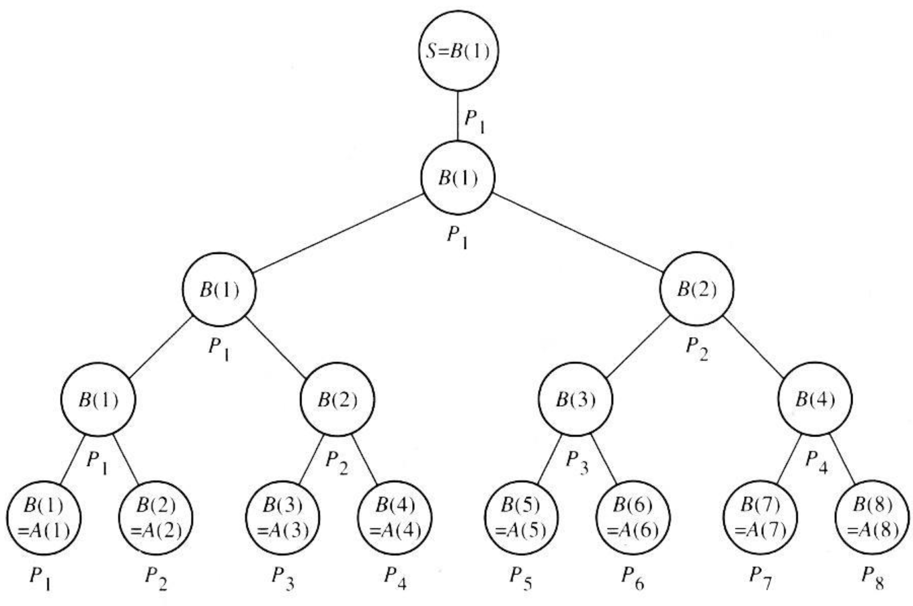
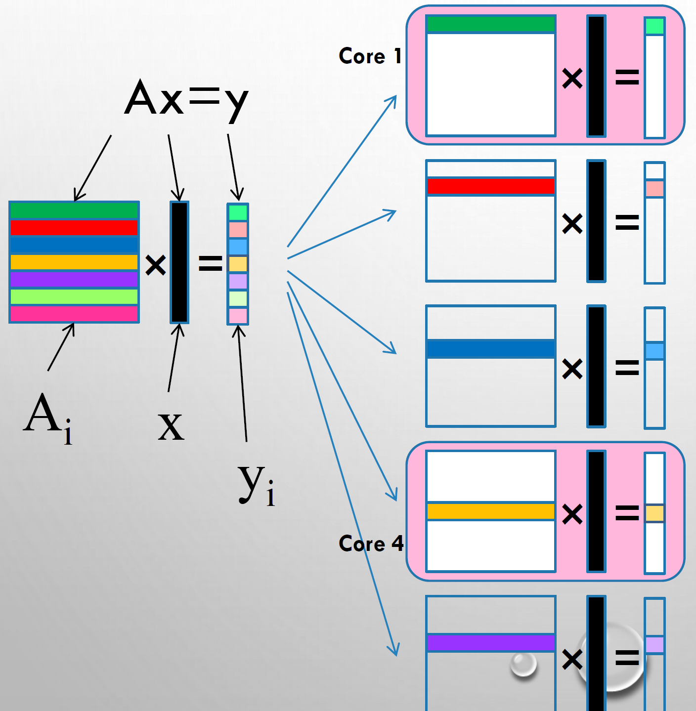
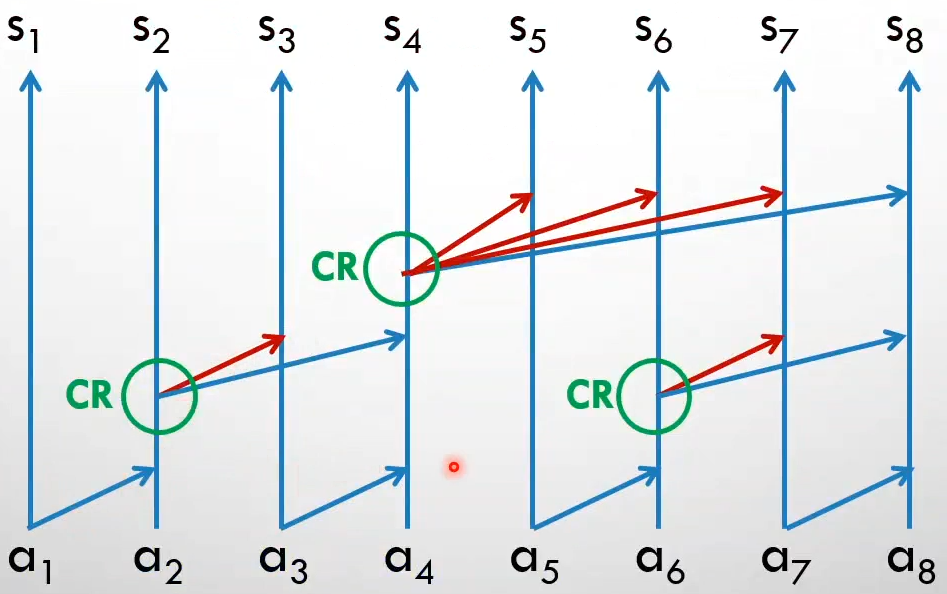
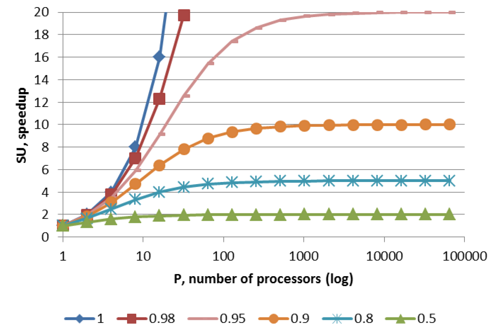

# PRAM

A machine model is fundamental to reason about algorithms without considering the hardware. For algorithms applicable to parallel computers we use PRAM models.
$M'$ is a PRAM model and it's defined as system $<m, x , y , a >$ where $m_1,m_2 \dots$ are different rams machines called processors, $x_1,x_2, \dots$ are input memory cells, $y_1,y_2, \dots$ are output memory cells and $a_1,a_2 \dots$ are shared memory cells.  
PRAM are classified based on their read/write abilities:

- exclusive read: all processors can simultaneously read from distinct memory locations
- exclusive write: all processors can simultaneously write to distinct memory locations
- concurrent read: all processors can simultaneously read from any memory location
- concurrent write: all processors can write to any memory location. Different criteria can apply in this case:
	- priority CW: processors have different priorities 
	- common CW: processors complete writes iff the written values are equals 
	- random CW

Some definitions: 

- $T^*(n)$ is time to solve problem using best sequential algorithm
- $T_p(n)$ is time to solve problem using $p$ processors 
- $S_p(n)=\frac{T^*(n)}{T_p(n)}$ is the speedup on $p$ processors
- $E_p(n)=\frac{T_1(n)}{p T_p(n)}$ is the efficiency 
- $T_{\infty}(n)$ is the shortest run time on any $p$ 
- $\mathrm{C}(\mathrm{n})=\mathrm{P}(\mathrm{n}) \cdot \mathrm{T}(\mathrm{n})$ is the cost that depends on processors and time
- $\mathrm{W}(\mathrm{n})$ is the work, which is the total number of operations

There could be also some variants of PRAM, like for example: 

- bounded number of shared memory cells
- bounded number of processor
- bounded size of a machine word 
- handling conflicts over shared memory cells

Any problem that can be solved by a $p$-processors PRAM in time $T_p$ can be solved by a $p’$ (with $p' \le p$) processors PRAM in time: $$T_{p'}=\frac{p T_p}{p'}$$ And in a similar way (assuming $m’ \le m$) any problem that can be solved by a p-processor and m-cells PRAM in t steps can also be solved by a processors and $m’$-cells PRAM in $$T_{p,m'}=\frac{m T_{p,m}}{m'}$$

## Sum of vector elements

Parallelization of a sum of vector elements with the naïve algorithm can be performed with $T*(n)=\Theta (n)$ while with a popular parallel pattern can be performed with $T_p=2+\log(n)$ . 

## Matrix-vector multiplication 

Embarrassingly parallel because there isn't cross-dependence (just the concurrent read over the vector $x$).  

The matrix $A$ can be subdivided in submatrices of size $\frac{n}{p}n$ .
This is so easy that from $T_1(n)=\Theta (n^2)$ we obtain $T_p(n)=\Theta (\frac{n^2}{p})$ (the ideal case is $p=n \rightarrow \Theta (n)$) so we have linear speedup and perfect efficiency $E_p=\frac{T_1}{pT_p}=1$ . 

## Matrix-matrix multiplications

This algorithm is characterized by concurrent read but only exclusive write so runs on CREW PRAM. Let $p=n^3$ processors we can compute the multiplication in $\log (n)$ assigning to each processor a row and a column and the corresponding cell in the result matrix. Note that $\log (n)$ is because you have to perform the sum of all elements of the vector (the vector obtained multiplying the row with the column). 

## Prefix Sum example

The previous PRAM algorithms make the same amount of work of the work done by a single processor, simply faster using parallelization. 
The prefix sum problem is basically the same of a sum of the vector elements but exploiting idle processors. 

The idea is to make more work in same time taking advantage of idle processors in sum. Basically we used all the processors all the time. Efficiency is $1$ and the complexity is still $log(n)$. The goal of this algorithm (and the difference of a normal sum vector elements) is that we not only obtain the final sum but also the sum of all the prefixes.
For example from $a,b,c,d,e$ we obtain $a$ , $a+b$ , $a+b+c$ , $a + b + c + d$ and $a+b+c+d+e$ . 

## Boolean DNF (sum of product)

Example of CRCW where each processor is assigned to a product. 
$$X = a_1 b_1 + a_2 b_2 + a_3 b_3$$
Not all processors write the result $X$ of the product but those that do, write $X=1$. 
Very simple parallel solution where the time is $O(1)$ . It works on CRCW PRAM with common, random and priority write. 

## Amdahl's law

Gene Amdahl objected to parallelism saying that computation consists of interleaved segments of 2 types:

- a serial segments that cannot be parallelized 
- parallelizable segments 

The law is 'pessimist' since if the parallelized part is a fixed fraction $f$ of the total computation, this will mean that given a problem with inherent $f=0.9$, there will not sense to use more than 10 processors... showing the limits of parallelization.

$$SU_p=\frac{T_1}{T_p}=\frac{T_1}{T_1(1-f) +\frac{f}{p}}=\lim_{p \rightarrow \infty} = \frac{1}{1-f}$$

## Gustafson's law

> "We feel that it is important for the computing research community to overcome the "mental block" against massive parallelism imposed by a misuse of amdahl's speedup formula." 

The key points of Gustafson are that portion $f$ is not fixed and only absolute serial time is fixed. The end result of Gustafson's law is that we could always increase up the parallelized part of the computation **redoing** the sequential work more than one time. 
So basically we map the work to more processors and then we **repeat the initialization/sequential part** more than one time to permits an infinite theoretical speedup. 

## ISPC for implementing PRAM algorithms. 

ISPC is a compiler for a variant of the C language that focuses on accelerating applications according to the SPMD paradigm. It parallelizes at the instruction level by distributing instructions over vectorized architectures (SSE and **AVX** units) for x86, ARM and GPUs. 
The documentation for ISPC can be found here: https://ispc.github.io/ispc.html . 
When a C/C++ function calls an ISPC function, the execution model instantly switches from a serial model to a parallel model, where a set of program instances called **gang** run in parallel. The parallelization is transparent to the OS and is managed entirely inside the program. Unless otherwise specified, variables are local to each program instance inside a gang. Doing so is memory-inefficient, and whenever possible variables should have the attribute `uniform` to signal that they are shared among all instances of the gang. This also opens the door to issued arising from concurrent accesses to the same `uniform` variable.
Each program instance in a gang has knowledge about the gang's size and its own index within the gang. The gang's size is stored in the `programCount` variable, while the instance's index in the gang is stored in the `programIndex` variable. They can be used to distribute the computation over the gang members by manually assigning the data they should work on.
