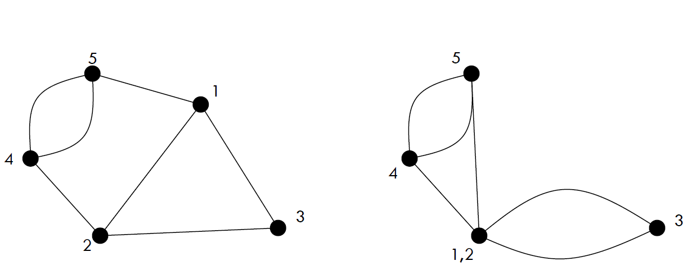

# Randomization 

## Las Vegas vs Montecarlo algorithms. 

An algorithm is randomized if it is in some way based on some random variable. There are mainly 2 different types of randomized algorithms:

- **Las Vegas** algorithms are **exact** : always provide correct solution.
- **Monte Carlo** algorithms are **approximate** : try to find an approximation of the solution in a given limited time (bound) and maybe it finds a wrong one.

Basically a Las Vegas algorithm is a MC algorithm with error probability of 0. Because of these characteristics we evaluate Las Vegas algorithms looking the **expected running time** , while we evaluate Monte Carlo algorithms looking the **maximum running time**. 

### Why the fuck we use MC algorithms if maybe they are wrong?

Monte Carlo algorithms are generally used for problems that are very very difficult, like for example the Karger's Min Cut algorithm (which is NP!). The MC solution for min-cut problem runs in polynomial time with the limit that we accept an error probability, that we can always tuning with the number of runs. 
In case MC algorithm is for a decision problem we can it in two classes: 

- two-sided error: MC algorithm which has non-zero error probability for both two possible outputs. 
- one-sided error: MC algorithm that has non-zero error probability only for one of the two possible outputs. 

## Karger’s approach

A **minimum cut** of a graph is a partition of the vertices of a graph into two disjoint subsets with the minimal amount of deleted edges. Karger's algorithm is an algorithm to find a min-cut on a multi-graph using a randomized approach. Multigraphs are undirected graphs that do not allow for self-loops but allow for multiple edges between the same node pairs.

Contracting an edge means to collapse a vertex into another neighbor vertex (removing self loops):

The Karger's algorithm consists in contracting edges uniformly at random until only two vertices remain. These two vertices correspond to a partition of the original graph and the edges remaining in the two vertex graph correspond to a cut in the original input graph.
The number of edges in the resultant graph is the cut produced by Karger’s algorithm. 

The key idea of the algorithm is that it is far more likely for non min-cut edges than min-cut edges to be randomly selected and lost to contraction, since min-cut edges are usually vastly outnumbered by non min-cut edges. Subsequently, it is plausible that the min-cut edges will survive all the edge contraction, and the algorithm will correctly identify the min-cut edge.

Karger’s algorithm is a Monte Carlo algorithm and cut produced by it may not be minimum. For example, the following diagram shows that a different order of picking random edges produces a min-cut of size 3.
The probability can be increased by repeated runs of basic algorithm and return minimum of all cuts found.

Each run of the algorithm is $O(n^2)$ and since the possibility of pick one of the edges of the min-cut during an iteration is $\binom{n}{2}$ we have to minimize $l \binom{n}{2}$, keeping in mind that we would like to have minimize probability of error $\frac{1}{\text{poly}(n)}$ increasing the number of runs. The best optimization is with $l =\log (n)$ . So the final complexity is $O(n^4 \log (n))$.

### Faster version of Karger and Stein 

Karger’s algorithm can be refined by observing that the probability of picking an edge belonging to the cut of minimum size is low for the first contractions and grows progressively as we go towards the end of the execution. This motivates the idea of switch to a faster algorithm during the first contraction steps and do exactly like Karger’s algorithm in the last phase.  From a multi-graph $G$, if $G$ has at least 6 vertices, repeat twice: run the original algorithm down to $\frac{n}{\sqrt{2}}+1$ vertices **recursively** on the resulting graph and each time return the minimum of the cuts found in the two recursive calls. When there multigraph has less than 6 vertices, it simply runs the normal Karger's algorithm. 
Since the recursivity, the faster version has this complexity:
$$T(n)=2T \left( \frac{n}{\sqrt 2} \right ) + \Theta (n^2)$$
so (using master theorem, case 2) we have $T(n)=n^2 \log (n)$ . Since we want to minimize the error of probability of $\frac{1}{\text{poly}(n)}$ , we find that with $\log ^2 (n)$ runs we can do so the final complexity is $O(n^2 \log^3(n))$ .

