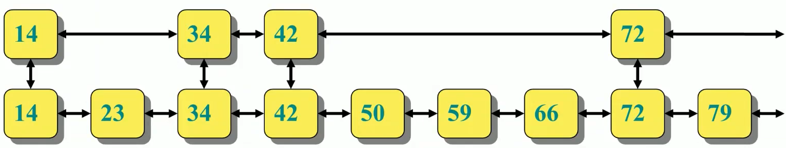
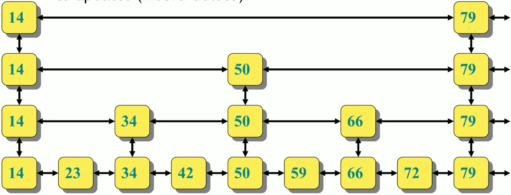

# Randomized data structures 

## Disjoint sets 

Disjoint sets is a data structure very useful for operations on graphs. A collection of sets of objects, not intersected and each identified by a representative element.
A representative is some member of the set (often it often does not matter which element is the representative irrelevant).
A couple of operations over the disjoint sets:

````C
make(x);
union(x,y);
find-set(x);

````

The most efficient way is using 'forests' (rooted trees, where each tree is a set) with 2 optimizations: 

- Union by Rank: Each node is associated with a rank, which is the upper bound on the height of the height of subtree rooted at the node. Then when ```union(x,y)```, let the root with smaller rank point to the root with larger rank.
- Path Compression: used in ```find_set(x)``` operation, make each node in the path from $x$ to the root directly point to the root. 

````C#
public class DisjointSet 
{
    private int[] _set;
    private int[] _rank;

    public DisjointSet(int size)
    {
        _set = new int[size];
        _rank = new int[size];
    }
    
    public void MakeSet(int x)
    {
        _set[x] = x;
        _rank[x] = 0;
    }
    
    public int FindSet(int x)
    {
        if (x != _set[x]) return FindSet(_set[x]);
        return x;
    }

    public void UnionSet(int x, int y)
    {
        var parentX = FindSet(x);
        var parentY = FindSet(y);
        if (_rank[x] > _rank[y]) _set[parentY] = parentX;
        else
        {
            _set[parentX] = parentY;
            if (_rank[x] == _rank[y]) _rank[y]++;
        }
    }
}
````

https://github.com/martinopiaggi/Unity-Maze-generation-using-disjoint-sets

## Treaps 

Treaps are binary trees where each child has a greater priority to his parent, like max heap. To do this, each element $x$ is assigned a priority chosen uniformly at random before the insertion.
With this magic trick, a treap achieve essentially the same time bounds of balanced trees with an expected number of rotations performed of 2 rotations for each operation. Also they are very simple to implement compared to AVL or RB trees for example.  If $n$ elements are inserted in random order into a binary search tree, the expected depth is always $1.39 log(n)$. 

Explained in spaghettata mode: I have a binary tree (so very good to search) but I have always the problem to balance it. So I assign to each key a random priority and then I consider my tree not only as a tree but also as a heap and I want to preserve the property of the heap using rotations. Note that the heap can be min heap or max heap without problems. 

Ops: 

- insert operation follows the logic of the insert in a BST. 
- delete operation is dual. The element is searched and once the node to be deleted is found we rotate the node left/right until the node to be deleted is a leaf. Once the element to be deleted is a leaf we simply remove it. 
- min and max can be found following the left/right subtree of all encountered nodes from root to leaf. 
- Merge of two treaps can be performed finding a key greater than the max of $T_1$ and smaller than the min $T_2$ . Then we will add this key with lower probability (in max heap version) as root with $T_1$ as left subtree and $T_2$ as right subtree. The algorithm then deletes the root from the treap. The expected running time is $O(\log (n))$. 
- The split of two treaps can be performed adding a key that doesn't exists in the tree and giving it maximum priority (in case of max heap) so that it will end up as the root. 


All these operations have $O(\log (n))$ time complexity. 

## Skip Lists 

Skip lists similar benefits to treaps but are based on an alternative randomized data structure. The starting point is a **sorted** linked list, a dynamic structure with $O(n)$ for search elements. The next step is adding a second sorted linked list shorter to 'skip' some elements of the list.




Let's expand the idea further: 




We randomly decide to promote an element to upper level. It's proved that the there will be $\log (n)$ levels/lists and at the end there will be a 'balanced' structure. 

Ops: 

- search is going to the 'right element' in the highest-level list until it is found an element greater than the one searched. If it's not already found the searched one and the element selected is lower than the one searched, it will be necessary to go to the lower list using the 'down' pointer. This process is repeated until the element is found or the last list is reached and there are not 'down pointers'.
- insert (after the 'search operation') is like in a normal linked list but at the end you will randomly choose if 'promote' it .
- deletion (after the 'search operation') is like in a normal linked list but at the end you will check to delete the element from all the lists.

All these operations have $O(\log (n))$ time complexity. 