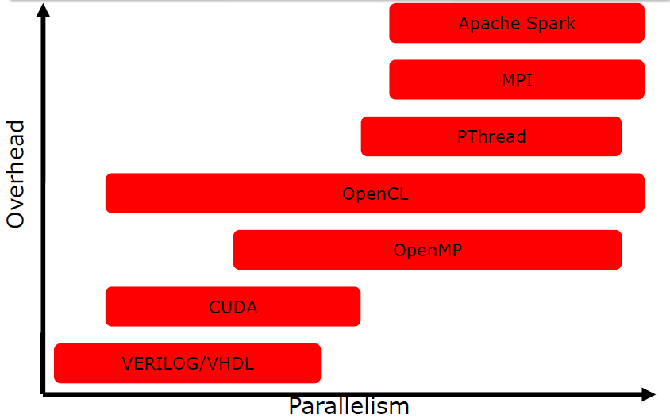

[Parallel Patterns](10.Parallel%20Patterns.md) 
[PThread](11.PThread.md)
[OpenMP](12.OpenMP.md)
[MPI](13.MPI.md) 

# Parallel Programming

Parallel programming can be a powerful tool for improving the performance of code and for taking advantage of the capabilities of modern hardware. 

Main advantages:

- performance
- cheaper than sequential implementation 
- basically the ''big problems'' can only solved by parallel algorithms 

## Brief history of parallel programming 

PP has continued to increase during time driven by the development of new hardware architectures and the need for more computational power. Some of the main steps of PP evolution include:

- (80s and 90s): the development of high-level languages and parallel libraries made it possible applying PP to a wider range of applications.
- (2000s): the widespread adoption of multicore microprocessors began to drive the development of new parallel programming techniques and tools. 
- (10s): the rise of manycore architectures, such as GPUs, led to the development of new parallel programming approaches, such as data parallelism and task parallelism.

| TECHNOLOGY | TYPE | YEAR | AUTHORS |
| :---: | :---: | :---: | :---: |
| Verilog/VHDL | Languages | 1984//1987 | US Government |
| MPI | Library | 1994 | MPI Forum |
| PThread | Library | 1995 | IEEE |
| OpenMP | C/Fortran Extensions | 1997 | OpenMP |
| CUDA | C Extensions | 2007 | NVIDIA |
| OpenCL | C/C++ Extensions + API | 2008 | Apple |
| Apache Spark | API | 2014 | Berkeley |

Manycore architectures are becoming increasingly common in modern computing, and are often used in applications that require a lot of computational power, such as data analysis, scientific simulations, and machine learning. A GPU, or graphics processing unit, is a type of manycore architecture that is specifically designed for high-performance graphics and parallel computation. GPUs are typically composed of hundreds or thousands of small, simple cores that are optimized for performing the parallel computations required for rendering graphics.

## Independency from architecture and automatic parallelization 

The design of parallel algorithms should focus on the logical steps and operations that are required to solve a particular problem, rather than the details of how those steps will be executed on a specific hardware platform. **But** the performance of a parallel algorithm can vary significantly depending on the hardware on which it is run. Therefore design a "good" parallel algorithm is not enough: which parallelism is available on the considered architecture is more important since non suitable parallelism can introduce overhead. 

| TECHNOLOGY | Target Independent Code? | Development Platforms |
| :--- | :--- | :--- |
| Verilog/VHDL | Yes (behavioral) No (structural) | Mainly Linux |
| MPI | Yes | All |
| PThread | Yes | All - Windows through a wrapper |
| OpenMP | Yes | All - Different compilers |
| CUDA | Depend on CUDA capabilities | All |
| OpenCL | Yes | All - Different compilers |
| Apache Spark | Yes | Mainly Linux |

## Automatic Parallelization

Automatic parallelization refers to the process of using a compiler or other tool to automatically transform sequential code into parallel code without requiring explicit parallelization directives from the programmer. 
In practice, it is not always possible for the compiler to accurately parallelize code. For example the compiler is not able to infer if 2 pointers of 2 arrays are pointing different region of RAM and are not overlapping while the programmer knows how to design the parallel algorithm. 
So parallelization by hand is predominant and the programmer needs to give hints to the tool: the concept is that the programmer needs to describe the parallelism to the compiler to make it exploitable.  

## Dependency Analysis 

To determine if a set of statements can be executed in parallel, we have to do an analysis since not everything can be executed in parallel. 

In general to execute in parallel: 
	- statement order must not matter 
	- statements must not have dependencies 

The Dependency Analysis is performed over IN and OUT sets of the statements. The IN set of a statement is the set of memory locations (variables) that may be used in the statement. The OUT set of a statement is the set of memory locations that may be modified in the statement. 

Often loops can be parallelized (we have to "unroll" the iterations), but there are also **loop-carried** dependencies, which often prevent loop parallelization. 
A loop-carried independence is a independence between two statements that is present only if this two statements are in two different iterations of the same loop. 

## Code extensions and languages for parallelism

The advantages of using extensions (such as OpenMP or MPI) of sequential languages instead of native parallel languages are many: 

- Familiarity and ease of use
- Interoperability: this can be especially useful for codebases that use a mix of sequential and parallel code.
- Portability: Extensions of sequential languages are often designed to be portable across different platforms and architectures.
    
Overall, the advantages of using extensions of sequential languages instead of native parallel languages depend on the specific needs and goals of the code being developed. 

Mainly the 3 macro paradigms of parallelism are: 
 
- Single instruction, multiple data: most of the modern GPUs 
- Multiple instruction, single data: experimental
- Multiple instruction, Multiple data: threads running in parallel on different data

| TECHNOLOGY | SIMD | MISD | MIMD |
| :--- | :--- | :--- | :--- |
| Verilog/VHDL | Yes | Yes | Yes |
| MPI | Yes | Yes | Yes |
| PThread | Yes | (Yes) | Yes |
| OpenMP | Yes | Yes | Yels |
| CUDA | Yes | No | Yes) |
| OpenCL | Yes | (Yes) | Yes |
| Apache Spark | Yes | No | No |

We can classify parallelism over different levels:

- bits level: it is very relevant in hardware implementation of algorithm. 
- instructions level: different instructions executed at the same time on the same core. This type of parallelism can be easily extracted by compilers. 
- tasks level: a logically discrete section of computational work. 
 
| TECHNOLOGY | Bit | Instruction | Task |
| :--- | :--- | :--- | :--- |
| Verilog/VHDL | Yes | Yes | No |
| MPI | (Yes) | (Yes) | Yes |
| PThread | (Yes) | (Yes) | Yes |
| OpenMP | (Yes) | (Yes) | Yes |
| CUDA | (Yes) | No | (Yes) |
| OpenCL | (Yes) | No | Yes |
| Apache Spark | (Yes) | No | (Yes) |

| TECHNOLOGY | Parallelism | Communication |
| :--- | :--- | :--- |
| Verilog/VHDL | Explicit | Explicit |
| MPI | Implicit | Explicit |
| PThread | Explicit | Implicit |
| OpenMP | Explicit | Implicit |
| CUDA | Implicit(Explicit) | Implicit(Explicit) |
| OpenCL | Explicit/Implicit | Explicit/Implicit |
| Apache Spark | Implicit | Implicit |

{width=50%}

## Main features of studied languages

### PThread 

PROS: 
	- different architectures
	- explicit parallelism and full control / freedom
CONS:
	- task management overhead 
	- low level API
	- not scalable 

### OpenMP

PROS: 
	- easy to learn
	- scalable 
	- parallel applications could be executed also sequentially without modifications
CONS:
	- mainly focused on shared memory homogeneous systems 
	- require small interaction between tasks 

### MPI 

PROS: 
	- different architectures
	- scalable solutions 
	- communication explicit 
CONS:
	- communication can introduce overhead 
	- programming paradigm more difficult 
