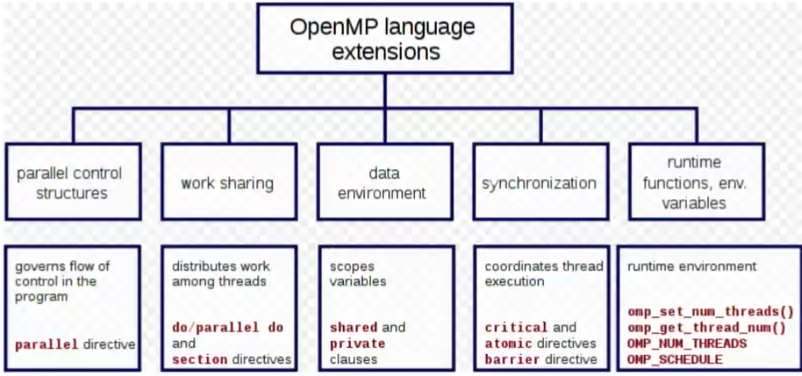

# OpenMP 

- OpenMP main goal is standardization and portability across a variety of **shared memory model** architectures.
- OpenMP uses a fork-join model, where a master thread forks a specified number of slave threads (so there is a hierarchy of threads).
- OpenMP provides directives to spawn threads, assign tasks, and manage synchronization. 
- Variables defined outside a parallel region are visible to all threads in the team, while variables defined inside are private to each thread unless otherwise specified. 

Note that OpenMP is an abstraction layer that provides a high-level interface for specifying parallelism, but the actual implementation of the parallelism may vary depending on the compiler and the target platform.

````Cpp
//this:
#pragma omp parallel num_threads(8) {...}
//might become: 
for(i=0;i<8;i++){
	pthread_create (...);
}   
for(i=0;i<8;i++){
	pthread_join (...);
}  
````

Under the hood, a compiler that supports OpenMP may replace the OpenMP directives with code that uses another programming model, such as Pthreads, to implement the parallelism.
For this it's also important to know that if the compiler does not support OpenMP, the directives will be treated as comments and ignored. This is because OpenMP directives are preprocessor directives, and they are only processed by the compiler if the compiler supports OpenMP. 
Nested parallelism is also possible in OpenMP, where a team of threads can create its own sub-teams of threads to perform additional parallel tasks: to this is important to specify the `nested` clause after the directive. 


## Overview of OpenMP

 


### Clauses 

In OpenMP, clauses are used within directives to control how the directive behaves. For example, the `private` clause can be used to make a variable private to each thread, and the `schedule` clause can be used to control loop iteration distribution among threads. There are many different types of clauses that can be used to control various aspects of behavior, such as thread scheduling, memory allocation, and synchronization.

### Directives

The directives allow the programmer to specify which loops and regions of code can be executed concurrently by multiple threads.

````c
#pragma omp <name> [list of clauses]
````
 
Preprocessor directives called pragma (pragmatic information). 

## Main directives 

### Parallel directive

````C
#pragma omp parallel [clause, ...] 
{
/* parallel section */ 
}
````

The main thread spawns a team of slave threads and becomes the master (thread number 0 in the within the team.
Some important clauses that can be used with this directive are:

- `if(condition)`: This clause allows to specify a condition that must be satisfied in order for the region of code to be executed in parallel. 
````c
#pragma omp parallel if(n > 1)
{
    // Code to be executed in parallel
}
````

- `num_threads(n)`: This clause specifies the number of threads that should be spawned to execute the code in the parallel region. If this clause is not used, the number of threads will be determined by the OpenMP runtime.
````c
#pragma omp parallel num_threads(4)
{
    // Code to be executed in parallel by 4 threads
}
````

The number of threads in a parallel region is determined evaluating the following factors, in order of precedence:  

- Evaluation of the ```if``` clause: obviously if it's false, no threads will be instanced 
- Value of the ```num_threads``` clause 
- Use of the ```omp_set_num_threads()``` library function 
- Setting of the ```OMP_NUM_THREADS``` environment variable
- Implementation default, example the number of CPUs on a node.

### For directive

````C
#pragma omp parallel {
	#pragma omp for [clauses...]  
	<for_loop>
}
```` 

Parallelize execution of iterations of the cycle with the assumption that iterations number are static (they are not modified during runtime) and there are no data dependencies in the loop. 
Most important clauses: ```schedule (type [ , chunk])``` describes how iterations of the loop are divided among the threads in the team:
````C
#pragma omp parallel {
	#pragma omp for schedule (type [ ,chunk]) 
	<for_loop>  
}
````

Where:
- `type` specifies the type of scheduling to be used:
	- `static`: specifies that iterations should be divided into equal-sized chunks. Eventually it is possible to divide into chunks of size `chunk` using the respective field.
	- `dynamic`: the loop iterations dynamically scheduled among threads. The default chunk size is 1 but you can specify.
- `chunk` specifies the size of the chunk of iterations that should be assigned to each thread.

````C
#pragma omp parallel {
	#pragma omp for schedule(static, 10)
	for (int i = 0; i < n; i++) {
	  // loop body
	}
}
````

Note that for directive **needs to be enclosed in a parallel section**. The for directive will run the loop serially otherwise.

### Sections

The directive to achieve MIMD parallelism of the application. Closed sections of code that are divided among the threads and executed concurrently. 

````c
#pragma omp sections [clause...]{   
	#pragma omp section   
		{ / * code section 1 * / }   
	#pragma omp section   
		{ / * code section 2 * / }
}
````


### Single and master directive

````c
#pragma omp single [clauses...]
{ / * code section   * / } 

#pragma omp master   
{ / * code section   * / } 
````

```single``` specifies that a section of a code is executed only by a single thread; the choice on the thread is implementation dependent. 
```master``` specifies that a section of a code is executed only by the master thread, no implied barrier at the end. 

### Critical Directive

````c
#pragma omp parallel
{
  // instructions to be executed by each thread

  // critical directive
  #pragma omp critical
  {
    // instructions to be executed by one thread at a time
  }

  // after the critical section
}
````

The critical directive specifies a **section of code** that must be executed by only one thread at time. The name is used as as global identifier. Different critical sections with the same name are considered as the same region. It's a concept very similar to the mutex stuff.

### Atomic directive

````c
#pragma omp parallel
{
	// instructions 
	#pragma omp atomic
	shared_variable += 1;
	// instructions 
}
````

The atomic directive, on the other hand, is used to specify that a particular **memory location** should be updated atomically. Different aspects of the statements are performed atomically depending on the clauses: ```read``` , ```write``` , ```update``` are possible clauses. 

### Barrier directive

````c
#pragma omp parallel
{
  // instructions to be executed by each thread

  // barrier directive
  #pragma omp barrier

  // instructions to be executed by each thread after the barrier
}
````

It's a directive used to synchronized all threads. All threads will wait the others before proceed over the barrier. 

### Scope of variables

The OpenMP Data Scope Attribute Clauses are used to explicitly define how variables (shared by default) should be scoped. The use of scope variables is an essential part of writing effective parallel code with OpenMP, since they can help to improve the performance and efficiency of the parallel code.

- private: ```#pragma omp <directive name> private (list)``` to have vars private for each thread. Each variable is uninitialized, we need ```firstprivate``` to specify that each var is initialized with the value of the variable, because it exists before the parallel construct. ```lastprivate``` specifies that the "final" variable is set equal to the private version of the thread which executes the final iteration or last section. 
- shared: ```#pragma omp <directive name> shared (list)``` declares variables in its list to be shared among all threads in the team. A shared variable exists in only one memory location and all threads can read or write to that address. **It is the programmer's responsibility** to ensure that multiple threads properly access shared variables, for example by guarding the access to shared variable using the **critical directive** .  
- default: ```#pragma omp <directive name> default(shared|none)``` specifies the default data scope for variables in the parallel region. If `default(shared)` is used, all variables in the region will be shared by default, meaning that they can be accessed and modified by all threads. If `default(none)` is used, no variables will be shared by default, and the programmer must explicitly specify which variables should be shared using the `shared` clause. 

### Reduction

reduction: ```#pragma omp for reduction (operator:<variable_name>)``` in a loop this kind of variables aggregates a value that depends on each iteration of the loop but not by their order. Possible operators are: ```+ * - ^  &&  || min max``` In this example, the `reduction` clause specifies that the values of the `sum` variable computed by each thread should be added together to produce the final result. Note that this can be more efficient than having each thread update a shared `sum` variable, as it avoids the need for synchronization:
````c
#pragma omp for reduction(+:sum)
for (int i = 0; i < n; i++)
{
    sum += a[i];
}
````

### Task directive 
 
````c
#pragma omp task [clause, ...]  
{  /* structured block */ }
````

The task directive specifies a work unit which **may** be executed by another thread in the same team. Tasks are composed of code + data environment, which is initialized at creation time. The ```depend``` clause enforces constraints on the scheduling of tasks by modeling data dependencies:

````c
#pragma omp task depend(in|out|inout:<variable_name>)   
{ /* structured block */ }
````

The tasks are put into a task pool and picked by idle threads. Using dependencies we can explicit an execution order. 

````c
#include <stdio.h>
#include <omp.h>

int main()
{
    int data[];
    // Initialize data array

    // Create a task with a dependency on data[
    #pragma omp task depend(in:data[)
    {
        // Modify data[ in some way
        data[ = some_function(data[);
    }

    return 0;
}
````

Task directive can be use in conjunction with:

````c
#pragma omp taskwait  //barrier for tasks completion
#pragma omp taskyield //used inside a task, interrupts execution 
````

Task directive useful for implement the "Pipeline" parallel pattern. 

### Runtime functions

- ```int omp_get_num_threads ()```
- ```void omp_set_num_threads (int num_threads)``` Sets the number of threads that will be used in the next parallel region 
- ```int omp_get_thread_num()```
- ```double omp_get_wtime()``` Provides a wall clock timing routine, use it in pairs to see how much time passes between calls 
- ```double omp_get_wtick()``` Returns the precision of the timer used by the previous function.


