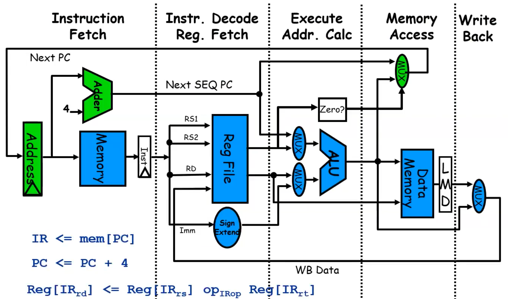

# Dependencies and Hazards

## Mips Recalls

Here is how the MIPS data path appears.

A multi-stage pipeline is made by:

- **Fetch** sends the Program Counter content to the memory in order to access the memory location where the instruction is. Then, the `PC` is updated (`PC + 4`, each instruction take `32` bits). 
- **Decode**, determines operations and reads the registers needed for the computation.
- **Execution**, arithmetic logic operations occur
- **Memory**, accesses memory or cache hierarchy for LOAD or STORE instructions.
- **Write back**, result of computation is written to register file.

## Hazards 

* **Structural Hazards**: Attempt to use the same resource from different instructions simultaneously. Example: Single memory for instructions and data
* **Data Hazards**: Attempt to use a result before it is ready. Example: Instruction depending on a result of a previous instruction still in the pipeline
* **Control Hazards**: Attempt to make a decision on the next instruction to execute before the condition is evaluated Example: Conditional branch execution. Caused by delay between the fetching of instructions and decisions about changes in control flow (branches, jumps, exceptions)

### Dependencies 

**Hazards are pipeline properties while dependences are program properties.**

Dependences among instructions are crucial for determining the amount of parallelism in a program: if 2 instructions are dependent, they cannot be executed in parallel and must be executed in order or at least partially overlapped. 
3 different types of dependences:

* **Name Dependences**: Name dependence occurs when 2 instructions use the same register or memory location (called name), but there is no flow of data between the instructions associated with that name. These kind of dependencies are "easily" fixed with register renaming. 
* **Data Dependences** (or **True** Data Dependences)
* **Control Dependences**
