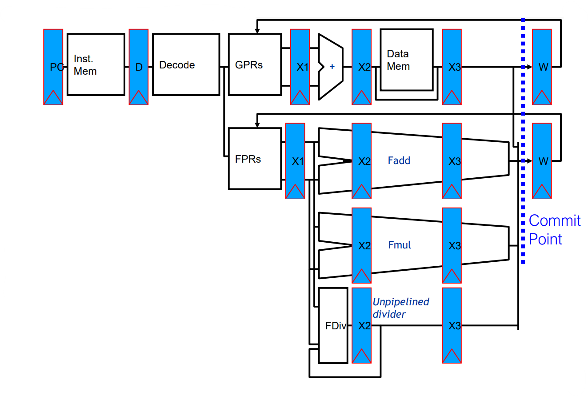
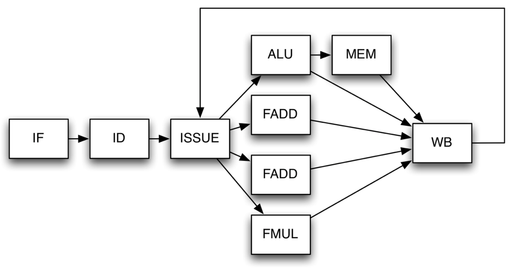

# Complex Pipeline

Moving towards to a more complex pipeline: pipelining becomes complex when we want high performance in the presence of:

* Long latency or partially pipelined **floating-point units**
* **Multiple** function and memory **units**
* Memory systems with **variable access time**
* Precise **exception** (divisions by zero, underflow and overflow at hardware level)

General purpose registers (**GPRs**) contain information being manipulated by the user program currently running. Floating-point registers (**FPRs**) hold numeric values associated with some exponent.

## Complex Pipeline main features 

- All functional units are **pipelined**
- Instructions are fetched, decoded and issued in order (always in this course)
- **Issue** stage can be seen as an infinite buffer.
- Generally it's assumed that the WB unit has a single write port
- RF can write first half of the CC and Read in the second half. (so IS aligned with WB)
- Only one instruction can be issued at a time, and in the case multiple instructions are ready, the oldest one will go first

### What to remember in the Complex Pipeline

- **Decode stalling** if it is causing a **WAR** or **WAW** hazard.
- **Issue stalling** if **RAW** 
- **EX stalling** iff **structural** hazard on writing port

Example:

|    Instruction    | C1  | C2  | C3  |C4 | C5  | C6  | C7  | C8  | C9  | C10 | C11 | C12 |     
|:-----------------:|:---:|:---:|:---:|:----:|:---:|:---:|:---:|:---:|:---:|:---:|:---:|:---:|
|  `LD F1, O(R1)`   |  F  |  D  | IS  | E1 | E2  | E3  | WB  |     |     |     |     |     
|  `LD F2, O(R1)`   |   |  F  |  D  |  IS  | E1  | E2  | E3  | WB  |     |     |     |       |
| `ADDD F1, F1, F2` |     | |  F  |  sD   | sD  | D  | sIS  | IS  | E1  | E2  | E3  |  WB  |
|  `ADD R1, R1, 8`  |     |     |     | sF  | sF  | F  | D  |  sIS  | IS  |  E  | WB  |   |

