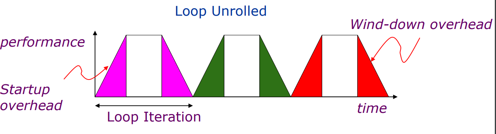
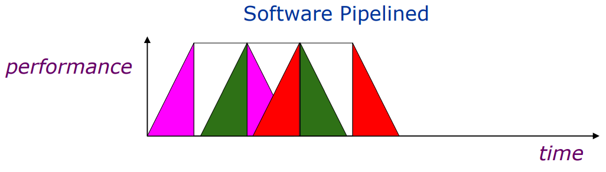
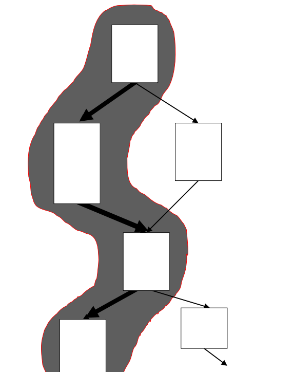

# VLIW

## Static Scheduling intro

Two strategies to support ILP: Static and Dynamic scheduling. VLIW is an example of **Static Scheduling**: it relies on software for identifying potential parallelism.
There are **limits of static scheduling**:

* **Unpredictable Branches**: the compiler can't know ahead of time which branch will be taken.
* **Variable Memory Latency**: compiler can't predict which memory blocks will be in cache at any given time. So it cannot optimize the instructions that rely on the data in memory.
* **Code Size Explosion**: Static scheduling can also result in a code size explosion. As we schedule instructions, we may need to insert more instructions to handle dependencies and ensure proper execution order.
* **Compiler Complexity**: static scheduling can also increase compiler complexity. The compiler must analyze the code for dependencies and optimize the instruction scheduling accordingly.

## VLIW

In VLIW, there is a fetch stage where the bundle is fetched from memory, and a decode stage where the operations within the instruction are separated and sent to functional units (FUs). VLIW architecture uses a singular instruction bundle called Very Long Instruction, which results in the requirement of only one **Program Counter**. As conflicts are resolved by the compiler statically, the instruction is executed once everything required is already available. 

{width=50%}

### What to remember in VLIW

- Both pipeline or unpipelined versions exist.  
- WAR and WAW in the same clock if they are on different units. 
- Both in-order and out-order issue exist. 

### VLIW: Pros and Cons

Pros:

* Simple HW: simpler hardware compared with superscalar processors. The hardware does not need sophisticated scheduling logic since it simply executes each operation according its position within the word without checking for dependencies among them.
* Easy to extend the # FUs: utilize all FUs in each cycle (in VLIW) as much as possible to reach better ILP and therefore higher parallel speedups.
* Good compilers can effectively detect parallelism

Cons:

* Huge number of registers to keep active the FUs
* Large data transport capacity between FUs and register files and between register files and memory
* High bandwidth between i-cache and fetch unit: the bus bandwidth should be capable of transferring an instruction that contains n operations, requiring a bandwidth of `n*(operation size)`.
* large code size since each instruction word contains many operations. 
* binary compatibility


## Static Scheduling methods

There are many different Static Scheduling methods that can be applied:

* **Simple code motion**: just moving code instructions during scheduling.
* **Loop unrolling & loop peeling**: Unrolling exposes more computation that can be scheduled to minimize stalls. If there aren't loop-carried dependencies we can "unroll" the iterations of any loop and perform them in a parallel way.
* **Software pipeline**
* **Trace scheduling**

All these techniques have lower power consumption compared to dynamic scheduling techniques. 

### Loop unrolling 

Loop Unrolling performance can be enhanced by rescheduling. Anticipating the next loop iteration at a scheduling level helps in this. This is done by anticipating operations to free slots in the pipeline that can be used to start up the next iteration. **Compensation code** may need to be added: for example the compensation code to decrease a counter is added  after it has been previously incremented. 



```assembly
loop:   ld f1, (r1)
        ld f2, 0(r2)
        fmul f1, f1, f1
        fadd f1, f1,f2
        st f1, 0(r3)
        addi r1, r1,4
        addi r2, r2,4
        addi r3, r3,4
        bne r3, r4, loop
```

For example here, to optimize the code, we can unroll the loop by one iteration, performing two iterations of the original loop. It's not considered the prologue or epilogue. 

```assembly
loop:   ld f1, (r1)
        ld f3, 4(r1)
        ld f2, 0(r2)
        ld f4, 4(r2)
        fmul f1, f1, f1
        fmul f3, f3, f3
        fadd f1, f1,f2
        fadd f3, f3, f4
        st f1, 0(r3)
        st f3, 4(r3)
        addi r1, r1,8
        addi r2, r2,8
        addi r3, r3,8
        bne r3, r4, loop
```


### Software pipeling 


Software pipelining pushes even further this idea, permitting the loop iterations that are executed parallelly to also be pipelined.




The main difference between them is that loop unrolling replicates the entire code of the loop, while software pipelining can be thought of as "symbolic" loop unrolling. This means that loop unrolling needs to add some startup code before the loop as well as finish-up code at the end, whereas software pipelining does not.


### Trace Scheduling

A trace is a sequence of basic blocks, it can be seen as a branch path.
Trace scheduling aims to execute and profile the application to find the most probable traces to be executed. Each trace is then considered as a single one, allowing for heavy rescheduling of the entire operation set to improve performance.

{width=30%}


Trace scheduling cannot proceed beyond a **loop barrier**. 
It's also important to say that TS can add **compensation code** (like loop unrolling) at the entry and exit of each trace to compensate for any effects that out-of-order execution may have had.


