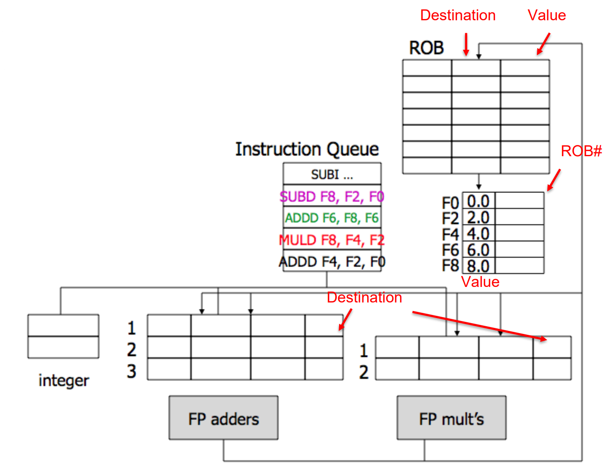

# Tomasulo

In Tomasulo the control unit is decentralized by distributing buffers among functional units, which makes it more efficient. Reservation stations play a key role in this approach by allowing for register renaming. 

## Tomasulo main features

- in-order issue
- out-of-order execution
- out-of-order completion
- register renaming based on reservation stations to avoid war and waw hazards
- results dispatched through the common data bus CDB

Tomasulo nomenclature of paramers:

- `Vj` and `Vk` for source values
- `Qj` and `Qk` for the RSs

## Three Logical Stages of Tomasulo

- **Issue**: it sends operands to the reservation station and performs register renaming.
- **Execution**: executes when operands on CDB are available 
- **Write result**: When result is available, write it to the CDB

### What to remember in Tomasulo

- **Stalling ISSUE** stage is used to avoid **RAWs** and **structural** hazards caused by the absence of RSs or parallel write on **CDB
- **Stalling WB** if a **structural** hazard over **CDB** is detected: not possible to access the CDB at the same clock cycle with 2+ different instructions. 

## Simplified view

| ISSUE | EXECUTION | WRITE |
| :---: | :---: | :---: |
|   Get Instruction from  Queue and Rename  Registers  | Execute and Watch CDB| Write on CDB|
|   Structural RSs check WAW and WAR solved  by Renaming  (!!!in-order-issue!!!) |   Check for Struct on FUs RAW delaying Struct check on CDB |   (FUs will hold results unless  CDB free)  RSs/FUs marked free  |

Example with: 

- RS1, RS2 + 1 LDU (3cc)
- RS3, RS4 + 1 MUL (11cc)
- RS5 + 1 ADD (5cc) 
- Consider structural hazards for RS, FU and CDB.

| Instruction | ISSUE | START EXE | WB |
| :--- | :---: | :---: | :---: |
| I1: LD F6 32+ R2 | 1 | 2 | 5 |
| I2: LD F2 45+ R3 | 2 | 6 | 9 |
| I3: MULTD F0 F4 F3 | 3 | 4 | 15 |
| 14: ADD F8 F2 F6 | 4 | 10 | 16 |
| 15: DIVD F12 F8 F0 | 5 | 17 | 28 |
| 16: SUBD F8 F6 F2 | 17 | 18 | 23 |

- **waw** and **war** are automagically solved by renaming!!!! we keep only the RAWs !! 

Other example:

| Instruction | ISSUE |START EXE | WB | Hazards Type | RSi | Unit |
| :---: | :---: | :---: | :---: | :---: | :---: | :---: |
| I1: LD F1, 0(R1) | 1 | 2 | 5 || RS1 | LDU1 |
| I2: FADD F2, F2, F3 | 2 | 3 | 6 || RS4 | FPU1 |
| I3: ADDI R3, R3, 8 | 3 | 4 | 7 | Struct CDB | RS7 | ALU1 |
| I4: LD F4, 0(R2) | 4 | 5 | 8 || RS2 | LDU2 |
| 15: FADD F5, F4, F2 | 5 | 9 | 1 2 | RAW F4, RAW F2 | RS5 | FPU1 |
| I6: FMULT F6, F1, F4 | 6 | 9 | 1 3 | RAW F4, Struct CDB | RS6 | FPU2 |
| 17: ADDI R5, R5, 1 | 7 | 8 | 9 || RS8 | ALU1 |
| I8: LD R6, 0(R4) | 8 | 9 | 1 4 | Struct CDB | RS1 | LDU1 |
| I9: SD F6, 0(R5) | 9 | 1 4 | 1 7 | RAW F6 | RS2 | LDU2 |
| I10: SD F5, 0(R6) | 1 0 | 1 5 | 1 8 | RAW F5, RAW R6 | RS3 | LDU1 |
 

## Tomasulo with ROB

### HW-based speculation 

HW-based Speculation combines what we have seen so far in this course + Speculation:

- Dynamic Branch Prediction 
- Dynamic Scheduling
- Speculation

Speculation consists to issue and execute instructions dependent on a branch before the branch outcome is known to allow instructions to execute out-of-order but to force them to commit in-order. 

### ROB

{width=50%}

Out of order means always "buffer". In this case we use a "**Reorder Buffer**" which holds instructions in FIFO order. 
Each entry holds program counter, instruction type, destination register specifier and value if any, and exception status (info often compressed to save hardware). 
The reorder buffer is added over Tomasulo Algorithm: 

1. Issue: 
	- Get instruction from FP Op Queue 
	- If reservation station and reorder buffer slot are free, issue instruction and send operands and reorder buffer number for destination. 
	- This stage is sometimes called "dispatch".

2. Execution: 
	- Operate on operands (EX) 
	- When both operands are ready, then execute. 
	- If not ready, watch CDB for the result. 
	- When both are in reservation station, execute. 
	- Checks RAW 
	- This stage is sometimes called "issue".

3. Write result: 
	- Finish execution (WB) 
	- Write on Common Data Bus to all awaiting FUs and reorder buffer. 
	- Mark reservation station available. 

4. **Commit**: 
	- Update register with reorder result 
	- When instruction at the head of the reorder buffer and result present, update register with the result (or store to memory). 
	- Remove instruction from reorder buffer. 
	- Mispredicted branch flushes reorder buffer. 

"Instead of processing instructions strictly in the sequential program order, the CPU executes them as soon as all required resources are available. While the execution unit of the current operation is occupied, other execution units can run ahead."

With Tomasulo we are still bounded by branches ! Tomasulo permits out of order execution of instruction that **surely** are executed. ReOrder Buffer permits to handle branches using speculation, since the fundamental concept is to have a buffer where we can temporally store already executed instruction that are committed depending on the outcome of the branch. 
So, to recap Tomasulo with ROB is possible to make **dynamic loop unrolling** since it's easy:

- Undo speculated instructions on mispredicted branches
- Manage exceptions precisely

### Simplified view of TOMASULO with ROB

|                                                 ISSUE                                                  |                         EXECUTION                         |                             WRITE                             |                                  COMMIT                                   |
|:------------------------------------------------------------------------------------------------------:|:---------------------------------------------------------:|:-------------------------------------------------------------:|:-------------------------------------------------------------------------:|
|              Get Instruction  from Queue and  Rename  Registers  Add Instruction  to ROB               |                  Execute and Watch  CDB                   |                   Write on CDB Write on ROB                   | Update register with  result (or store to  memory) remove Instr from  ROB |
| Structural RSs  check Structural ROB  check WAW and WAR  solved by  Renaming  (!!!in-order-  issue!!!) | Check for Struct on  FUs RAW delaying Struct check on CDB | (FUs will hold results  unless CDB free)  RSs/FUs marked free |             In-order commit Mispredicted branch  flushes ROB              |

- waw and war are automagically solved by renaming!!!! we keep only the RAWs !! 
- when an instruction is in the commit stage, other instructions can be executed 
- in-order commit using the "index" of ROB 
- remember to check **struct hazards** also for the **ROB** 

