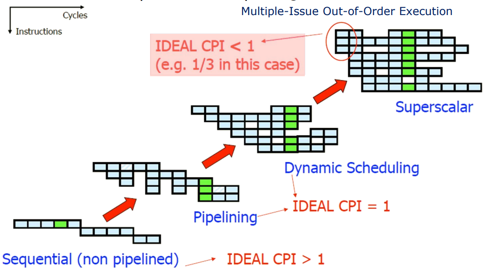
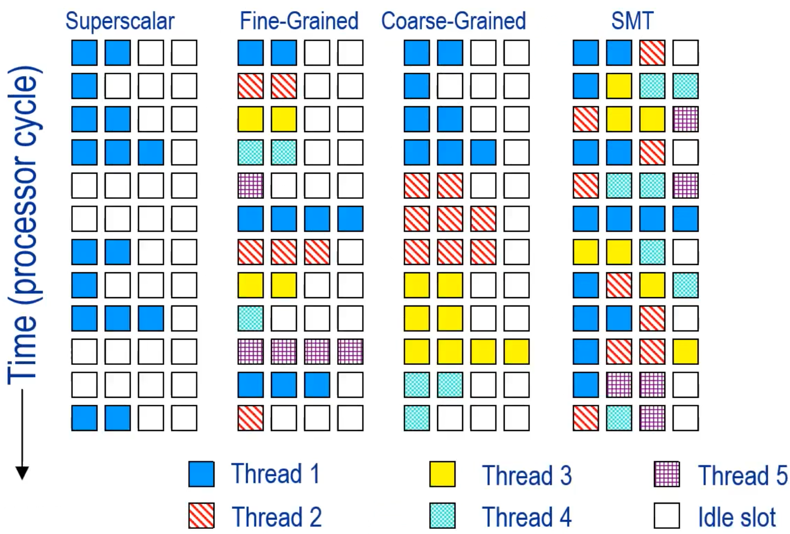
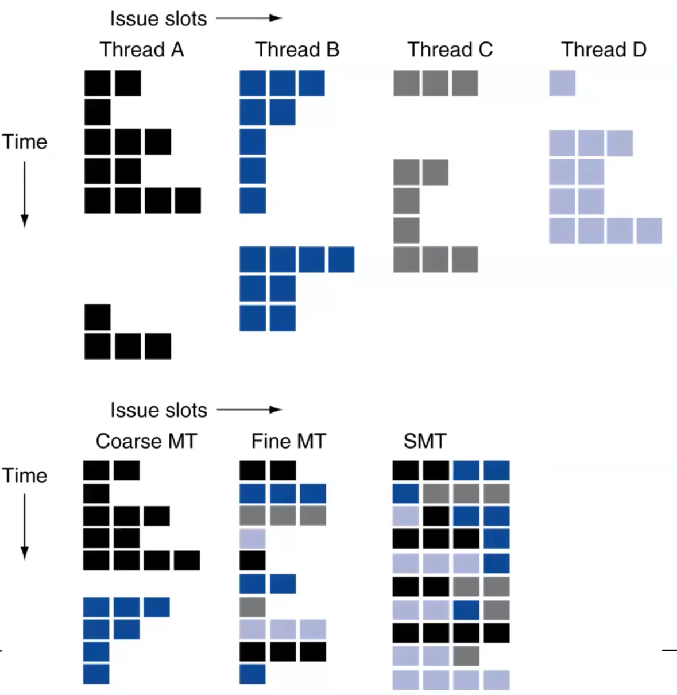
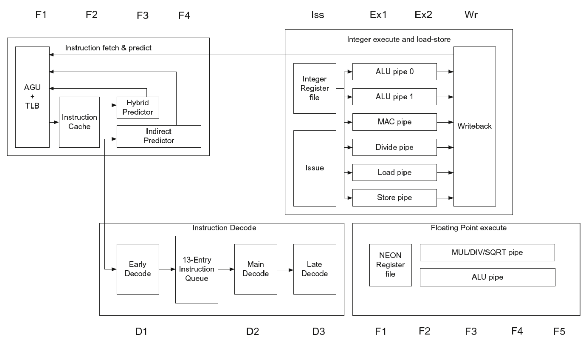

# Multithreading Architectures

## Superscalar architectures 

A scalar architecture is a single issue architecture while superscalar architectures allow for multiple instructions to be executed per clock cycle.
Remember that ILP $\ne$ parallel processing:

- ILP improves throughput by pipelining operations
- Parallel processing is non-user-transparent way of executing programs

{width=50%}

Superscalar architectures have limitations. ILP has an upper bound: 

- Dynamic scheduling is expensive and difficult to design and verify
- Register renaming has its limits
- Jump and branch predictions are not always accurate
- Memory latency is a huge issue. 
- Hazards prevent too many instructions from being issued simultaneously.

## Temporal Multithreading

Using Temporal Multithreading is possible to further increase parallelism by alternately switching between tasks. Temporal Multi-threading has a high cost due to each thread having its own context and there are different techniques to achieve it:

- **Fine-grained** multi-threading involves switching between different threads at a very fine level of granularity, such as after every instruction. This allows for maximum utilization of resources but can also lead to increased overhead due to **frequent context switching**.
- **Coarse-grained** multi-threading involves switching between different threads at a coarser level of granularity, such as after completing a group of instructions from one thread before moving on to another thread. This reduces the overhead associated with context switching but may not fully utilize available resources.
- **Simultaneous multi-threading** (SMT) is similar to fine-grained multi-threading but goes further by allowing multiple instructions from different threads to be executed simultaneously within each clock cycle.

{width=50%}

There are drawbacks in each approach:

- **Fine-grain** multithreading has empty issue windows, causing idle time. 
- **Coarse-grained** multithreading architecture is not commonly used, since it requires flushing the pipeline and can result in starvation. 
- **SMT** requires more complex hardware than either fine- or coarse-grained multithreading but can provide higher levels of parallelism and better resource utilization.

{width=50%}

## ARM Cortex-a53 pipeline example

What actually happens in real world? Basically different systems are combined to achieve the most performance: for example cpu alone is not enough for tasks such as playing games in 4K or streaming on Twitch: GPUs are a common addition to systems.
This is called **heterogeneous architecture** since it combines different types of processors. 
An example of heterogeneous architecture is the big.LITTLE architecture. Cortex-a53 (also the Raspberry Pi 3 CPU) can be used alone as an energy-efficient alternative to the Cortex-A57, or in a big.LITTLE configuration alongside a more powerful microarchitecture. The big.LITTLE configuration architecture is multicore and heterogeneous with a shared ISA, combining battery-efficient (LITTLE) and power-hungry (big) cores. Typically, only one side will be active, but all cores can access the same memory. 

