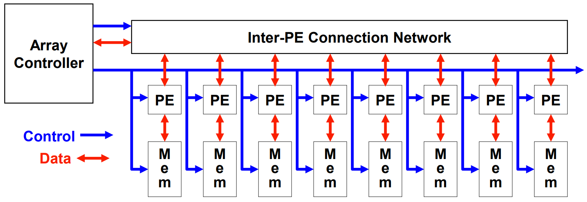
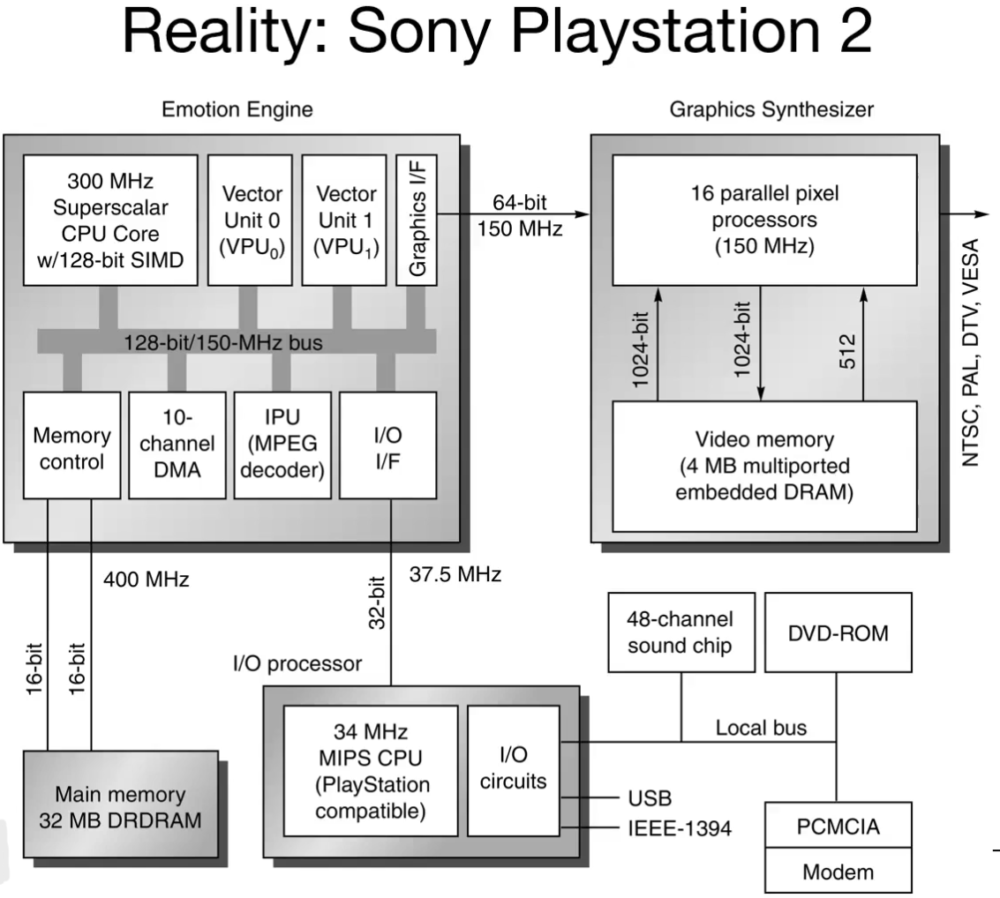
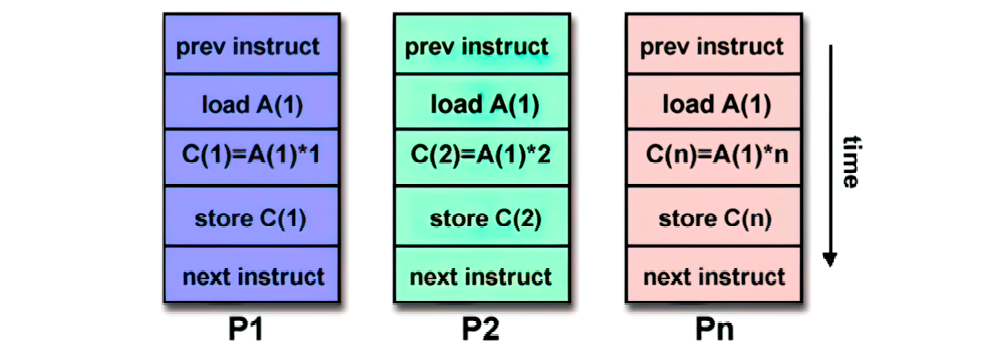
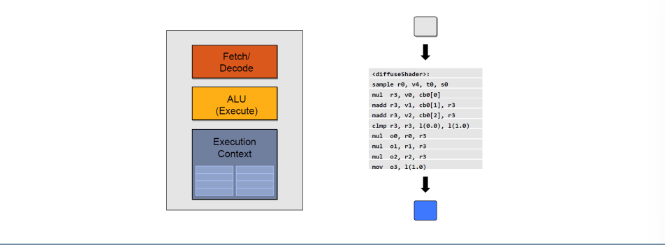
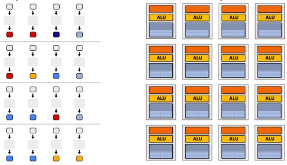
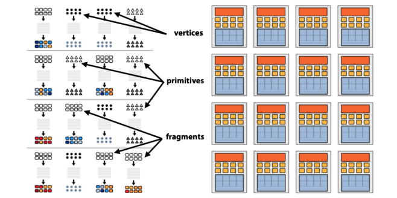
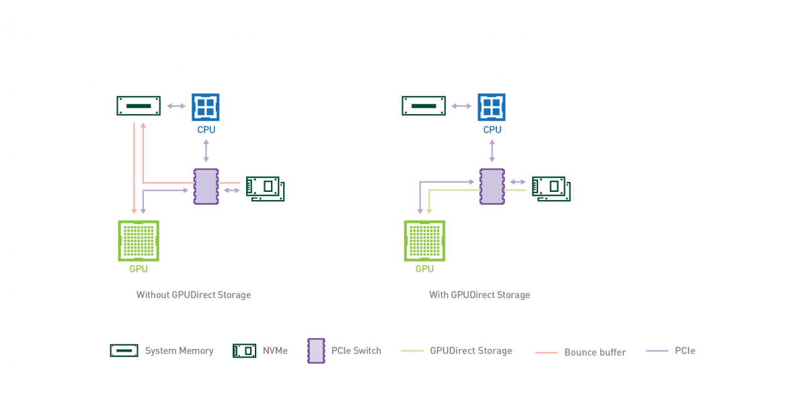
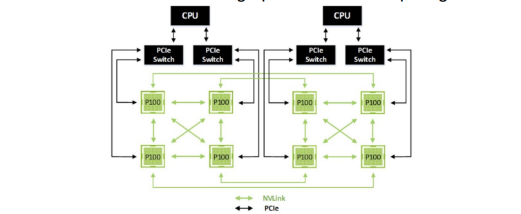

# Parallel Architectures

[Parallel Programming](../../Advanced%20Algorithms%20and%20Parallel%20Programming/src/09.Parallel%20Programming.md) 

## Flynn taxonomy recall

* SISD - Single Instruction Single Data : Uniprocessor systems
* MISD - Multiple Instruction Single Data: no practical configuration and no commercial systems
* SIMD - Single Instruction Multiple Data
* MIMD - Multiple Instruction Multiple Data: Scalable, fault tolerant, off-the-shelf micros

SISD architectures have hit this upper bound, and alternative architectures must be explored for increased performance: SIMD, MIMD, MISD.

## SIMD 

Vector computation (SIMD) requires each processing element to have its own memory space and necessitates vectorized architecture on multiple levels including registers, buses, and I/O ports. Vectorization can save time by summing up an entire loop in a single vector instruction, if iterations are independent.

A notable example of complex vectorized architecture is Sony Playstation 2, which combines a graphics synthesizer similar to a modern GPU with a CPU that features a superscalar architecture with two vector units, a sort of SIMD extension to the cpu.

{width=75%}

## MIMD 

Nowadays, the most common type of parallel computer are MIMD. MIMD architectures allow for multiple instructions to execute at the same time on different data, which can lead to super different computations on the same chip. MIMD processors can be arrays of processors that work asynchronously on different data, including homogeneous and heterogeneous architectures, as well as clusters of independent machines. 
Highlights:

### The console war between Xbox 360 and Playstation 3

The console war between Microsoft's Xbox 360 and Sony's Playstation 3 influenced the development of their respective architectures. Both systems used IBM's Powercore as the main processor, but the approaches differed: 

- Sony used the **Cell** heterogeneous multicore processor, which contained a single 64-bit Power core and 8 specialized SIMD coprocessors. This enabled additional vector processing without changing the main CPU's ISA. 
- Microsoft's **Xenon** homogenous multicore processor was composed of **three identical CPUs**, each containing its own SIMD extension, which modified the ISA.

Completely different approaches, one more oriented with a SIMD approach, the other more oriented with MIMD since three different CPUs. 

> "If you program the software having in mind how the architecture is designed you will always gain better performance"

In a period of resurgence of applications /such as graphics, machine vision, speech recognition, machine learning and similar stuff, which requires large numerical computations that are often trivially data parallel SIMD-based architectures are most efficient way to execute these algorithms. 

Nvidia ceo said:

> "It's not just a matter of waiting for more transistor but designing the architecture, every part of the stack, from the hardware to the software to get more performance."

## GPUs 

GPU in computers:

- In the 90s, high computational power in video games was needed, GPUs born
- GPUs also accelerate general-purpose computing functions with similar characteristics to graphics computing
- Extensive data parallelism
- Few control instructions
- Many math operations
- Few synchronization

A GPU simple core is very simple. 

GPU is a throughput-oriented architecture. This means that the latency of the single stream is increased but the overall throughput is increased as well. As a result, the latency of the overall task execution is decreased. The interleaving of streams is managed by an HW scheduler and large register files are used to store execution contexts.

### GPU pipeline

Computer graphics is parallel by nature and fragments, vertices and pixels are processed independently, meaning the function is executed for each fragment.

Nvidia CUDA architecture uses scalable array of multithreaded Streaming Multiprocessors (SMs). A CUDA program distributes kernel grid blocks to SMs which have execution capacity. Multiple thread blocks can execute on a SM concurrently.

The "warp" concept, introduced with the Fermi architecture, executes threads in groups of 32 threads. Similarly to Fermi architecture, Kepler's one incorporates register scoreboarding for long-latency operations and inter-warp scheduling decisions, similar to Fermi.

The CPU/GPU transmission bandwidth is a critical factor in this process. GPUDirect technology enables direct access to GPU memory from other devices, resulting in faster data transfer without involving the CPU's memory. 

In a similar way, Nvidia developed a technology to increase data transfer speed between multi-GPU architectures used in high performance computing.

### Tensor Cores

**Half** precision floating point instructions have been introduced, which are useful for **deep learning**. From NVIDIA Volta (2017) **Tensor Cores** were introduced, cores specifically designed for:

- Matrix multiplication and accumulation
- Very specific for DNN applications 

In 2020, the Nvidia Ampere architecture introduced changes to Tensor Cores allowing for boosted tensor operations through **matrix sparsity** exploitation. Ampere introduces the concept of *fine-grained structured sparsity* which basically skips the computation of zero values.The primary alternative to _fine-grained sparsity_ is through the organization of matrix entries/network weights in groups, such as vectors or blocks. This _coarse-grained sparsity_ allows regular access pattern and locality, making the computation amenable for GPUs.

Nvidia Ampere architecture in 2020 introduced changes to Tensor Cores, enabling boosted tensor operations by exploiting **matrix sparsity**. *Fine-grained structured sparsity* skips the computation of zero values for efficiency. Another interesting introduction of Ampere was the **virtualization** of GPUs, particularly interesting for **cloud's service providers** where a single GPU can be partitioned in 7 separate virtual GPUs. 

