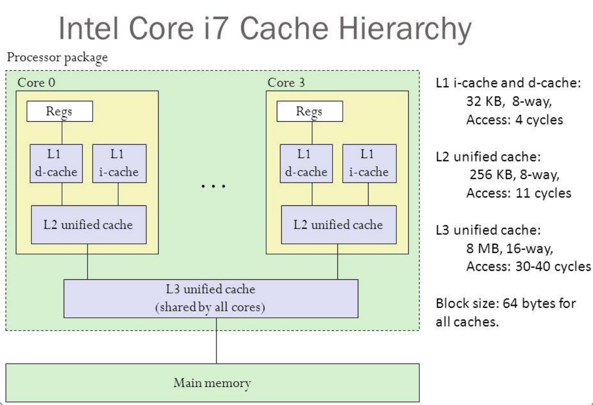

# Memory Hierarchy

The origin of a lot of problems: 

{width=50%}

Developing a **memory hierarchy** is crucial in multi-core processors to improve memory access speed and create an illusion of a large, fast, and cheap memory.

{width=50%}

## Principle of Locality

The **Principle of Locality** states that programs access only a small portion of the address space at any given time. There are two predictable properties of memory references: 

- **temporal locality** means that if a location is referenced, it is likely to be referenced again in the near future. This is observed in loops or reuse. 
- **spatial locality** states that if a location is referenced it is likely that locations near it will be referenced in the near future. This is observed in straight line code or array access.

## Cache 

**Block placement** in cache can be addressed in different way:

- **Direct-Mapped Cache**: a block in the main memory can be placed only in one specific location in the cache. The block's address in the cache is determined by the index field of the memory address (in the next table is the tag).

| Block Address |       | Block Offset |             |
|:-------------:|:-----:|:------------:|:-----------:|
|      Tag      | Index | Word OFFSET  | Byte OFFSET |

- **Fully Associative Cache**: a block in the main memory can be placed **anywhere** in the cache. The block's address in the cache is determined by a **tag** field that uniquely identifies the block.

| Tag ( n-4 bit) | Word offset (2 bit) | Block Offset (2 bit) |
| :---: | :---: | :---: |

- **N-Way Set-Associative Cache**: it's a mix of the previous techniques. A block in the main memory can be placed anywhere inside a specific set. The block's address in the cache is determined by both the **set index** and the **tag**.

| Block Address |       | Block Offset |             |
|:-------------:|:-----:|:------------:|:-----------:|
|      Tag      | Index | Word OFFSET  | Byte OFFSET |

### Different policies to manage cache

Common combinations are write-through with no write-allocate and write-back with write-allocate.

|                                 |                           Write-Through                            |                                       Write-Back                                       |
|:-------------------------------:|:------------------------------------------------------------------:|:--------------------------------------------------------------------------------------:|
|             Policy              | Data written to cache  block  also written to lower-  level memory | Write data only to  the cache  Update lower leve  when a block falls  out of the cache |
|              Debug              |                                Easy                                |                                          Hard                                          |
| Do read misses  produce writes? |                                 No                                 |                                          Yes                                           |
| Do repeated  writes make it to  |                                Yes                                 |                                           No                                           |

## Memory Address Space Model

Two types of logical memory architectures: 

- **Single logically shared address space**: single logically shared address space. Any processor can reference any memory location. Multiple processors can refer to same physical address in memory. 
	- Implicit communication (loads/stores) 
	- Low overhead when cached 
	- Complex to build in way that scales well 
	- Requires synchronization operations 
	- Hard to control data placement within caching system
- **Multiple logically private address spaces**: multiple and private address spaces. Processors communicate through send/receive primitives (**message passing**). Each processor's memory is disjoint and cannot be addressed by other processors.
	- Easier to control data placement (no automatic caching)
	- Overhead can be quite high 
	- More complex to program 
	- Introduces question of reception technique (interrupts/polling)

### Physical Memory Organization

The concepts of addressing space (single/multiple) and the physical memory organization (**centralized/distributed**) are orthogonal to each other. Both the centralized memory and the distributed memory models can be used to implement a shared-memory architecture. Last phrase but in bold and repeated:

> **Shared memory does not mean that there is a single centralized memory.**

## Cache Coherence 

### Bus-Based: Symmetric Shared Memory

The most popular memory architecture is **bus-based**: each core has its own cache memory and there is the bus, which connects processors with each other and to the shared memory.
Since each core has its own cache memory, it's possible to encounter cache coherence problems between multiple memories. **Cache coherency protocols** ensure that all caches have the **same values** for the same address.

### Cache Coherency Protocols in Multiprocessors

Two classes of protocols: 

- **Snooping Protocols**: all cache controllers monitor (**snoop**) on the bus to determine whether or not they have a copy of the block requested on the bus and respond accordingly. 
	- **Write-Invalidate Protocol**: The writing processor issues an invalidation signal over the bus to cause all copies in other caches to be invalidated before changing its local copy. This scheme allows multiple readers but only a single writer.
	- Write-Update or Write-Broadcast Protocol: 
- Directory-Based Protocols

### MESI

MESI protocol is a write-invalidate protocol which enhances  
MSI Invalidate Protocol: it adds to the MSI protocol the exclusive state to indicate clean block in only one cache.

#### Cache blocks logical states: 

- **Modified** : the block is dirty and cannot be shared; cache has only copy, its writeable. 
- (NEW STATE) **Exclusive** : the block is clean and cache has only copy; 
- **Shared**: the block is clean and other copies of the block are in cache; 
- **Invalid**: block contains no valid data Add exclusive state to distinguish exclusive (writable) and owned (written)

#### What to remember 

- In both S and E, the memory has an up-to-date version of the data. 
- Write to a S block implies the invalidation of the other copies of the block in caches and the memory will not be up to date. 
- Write to a E block does not require to send the invalidation signal on the bus, since no other copies of the block are in cache. 

#### Simplified view

Golden rule:

> "Keep the block has much as possible and don't update the main memory if not strictly necessary"

| | Modified | Exclusive | Shared | Invalid |
| :---: | :---:  | :---: | :---: | :---: |
| Line valid? | Yes | Yes | Yes | No |
|  Copy in  memory...  |  Has to be  updated  | Valid | Valid | - |
|  Other copies in  other caches?  | No | No | (maybe/yes) * | Maybe |
|  A write on this  line...  | Access the BUS | Access the BUS |  Access the BUS  and Update the  cache  |  Direct access to  the BUS |

\* actually it depends on how the state machine is implemented. From the fifth and sixth edition of the reference course book conventions changed. If the protocol keeps track only the invalid signals it is not always implied that a Shared block has other copies in other caches. If the protocol keeps track also what the other operations are doing it's safe to say that shared implies always others copies.

#### Mesi example

| After Operation | P1 block state | P2 block state | Memory at block0 up to date | Memory at block1 up to date |
|:--------------- |:-------------- |:-------------- |:--------------------------- |:--------------------------- |
| P1:read1| Exclusive1| Invalid0 | Yes | Yes |
| P2:read0| Exclusive1| Exclusive0| Yes | Yes |
| P1:read0| Shared0  | Shared0  | Yes | Yes |
| P2:writeblock0  | Invalid0 | Modified0| No  | Yes |
| P1:read1| Exclusive1| Modified0| No  | Yes |
| P2:read1| Shared1  | Shared1  | Yes | Yes |
| P1:read1| Shared1  | Shared1  | Yes | Yes |
| P2:writeblock1  | Invalid1 | Modified1| Yes | No  |
| P1:read0| Exclusive0| Modified1| Yes | No  |
| P2:read1| Exclusive0| Modified1| Yes | No  |
| P2:writeblock1  | Exclusive0| Modified1| Yes | No  |
| P1:read1| Shared1  | Shared1  | Yes | Yes |
| P2:read1| Shared1  | Shared1  | Yes | Yes |

