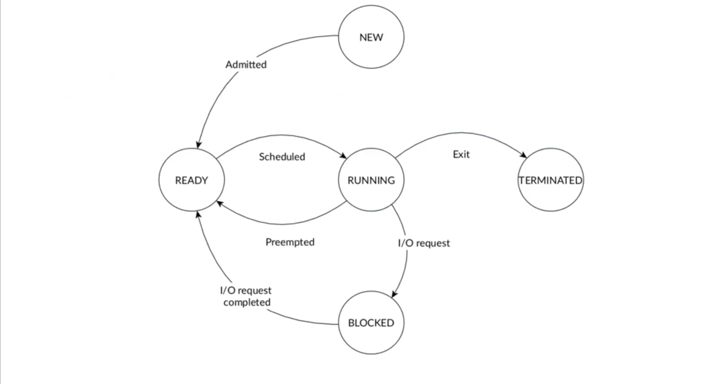

Scheduling General criteria adopted by the OS
Deciding which process to run next, policy should balance

- Fairness -- don't starve processes
- Throughput -- want good overall performance
- Efficiency -- minimize overhead of scheduler itself
- Priority -- reflect relative importance of processes
- Deadlines -- must do $X$ (play audio) by certain time

There is no universal policy: 

- Conflicting goals (e.g., deadlines vs. fairness)
- Solution depends on the problem domain (General purpose OSes vs RTOSes) 

| Name          | Target (Goal)  | Where is it used             |
|:------------- |:-------------- |:---------------------------- |
| `FIFO`          | turnaround     | Linux `SCHED_FIFO`           |
| `Round-robin `  | res. time      | Linux `SCHED_RR`               |
| `CFS`           | CPU fair share | Linux `SCHED_CFS`              |
| `EDF`           | real-time      | Linux-`SCHED_DEADLINE`         |
| `MLFQ`   | res. time      | Solaris, Windows, macOS, BSD |
| `SJF/SRTF/HRRN` | waiting time   | custom                       |

## Processes & Tasks

A process is a program with:

- a unique program counter called `PID`
- two stacks, one in user mode and one in kernel mode
- a set of processor registers, and (optional) an address space

If a Threads (in Linux tasks) are processes which share memory with other processes, in these case tasks have: 

- PID (which is unique)
- PPID (parent's PID, which is set to the original process),

This is the state machine of a process: 

| `task_struct` |
| :---: |
| state {R, I, U, D} |
| PID |
| PPID |
| mm (mm_struct) |
| fs (fs_struct) |
| files (files_struct) |
| signal (signal_struct) |
|  |
| thread_struct |

`fork()` creates a new copy of the current `task_struct`. The copy differs from the parent only in terms of:

- PID
- PPID
- certain resources

The init task`runs/bin/init` which is called in `kernel_init()` runs services, mounts hdd, performs clean-up and more. 

Several implementations exist but the most important to note are:

SystemV -> SystemD 

systemd requires PID 1 

systemd includes a tool called systemctl that allows you to query the status of services as well as start and stop them.

> Systemd is a suite of basic building blocks for a Linux system. It provides a system and service manager that runs as PID 1 and starts the rest of the system.

Many popular distributions run systemd by default, such as Ubuntu, Debian and more.

systemd records initialization instructions for each daemon in a [configuration file](https://en.wikipedia.org/wiki/Configuration_file "Configuration file") (referred to as a "unit file") that uses a [declarative language](https://en.wikipedia.org/wiki/Declarative_language "Declarative language"), replacing the traditionally used per-daemon startup [shell scripts](https://en.wikipedia.org/wiki/Shell_script "Shell script"). The syntax of the language is inspired by [.ini files](https://en.wikipedia.org/wiki/INI_file "INI file").

Units plain text ini-style file that encodes information about a service, a socket, a device, a mount point, an automount point

Services are the most common type of units are described in *. service files; encode information about a process controlled and supervised by systemd. They contain ordering the required units to be started as dependencies.
Targets are collections of units, and emulate old run-levels e.g. /lib/systemd/system/multi-user.target is a directory that contains links to RL 3 units

### Task switching from User to Kernel 

*note the system to save EBP etc and later restore stuff during switching*

## Scheduling classes 

The idea is to dispatching processes in multiple classes. Each class has a unique scheduling policy defined in a set of functions called **scheduling class**. 
Scheduling classes:

- `SCHED_DEADLINE`
- `SCHED_FIFO`
- `SCHED_RR`
- `SCHED_OTHER`
- `SCHED_BATCH`
- `SCHED_IDLE`

Following the 2007 Completely Fair Scheduler CFS policy for non-real-time processes, there is this priority:

- Real-time processes $\pi \in[0,99]$; they belong to scheduling class `SCHED_FIFO` and `SCHED_RR`
- Non real-time processes $100 \leq \pi(v) \leq 139$ which depend on a nice value $v \in$ $[-20,+19]$ : $\pi(v)=120+v$.

### Run queues

In CFS there exists a `cfs_rq` which is a [red-black tree](../../../BSc(italian)/Algoritmi%20e%20Principi%20dell'Informatica/src/12.Alberi%20e%20grafi.md##Alberi%20rosso-neri) .

... Explanation of CFS computation based on $\rho$ , $\epsilon$ , $\lambda$ . 

Also Cgroup for control group a solution for guarantee fairness and optimal cpu usage when there are multiple users. 

## Task scheduling

The scheduler is responsible for determining the order in which tasks are executed ("task" can have different meanings and can be used interchangeably with "thread" in these notes).

A simplified view of task states is:

Actually the reality in Linux is much more complex and there are a lot of possible things that can happen to the process like errors, special states etc. 

### Task parameters

When studying the behavior of processes, we examine several important

- `a_i`: Arrival time, which is when the task becomes ready for scheduling.
- `s_i`: Start time, which indicates when the task begins execution.
- `W_i`: Wait time, which is the time spent waiting in the queue. It can be calculated as the difference between `s_i` and `a_i`.
- `f_i`: Finishing time, which denotes when the task completes its execution.
- `C_i`: Computation time or burst time, which represents the duration required for the processor to execute the task without any interruptions.
- `Z_i`: Turnaround time, which is the overall time taken from when the task becomes ready until it completes its execution. It is given by the equation `Z_i = f_i - a_i`. Note that `Z_i` is not necessarily equal to `W_i + C_i` because interruptions could occur.

Based on the nature of the operations performed by a task, we categorize processes as either CPU-bound or I/O bound:

- CPU-bound processes primarily spend their time executing computations. In this case, `Z_i` is approximately equal to `W_i + C_i`.
- I/O bound processes spend most of their time waiting for I/O operations. Here, `Z_i` is significantly higher than `W_i + C_i`.

### Scheduling polieces 

The algorithm used by the scheduler to determine the order is called the scheduling policy.

Computing an optimal schedule and resource allocation is an NP-complete problem. To increase the complexity we have to keep in mind that these objectives often conflict with each other: 

- maximize processor utilization
- maximize throughput: number of tasks completing per time unit
- minimize waiting time: time spent ready in the wait queue
- ensure fairness
- minimize scheduling overhead
- minimize turnaround time
- and many more: energy, power, temps, ....

Also there is the problem of **starvation**. 

Schedulers can be categorized into different types based on their characteristics.

- **Preemptive vs Non-preemptive**:
	- Preemptive is the ability to interrupt tasks and allocate the CPU to another task ensuring responsiveness.
	- Non-preemptive schedulers minimizes overhead but can impact responsiveness.
- **Static vs Dynamic**:
	- Static schedulers make decisions based on fixed parameters and are not be realistic in general-purpose systems.
	- Dynamic schedulers make decisions based on runtime parameters.
- **Offline vs Online**:
	- Offline schedulers are executed once before task activation, and the resulting *inflexible* schedule remains unchanged.
	- Online schedulers are executed during task execution at runtime, allowing for the addition of new tasks.
- **Optimal vs Heuristic**:
	- Optimal schedulers typically come with higher overhead and complexity.
	- Heuristic schedulers are not optimal but are usually more efficient in terms of overhead.

## Scheduling algorithms

### First-In-First-Out (FIFO)

Simplest scheduling algorithm possible, also known as First Come First Served (FCFS). 
FIFO blueprint:

- Tasks are scheduled in the order of arrival
- Non-preemptive
- Very simple
- Not good for responsiveness
- Long tasks may monopolize the processor
- Short tasks are penalized

### Shortest Job First (SJF)

Shortest Job First (SJF) scheduler aims to minimize the **waiting time** of processes. Also known as Shortest Job Next (SJN). 
SJF blueprint:

- It selects the process with the shortest computation time `C_i` and executes it first. 
- Non-preemptive
- Starvation for long tasks
- How the fuck you know $C_{i}$ in advance?

### Shortest Remaining Time First (SRTF)

SRTF uses the **remaining** execution time instead of the total $C_{i}$ to decide which task to run.
SRTF blueprint:

- Improve responsiveness for all tasks compared to SJF
- Starvation for long tasks
- We need to know $C_{i}$ in advance as SJF

### Highest Response Ratio Next (HRRN)

HRRN selects the task with the highest **Response Ratio**:

$$R R_{i}=\left(W_{i}+C_{i}\right) / C_{i}$$

HRRN blueprint:

- Non-preemptive
- Prevent starvation
- We need to know $C_{i}$ in advance

### Round Robin (RR)

RR is  very  popular  and  very  simple and also very adopted in modern OS.  Tasks are scheduled for a given time slice $q$ and then preempted to give time to other tasks.
RR blueprint:

- Preemptive: when the time quantum expires, the task is moved back to the ready queue.
- Computable maximum waiting time: $(n-1) * q$
- No need to know $C_{i}$ in advance
- Good to achieve the fairness and responsiveness goals
- No starvation is possible
- Turnaround time worse than SJF

Tasks in a ready queue are added based on FIFO policy. If an executing task gets pre-empted while a new task has been added in the ready queue, the new task has precedence in the queue over the pre-empted task.
In Linux, the default time quantum for the Round Robin (RR) scheduler is stored in `/proc/sys/kernel/sched_rr_timeslice_ms`, with a default value of 100ms.

### Priority-based scheduling

A priority-based (also called multi-level) scheduler is usually a scheduling algorithm with multiple ready queues, divided by priority. 
Actually, for each of these queues i can use a different scheduling algorithm. 

One example is using RR scheduling for each queue, but extending the time quantum for lower priority tasks to compensate for their longer wait times. 
It's useful to implement time slicing between the queues. For example we divide a 100ms time window into different portions for each queue: 

| Queue | Quota | Period |
| :--- | ---: | ---: |
| Queue 1 | 80 ms | 100 ms |
| Queue 2 | 15 ms | 100 ms |
| Queue 3 | 5 ms |100 ms |

This allocation ensures that each queue receives a certain percentage of CPU time.

Priority is selected depending on the workload type:

- CPU-bound tasks have low priority (high quantum value)
- I/O-bound tasks have high priority (low quantum value)

How to know if a task is CPU-bound or I/O-bound?

- A **run-time feedback mechanism**: a a new task is always placed in the highest priority queue with the lowest quantum value. If the quantum expires, the task is progressively moved in queues with longer time quantum.
- Manually set by the user 

Priority levels in Windows:

- `IDLE_PRIORITY_CLASS`  
- `BELOW_NORMAL_PRIORITY_CLASS`  
- `NORMAL_PRIORITY_CLASS`  
- `ABOVE_NORMAL_PRIORITY_CLASS`  
- `HIGH_PRIORITY_CLASS`  
- `REALTIME_PRIORITY_CLASS`

Where `REALTIME_PRIORITY_CLASS` interrupts system threads that manage mouse input, keyboard input, and background disk flushing and it's generally used by tasks which should have limited interruptions.

### Multi-Processor Scheduling

In a multi-processor system, the scheduler must decide not only which task to execute but also on which processor to assign. 
This can be a challenging decision due to various factors such as the occurrence of task synchronization across parallel executions and the difficulty of achieving high utilization of all processors or CPU cores. Additionally, managing correctly cache memory which can significantly enhance overall performance by enabling faster access to frequently used data, reducing the reliance on slower main memory access.

- **Load balancing**: evenly distributing tasks across different queues to positively impact power consumption, energy efficiency, and system reliability. It's typically performed via **task migration** which can be implemented mainly in 2 ways: 
	- **push model**: a dedicated task periodically checks the lengths of the queues and moves tasks if balancing is required.
	- **pull model**: each processor notifying an empty queue condition and picking tasks from other queues. 
- **Hierarchical queues**: a hierarchy of schedulers can be implemented to manage task dispatching in a global queue and local ready queues. Improved scalability with maybe more complex.

## CFS (Completely Fair Scheduler)

We will review how scheduling of processes in Linux works and discuss some advanced topics related to load balancing. 

### How CFS assign time slices  ?

Linux's CFS scheduler assigns a proportion of the processor time depending on the load of the system.
This proportion is computed with a function: 
$$
\tau_p=f\left(v_0 \ldots v_{m-1}, \tau, \mu\right)
$$
where: 

- with $v_i$ is the process's nice value which acts as a weight. 
- the targeted latency $\tau$  is the overall time in which you would like that each of the processes has been given some time to work. 
- the minimum granularity $\mu$  is a floor on the time-slice assigned to each process. By default it is 1 millisecond.

Actually the function can be reduced to: 
$$
\tau_{p}=f\left(v_{0}, \ldots, v_{p}, \ldots, v_{n-1}, \tau, \mu\right) \sim \max \left(\frac{\lambda_{p} \tau}{\sum \lambda_{i}}\right)
$$

where:

- $\lambda_{i}\left(\nu_{i}\right)$ is the weight associated with an exponential formula: $\lambda_{i}=k \times b^{-\nu_{i}}$  (with $k$ and $b$ constants chosen by the scheduler). 

On each timer interrupt at time $t$, CFS updates the variable `vruntime`  $\left(\rho_{i}\right)$  and `sum_exec_time` $\left(\epsilon_{i}\right)$ .
The next process which is selected to run is the one with the smallest $\rho$ taken from a red-black tree ($O(1)$).

### Cgroups 

CFS alone is not enough to guarantee optimal CPU usage, especially when there are multiple threads from different user: for example, if user `A` with 2 threads and user `B` with 98 threads, user `A` will only be given 2% of the CPU time, which is not ideal. Each user should be given an equal share of the CPU, which is then divided among their threads.

To address this issue, we can use **cgroups** (control groups) which allows to allocate CPU usage based on groups rather than individual threads. By creating separate control groups for different users, we can ensure that each user gets a fair share of CPU usage.

### Load balancing in CFS 

Load balancing in CFS is done using a work stealing approach, where each idle core balances its workload by attempting to steal threads from the busiest core (also known as the designated core). 