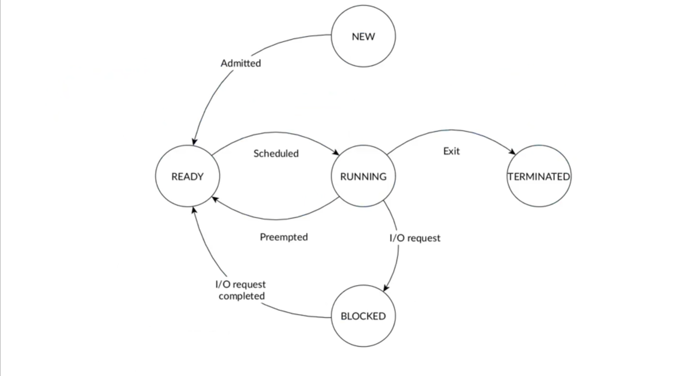
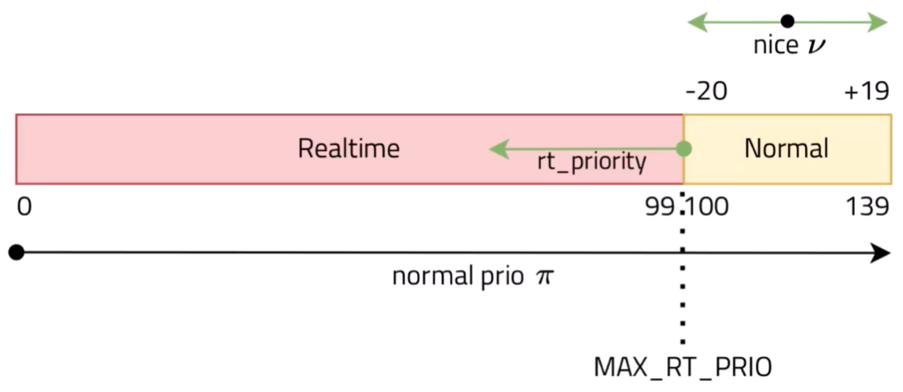

# Scheduling

The scheduler is responsible for determining the order in which tasks are executed ("task" can have different meanings and can be used interchangeably with "thread" in these notes). A simplified view of task states is:

Actually the reality in Linux is much more complex and there are a lot of possible things that can happen to the process like errors, special states etc. 

When studying the scheduling of processes we have a couple of metrics to consider: 

- **`a_i`**: **Arrival time**, which is when a task becomes ready for scheduling.
- **`s_i`**: **Start time**, which indicates when a task begins execution.
- **`R_i`**: **Response time**, which is the time from arrival to **first quantum slice** ends. 
- **`W_i`**: **Wait time**, which is the **total** time spent waiting in the queue by a task.
- **`f_i`**: **Finishing time**, which denotes when a task completes its execution.
- **`C_i`**: **Computation time** or burst time, which represents the duration required for the processor to execute the task without any interruptions.
- **`Z_i`**: **Turnaround time**, which is the overall time taken from when a task becomes ready until it completes its execution. It is given by the equation **`Z_i = f_i - a_i`**. Note that **`Z_i`** is not necessarily equal to **`W_i + C_i`** because **interruptions** could occur.

Based on the nature of the operations performed by a task, we categorize processes as either CPU-bound or I/O bound:

- CPU-bound processes primarily spend their time executing computations. In this case, `Z_i` is approximately equal to `W_i + C_i`.
- I/O bound processes spend most of their time waiting for I/O operations. Here, `Z_i` is significantly higher than `W_i + C_i`.

Scheduling in an OS is a critical task involving the decision of which process to run next. The scheduling policy should aim to balance several factors:

- **Fairness**: 
   - Ensure the scheduling is fair and that no process is starving.
- **Throughput**: 
   - Aim for maximum process completion rate.
- **Efficiency**: 
   - Minimize the resources used by the scheduler itself.
   - Optimize CPU usage reducing context switching overhead.
- **Priority**: 
   - Reflect the relative importance or urgency of processes.
- **Deadlines**: 
   - Meet time constraints for time-sensitive operations like real-time tasks like multimedia playback or similar.

Note that OS scheduling strategies are **balancing conflicting goals** like deadlines and fairness.
For this reason we must make a distinction **domain-Specific Scheduling**:

- General-Purpose OSes **GPOS**: Balance throughput, fairness, user response; utilize time-sharing, dynamic priorities.
- Real-Time Operating Systems **RTOS**: Prioritize deadlines, predictability; apply RMS, EDF algorithms.

Additionally, **user** and **kernel mode** processes may have different priorities. 
But also **I/O-Bound** and **CPU-Bound** processes need a distinction for resource efficiency.
**Multicore/Multiprocessor** environments add scheduling complexities and **adaptive Scheduling** adjusts priorities and nakes decisions based on system load and process activity.

## Scheduling algorithms

The algorithm used by the scheduler to determine the order is called the **scheduling policy**. Computing an optimal schedule and resource allocation is an NP-complete problem. 
To increase the complexity we have to keep in mind that these objectives often conflict with each other: 

- maximize processor utilization
- maximize throughput: number of tasks completing per time unit
- minimize waiting time: time spent ready in the wait queue
- ensure fairness
- minimize scheduling overhead
- minimize turnaround time
- and many more: energy, power, temps, ....

Also there is the problem of **starvation**. 
Schedulers can be categorized into different types based on their characteristics.

- **Preemptive vs Non-preemptive**:
	- Preemptive is the ability to interrupt tasks and allocate the CPU to another task ensuring responsiveness.
	- Non-preemptive schedulers minimizes overhead but can impact responsiveness.
- **Static vs Dynamic**:
	- Static schedulers make decisions based on fixed parameters and are not be realistic in general-purpose systems.
	- Dynamic schedulers make decisions based on runtime parameters.
- **Offline vs Online**:
	- Offline schedulers are executed once before task activation, and the resulting *inflexible* schedule remains unchanged.
	- Online schedulers are executed during task execution at runtime, allowing for the addition of new tasks.
- **Optimal vs Heuristic**:
	- Optimal schedulers typically come with higher overhead and complexity.
	- Heuristic schedulers are not optimal but are usually more efficient in terms of overhead.

What are the menu offerings?

| Name          | Target (Goal)  | Preemptive |
| :------------ | :------------- | :--------- |
| `FIFO`        | turnaround     | No         |
| `SJF`         | waiting time   | No         |
| `HRRN`        | waiting time   | No         |
| `SRTF`        | waiting time   | Yes        |
| `Round-robin` | response time  | Yes        |
| `CFS`         | CPU fair share | Yes        |

### First-In-First-Out (FIFO)

Simplest scheduling algorithm possible, also known as First Come First Served (FCFS). 
FIFO blueprint:

- Tasks are scheduled in the order of arrival
- Non-preemptive
- Very simple
- Not good for responsiveness
- Long tasks may monopolize the processor
- Short tasks are penalized

### Shortest Job First (SJF)

Shortest Job First (SJF) scheduler aims to minimize the **waiting time** of processes. Also known as Shortest Job Next (SJN). 
SJF blueprint:

- It selects the process with the shortest computation time `C_i` and executes it first. 
- Non-preemptive
- Starvation for long tasksthe main disadvantage
- How the fuck you know $C_{i}$ in advance?

This makes SJF less ideal in environments with a high variance in task length or where fairness among tasks is a crucial requirement.

A possible alternative that mitigates starvation is the Highest Response Ratio Next (HRRN) scheduler.

### Shortest Remaining Time First (SRTF)

SRTF uses the **remaining** execution time instead of the total $C_{i}$ to decide which task to run.
SRTF blueprint:

- Improve responsiveness for all tasks compared to SJF
- Starvation for long tasks
- We need to know $C_{i}$ in advance as SJF

### Highest Response Ratio Next (HRRN)

HRRN selects the task with the highest **Response Ratio**:

$$R R_{i}=\left(W_{i}+C_{i}\right) / C_{i}$$

HRRN blueprint:

- Non-preemptive
- Prevent starvation
- We need to know $C_{i}$ in advance

### Round Robin (RR)

RR is  very  popular  and  very  simple and also very adopted in modern OS.  Tasks are scheduled for a given time slice $q$ and then preempted to give time to other tasks.
RR blueprint:

- Preemptive: when the time quantum expires, the task is moved back to the ready queue.
- Computable maximum waiting time: $(n-1) * q$
- No need to know $C_{i}$ in advance
- Good to achieve the fairness and responsiveness goals
- No starvation is possible
- Turnaround time worse than SJF

Tasks in a ready queue are added based on FIFO policy. If an executing task gets preempted while a new task has been added in the ready queue, the new task has precedence in the queue over the preempted task.
In Linux, the default time quantum for the Round Robin (RR) scheduler is stored in `/proc/sys/kernel/sched_rr_timeslice_ms`, with a default value of 100ms.

The total overhead depends on the number of preemptions, and so it can be reduced by increasing the quantum $q$. Obviously, the disadvantage of choosing a larger quantum value is the increasing of the average turnaround and waiting time. 

### CFS (Completely Fair Scheduler)

CFS attempts to balance a process's virtual runtime with a simple rule: CFS picks the process with the smallest virtual runtime (`vruntime`), which represents the time a task should run on the CPU.
CFS uses a red-black tree to find the task with the smallest `vruntime` efficiently.
If here're no runnable processes, CFS schedules the idle task. 

In Linux, the transition from the $O(1)$ scheduler to the CFS marked a significant evolution in process scheduling, emphasizing fairness and dynamic adaptability.

The $O(1)$ scheduler (known for its constant time complexity) offered quick scheduling decisions but struggled with **fair** CPU time distribution, especially for long-running tasks. This was due to its reliance on fixed timeslices, which could lead to task starvation.

CFS dynamically adjusts time slices in proportion to the task's priority and the overall system load, encapsulated in the formula:

$$\tau_{p} = \max \left(\frac{\lambda_{p} \tau}{\sum \lambda_{i}},\mu\right)$$

Here, $\lambda_{i} = k \times b^{-\nu_{i}}$ (with $k$ and $b$ constants chosen by the scheduler) signifies the weight derived from the task's nice value ($\nu_{i}$), influencing its share of CPU time. The targeted latency ($\tau$) reflects the desired period within which all runnable tasks receive CPU time, while the minimum granularity ($\mu$) ensures a lower bound on the timeslice, preventing excessive preemption.

This algorithm it's used for the conventional **time-shared** processes in modern linux. 
All it's based on the 'nice' value $\nu$ $\left(\nu\in[-20,+19],\pi\in[100-139]\right) of a process. 

The nice value it's then used in this exponential formula

$$\lambda_i=k\times b^{-\nu_i}$$ 
(current values k= 1024, $\mathbf{b}=\mathbf{1}.25)$

Then for each process $p$, its time-slice is computed as:

$$
\tau_{p}=f(\nu_{0},\ldots,\nu_{p},\ldots,\nu_{n-1},\bar{\tau},\mu)\sim max(\frac{\lambda_{p}\bar{\tau}}{\sum\lambda_{i}},\mu)
$$

where $\bar{\tau}$ is called schedule latency, $\mu$ is called minimum granularity while $\lambda_i(\nu_i)$ is the weight associated with a process, a sort of priority. 

#### Cgroups 

CFS alone is not enough to guarantee optimal CPU usage, especially when there are multiple threads from different user: for example, if user `A` with 2 threads and user `B` with $98$ threads, user `A` will only be given 2% of the CPU time, which is not ideal. Each user should be given an equal share of the CPU, which is then divided among their threads.
Cgroups is a mechanism for guarantee fairness and optimal cpu usage when there are multiple users: it allocates CPU usage based on groups rather than individual threads. 

#### Load balancing in CFS 

Load balancing in CFS is done using a work stealing approach, where each idle core balances its workload by attempting to steal threads from the busiest core (also known as the designated core). 

## Scheduling classes 

A scheduling class is an API (set of functions) that include an unique scheduling algorithm/policy-specific code. 
This allows developers to implement thread schedulers without reimplementing generic code and also helps minimizing the number of bugs.

Priority levels in Windows:

- `IDLE_PRIORITY_CLASS`  
- `BELOW_NORMAL_PRIORITY_CLASS`  
- `NORMAL_PRIORITY_CLASS`  
- `ABOVE_NORMAL_PRIORITY_CLASS`  
- `HIGH_PRIORITY_CLASS`  
- `REALTIME_PRIORITY_CLASS`

Where `REALTIME_PRIORITY_CLASS` interrupts system threads that manage mouse input, keyboard input, and background disk flushing and it's generally used by tasks which should have limited interruptions.

Which are these scheduling class in linux?

- `SCHED_DEADLINE`
- `SCHED_FIFO`
- `SCHED_RR`
- `SCHED_OTHER`
- `SCHED_BATCH`
- `SCHED_IDLE`

Or in more detailed way:

| Scheduling Class | Description | Scheduling Algorithm | Type of Target Processes |
| ---- | ---- | ---- | ---- |
| **SCHED_DEADLINE** | Deadline-based | Deadline scheduling (EDF) | Real-time |
| **SCHED_FIFO** | Soft real‑time processes, continue to run until higher priority task is ready. | First-In-First-Out | Real-time |
| **SCHED_RR** | Share with timeslice | Round-Robin | Real-time |
| **SCHED_OTHER** / SCHED_NORMAL | Variable-priority | Completely Fair Scheduler (CFS) | Not real-time |
| **SCHED_BATCH** | Low-priority | CFS with idle task prioritization | Not real-time |

Real-time processes $\pi \in[0,99]$; they belong to scheduling class `SCHED_FIFO` and `SCHED_RR`. 

Non real-time processes $100 \leq \pi(v) \leq 139$ which depend on a nice value $v \in$ $[-20,+19]$ : $\pi(v)=120+v$.

The `nice` value is only applicable to non-real-time processes, specifically those in the `SCHED_OTHER` (also known as `SCHED_NORMAL`) scheduling class. The `nice` value ranges from -20 (highest priority within this class) to +19 (lowest priority within this class). These `nice` values are used by the Completely Fair Scheduler (CFS) to adjust the share of CPU time that processes get, with lower `nice` values giving a process more priority, hence more CPU time.

Regarding process priorities, Linux uses a priority range from 0 to 139, where:

- Priorities 0 to 99 are reserved for real-time priorities (higher value, higher priority), used in scheduling classes like `SCHED_FIFO`, `SCHED_RR`, and `SCHED_DEADLINE`.
- Priorities 100 to 139 are for non-real-time tasks, with the `SCHED_OTHER` (or `SCHED_NORMAL`) and `SCHED_BATCH` classes. Within this range, the effect of the `nice` value is evident.

It might seem counterintuitive, but within the Linux kernel's scheduling system, a lower priority number means a higher priority for getting CPU time. This is particularly true for real-time tasks where a priority of 0 is the highest possible priority. This scheme allows real-time tasks (with priorities 0 to 99) to always preempt non-real-time tasks (with priorities 100 to 139) regardless of their `nice` values.

So, in summary:

- `nice` values are used to adjust priorities within the non-real-time priority range ($100$ to $139$).
- Real-time tasks, which ignore `nice` values, have priorities in the range of $0$ to $99$, where a lower number means higher priority.

Regarding the rest, Linux chooses a simple fixed-priority list to determine this order (deadline $\rightarrow$ real-time $\rightarrow$ fair $\rightarrow$ idle).

Priority is selected depending on the workload type:

- CPU-bound tasks have low priority (high quantum value)
- I/O-bound tasks have high priority (low quantum value)

How to know if a task is CPU-bound or I/O-bound?

- A **run-time feedback mechanism**: a a new task is always placed in the highest priority queue with the lowest quantum value. If the quantum expires, the task is progressively moved in queues with longer time quantum.
- Or manually set by the user 

## Multi-Processor Scheduling

In a multi-processor system, the scheduler must decide not only which task to execute but also on which processor to assign. 
This can be a challenging decision due to various factors such as the occurrence of task synchronization across parallel executions and the difficulty of achieving high utilization of all processors or CPU cores. Additionally, managing correctly cache memory which can significantly enhance overall performance by enabling faster access to frequently used data, reducing the reliance on slower main memory access.

- **Load balancing**: evenly distributing tasks across different queues to positively impact power consumption, energy efficiency, and system reliability. It's typically performed via **task migration** which can be implemented mainly in 2 ways: 
	- **push model**: a dedicated task periodically checks the lengths of the queues and moves tasks if balancing is required.
	- **pull model**: each processor notifying an empty queue condition and picking tasks from other queues. 
- **Hierarchical queues**: a hierarchy of schedulers can be implemented to manage task dispatching in a global queue and local ready queues. Improved scalability with maybe more complex.
