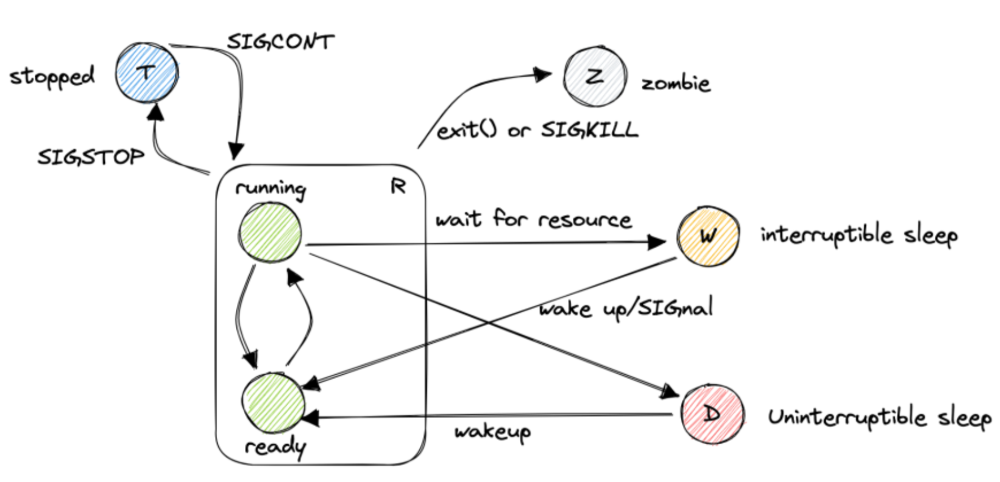

# Scheduling

Scheduling in an OS is a critical task involving the decision of which process to run next. The scheduling policy should aim to balance several factors:

- **Fairness**: 
   - Ensure the scheduling is fair and that no process is starving.
- **Throughput**: 
   - Aim for maximum process completion rate.
- **Efficiency**: 
   - Minimize the resources used by the scheduler itself.
   - Optimize CPU usage reducing context switching overhead.
- **Priority**: 
   - Reflect the relative importance or urgency of processes.
- **Deadlines**: 
   - Meet time constraints for time-sensitive operations like real-time tasks like multimedia playback or similar.

Note that OS scheduling strategies are **balancing conflicting Goals** like deadlines and fairness.
For this reason we must make a distinction **domain-Specific Scheduling**:

- General-Purpose OSes **GPOS**: Balance throughput, fairness, user response; utilize time-sharing, dynamic priorities.
- Real-Time Operating Systems **RTOS**: Prioritize deadlines, predictability; apply RMS, EDF algorithms.

Additionally, **user** and **kernel mode** processes may have different priorities. 
But also **I/O-Bound** and **CPU-Bound** processes need a distinction for resource efficiency.
**Multicore/Multiprocessor** environments add scheduling complexities and **adaptive Scheduling** adjusts priorities and nakes decisions based on system load and process activity.

## Processes & Tasks

First, let's clarify some definitions:

- "**Task**" refers to a single unit of computation and is often used interchangeably with "thread" in Linux.
- A **program** is a set of computer instructions stored and not currently being executed. A **process** is an instance of a program that is currently being executed and has its own isolated memory address space. It has a unique program counter called `PID`, two stacks (one in user mode and one in kernel mode), a set of processor registers, and an optional address space.
- A **process** is an instance of a program that is currently being executed. It has its own isolated memory address space, a unique program counter called `PID`, two stacks (one in user mode and one in kernel mode), a set of processor registers, and an optional address space.
- An **application** is a user-oriented concept of a program, often referring to programs with a graphical user interface (GUI).
- A **thread** is the smallest schedulable unit of execution which can be **contained in a process**.
	- Threads have a unique PID and PPID (parent's PID)
	- Each thread in a process has its own stack for independent execution, while they share the process's global memory.
	- Variables that are part of the parent process's memory (e.g., global or static variables and heap-allocated data) are inherently shared among all threads of that process.
	- Local variables (on the stack) of a thread are private to that thread and not directly accessible to other threads.
	- Threads can be synchronized, access global memory areas, and variables of other threads.
	- Threads have a private address space, and communication between threads requires inter-process communication (IPC) facilitated by the operating system.
	- Threads are executed sequentially on the CPU, but hardware parallelism can be an exception.

This is the state machine of a process: 

###  `Fork()` Function

`fork()` is a system call in Linux used to create a new process. It duplicates the current process, known as the parent, to create a child process. The new `task_struct` of the child process is a copy of the parent’s, with differences in:

- **PID (Process ID)**: Unique identifier for the new process.
- **PPID (Parent Process ID)**: Set to the PID of the parent process.
- **Resources**: Some resources are duplicated or shared under certain conditions.

| `task_struct` Attributes |
| :----------------------: |
| State {R (Running), I (Interruptible), U (Uninterruptible), D (Disk Sleep)} |
| PID (Process ID) |
| PPID (Parent Process ID) |
| mm (Memory Management) |
| fs (Filesystem Context) |
| files (Open Files List) |
| signal (Signal Handlers) |
| thread_struct (Processor Specific Context) |

### System Initialization with systemd

**Systemd** is a system and service manager for Linux, operating as PID 1:

- It initializes the system, manages services, mounts HDDs, and handles clean-up.
- Replaces traditional init systems like SystemV with a more efficient and unified approach.
- Configuration files in declarative language called "unit files"
- Unit files are plain text, INI-style, encoding information about services, sockets, devices, mount points, automount points, etc.

**Systemctl** is command-line tool for querying and controlling the systemd system and service manager:

- Start, stop, and query the status of services.
- Manage system resources and services effectively.

### Task scheduling

The scheduler is responsible for determining the order in which tasks are executed ("task" can have different meanings and can be used interchangeably with "thread" in these notes).
A simplified view of task states is:

Actually the reality in Linux is much more complex and there are a lot of possible things that can happen to the process like errors, special states etc. 
### Task parameters

When studying the behavior of processes we have a couple of metrics to consider: 

- `a_i`: Arrival time, which is when the task becomes ready for scheduling.
- `s_i`: Start time, which indicates when the task begins execution.
- `W_i`: Wait time, which is the **total** time spent waiting in the queue.
- `f_i`: Finishing time, which denotes when the task completes its execution.
- `C_i`: Computation time or burst time, which represents the duration required for the processor to execute the task without any interruptions.
- `Z_i`: Turnaround time, which is the overall time taken from when the task becomes ready until it completes its execution. It is given by the equation `Z_i = f_i - a_i`. Note that `Z_i` is not necessarily equal to `W_i + C_i` because **interruptions** could occur.

Based on the nature of the operations performed by a task, we categorize processes as either CPU-bound or I/O bound:

- CPU-bound processes primarily spend their time executing computations. In this case, `Z_i` is approximately equal to `W_i + C_i`.
- I/O bound processes spend most of their time waiting for I/O operations. Here, `Z_i` is significantly higher than `W_i + C_i`.

## Scheduling algorithms

The algorithm used by the scheduler to determine the order is called the **scheduling policy**.
Computing an optimal schedule and resource allocation is an NP-complete problem. To increase the complexity we have to keep in mind that these objectives often conflict with each other: 

- maximize processor utilization
- maximize throughput: number of tasks completing per time unit
- minimize waiting time: time spent ready in the wait queue
- ensure fairness
- minimize scheduling overhead
- minimize turnaround time
- and many more: energy, power, temps, ....

Also there is the problem of **starvation**. 
Schedulers can be categorized into different types based on their characteristics.

- **Preemptive vs Non-preemptive**:
	- Preemptive is the ability to interrupt tasks and allocate the CPU to another task ensuring responsiveness.
	- Non-preemptive schedulers minimizes overhead but can impact responsiveness.
- **Static vs Dynamic**:
	- Static schedulers make decisions based on fixed parameters and are not be realistic in general-purpose systems.
	- Dynamic schedulers make decisions based on runtime parameters.
- **Offline vs Online**:
	- Offline schedulers are executed once before task activation, and the resulting *inflexible* schedule remains unchanged.
	- Online schedulers are executed during task execution at runtime, allowing for the addition of new tasks.
- **Optimal vs Heuristic**:
	- Optimal schedulers typically come with higher overhead and complexity.
	- Heuristic schedulers are not optimal but are usually more efficient in terms of overhead.

| Name | Target (Goal) | Where is it used |
| :--- | :--- | :--- |
| `FIFO` | turnaround | Linux `SCHED_FIFO` |
| `SJF` | waiting time | custom |
| `SRTF` | waiting time | custom |
| `HRRN` | waiting time | custom |
| `Round-robin` | res. time | Linux `SCHED_RR` |
| `CFS` | CPU fair share | Linux `SCHED_CFS` |

### First-In-First-Out (FIFO)

Simplest scheduling algorithm possible, also known as First Come First Served (FCFS). 
FIFO blueprint:

- Tasks are scheduled in the order of arrival
- Non-preemptive
- Very simple
- Not good for responsiveness
- Long tasks may monopolize the processor
- Short tasks are penalized

### Shortest Job First (SJF)

Shortest Job First (SJF) scheduler aims to minimize the **waiting time** of processes. Also known as Shortest Job Next (SJN). 
SJF blueprint:

- It selects the process with the shortest computation time `C_i` and executes it first. 
- Non-preemptive
- Starvation for long tasks
- How the fuck you know $C_{i}$ in advance?

### Shortest Remaining Time First (SRTF)

SRTF uses the **remaining** execution time instead of the total $C_{i}$ to decide which task to run.
SRTF blueprint:

- Improve responsiveness for all tasks compared to SJF
- Starvation for long tasks
- We need to know $C_{i}$ in advance as SJF

### Highest Response Ratio Next (HRRN)

HRRN selects the task with the highest **Response Ratio**:

$$R R_{i}=\left(W_{i}+C_{i}\right) / C_{i}$$

HRRN blueprint:

- Non-preemptive
- Prevent starvation
- We need to know $C_{i}$ in advance

### Round Robin (RR)

RR is  very  popular  and  very  simple and also very adopted in modern OS.  Tasks are scheduled for a given time slice $q$ and then preempted to give time to other tasks.
RR blueprint:

- Preemptive: when the time quantum expires, the task is moved back to the ready queue.
- Computable maximum waiting time: $(n-1) * q$
- No need to know $C_{i}$ in advance
- Good to achieve the fairness and responsiveness goals
- No starvation is possible
- Turnaround time worse than SJF

Tasks in a ready queue are added based on FIFO policy. If an executing task gets pre-empted while a new task has been added in the ready queue, the new task has precedence in the queue over the pre-empted task.
In Linux, the default time quantum for the Round Robin (RR) scheduler is stored in `/proc/sys/kernel/sched_rr_timeslice_ms`, with a default value of 100ms.

### CFS (Completely Fair Scheduler)

In Linux, the transition from the $O(1)$ scheduler to the CFS marked a significant evolution in process scheduling, emphasizing fairness and dynamic adaptability.

The $O(1)$ scheduler (known for its constant time complexity) offered quick scheduling decisions but struggled with fair CPU time distribution, especially for long-running tasks. This was due to its reliance on fixed timeslices, which could lead to task starvation.

CFS introduces a fairness-centric approach, employing a red-black tree structure to manage tasks. This method ensures fair CPU time allocation by maintaining tasks in a sorted manner based on their virtual runtime (`vruntime`), which represents the time a task should run on the CPU.

CFS dynamically adjusts time slices in proportion to the task's priority and the overall system load, encapsulated in the formula:

$$\tau_{p} = \max \left(\frac{\lambda_{p} \tau}{\sum \lambda_{i}},\mu\right)$$

Here, $\lambda_{i} = k \times b^{-\nu_{i}}$ (with $k$ and $b$ constants chosen by the scheduler) signifies the weight derived from the task's nice value ($\nu_{i}$), influencing its share of CPU time. The targeted latency ($\tau$) reflects the desired period within which all runnable tasks receive CPU time, while the minimum granularity ($\mu$) ensures a lower bound on the timeslice, preventing excessive preemption.

During each timer interrupt at time $t$, CFS updates `vruntime` ($\rho_{i}$) for each task, ensuring the task with the lowest $\rho_{i}$, and hence the least CPU time so far, is selected next for execution. This selection process is efficiently managed through the red-black tree, maintaining $O(1)$ complexity.

#### Cgroups 

CFS alone is not enough to guarantee optimal CPU usage, especially when there are multiple threads from different user: for example, if user `A` with 2 threads and user `B` with 98 threads, user `A` will only be given 2% of the CPU time, which is not ideal. Each user should be given an equal share of the CPU, which is then divided among their threads.

To address this issue, we can use **cgroups** (control groups) which allows to allocate CPU usage based on groups rather than individual threads. By creating separate control groups for different users, we can ensure that each user gets a fair share of CPU usage.

#### Load balancing in CFS 

Load balancing in CFS is done using a work stealing approach, where each idle core balances its workload by attempting to steal threads from the busiest core (also known as the designated core). 

## Scheduling classes 

The idea is to dispatching processes in multiple classes. Each class has a unique scheduling policy defined in a set of functions called **scheduling class**. 
Scheduling classes:

- `SCHED_DEADLINE`
- `SCHED_FIFO`
- `SCHED_RR`
- `SCHED_OTHER`
- `SCHED_BATCH`
- `SCHED_IDLE`

Following the 2007 Completely Fair Scheduler CFS policy for non-real-time processes, there is this priority:

- Real-time processes $\pi \in[0,99]$; they belong to scheduling class `SCHED_FIFO` and `SCHED_RR`
- Non real-time processes $100 \leq \pi(v) \leq 139$ which depend on a nice value $v \in$ $[-20,+19]$ : $\pi(v)=120+v$.

### Run queues

In CFS there exists a `cfs_rq` which is a [red-black tree](../../../BSc(italian)/Algoritmi%20e%20Principi%20dell'Informatica/src/12.Alberi%20e%20grafi.md##Alberi%20rosso-neri) .

... Explanation of CFS computation based on $\rho$ , $\epsilon$ , $\lambda$ . 

Also Cgroup for control group a solution for guarantee fairness and optimal cpu usage when there are multiple users. 

## Priority-based scheduling

A priority-based scheduler is a type of scheduling algorithm that uses multiple queues divided by priority. Each queue can use a different scheduling algorithm. For example, we can use Round Robin (RR) scheduling for each queue, but increase the time quantum for lower priority tasks to account for their longer wait times. It's also possible to implement time slicing between the queues: a 100ms time window is divided into different portions for each queue.

| Queue | Quota | Period |
| :--- | ---: | ---: |
| Queue 1 | 80 ms | 100 ms |
| Queue 2 | 15 ms | 100 ms |
| Queue 3 | 5 ms |100 ms |

Priority is selected depending on the workload type:

- CPU-bound tasks have low priority (high quantum value)
- I/O-bound tasks have high priority (low quantum value)

How to know if a task is CPU-bound or I/O-bound?

- A **run-time feedback mechanism**: a a new task is always placed in the highest priority queue with the lowest quantum value. If the quantum expires, the task is progressively moved in queues with longer time quantum.
- Or manually set by the user 

Priority levels in Windows:

- `IDLE_PRIORITY_CLASS`  
- `BELOW_NORMAL_PRIORITY_CLASS`  
- `NORMAL_PRIORITY_CLASS`  
- `ABOVE_NORMAL_PRIORITY_CLASS`  
- `HIGH_PRIORITY_CLASS`  
- `REALTIME_PRIORITY_CLASS`

Where `REALTIME_PRIORITY_CLASS` interrupts system threads that manage mouse input, keyboard input, and background disk flushing and it's generally used by tasks which should have limited interruptions.

## Multi-Processor Scheduling

In a multi-processor system, the scheduler must decide not only which task to execute but also on which processor to assign. 
This can be a challenging decision due to various factors such as the occurrence of task synchronization across parallel executions and the difficulty of achieving high utilization of all processors or CPU cores. Additionally, managing correctly cache memory which can significantly enhance overall performance by enabling faster access to frequently used data, reducing the reliance on slower main memory access.

- **Load balancing**: evenly distributing tasks across different queues to positively impact power consumption, energy efficiency, and system reliability. It's typically performed via **task migration** which can be implemented mainly in 2 ways: 
	- **push model**: a dedicated task periodically checks the lengths of the queues and moves tasks if balancing is required.
	- **pull model**: each processor notifying an empty queue condition and picking tasks from other queues. 
- **Hierarchical queues**: a hierarchy of schedulers can be implemented to manage task dispatching in a global queue and local ready queues. Improved scalability with maybe more complex.

