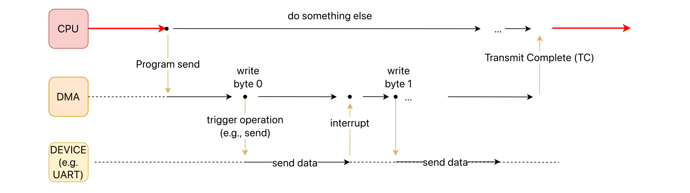

# I/O

## Memory and port mapped devices

A **bus** is an hardware connection channel that facilitates communication between the CPU and other devices. Communication between the CPU and devices can happen over two buses:

- **Memory bus:** Peripheral device registers are integrated into the CPU's address space. This setup allows the CPU to read from and write data to the peripherals, as well as send commands, using standard memory access instructions. It simplifies the interaction between the CPU and the peripherals by treating peripheral I/O as regular memory reads and writes. Memory-mapped I/O is more used than port-based I/O
- **Port bus:** the port bus typically has its own address space separate from the main memory, necessitating specialized commands for data transfer and control.

## Devices and CPU communication

3 main ways to communicate: 

- **Polling** involves the CPU constantly checking the status of devices. While simple, it is inefficient as it consumes significant CPU resources.
- **Interrupts**: Allow devices to notify the CPU of important events, prompting immediate attention. This is more efficient than polling. We can say there are different types of Interrupts:
	- **Asynchronous Interrupts**: Generated by hardware devices.
	- **Maskable Interrupts**: Can be ignored by the CPU. 
	- **Non-Maskable Interrupts**: Always recognized by the CPU.
	- **Synchronous Interrupts**: Produced by the CPU itself during instruction execution.
	- The **Interrupt Handling Process** prioritizes the interrupts and addresses an interrupt event by executing an interrupt handler stopping what the CPU is doing.
	- In **Multi-Core Systems**, interrupts are managed by a dedicated interrupt controller that assigns them to the appropriate CPU core based on priority.
- **DMA** (Direct Memory Access) which involves using a DMA controller. The DMA controller is like an additional device that independently manages data transfers between different devices and memory. It does so without needing the CPU's involvement, thereby **decoupling** it from the transfer process.



### Interrupts

#### Interrupts and you

1. Why we need interrupts?
2. The only way we know up to now to check whether some hardware condition happened is to check status bits.
3. Repeatedly checking status bits is called **polling**.
4. There is an inherent trade-off between responsiveness to events, and polling period.
5. Some events may be sporadic.
6. Interrupts can be thought as letting hardware call a software function when an event occurs.
7. When the interrupt occurs, the CPU is executing some other userspace or kernelspace code.
8. Interrupts can pause the normal code execution in between any two assembly instructions and jump to a function, the "interrupt service routine (ISR)".

#### Interrupt Service Routine (ISR)

Interrupt handlers or Interrupt Service Routine (ISR), the function kernel runs in response to a specific interrupt. What differentiates interrupt handlers from other kernel functions is that: ISRs live in a special context called **interrupt context**, also called atomic context sometimes, because code executing in this context is unable to block.

Top halves versus bottom halves: Because the 2 goals:

- ISR executes quickly
- ISR performs a large amount of work

conflict with each other, it's smart split each ISR into two part:

- top half: most urgent aspects of the interrupt.
- bottom half: defer work until any point in the future when the system is less busy and interrupts again enabled. Often the bottom halves run immediately after the interrupt returns. The key is that they run with all interrupts enabled.

#### Deferring work 

In Linux, the concept of "**deferring work**" involves postponing the execution of a task until a later time. 
Before diving in the common methods for deferring work in Linux, let's talk about **reentrancy** which is: a property of code that allows it to be safely called again before its previous execution is complete. 

**Reentrant Code**:

- Does not rely on shared data.
- Uses local variables or ensures exclusive access to shared resources (e.g., through locking mechanisms).

**Non-reentrant Code**:

- Uses static or global variables without proper synchronization.
- Relies on state that might be altered by concurrent executions.

Three methods are available for deferring work:

1) **SoftIRQs**: difficult to program them directly, mainly used only by networking and block devices directly in their interrupt handlers. Same type of SoftIRQs can run simultaneously on several processors and for this reason it must be reentrant.
2) **Tasklets**: offer an easier interface for defining bottom-half processes. 
	- the same tasklet **cannot** run on multiple CPUs simultaneously by design
	- cannot sleep.
1) **Work Queues**: Work queues accommodate deferred tasks that may need to **sleep** or **wait** for resources, something that SoftIRQs and Tasklets aren't capable of. It’s the general mechanism for submitting work to a worker kernel thread: operate in **process context** rather than in interrupt context. This means that: 
	- they can sleep
	- less time-pressured

##### Tasklets example

Tasklets could be created statically or dynamically:

`DECLARE_TASKLET(packet_tasklet, packet_tasklet_handler, 0);`

The tasklet handler must match the following prototyte:

``void tasklet_handler(unsigned long data);`` 

Scheduling the tasklet:

``tasklet_schedule(&my_tasklet);  /* mark my_tasklet pending */``

As with softirqs, tasklets cannot sleep, so you cannot use semaphores or other blocking functions in a tasklet. 
Tasklets are rapresented as a list of `tasklet_struct` :

```c
struct tasklet_struct {
	struct tasklet_struct *next;
	unsigned long state; /* 0, scheduled or running */
	...
	void (*func)(unsigned long);
	unsigned long data;
};
```

## Linux Device Management

The inclusion of devices into the file system is a key idea that makes device management easier. Highlights of this approach:

- **Special Files for Devices**: Linux treats devices like files, represented as special files within the file system. This approach is based on the Unix philosophy of "everything is a file". Each device is assigned a path name, typically located in the `/dev` directory. 
- These files are identified by **major** and **minor** numbers:
	- **Major Device Number**: This is used to identify the driver associated with the device. 
	- **Minor Device Number**: When a driver manages multiple devices of the same type, each device is assigned a unique minor number. 

In summary, modern Linux systems handle all of this using:

- `udev` for managing device nodes in `/dev` 
- `sysfs` for exporting device their attributes, and their relationships to user space. 

Behind this there is the Virtual File System (VFS): it exposes information about devices and drivers, as well as the relationships and hierarchy among different components, to user space.

`devfs` is now deprecated and removed in favor of `udev`.
`udev`, which is a user-space daemon handles the creation and removal of device nodes, and manages device permissions and symlinks dynamically.


### Device Categories

Linux categorizes devices based on their type and function into:

- **Character Devices**:
    - **Functionality**: Operate with a stream of characters, accessed one at a time. Interaction with these devices is immediate, making them ideal for hardware that requires prompt data transfer.
    - **Examples**: Serial ports, keyboards, terminal devices.
    - **Access**: Via special files in `/dev/`.
    - **Key Point**: They do **not use buffering**, directly affecting the device.
- **Block Devices**:
    - **Functionality**: Organized in blocks for random access, employing buffering and caching, suitable for large data storage and retrieval.
    - **Examples**: Hard drives, SSDs, USB drives.
    - **Access**: Through special files in `/dev/`.
- **Network Devices**:
    - **Functionality**: Handle data packet transmission and reception over network interfaces, critical for network communication.
    - **Examples**: Ethernet adapters, wireless interfaces.
    - **Access**: Managed through network configuration tools, not directly via `/dev/`.

#### Block Devices

In the context of the block layer: 

- **Segments** refer to the parts of a page that correspond to contiguous sectors on the disk. 
- Internally, the mapping layer works with multiples of sectors called **blocks**. 
- **bio**: This structure represents a block I/O operation. A bio can contain multiple segments (bio_vec), each pointing to a **contiguous** area in memory where data resides or will be placed after an I/O operation. 
- **bio_vec** : Represents a segment with:
	1. The page where the data should be read or written.
	2. The offset within that page.
	3. The length of this segment.


**request_queue**: This structure represents the queue of pending I/O requests for a block device. It helps in scheduling and optimizing these requests before they are dispatched to the actual device driver. Techniques such as merging adjacent requests are employed to enhance performance through the "hw schedulers". 
There also I/O software schedulers on top of hw schedulers to optimize everything: 

- kyber
- noop: mainly used for SSDs
- MQ-deadlines 
- Budget Fair Queue


`queue_rq()` is a function which queues any request (rapresented in the kernel by a `struct request`).

### High-Level Device Management (The Device Model)

The Linux device model is an abstraction layer which aims to **maximize code reuse** between different platforms in the Linux kernel.
This is achieved by the kernel providing a framework and a set of APIs that enable consistent and efficient management of devices. 
The goals of this kind of frameworks are: 

- **device representation** which gives an unified view of a clear structure
- **driver binding**
- **power management**
- **hot plugging**
- expose it to user space (through sysfs and udev)
- **event notifications** 

The core components (logically) of this device model are: 

- devices
- drivers 
- buses 

all of these are structures which are extended with custom data. For example, the `pci_driver` extends the generic device structure adding PCI-specific infos. 


To conclude, just remember that **kobjects** are the underlying foundation of the device model: they represent kernel objects such as bus, devices, drivers, and modules to user space via the `sysfs` virtual filesystem:

- (kobject -> directory, attributes -> file)

An important feature of kobjects is their ability to emit **uevents**. These are notifications sent to user-space tools like udev, signaling any changes in the Kobjects. Sysfs exports information about these objects to user space, providing structured access to hardware details.


