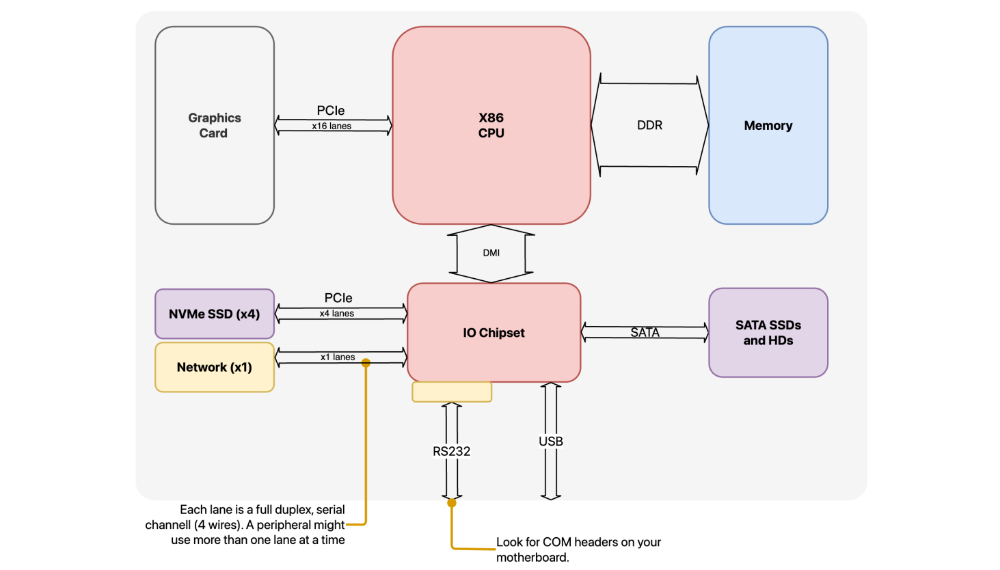

# Introduction to I/O

## CPU to device communication

A **bus** is an hardware connection channel that facilitates communication between the CPU and other devices. Communication between the CPU and devices can happen over two buses:

- **Memory bus:** Peripheral device registers are integrated into the CPU's address space. This setup allows the CPU to read from and write data to the peripherals, as well as send commands, using standard memory access instructions. It simplifies the interaction between the CPU and the peripherals by treating peripheral I/O as regular memory reads and writes. Memory-mapped I/O is more used than port-based I/O
- **Port bus:** the port bus typically has its own address space separate from the main memory, necessitating specialized commands for data transfer and control.

## Device to CPU Communication

**Polling** involves the CPU constantly checking the status of devices. While simple, it is inefficient as it consumes significant CPU resources.

**Interrupts**: Allow devices to notify the CPU of important events, prompting immediate attention. This is more efficient than polling. We can say there are different types of Interrupts:
- **Asynchronous Interrupts**: Generated by hardware devices.
- **Maskable Interrupts**: Can be ignored by the CPU. 
- **Non-Maskable Interrupts**: Always recognized by the CPU.
- **Synchronous Interrupts**: Produced by the CPU itself during instruction execution.

The **Interrupt Handling Process** prioritizes the interrupts and addresses an interrupt event by executing an interrupt handler stopping what the CPU is doing.
In **Multi-Core Systems**, interrupts are managed by a dedicated interrupt controller that assigns them to the appropriate CPU core based on priority.

Another option instead of using interrupts is to use DMA (Direct Memory Access) which involves using a DMA controller. The DMA controller is like an additional device that independently manages data transfers between different devices and memory. It does so without needing the CPU's involvement, thereby **decoupling** it from the transfer process.

## Linux low level programming 

### Interrupt flow

1. **Interrupt Generation**: Triggered by a device or event.
2. **CPU Processing**: Upon receiving an interrupt, the CPU halts its current task.
3. **Interrupt Handler Execution**: 
   - **Role**: Determines the interrupt source and performs necessary actions.
   - **Actions**: May include servicing a device or handling a software event.
4. **Multi-Core Handling**: 
   - **Interrupt Controller**: In multi-core systems, an interrupt controller directs the interrupt to the correct CPU core.
   - **Priority Scheme**: Determines handling order, prioritizing higher over lower priority interrupts.
5. **Task Resumption**: 
   - **Preempted Tasks**: If a task was interrupted, it resumes from where it left off.
   - **Completed Tasks**: If the task finished, the CPU proceeds to the next queued task.

### Deferring work 

In Linux, the concept of "**deferring work**" involves postponing the execution of a task until a later time. This is typically done when a task cannot be immediately completed due to external factors, such as the availability of a resource or the completion of another task.
Interrupt management is divided into two levels:

- **The top half** is responsible for handling the most urgent aspects of the interrupt. It acknowledges the interrupt and performs minimal processing to stabilize the system. It executes quickly and does not block other tasks.
- **The bottom half** takes care of the actual data processing. It is less time-sensitive and can afford to be interrupted or blocked. It is scheduled to run at a later time, allowing the system to remain responsive to other tasks.

Three methods are available for deferring work:

1) **SoftIRQs**: SoftIRQs are employed for tasks that require prompt attention but are too time-consuming to handle in the interrupt context. Following an interrupt, crucial work is handled immediately by the 'top half' or interrupt handler. Non-critical tasks are postponed and dealt with by SoftIRQs, the 'bottom half' of the procedure. SoftIRQs are scheduled to operate once the interrupt handler is done and are processed when the system is less occupied or under favorable conditions. SoftIRQs are known for running their entire course on the CPU they run on.
2) **Tasklets**: Tasklets, built on SoftIRQs, are used for tasks that do not require order or immediate execution. They offer an easier user-interface for defining bottom-half processes, simplifying the handling of SoftIRQs for kernel developers. Tasklets are **serialized** based on their CPU. Consequently, no two tasklets of the same type will run simultaneously on the same CPU, thereby minimizing concurrency problems. Tasklets are popular for tasks related to deferred data processing or cleanup operations mainly because they can be dynamically allocated and are easier to utilize than pure SoftIRQs.
3) **Work Queues**: Work queues accommodate deferred tasks that may need to **sleep** or **wait** for resources, something that SoftIRQs and Tasklets aren't capable of. This feature makes work queues perfect for tasks that might need to wait for I/O operations, mutexes, or other blocking events. Moreover, work queues operate in **process context** rather than in interrupt context, which is vital for operations requiring a process context such as user-space interactions or complex I/O. Work queues are suited for tasks that require process context like sleeping or blocking operations. They can carry out longer-running tasks that can sleep and are less time-pressured, such as I/O functions or batch processing.
## Linux Device Management

### Device Categories

Linux categorizes devices based on their type and function into:

- **Character Devices**:
    - **Functionality**: Operate with a stream of characters, accessed one at a time. Interaction with these devices is immediate, making them ideal for hardware that requires prompt data transfer.
    - **Examples**: Serial ports, keyboards, terminal devices.
    - **Access**: Via special files in `/dev/`.
    - **Key Point**: They do **not use buffering**, directly affecting the device.
- **Block Devices**:
    - **Functionality**: Organized in blocks for random access, employing buffering and caching, suitable for large data storage and retrieval.
    - **Examples**: Hard drives, SSDs, USB drives.
    - **Access**: Through special files in `/dev/`.
- **Network Devices**:
    - **Functionality**: Handle data packet transmission and reception over network interfaces, critical for network communication.
    - **Examples**: Ethernet adapters, wireless interfaces.
    - **Access**: Managed through network configuration tools, not directly via `/dev/`.

The inclusion of devices into the file system is a key idea that makes device management easier. Highlights of this approach:

- **Special Files for Devices**: Linux treats devices like files, represented as special files within the file system. This approach is based on the Unix philosophy of "everything is a file". Each device is assigned a path name, typically located in the `/dev` directory. For example, a UART device used in labs was represented as `/dev/serialaos`.
- These files are identified by **major** and **minor** numbers:
	- **Major Device Number**: This is used to identify the driver associated with the device. 
	- **Minor Device Number**: When a driver manages multiple devices of the same type, each device is assigned a unique minor number. 

All of this is handled by systems such as devfs, sysfs, and udev:

- **devfs (Device File System)**: This system is responsible for the management of device files. It dynamically creates and deletes these files as devices are added or removed, reflecting the current hardware configuration of the system.
- **sysfs (System File System)**: A virtual file system that provides a view into the kernel's device model. It exposes information about devices and drivers, as well as the relationships and hierarchy among different components, to user space.
- **udev (Userspace Device Manager)**: A daemon that manages device nodes in the `/dev` directory. It operates in user space to handle the dynamic attachment and detachment of devices, often using rules defined by the system administrator to manage permissions and naming.

### Low-Level Device Management (Block Devices)

The low-level driver interface is responsible for directly communicating with hardware devices. Key components include:

- **Page Cache**: Caches file data in memory pages to check before generating block requests.
- **Mapping Layer**: Determines block numbers for requested data.
- **I/O Schedulers**: Optimize block I/O operations order for efficiency and fairness. Examples include CFQ, Deadline, and NOOP schedulers, each serving different purposes like minimizing disk seek times or prioritizing specific processes.

### High-Level Device Management (The Device Model)

The linux device model is an abstraction layer which aims to **maximize code reuse** between different platforms in the Linux kernel, examples like using the same USB device driver for both a x86 PC and an ARM platform, even though they have different USB controllers, can be done.
This is achieved by the kernel providing a framework and a set of APIs that enable consistent and efficient management of devices. 

- **Kernel Frameworks**: essentially libraries that aid in the configuration of certain types of devices. They simplify setup by focusing on device-specific features while handling standard configurations, as seen in network driver, real-time clock (RTC), and universal asynchronous receiver-transmitter (UART) frameworks.
- **Bus Frameworks**: Manage bus technologies like USB, PCI, and platform buses. Essential for device detection, enumeration, and management, especially in SoC and embedded devices.
- **Kobjects and Sysfs**: Kobjects represent kernel objects and are the foundation of the device model. An important feature of Kobjects is their ability to emit uevents. These are notifications sent to user-space tools like udev, signaling any changes in the Kobjects. Sysfs exports information about these objects to user space, providing structured access to hardware details.

An example of **kernel frameworks** is the Universal Asynchronous Receiver/Transmitter (UART) which manages serial communication. UARTs are widely used for low-speed peripheral connectivity and are an essential part of embedded systems and computer interfacing.

An example of **bus frameworks** is the **The Platform Bus Framework** which is designed specifically for system-on-chip (SoC) and embedded devices. It manages hardware components that are not easily discoverable and represents fixed resources. 
The framework is defined either in board-specific code or the Device Tree.
Some key advantages of the Platform Bus Framework include simplifying driver development for embedded systems and promoting code reusability. 

