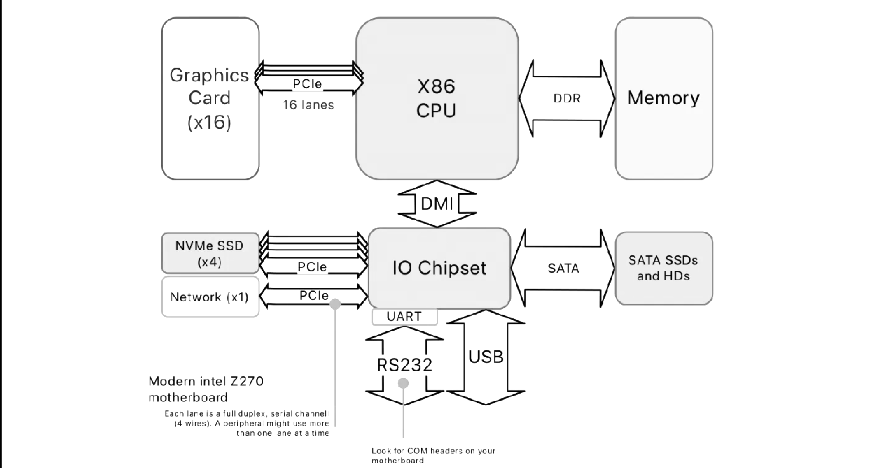
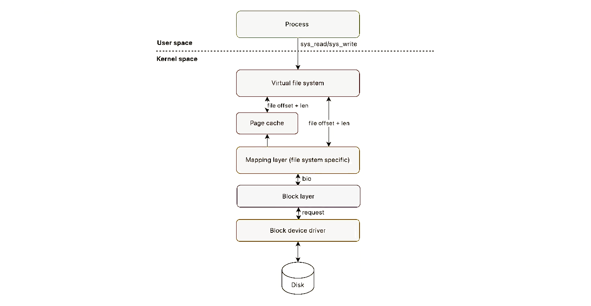

# Introduction to I/O

## CPU to device communication

**System Bus Structure:** Traditionally, both memory and peripherals are accessible via a shared system bus. This design allows various components to communicate over the same bus interface.

**Memory-Mapped I/O:** Peripheral device registers are integrated into the CPU's address space. This setup allows the CPU to read from and write data to the peripherals, as well as send commands, using standard memory access instructions. It simplifies the interaction between the CPU and the peripherals by treating peripheral I/O as regular memory reads and writes.

Memory-mapped I/O is more used than port-based I/O

**Port-Based I/O:** In contrast to memory-mapped I/O, some peripherals are accessed through a logically distinct bus, known as the port bus. This requires specific I/O instructions different from regular memory access instructions. The port bus typically has its own address space separate from the main memory, necessitating specialized commands for data transfer and control.

**Bus:** A hardware connection channel that facilitates communication between the CPU and other devices. In a computer system, the bus serves as a critical component for data transfer.  

UART stands for Universal Asynchronous Receiver/Transmitter. It is a hardware component, typically an integrated circuit, that is utilized for serial communication through a serial port on a computer or peripheral device.
To put it simply, a UART is an essential element for serial communication in electronic and computing devices. It enables asynchronous data transfer between different devices or components. Its purpose is to handle the intricacies involved in transmitting and receiving serial data at a lower level.
Here are some key points about UART:
1. **Asynchronous Communication**
2. **Data Format and Baud Rate*
3. **Serial Interface**: UARTs are commonly used for serial interfaces, converting parallel data from a data bus into serial form for transmission through a serial port, and vice versa for received data.
4. **Buffers**: Most UARTs have built-in transmit and receive buffers. These buffers allow UARTs to hold received data until the CPU is ready to process it, and to store data for transmission while the UART is busy sending previous data.
5. **Handshaking**: UARTs may also support hardware or software handshaking. This mechanism ensures coordinated data transmission between sender and receiver, preventing data loss or overrun.
6. **Widespread Use**: UARTs are ubiquitous in computing and telecommunications. They are used in various applications, including connecting peripheral devices, in microcontroller communication, and in modems, where they interface with the RS-232 standard (among others).
7. **Simple Implementation**: UART communication is relatively simple to implement and requires minimal hardware and software resources, making it a popular choice for basic serial data communication.
    
### Device to CPU Communication: interrupts

**Polling** involves the CPU constantly checking the status of devices. While simple, it is inefficient as it consumes significant CPU resources.

**Interrupts**: Allow devices to notify the CPU of important events, prompting immediate attention. This is more efficient than polling. We can say there are differen types of Interrupts:
    - Asynchronous (I/O) Interrupts: Generated by hardware devices.
    - Maskable Interrupts: Can be ignored by the CPU.
    - Non-Maskable Interrupts: Always recognized by the CPU.
    - Synchronous Interrupts: Produced by the CPU itself during instruction execution.
4. **Interrupt Handling Process**: When an interrupt occurs, the CPU stops its current tasks and executes an interrupt handler to address the event.
5. **Multi-Core Systems**: Interrupts are managed by a dedicated interrupt controller that assigns them to the appropriate CPU core based on priority.
6. **Prioritization**: Interrupts are prioritized, with higher priority ones being handled first.

## Linux low level programming 

In Linux, the concept of "deferring work" involves postponing the execution of a task until a later time. This is typically done when a task cannot be immediately completed due to external factors, such as the availability of a resource or the completion of another task.
Initially, interrupt management in Linux was divided into two levels:

- Top half: Performs essential tasks required for completing the interrupt management process. Executes in a non-interruptible manner and schedules deferred work (deferred functions).
- Bottom half: Completes the remaining work by dequeuing and executing deferred functions. Invoked at specific reconciliation points in time. 

Now there are three methods for deferring work:

1) **SoftIRQs**: the primary mechanism used by Linux, usually used in combination with others. 
2) **Tasklet**: One of the many SoftlRQs available; they have a simpler interface and kernel ensures no more than one instance of them is running concurrently. It is a a one-shot deferral scheme: If you schedule two, only one is ran. A tasklet is a pointer to a function plus some data; it is represented by the kernel with a list of `tasklet_struct`. 
3) **Work queues**: What if your deferred action must block? I.e., allocate a lot of memory, btain a semaphore, or perform block 1/0. Use a work queue which is a schedulable entity that runs in process ontext to execute your bottom half. eneral mechanism to submit work to a worker kernel thread ( `events/n`)/

The concept of "deferring work" in Linux is crucial for efficient system performance, particularly in handling interrupts and tasks that don't need immediate execution. This concept is implemented through mechanisms like SoftIRQs, Tasklets, and Work Queues. Let's delve into each of these:

### SoftIRQs

1. **Purpose**: SoftIRQs are a mechanism for deferring non-critical work that originates from interrupt handling. They are used for tasks that are too time-consuming to be executed in the interrupt context but still need to be processed relatively quickly.

2. **Operation**: 
   - When an interrupt occurs, the critical work is done immediately in the "top half" (the actual interrupt handler), which is quick and precise.
   - Non-critical work is deferred and handled by SoftIRQs, which is the "bottom half" processing.
   - SoftIRQs are scheduled to run after the interrupt handler completes and are processed when the system is less busy.

3. **Characteristics**:
   - SoftIRQs are statically defined and are non-preemptive on the CPU they run on, meaning they run to completion on that CPU.
   - They are processed at a later time when the CPU is idle or when the system conditions are more favorable.

### Tasklets

1. **Functionality**: Tasklets are built on top of SoftIRQs. They are a simpler interface for deferring work and are used for tasks that don't require immediate action and don't need to run in a particular order.

2. **Features**:
   - Tasklets can be dynamically allocated and are easier to use than raw SoftIRQs.
   - They are serialized on a per-CPU basis, meaning two tasklets on the same CPU won't run simultaneously.
   - Ideal for tasks like deferred processing of data or cleanup operations.

### Work Queues

1. **Description**: Work Queues provide a more flexible mechanism for deferring work. They allow for scheduling tasks (work items) to be executed in process context, not in interrupt context.

2. **Usage**:
   - Work Queues are used for longer-running tasks that can sleep and are not time-critical, such as I/O operations or batch processing.
   - They can be executed by worker threads that can be scheduled like normal processes, allowing them to sleep or yield.

3. **Advantages**:
   - Provides greater flexibility compared to SoftIRQs and Tasklets.
   - Suitable for tasks that require process context, like sleeping or blocking operations.

In summary, in Linux, deferring work is a strategy to improve system responsiveness and efficiency by postponing certain tasks to be handled later, outside of the critical interrupt context. SoftIRQs handle quick, non-preemptive tasks soon after an interrupt. Tasklets offer a simpler interface for similar kinds of tasks but with added serialization benefits. Work Queues are used for more complex tasks that can afford to sleep and don't have strict latency requirements.

Certainly! Let's use a practical example involving a network card receiving data to illustrate the "top half" and "bottom half" concepts in Linux interrupt handling:

### Scenario: Network Card Receives Data

1. **Interrupt Triggered**:
   - The network card receives data and triggers an interrupt to notify the CPU.

### Top Half: Immediate Interrupt Handler

2. **Handling in Top Half**:
   - **Acknowledge Interrupt**: The interrupt handler (top half) acknowledges the interrupt to the network card, preventing it from sending further interrupts.
   - **Minimal Data Handling**: It might read the status of the network card or copy the received data's headers into a buffer.
   - **Quick Execution**: The top half does this as quickly as possible to free up the system to handle other interrupts or tasks.

3. **Deferring to Bottom Half**:
   - **Schedule Deferred Work**: The top half schedules deferred work (bottom half) for more extensive processing of the received data. This could involve queuing a SoftIRQ, tasklet, or work queue item.
   - **Return Control**: The system quickly returns from the interrupt, improving responsiveness.

4. **Handling in Bottom Half**:
   - **Data Processing**: The bottom half, which runs at a later time, handles the bulk of the data processing. This could involve parsing the received data, performing error checks, or passing the data to the appropriate protocol stack.
   - **Can Sleep or Block**: Since the bottom half is not running in an interrupt context, it can afford to sleep or wait for resources if necessary.

- **Top Half**: Does the minimum necessary to acknowledge the interrupt and ensure the system's stability and responsiveness.
- **Bottom Half**: Takes care of the actual data processing, which is more time-consuming and potentially involves waiting for resources or other complex operations.

This division ensures that the system can quickly respond to interrupts (like new data arriving on a network card) while still handling the necessary processing (like passing the data up the network stack) efficiently.

Yes, exactly! Your summary captures the essence of the top half and bottom half concept in Linux interrupt handling:

- **Top Half**: This is the "do it immediately" part. It's the initial response to an interrupt, where actions are taken to quickly handle the most urgent aspects of the interrupt. These actions typically include acknowledging the interrupt and performing minimal processing required to stabilize the system or the hardware. The key here is that the top half is fast and non-blocking, ensuring the system can quickly address the interrupt and then move on.

- **Bottom Half**: This is the "schedule for later" part. It represents the deferred processing that can happen after the immediate response. Tasks in the bottom half are not as time-sensitive as those in the top half. They can be more complex, potentially time-consuming, and can afford to be interrupted or to block (e.g., waiting for a resource). The bottom half is scheduled to run at a later time, allowing the system to remain responsive to other interrupts and tasks in the meantime.

The distinction between the two halves is crucial for maintaining system responsiveness and efficiency, especially in handling tasks that are too lengthy to be processed directly within an interrupt context.
Certainly! Let's employ some memorization techniques to help you remember the concept of SoftIRQs, and then we'll explore why Linux also uses Tasklets and Work Queues alongside SoftIRQs.

### Tasklets and Work Queues: Why Are They Needed?

1. **Tasklets**:
   - **Simplification**: Tasklets simplify the handling of SoftIRQs. They provide a more straightforward interface for defining bottom-half processing, making it easier for kernel developers to manage deferred tasks.
   - **Serialization**: Tasklets are serialized on a per-CPU basis, which means two tasklets of the same type will not run simultaneously on the same CPU. This reduces concurrency issues.

2. **Work Queues**:
   - **Sleeping Operations**: Work queues allow deferred tasks to sleep or wait for resources, which SoftIRQs and tasklets cannot do. This makes work queues suitable for tasks that might need to wait for I/O operations, mutexes, or other blocking events.
   - **Process Context**: Work queues execute in process context, not in interrupt context. This is crucial for operations that require process context, like user-space interactions or complex I/O.

- **Tasklets**: Think of "little tasks" (Tasklets) lined up in an orderly fashion (serialization), easier and more organized than a big crowd (SoftIRQs).
- **Work Queues**: Envision a "queue at a workspace" where some tasks are taking naps or waiting for their turn (sleeping/blocking operations), different from the always-awake, non-stop SoftIRQs and Tasklets.

In summary, SoftIRQs handle deferred work but with some limitations. Tasklets provide a simpler and serialized way to handle similar tasks, while Work Queues offer more flexibility for tasks that require sleeping or process context. Each mechanism addresses specific needs in Linux’s interrupt handling and task scheduling paradigm.

## Linux Device Management

### Device categories 

Devices in Linux are typically categorized based on their type and function into:

- **Character Devices**:
    - Character devices operate with a stream of characters and are accessed one character at a time.
    - **Functionality**: Reading from or writing to these devices directly impacts the device, as they do not employ buffering. This direct interaction makes character devices suitable for hardware like serial ports, where immediate data transfer is essential.
    - **Examples**: Serial ports, keyboards, and terminal devices.
    - **Access**: Accessed through special files in the `/dev/` directory, character devices facilitate the transmission of data to and from the hardware.
- **Block Devices**:
    - **Characteristics**: Block devices are organized as a sequence of numbered blocks, allowing for random access. Each block can be individually addressed.
    - **Functionality**: These devices use a system of buffering and caching, which is efficient for devices that require the storage and retrieval of large amounts of data in fixed-size segments.
    - **Examples**: Hard drives, solid-state drives (SSDs), and USB drives.
    - **Access**: Block devices are also accessed through special files in the `/dev/` directory and are primarily utilized for data storage and retrieval purposes.
- **Network Devices**:
    - **Characteristics**: Network devices are concerned with the transmission and reception of data packets over network interfaces.
    - **Functionality**: They operate on a sequence of packets, each packet being a unit of data transmitted across the network. These devices are key in enabling communication and data exchange over networks, including local and wide area networks.
    - **Examples**: Ethernet adapters, wireless network interfaces.
    - **Access**: While not directly accessed through the `/dev/` directory like block and character devices, network devices are managed through various network configuration tools and interfaces in Linux.

Linux employs several systems for device and driver management:

- **devfs (Device File System)**: it handles the creation and management of device files in the file system, including the dynamic creation and deletion of these files as devices were added or removed from the system.
- **sysfs (System File System)**: A virtual file system that not only show devices and drivers to user-space programs but also the topology of the connections
- **udev (Userspace Device Manager)**: 

### Low level device management (Block devices)

The low-level driver interface is responsible for directly communicating with hardware devices.

Page cache involves caching file data using memory pages. When a file operation occurs, the system first checks the page cache. If the data is not in the cache, block requests are generated to fetch or write the data from/to the storage device.

The mapping layer is responsible for determining the block number corresponding to the requested data.

I/O schedulers are responsible for determining the order in which block I/O operations are sent to storage devices.
I/O schedulers serve various purposes depending otheir goals. Some common purposes include:

- Minimizing time wasted by hard disk seeks (still relevant in certain cases).
- Prioritizing I/O requests from specific processes.
- Allocating a fair share of disk bandwidth to each running process.
- Ensuring that certain requests are issued before a specific deadline.

Choosing the appropriate I/O scheduler can significantly impact system performance, especially in systems with high disk I/O. Some examples of I/O schedulers are the Completely Fair Queuing (CFQ) scheduler, Deadline scheduler, and NOOP scheduler.

### High Level Device Management (The Device Model)

The linux device model is an abstraction layer which aims to **maximize code reuse** between different platforms in the Linux kernel, examples like using the same USB device driver for both a x86 PC and an ARM platform, even though they have different USB controllers, can be done.
This is achieved by the kernel providing a framework and a set of APIs that enable consistent and efficient management of devices. 

- **Kernel frameworks** are just libraries that take the tool out Of configuring certain categories of devices. These frameworks offer common APIs and handle many routine tasks, allowing driver developers to focus on device-specific functionalities. Examples include the network driver framework, rtc framework, uart framework. 

**The UART Framework**
 Universal Asynchronous Receiver/Transmitter (UART) framework manages serial communication. UARTs are widely used for low-speed peripheral connectivity and are an essential part of embedded systems and computer interfacing.

Bus frameworks are part of the OS that manage different types of bus technologies like USB, PCI, etc. They handle the detection, enumeration, and management of devices connected to these buses.

**The Platform Bus Framework** handles devices that are often directly connected to the processor without a traditional bus interface, such as those found in embedded systems.

Bus frameworks are a part of the operating system (OS) that handle various types of bus technologies, such as USB and PCI. They are responsible for detecting, enumerating, and managing devices connected to these buses.

The Platform Bus Framework is designed specifically for system-on-chip (SoC) and embedded devices. It manages hardware components that are not easily discoverable and represents fixed resources. The framework is defined either in board-specific code or the Device Tree.

Some key advantages of the Platform Bus Framework include simplifying driver development for embedded systems and promoting code reusability. It helps maintain a clean and maintainable codebase for board-specific logic.

The **PCI bus framework** (Peripheral Component Interconnect) bus framework, on the other hand, manages the PCI buses and devices in the system. It handles complex operations related to PCI devices, such as enumeration, resource allocation, and driver binding.

Kobjects serve as the underlying foundation of the device model in Linux. They represent kernel objects such as buses, devices, drivers, and modules.

Sysfs, on the other hand, is a virtual filesystem in Linux that allows the exporting of information about these kernel objects (Kobjects) to user space. It provides a structured way to access data from the kernel and is commonly used to obtain information about hardware devices and their configurations. Sysfs relies on Kobjects as the base object type for various kernel subsystems, helping in managing the hierarchy of the device model.

Kobjects have fields or attributes, which are exposed to user space through the sysfs virtual filesystem. This includes a Kobject directory and corresponding attribute files. Kobjects belong to Ksets, and their hierarchy mimics the real hardware topology, making it useful for understanding the relationships between different objects.

Additionally, Kobjects emit uevents, which are notifications sent to user-space tools (such as udev) to inform them of any changes in the Kobjects. For example, when a USB pen drive is inserted, the kernel creates entries in /sys/usb/devices, /sys/class/block, and /dev/sdb (through udev), allowing users to access and interact with the added device.

