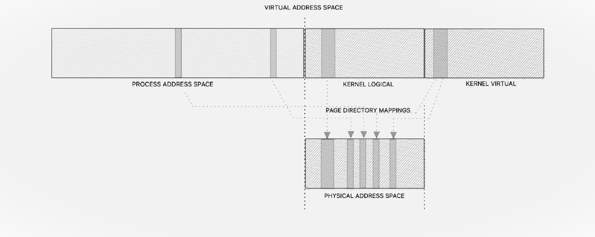
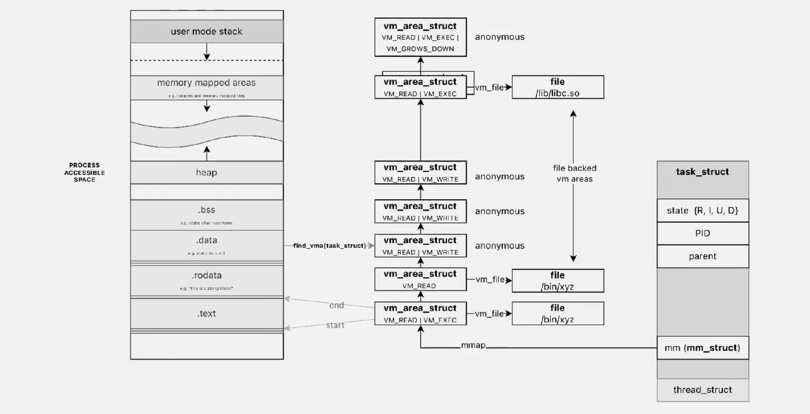
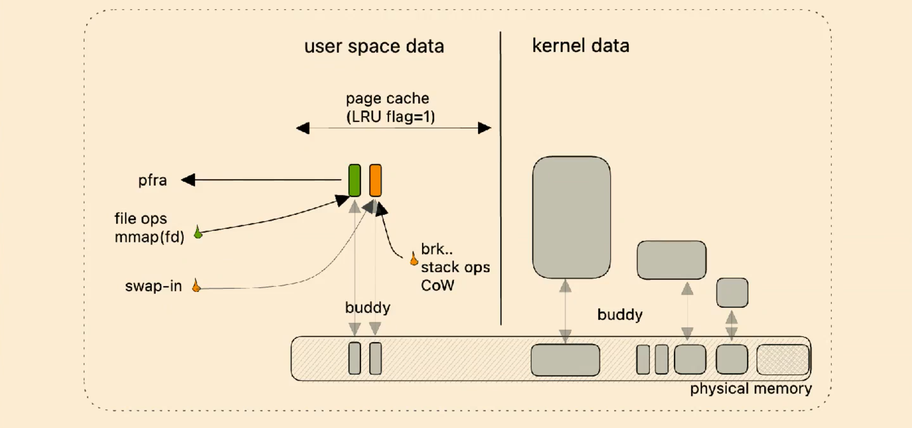
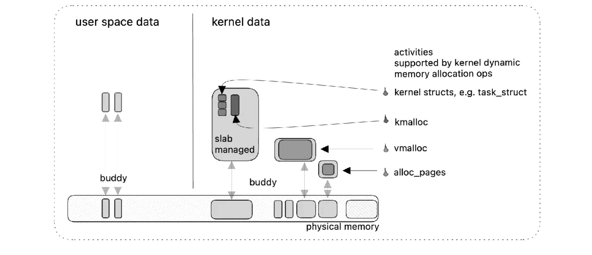
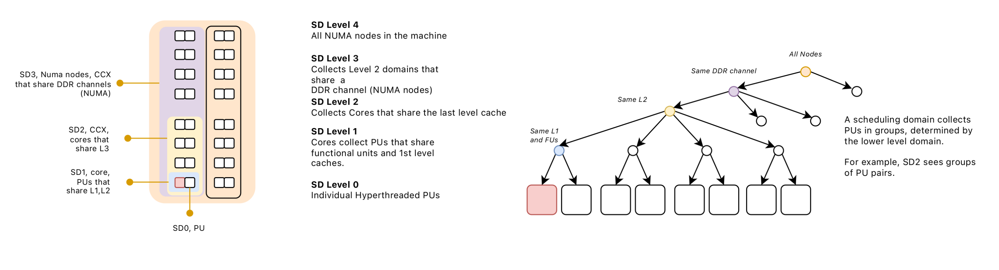

# Virtual memory

Linux, similar to other OSs, uses virtual memory to manage memory. Virtual memory allows a computer to overcome memory shortages by temporarily moving data from RAM to disk storage. This creates the perception of a larger memory space, even when physical memory is limited.

Some main concept to keep in mind:

- **Virtual Memory Area** (VMA) is a region in a process's virtual address space which main purpose is to handle mappings of virtual memory into physical memory.
    - VMA can be mapped to a file (with backing store) or be anonymous (e.g., stack, heap).
    - Anonymous areas (heap, stack, bss) initially map to a zero page and employ Copy-On-Write (COW) if written.
    -  Backing store areas are derived from PT_LOAD segments in the ELF file.
    - shared or private.
    - Permissions: Readable, writable, executable.
    - `VM_IO` flag indicates mapping of a device's I/O space.
    - VMAs are created by a process using the `mmap()` function.
- **Paging** is a memory management scheme that eliminates the need for contiguous allocation of physical memory. It allows the physical address space of a process to be non-contiguous, which helps in efficiently utilizing memory and simplifies memory management.
- Page faults occur when a process accesses a page not present in memory.
- Linux uses a [red-black tree](../../../BSc(italian)/Algoritmi%20e%20Principi%20dell'Informatica/src/12.Alberi%20e%20grafi.md##Alberi%20rosso-neri) of VMAs for efficient and balanced searching.
- Page Fault: Occurs when a process accesses a part of its virtual memory that is not currently in physical memory.
- Demand Paging: Pages are loaded into memory only when they are accessed, not all at once.
- **Process Address Space** is the range of addressable memory for each process which includes text (code), data, heap, and stack segments.

## Kernel address space

**Kernel Logical Addresses** are a subset of kernel addresses that are directly mapped to physical memory. They are used for memory that is frequently accessed or needs to be accessed quickly, such as memory used by DMA (Direct Memory Access).
- Directly mapped to physical addresses starting from 0.
- Correspond to contiguous physical memory.
- Accessible by Direct Memory Access (DMA).
- Managed using the `kmalloc` function.

**Kernel Virtual Addresses** are not directly mapped to physical memory. They are helpful in situations where the kernel needs to allocate large buffers but can't find a continuous block of physical memory. The allocation and management of these addresses are done using the `vmalloc` function.
- Not contiguous in physical memory.
- Ideal for large buffers where contiguous physical memory is scarce.
- Managed using the `vmalloc` function.

The main **Kernel Address Space Management** methods are `kmalloc`, `vmalloc`, and page allocation techniques.

## Page Allocation in Linux Kernel

In the Linux kernel, each memory zone is characterized by the total size of its pages and an array of lists of free page ranges. When the kernel requires contiguous pages and free pages are available, it utilizes the **buddy algorithm** and a couple of others.

#### Buddy Algorithm

The buddy algorithm aims to reduce the need for splitting large free memory blocks when smaller requests are made. This is important for two reasons:

1. The kernel often needs contiguous pages for Direct Memory Access (DMA).
2. Using larger, 4 MB pages instead of smaller ones decreases the frequency of Translation Lookaside Buffer (TLB) misses.

This algorithm manages the merging/splitting of memory blocks:

- **Allocation**: To allocate a block of a given size, the kernel first checks the free list of the requested size and higher. If a block of the requested size is available, it is allocated immediately. If not, a larger block is split into two smaller blocks, with one half being allocated and the other returned to the free list. This process may recur as necessary.
- **Deallocation**: Upon freeing memory, the kernel checks if there is a free 'buddy' block adjacent to the one being freed. If so, the two blocks are merged into a single larger block. This process is recursive.

   - It works by dividing memory into blocks of various sizes, which are **powers of 2**. When a request for memory is made, the Buddy System finds the smallest block that will satisfy the request. If a block is larger than needed, it's split into "buddies."
   - The Buddy System is efficient for managing varying sizes of memory requests and for minimizing fragmentation.
 

#### Beyond the Buddy Algorithm

The kernel frequently allocates and releases fixed-size data structures. The Buddy System, while efficient for larger allocations, is not ideal for these smaller structures due to potential internal fragmentation and the need for synchronization via locks. 
The **Slab allocator** builds on the Buddy System to optimize the allocation of frequently used kernel objects. 
**Quicklists** are used to further optimize specific use cases, especially in multiprocessor environments. These optimizations help manage physical memory blocks efficiently in the kernel.

Therefore, Linux kernel buffers its request through two additional fast allocators:

1. **Quicklists**: used to optimize the allocation of frequently used small objects, particularly for per-CPU allocations.
   - They are essentially a list of pre-allocated memory pages or blocks for certain types of objects, allowing for rapid allocation without having to frequently query the general-purpose memory allocators.
   - Quicklists can reduce contention on global resources in a multiprocessor system.

3. **Slab Allocator**: specifically for kernel objects such as file objects, task structures, etc.:
   - When an object of that type is needed, it can be quickly allocated from a pre-existing  memory chunk called slab, reducing the overhead of frequent allocations.
   - The Slab Allocator is not a replacement for the Buddy System but rather a higher-level memory manager that works on top of it. It uses the Buddy System for obtaining larger chunks of memory, which are then subdivided into slabs. The slab allocator provides two main classes of caches:
		- **Dedicated**: These are caches that are created in the kernel for commonly used objects (e.g., `mm_struct`, `vm_area_struct` ,etc...). 
		- **Generic** (size-N and size-N(DMA)): These are general purpose caches, which in most cases are of sizes corresponding to powers of two.

## Physical Address Space in Linux

#### Memory Configuration

- Memory can be organized into NUMA banks or nodes.
- Each physical page is represented by `struct page` in an array `mem_map`.

#### Memory Allocation

- Node-local allocation policy: Memory is allocated from the node closest to the running CPU.
- Different zones for memory allocation:
    - `ZONE_DMA`: For certain ISA devices.
    - `ZONE_NORMAL`: Directly mapped by the kernel.
    - `ZONE_HIGHMEM`: Remaining memory, not directly mapped.

#### Zone Management

- Zone information is maintained in `pgdat_list`.
- For UMA architectures, a single `pg_data_t` structure called `contig_page_data` is used.

### Zonal page allocation in Linux

Zonal Page Allocation is a memory management strategy in Linux designed to efficiently utilize physical memory based on different types of hardware requirements and limitations.

**Zones** contain information about the total size and lists of free page ranges.
 **Zone Types**:
   - **DMA (Direct Memory Access) Zone**: For devices that can only do DMA to lower addresses.
   - **Normal Zone**: For regular allocations that don't have specific hardware constraints.
   - **HighMem Zone**: For addressing memory beyond the normal address range, particularly in 32-bit systems with more than 4GB of RAM.

# ANON ?

Anonymous memory regions or pages that lack an association with any specific file and don't have a file-based backing store on the disk. Instead, these memory regions are dynamically generated as needed and can be supported by the system's swap area when required.

1. **No File Backing**: Unlike file-mapped VMAs, anonymous VMAs don't have a direct file backing on the disk. Their content is created at runtime.    
2. **Common Uses**:
    - **Heap**: For dynamically allocated memory in a process (e.g., using `malloc` in C).
    - **Stack**: To store function call frames, local variables, etc.
    - **System Calls**: In scenarios like using `mmap` without a file descriptor or with the `MAP_ANONYMOUS` flag.
3. **Initialization**: Anonymous pages are typically initialized to zero upon first access, contrasting with file-backed pages, which are initialized with the corresponding file content.
4. **Swapping Mechanism**: In the absence of file backing, anonymous pages might be moved to a swap area on the disk to free up physical memory, and reloaded into memory when accessed again.
5. **Copy-On-Write (COW) Technique**: Frequently used with COW, particularly during process forking (`fork` system call), where the child process initially shares the same pages as its parent, and duplication of pages occurs only upon modification by either process.

### User space page caching

Linux's User Space Page Caching goal is:

- Cache  disk data in RAM, increasing system performance by storing frequently accessed disk data, including filesystem data and executable code. 

**How It Works:**

- Disk data, upon being read, is cached in the Page Cache, represented as a collection of `struct page`, each describing a memory page's properties and status.
- Subsequent data requests are served directly from this cache, bypassing the slower disk reads.

This `struct page` describes **physical page** (where actual data is) attributes in memory, containing essential details like mappings, counters, and flags.

Exits two **mapping mechanisms:**

1. **Forward Mapping (`file descriptor + offset -> struct page`):** Enables direct access to the physical page containing a file's data at a specified offset.
2. **Backward Mapping (`struct page -> [VMA]`):** Facilitates invalidation of page table entries for shared or CoW (Copy-on-Write) pages across different processes, crucial for managing file-backed pages.

To manage memory pressure (no infinite RAM), Linux employs a **Page Frame Reclaim Algorithm** which organizes pages based on their activity into 'active' and 'inactive' lists within each memory zone.

The PFRA manages the page cache, incorporates a strategy based on the Least Recently Used (LRU) principle:

- Pages initially reside in the 'inactive' list, moving to 'active' after two accesses, signifying regular use. 
- The algorithm prioritizes removing non-dirty pages from the 'inactive' list for reclamation, aiming to balance both lists and maintain optimal memory utilization.

--- 

NUMA, or Non-Uniform Memory Access, is a computer memory design used in multiprocessor systems. In NUMA, multiple processors are connected in such a way that they have varying access times to different parts of the computer's memory, making memory non-uniformly accessible. Here's an overview of NUMA:

1. **Memory Access in NUMA**:
   - In a NUMA system, memory is divided into several regions (or nodes), with each region being closer (in terms of access time) to one particular processor or a group of processors.
   - While a processor can access all memory regions, accessing memory local to it (local memory) is faster than accessing memory local to other processors (remote memory).

2. **Why NUMA?**:
   - NUMA architecture is used to overcome the limitations of earlier symmetric multiprocessing (SMP) systems, where all processors share a single, uniform memory bus. In SMP, as the number of processors increases, the memory bus becomes a bottleneck, limiting scalability.
   - NUMA improves scalability by providing processors with their own memory and reducing contention on a single memory bus.

3. **Advantages of NUMA**:
   - **Improved Scalability**: By reducing bus contention, NUMA systems can scale better with the addition of more processors.
   - **Increased Performance**: For workloads that primarily access local memory, NUMA can offer significant performance benefits.

4. **Challenges of NUMA**:
   - **Complex Memory Management**: Operating systems and applications need to be NUMA-aware to optimize memory locality. This often involves sophisticated memory management strategies.
   - **Non-Uniformity**: The non-uniform nature of memory access times can lead to performance inconsistencies, especially for processes that access a lot of remote memory.

5. **NUMA in Modern Systems**:
   - Modern operating systems like Linux, Windows Server, and others support NUMA. They include optimizations to allocate memory from a node local to the processor executing a task and to schedule tasks on processors close to the memory being accessed.
   - Many server and high-performance computing systems use NUMA architecture due to its scalability benefits.

In summary, NUMA is a key architectural approach in high-end computing systems, designed to improve scalability and performance in multi-processor systems by localizing memory access. However, it requires intelligent management of memory and processor resources to fully realize its potential benefits.

A DMA (Direct Memory Access) device is not a core of the CPU. Instead, it is a feature of certain hardware devices that allows them to access the system memory (RAM) directly, bypassing the CPU to speed up memory operations. DMA is often used by devices like network cards, sound cards, graphics cards, and disk drive controllers.

The classification of memory zones in Linux (ZONE_DMA, ZONE_NORMAL, ZONE_HIGHMEM) is not directly related to the proximity of CPU cores to memory zones in a NUMA (Non-Uniform Memory Access) architecture. Instead, these zones are primarily concerned with how the kernel addresses and manages different parts of the physical memory within a single node. Let's clarify this:

1. **Memory Zones (ZONE_DMA, ZONE_NORMAL, ZONE_HIGHMEM)**:
   - These zones are used to manage physical memory in a way that accommodates hardware limitations and addresses the kernel's memory mapping capabilities.
   - **ZONE_DMA**: For memory that can be accessed by DMA devices.
   - **ZONE_NORMAL**: For memory that can be directly mapped by the kernel.
   - **ZONE_HIGHMEM**: For memory that cannot be permanently mapped by the kernel and is used in systems with physical memory exceeding the addressable range of the kernel.

2. **NUMA and CPU Cores**:
   - NUMA architectures are about the physical layout of processors and memory in a system where memory access time varies depending on the memory's location relative to a particular processor.
   - In a NUMA system, memory is divided into nodes, and each node is closer to some CPUs than to others. This affects the latency and bandwidth of memory access from different CPUs.

3. **Interaction Between NUMA and Memory Zones**:
   - While NUMA deals with the topology of memory relative to CPU cores, memory zones deal with how the operating system kernel manages different types of memory.
   - In a NUMA system, each node might have its own set of memory zones. The kernel's memory allocator can make decisions based on both the NUMA node and the type of memory zone when allocating memory for processes.

4. **Kernel and CPU Cores**:
   - The Linux kernel can be NUMA-aware, meaning it can optimize processes and memory allocation based on the distance of memory from the CPU cores.
   - However, this optimization is separate from the division of physical memory into ZONE_DMA, ZONE_NORMAL, and ZONE_HIGHMEM.

