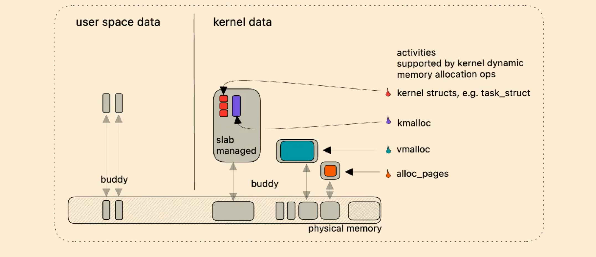

- Linux, like many modern operating systems, uses a complex system of memory management to efficiently use the limited resource of physical memory.
- It employs concepts like virtual memory, pages, and VMAs to manage the memory needs of different processes, ensuring that each process gets the memory it needs without interfering with others.
- The kernel’s own memory management (logical and virtual addresses) is optimized for different use cases to ensure efficient system operation.

- **User-mode mappings**: These are memory addresses that the process can access. For example, the memory where the process's code and data live.
- **Kernel mappings**: This part of the address space is common across all processes and can only be accessed when the process is executing in kernel mode. This memory contains the kernel code, data, and some structures needed by the OS.

#### Kernel Logical Addresses

- These are a subset of kernel addresses that are directly mapped to physical memory.
- They are used for memory that is frequently accessed or needs to be accessed quickly, such as memory used by DMA (Direct Memory Access).

#### Kernel Virtual Addresses

- These addresses do not have a fixed direct mapping to physical memory.
- Useful for situations where the kernel needs to allocate large buffers, and it's challenging to find a large contiguous block of physical memory.
- Managed through `vmalloc` function, which allows allocation of memory that is not contiguous in physical memory.

### Virtual Memory Area (VMA)

- A VMA is a region in a process's virtual address space.
- It represents a contiguous area in a process's address space that has similar properties, like permissions and whether the area is backed by a file or is an anonymous region.

## Virtual memory

- Virtual memory is a memory management capability of an OS that uses hardware and software to allow a computer to compensate for physical memory shortages, by temporarily transferring data from random access memory (RAM) to disk storage.
- It creates an illusion of a very large memory space, even if the physical memory is limited.

Demand paging is a form of lazy loading, where the system defers loading parts of a program until they are actually needed. This contrasts with a strategy where the entire program and all its associated resources are loaded into memory at start-up.

### Virtual Address Space in Linux

#### Overview

- Each process in Linux has its own page directory, which includes both user-mode and kernel mappings.
- During a context switch, only user space mapping changes, while kernel pages remain inaccessible in user mode.

#### Address Types

1. **Kernel Logical Addresses**:
    
    - Directly mapped to physical addresses starting from 0.
    - Correspond to contiguous physical memory.
    - Accessible by Direct Memory Access (DMA).
    - Managed using the `kmalloc` function.
2. **Kernel Virtual Addresses**:
    
    - Not contiguous in physical memory.
    - Ideal for large buffers where contiguous physical memory is scarce.
    - Managed using the `vmalloc` function.

#### Page Sizes

- Linux supports multiple page sizes: standard 4KB, 2MB, and 1GB (huge pages).

#### Memory on 32-bit Machines

- "Low memory" refers to the portion of physical memory less than 1GB, which can be mapped above user space.
- Accessing memory beyond low memory requires mapping it into virtual memory space.

#### Virtual Memory Areas (VMA)

- Characteristics of a VMA:
    - Can be mapped to a file (with backing store) or be anonymous (e.g., stack, heap).
    - Can be shared or private.
    - Permissions: Readable, writable, executable.
    - VM_IO flag indicates mapping of a device's I/O space.

#### Backing Store and Anonymous Areas

- Backing store areas are derived from PT_LOAD segments in the ELF file.
- Anonymous areas (heap, stack, bss) initially map to a zero page and employ Copy-On-Write (COW) if written.

#### Page Fault Handling

- Page faults occur when a process accesses a page not present in memory.
- Linux uses a [red-black tree](../../../BSc(italian)/Algoritmi%20e%20Principi%20dell'Informatica/src/12.Alberi%20e%20grafi.md##Alberi%20rosso-neri) of VMAs for efficient and balanced searching.

#### Creating VMAs

- VMAs are created by a process using the `mmap()` function.
- `mmap()` provides direct access to the kernel's internal page cache, avoiding data copying.

### Physical Address Space in Linux

#### Memory Configuration

- Memory can be organized into NUMA banks or nodes.
- Each physical page is represented by `struct page` in an array `mem_map`.

#### Memory Allocation

- Node-local allocation policy: Memory is allocated from the node closest to the running CPU.
- Different zones for memory allocation:
    - ZONE_DMA: For certain ISA devices.
    - ZONE_NORMAL: Directly mapped by the kernel.
    - ZONE_HIGHMEM: Remaining memory, not directly mapped.

#### Zone Management

- Zone information is maintained in `pgdat_list`.
- For UMA architectures, a single `pg_data_t` structure called `contig_page_data` is used.

### Page Allocation in Linux

- Zones contain information about the total size and lists of free page ranges.
- The buddy algorithm is used for allocating contiguous pages from available free regions.

 

These notes offer a concise yet comprehensive overview of memory mechanics in Linux, focusing on virtual and physical address spaces, VMAs, and page allocation strategies. The use of diagrams further aids in understanding these complex concepts.

Anonymous memory regions or pages that lack an association with any specific file and don't have a file-based backing store on the disk. Instead, these memory regions are dynamically generated as needed and can be supported by the system's swap area when required.

1. **No File Backing**: Unlike file-mapped VMAs, anonymous VMAs don't have a direct file backing on the disk. Their content is created at runtime.    
2. **Common Uses**:
    - **Heap**: For dynamically allocated memory in a process (e.g., using `malloc` in C).
    - **Stack**: To store function call frames, local variables, etc.
    - **System Calls**: In scenarios like using `mmap` without a file descriptor or with the `MAP_ANONYMOUS` flag.
3. **Initialization**: Anonymous pages are typically initialized to zero upon first access, contrasting with file-backed pages, which are initialized with the corresponding file content.
4. **Swapping Mechanism**: In the absence of file backing, anonymous pages might be moved to a swap area on the disk to free up physical memory, and reloaded into memory when accessed again.
5. **Copy-On-Write (COW) Technique**: Frequently used with COW, particularly during process forking (`fork` system call), where the child process initially shares the same pages as its parent, and duplication of pages occurs only upon modification by either process.

NUMA, or Non-Uniform Memory Access, is a computer memory design used in multiprocessor systems. In NUMA, multiple processors are connected in such a way that they have varying access times to different parts of the computer's memory, making memory non-uniformly accessible. Here's an overview of NUMA:

1. **Memory Access in NUMA**:
   - In a NUMA system, memory is divided into several regions (or nodes), with each region being closer (in terms of access time) to one particular processor or a group of processors.
   - While a processor can access all memory regions, accessing memory local to it (local memory) is faster than accessing memory local to other processors (remote memory).

2. **Why NUMA?**:
   - NUMA architecture is used to overcome the limitations of earlier symmetric multiprocessing (SMP) systems, where all processors share a single, uniform memory bus. In SMP, as the number of processors increases, the memory bus becomes a bottleneck, limiting scalability.
   - NUMA improves scalability by providing processors with their own memory and reducing contention on a single memory bus.

3. **Advantages of NUMA**:
   - **Improved Scalability**: By reducing bus contention, NUMA systems can scale better with the addition of more processors.
   - **Increased Performance**: For workloads that primarily access local memory, NUMA can offer significant performance benefits.

4. **Challenges of NUMA**:
   - **Complex Memory Management**: Operating systems and applications need to be NUMA-aware to optimize memory locality. This often involves sophisticated memory management strategies.
   - **Non-Uniformity**: The non-uniform nature of memory access times can lead to performance inconsistencies, especially for processes that access a lot of remote memory.

5. **NUMA in Modern Systems**:
   - Modern operating systems like Linux, Windows Server, and others support NUMA. They include optimizations to allocate memory from a node local to the processor executing a task and to schedule tasks on processors close to the memory being accessed.
   - Many server and high-performance computing systems use NUMA architecture due to its scalability benefits.

In summary, NUMA is a key architectural approach in high-end computing systems, designed to improve scalability and performance in multi-processor systems by localizing memory access. However, it requires intelligent management of memory and processor resources to fully realize its potential benefits.

A DMA (Direct Memory Access) device is not a core of the CPU. Instead, it is a feature of certain hardware devices that allows them to access the system memory (RAM) directly, bypassing the CPU to speed up memory operations. DMA is often used by devices like network cards, sound cards, graphics cards, and disk drive controllers.

The classification of memory zones in Linux (ZONE_DMA, ZONE_NORMAL, ZONE_HIGHMEM) is not directly related to the proximity of CPU cores to memory zones in a NUMA (Non-Uniform Memory Access) architecture. Instead, these zones are primarily concerned with how the kernel addresses and manages different parts of the physical memory within a single node. Let's clarify this:

1. **Memory Zones (ZONE_DMA, ZONE_NORMAL, ZONE_HIGHMEM)**:
   - These zones are used to manage physical memory in a way that accommodates hardware limitations and addresses the kernel's memory mapping capabilities.
   - **ZONE_DMA**: For memory that can be accessed by DMA devices.
   - **ZONE_NORMAL**: For memory that can be directly mapped by the kernel.
   - **ZONE_HIGHMEM**: For memory that cannot be permanently mapped by the kernel and is used in systems with physical memory exceeding the addressable range of the kernel.

2. **NUMA and CPU Cores**:
   - NUMA architectures are about the physical layout of processors and memory in a system where memory access time varies depending on the memory's location relative to a particular processor.
   - In a NUMA system, memory is divided into nodes, and each node is closer to some CPUs than to others. This affects the latency and bandwidth of memory access from different CPUs.

3. **Interaction Between NUMA and Memory Zones**:
   - While NUMA deals with the topology of memory relative to CPU cores, memory zones deal with how the operating system kernel manages different types of memory.
   - In a NUMA system, each node might have its own set of memory zones. The kernel's memory allocator can make decisions based on both the NUMA node and the type of memory zone when allocating memory for processes.

4. **Kernel and CPU Cores**:
   - The Linux kernel can be NUMA-aware, meaning it can optimize processes and memory allocation based on the distance of memory from the CPU cores.
   - However, this optimization is separate from the division of physical memory into ZONE_DMA, ZONE_NORMAL, and ZONE_HIGHMEM.

In summary, while both memory zones and NUMA architectures deal with memory management, they operate at different levels. Memory zones are about how the kernel manages and accesses different types of physical memory, while NUMA is about optimizing memory and processor usage based on the physical layout of memory and processors in a system.

--- 

Linux virtual address space Each process has its own page directory. Kernel logical (kmalloc) addresses are mapped directly to physical memory starting from 0 while kernel virtual (vmalloc) ones are not contiguous 

Kernel logical addresses are mapped directly to physical addresses starting from 0 . These correspond to contiguous physical memory and can be used by DMA if needed. There is a special function called $\mathrm{kmalloc}$ requesting pages from here.

Kernel virtual addresses are not contiguous in physical memory. They are used to allocate large buffers where finding chunks of physical memory would be difficult. The vmalloc function is used to request non-contiguous physical pages and sets up addresses here

### Page Allocation in Linux Kernel

In the Linux kernel, each memory zone is characterized by the total size of its pages and an array of lists of free page ranges. When the kernel requires contiguous pages and free pages are available, it utilizes the buddy algorithm. This algorithm is designed to efficiently allocate memory by minimizing the fragmentation of large free memory blocks.

#### Buddy Algorithm

The buddy algorithm aims to reduce the need for splitting large free memory blocks when smaller requests are made. This is important for two reasons:

1. The kernel often needs contiguous pages for Direct Memory Access (DMA).
2. Using larger, 4 MB pages instead of smaller ones decreases the frequency of Translation Lookaside Buffer (TLB) misses.

This algorithm manages the merging/splitting of memory blocks:

- **Allocation**: To allocate a block of a given size, the kernel first checks the free list of the requested size and higher. If a block of the requested size is available, it is allocated immediately. If not, a larger block is split into two smaller blocks, with one half being allocated and the other returned to the free list. This process may recur as necessary.
- **Deallocation**: Upon freeing memory, the kernel checks if there is a free 'buddy' block adjacent to the one being freed. If so, the two blocks are merged into a single larger block. This process is recursive.

The kernel frequently allocates and releases fixed-size data structures. The Buddy System, while efficient for larger allocations, is not ideal for these smaller structures due to potential internal fragmentation and the need for synchronization via locks. Therefore, Linux kernel buffers its request through two additional fast allocators:

1. **Quicklists**: Specifically for paging, quicklists implement a LIFO system for managing page table caches.
2. **Slab Allocator**: This is used for various buffers and manages caches of commonly used objects. It includes dedicated caches for specific objects and general-purpose caches for various sizes. The slab allocator provides two main classes of caches:
	- **Dedicated**: These are caches that are created in the kernel for commonly used objects (e.g., mm_struct, vm_area_struct ,etc...).Reinitialised at free.
	- **Generic** (size-N and size- N(DMA)): These are general purpose caches, which in most cases are of sizes corresponding to powers of two.

( Paging is a memory management scheme that eliminates the need for contiguous allocation of physical memory. It allows the physical address space of a process to be non-contiguous, which helps in efficiently utilizing memory and simplifies memory management. )
 

### User space page caching

The page cache is a collection of physical page descriptors( `struct page` is a c structure which represents properties of a page ) corresponding to pages that contain data read and written from regular filesystem files or associated with anonymous VMAs.

It accessible through two maps:

- **forward mapping**: `file descriptor + offset -> struct page` is useful to get to the physical page containing file's data at offset.
- **backward mapping**: `struct page -> [VMA]` is useful when we want to invalidate page tables entries of shared pages in different processes.

Reverse mapping keeps track of which physical pages are shared between VMAs, particularly useful for file-backed pages and Copy-on-Write (CoW) pages. The `page` struct's fields like `_mapcount`, `address_space`, `flags`, and reference counters are instrumental in tracking these shared pages and their states.

For identifying if data requested by a process is already in memory, Linux uses a per-file page cache, managed through `address_space` structures, each with a unique radix tree for tracking the physical page mappings. The mapping between file descriptors plus offsets to physical pages ensures that multiple processes can access the same file data without unnecessary duplication in memory.

When it's time to reclaim pages, the Page Frame Reclaim Algorithm comes into play. This algorithm aims to reduce memory pressure by maintaining two lists of pages—active and inactive—in each memory zone. Pages are initially placed in the inactive list; after two accesses, they move to the active list, indicating frequent use. The algorithm prefers to evict 'clean' pages (those not marked as dirty) from the inactive list. This process is dynamic, with Linux moving pages between the active and inactive lists to balance the system's memory needs with the availability of clean pages for new data or processes.

A Virtual Memory Area (VMA) is a segment of memory assigned to a process that includes information about the process's memory pages. Physical pages are shared between VMAs to avoid unnecessary duplication. For instance, if several processes are using the same library or file, they can share the same physical pages where this data is loaded, as long as they're not modifying it.

Each process in a system has its own set of VMAs. VMAs are linked to the process's address space, which is separate from other processes

In summary:

- **Reclaiming pages**:  memory pages that are no longer actively used and recycles them for new tasks.
- **File-backed pages** allow memory to directly reflect the contents of files.
- **CoW pages** are an efficient way to handle data copies only when necessary.
- **Physical pages are shared** to save memory and prevent duplication.
- **VMAs** are associated with processes, not threads; threads within the same process share the same VMAs.

File-backed pages are areas of memory that directly correspond to files on disk. For example, when you open a document on your computer, the operating system loads the contents of the document from the storage disk into memory. This memory is now "backed" by the file - there's a direct link between the file on disk and the data in memory.

The Buddy System, Quicklists, and the Slab Allocator are all memory management techniques used in operating systems, particularly in the Linux kernel. Each serves a different purpose, and they are used in conjunction to manage memory efficiently. Let's break down their roles and relationships:

1. **Buddy System**:
   - The Buddy System is still used in the Linux kernel for managing physical memory, particularly for allocating and deallocating memory blocks of various sizes.
   - It works by dividing memory into blocks of various sizes, which are powers of two. When a request for memory is made, the Buddy System finds the smallest block that will satisfy the request. If a block is larger than needed, it's split into "buddies."
   - The Buddy System is efficient for managing varying sizes of memory requests and for minimizing fragmentation.

2. **Slab Allocator**:
   - The Slab Allocator is a memory management mechanism that caches kernel objects (such as file objects, task structures, etc.) to optimize frequent allocations and deallocations.
   - It works by pre-allocating memory chunks (slabs) for certain types of objects. When an object of that type is needed, it can be quickly allocated from a pre-existing slab, reducing the overhead of frequent allocations.
   - The Slab Allocator is not a replacement for the Buddy System but rather a higher-level memory manager that works on top of it. It uses the Buddy System for obtaining larger chunks of memory, which are then subdivided into slabs.

3. **Quicklists**:
   - Quicklists are a mechanism used to optimize the allocation of frequently used small objects, particularly for per-CPU allocations.
   - They are essentially a list of pre-allocated memory pages or blocks for certain types of objects, allowing for rapid allocation without having to frequently query the general-purpose memory allocators.
   - Quicklists can reduce contention on global resources in a multiprocessor system.

In summary, the Buddy System, Slab Allocator, and Quicklists are all used in the Linux kernel for different aspects of memory management. The Buddy System provides a fundamental way to manage physical memory blocks efficiently. The Slab Allocator builds on this to optimize the allocation of frequently used kernel objects. Quicklists further optimize specific use cases, especially in multiprocessor environments. Each has its own role, and they complement each other rather than one replacing the others.

**User Space vs. Kernel Space:**

- In Linux, memory is divided into user space and kernel space. User space is where user applications run, while kernel space is where the kernel (core part of the operating system) runs.
- This separation is important for system stability and security. If user applications could directly access kernel memory, it could lead to system crashes or security vulnerabilities.

Sure, here's a list of scenarios where a task would use the kernel space stack:

1. **System Calls**: When a user application requests services from the OS, like file operations (open, read, write), network communication, or process management.
2. **Interrupt Handling**: When the CPU interrupts the current process to handle an external event, like I/O completion or timer interrupts.
3. **Exception Handling**: In response to exceptions such as division by zero, invalid memory access, or other faults.
4. **Context Switching**: During the process of switching the CPU's attention from one process to another, especially to save and restore execution contexts.
5. **Device Driver Operations**: When executing code within device drivers, for instance, during data read/write to hardware devices.
6. **Signal Handling**: When processing signals sent to a process, which might involve kernel-level operations like process termination or pausing.
7. **Scheduling and Dispatching**: When the OS's scheduler decides which process to run next and performs the necessary operations to start its execution.
8. **Memory Management**: During operations like allocating or freeing memory, especially when it involves modifying the process's page tables.
9. **Network Stack Processing**: For tasks like packet sending/receiving, which are handled at the kernel level.
10. **File System Management**: When performing tasks like navigating directories, creating/deleting files, or managing file system metadata.
