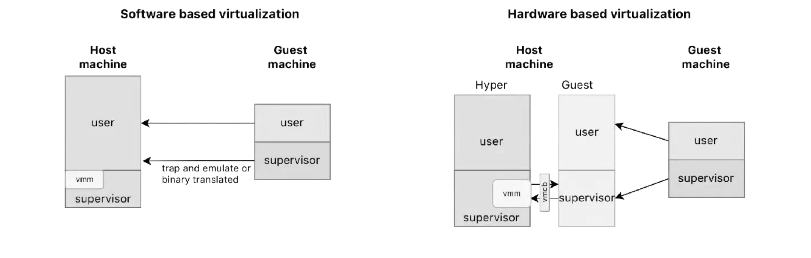

# Virtualization 

A Virtual Machine (VM) is an effective, isolated replication of an actual computer designed for running a specific operating system (OS). It's based on a virtual machine monitor (VMM), also known as a **hypervisor**. 
There are two types of hypervisors:

- **Type 1 Hypervisor**: Also known as a native or bare-metal hypervisor, it operates directly on the hardware without an underlying host OS.
- **Type 2 Hypervisor**: This runs on top of a host operating system, like KVM or VirtualBox.

A mention also goes to paravirtualization, which is when the guest os is modified to work closely with the hypervisor, leading to improved performance and reduced virtualization overhead.
The VMM has total control over system resources, ensuring:

- **Fidelity**: The VM behaves in the same way as the real machine.
- **Safety**: The VM is restricted from bypassing the VMM's management of virtualized resources.
- **Efficiency**: Programs running within the VM experience little to no significant drop in performance.

The reasons for using a virtual machine are numerous:

- **Consolidation**: Multiple VMs can run on a single physical machine, maximizing hardware utilization by running one machine at full capacity instead of multiple machines at partial capacity.
- **Adaptability**: VMs can quickly adjust to changing workloads.
- **Cost Reduction**: Data centers can reduce both hardware and administrative expenses.
- **Scalability**: VMs can be easily scaled horizontally to meet increased demands.
- **Standardization**: They provide a standardized infrastructure across different environments.
- **Security and Reliability**: VMs offer secure sandboxing for applications and can enhance fault tolerance.

## Popek and Goldberg theorem

First of all, the difference between sensitive and privileged instructions: 

- **Sensitive**: 
	- **Controls Sensitive**: Directly changes the machine status, like enabling or disabling interrupts.
	- **Behavior Sensitive**: Operates differently depending on whether it's executed in user or supervisor mode, which can impact fidelity.
- privileged: privileged (which are restricted and can cause a trap if executed in user mode).

> "For any conventional computer, a virtual machine monitor may be built if the set of sensitive instructions for that computer is a subset of the set of privileged instructions." theorem, Popek and Goldberg

This theorem states that for any conventional computer, a  VMM can control the execution of guest OS (by intercepting and emulating privileged instructions) only if all sensitive instructions are also privileged: this so that any attempt by the guest OS to execute a sensitive instruction will cause a trap to the VMM, allowing it to handle the instruction appropriately. 
    
This theorem is a **sufficient** condition, not a necessary one as some mechanism exist(ed) to achieve virtualisation for x86 processors not equipped with VT-x.

##  Virtualization techniques

[Virtualization](../../Computing%20Infrastructures/src/07.Virtualization.md) can be achieved through:

1. **Software-Based** (de-privileging): 
	- "Trap and emulate" 
	- Together with shadowing it is a basic constituent of software virtualisation is **ring deprivileging**: the process of reducing the privilege level of a virtual machine by moving it from a higher privilege ring to a lower one, such as from Ring 0 to Ring 3 and 1.
2. **Hardware-Assisted**: 
	  - Modern processors offer built-in support for virtualization, making it easier and more efficient. These processors have additional modes for guest and hypervisor operations.
	   - Some instructions aren't trapped, fetched, and executed by the hypervisor, but directly transformed into emulation routines.
    

## Depriviliging

Privileged instructions affect the state within the virtual CPU, represented in the Virtual Machine Control Block (VMCB):

- Guest state: the state of the processor that is saved and restored when exiting and entering the virtual machine.
- Host state: the state of the processor that is restored upon exiting the virtual machine.
- Execution control: specifies how to handle interrupts when the guest operating system is running.
- Specifies whether certain instructions, such as manipulating $\mathrm{cr} 3$, should be considered sensitive.
- Exit reason: indicates why the virtual machine exited, such as due to I/O access and which register was involved.
- Enter and exit control: used, for example, when the machine is in root mode and receives an interrupt but the guest has disabled interrupts. It informs the VMM to trap when interrupts are reenabled.

Deprivileging might pose a problem in terms of fidelity because, if not taken care of, a guest could under- stand that it is running in unprivileged mode. This is resolved, for software virtualisation, through just in time compilation.

- Deprivileging is when a virtual machine functions with lesser access to hardware and system resources than it would if it ran on a physical system."
- **Mechanism**: "In the context of an x86 host this could mean that the guest's ring 0 is demoted to function in ring one on the host.

- he JIT compiler detects sensitive or privileged instructions in the guest code that need special handling when the guest OS is deprivileged.
- **Translation**: Instead of executing these instructions directly, the JIT compiler translates them into a sequence of safe, unprivileged instructions that the host system can execute without compromising security or stability.
- **Caching**: Translated instructions are cached so that subsequent executions of the same instructions can use the optimized versions without needing retranslation, improving performance.

- **Ring 0 to Ring 1**: The guest OS, which would normally run in ring 0 (highest privilege), is demoted to run in ring 1 or another less privileged ring.

1. **Ring 0**: Kernel mode, full privileges.
2. **Ring 1**: (Rarely used) Driver mode, intermediate privileges.
3. **Ring 2**: (Rarely used) Driver mode, intermediate privileges.
4. **Ring 3**: User mode, least privileges.

## KVM

KVM (Kernel-based Virtual Machine) is a virtualization technology in the Linux kernel which allows Linux to be a hypervisor, converting it into a type 1 hypervisor.

KVM (Kernel-based Virtual Machine) uses IOMMU (Input-Output Memory Management Unit) which provides a mechanism to apply virtual-to-physical address translation and access control for device DMA, similar to how the MMU does for CPU access to memory. This allows devices to use "virtual addresses" in their operations, which the IOMMU then translates to physical addresses according to translation tables it maintains.

## Translation of physical addresses 

Regarding the translation of physical addresses from the guest OS to physical addresses on the host:

- in **software based virtualization** the guest physical pages are actually host virtual pages and the whole mapping guest virtual to hardware physical host is called "Shadow Page Table". The guest OS believes it controls the page tables, but the hypervisor actually intercepts and manages the mappings. The hypervisor intercepts these updates, translates them, and updates the shadow page tables accordingly (all of this, under the hood, it's done marking the guest page table as read-only so that then it manages any corresponding traps) that arise out of these modifications).
- in **hardware based virtualization**, as the name suggests all this stuff is managed at hardware level by a mechanism called "Extended Page Tables" . Introduced by Intel VT-x or AMD RVIK (Rapid Virtualization Indexing), EPT is an "extended part" which keeps track of the mapping from the guest physical address to the host physical address.

## hardware/software virtualizations techniques

- KSM (Kernel Same-page Merging) is a feature in Linux designed to save memory across multiple processes or VMs. It works by scanning for physical pages with identical content and remaps all virtual pages pointing to these physical pages to a single copy. This allows the system to free up the surplus physical pages, setting them as copy-on-write.
- Ballooning allows a hypervisor to dynamically adjust the amount of physical memory available to VMs. A special driver installed in the guest operating system allocates memory to itself forcing the guest OS to swap or release less frequently used memory pages back to the host, allowing the hypervisor to reallocate this memory to other VMs.
- Memory overcommitment in virtualization allows assigning more memory to virtual machines (VMs) than the physical memory available. When the actual memory usage approaches or exceeds the physical memory, techniques like ballooning are used to reclaim memory.

## Containerization 

Containers are a way to isolate a set of processes and make them think that they are the only ones running on the machine:
- Processes running inside a container are normal processes running on the host kernel.
- There is no guest kernel running inside the container

Containers are based mainly on 2 technologies: 

- Namespaces are a feature of the Linux kernel that partitions kernel resources such that one set of processes sees one set of resources while another set of processes sees a different set of resources. In this way each process in Linux has its own network namespace, pid namespace, user namespace and a few others.
- CGroups / control group (met at [this chapter](projects/polimi-notes/MSc(english)%20(WIP)/Advanced%20OS%20(WIP)/src/02.Scheduling.md#Cgroups) ) 
