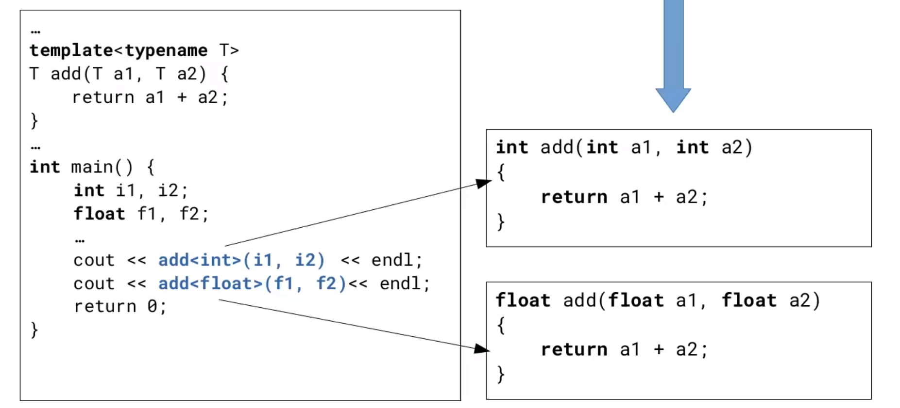

# C++

## Recap on C++ 

- Classes
- Namespaces
- Smart pointers
- Template and STL containers
- Lambda expressions
### How to compile C++ sources?

In `C++11` and beyond, there are several new features introduced. These features can only be utilized if the compiler is instructed to target a specific standard, such as `C++17`. If the target standard is not specified, the compiler may be unable to find the necessary definitions of functions and data structures.
`$> g++ myprogram.cpp -o myprogram -Wall -02 -stdc=c++17`

### Classes

A class is a type of data that consists of data members (attributes) and function members (methods). An object is an instance of a class, such as Leonardo da Vinci being an instance of the class "Human Beings".

A class is defined using a specific syntax and is typically placed in a header file (.h or .hh) that needs to be imported in implementation files (.cpp or .cc).

Each class has special member functions:

1. Constructor: initializes an object and can take parameters. If not defined, the compiler will generate a default one.
2. Copy constructor: initializes an object using another object of the same class as an argument. If not defined, the compiler will generate a default one.
3. Move constructor: initializes an object from an value. The constructor argument is not stored in any variable.
4. Destructor: called implicitly when the object goes out of scope. If not defined, the compiler will generate a default one. It does not take any parameters and includes cleanup/resource release code.

To instantiate an object of a class:

- Use `Car c;` which is equivalent to `c();` for constructors with no parameters.
- Use `Car c(<params-list>);` for constructors with parameters.
- Use `Car c{<params-list>};` as a more modern approach that prevents data type narrowing.

Object-oriented programming defines three fundamental properties for a class type data: encapsulation, inheritance, and polymorphism. In the context of C++, these properties are implemented in specific ways.
#### Encapsulation

Encapsulation means to properly restrict the access to some of the members
We can set a member as:
- public: can be accessed by code outside of the object
- private
- protected: are something in the middle, that we are going to explain in a few slides
### Inheritance and polymorphism

Inheritance is a fundamental concept in object-oriented programming that allows for the creation of relationships between classes. With inheritance, a class can inherit the public and protected members of another class, known as the parent or base class. This relationship between classes is beneficial as it helps to prevent code duplication.
Inheritance allows for cleaner design by promoting the reuse of code. Instead of rewriting the same code in multiple classes, inheritance allows a derived class to inherit the members of its parent class, reducing redundancy and improving code organization.
When creating a derived class, it is important to note that the constructor of the parent class must be called. This ensures that the proper initialization of the inherited members takes place.
Polymorphism allows a derived class to behave differently from its parent class. This is achieved through overriding, where the derived class re-implements its own version of a member function inherited from the parent class. To indicate that a member function can be overridden, the virtual specifier keyword is used. It is strongly recommended to use the keyword override to avoid errors. 

```cpp
#include <iostream>
class Vehicle {
public:
    virtual void move_one_step_forward() {
        this->x += 1;
    }
protected:
    int x;
};
class Car : public Vehicle {
public:
    void move_one_step_forward() override {
        this->x += 100;
    }
};
int main() {
    Car my_car;
    // Move vehicle forward
    my_car.move_one_step_forward();
    // Print new position
    std::cout << "New position: " << my_car.num_of_wheels();
   return 0;
}
```
Some member functions may be pure virtual, which means that derived classes must provide their own implementation. An abstract class refers to a type of class whose member functions are all pure virtual. This is useful when defining a general interface but leaving the implementation to the specific case. Pure virtual member function definitions must include the virtual keyword as a qualifier and an "=0" termination.
#### Member qualifiers

- The const qualifier can be used to define read-only member functions
(their invocation will not change the status of the class instance)
Helpful for enabling compiler optimizations
Self-explanatory
- The noexcept specifier declares the function non-throwing (we are promising that it will not throw exceptions)

#### Operators

In addition to member data and functions, we can define and implement different operators in C++. 
In this lecture, we will focus on the copy assignment operator and the move assignment operator.

The copy assignment operator is responsible for replacing the current content of an object with a copy of another object. By default, the compiler provides us with an implementation of this operator. However, there are certain conditions that can lead to the deletion of the default implementation. In such cases, we can explicitly require the default implementation or explicitly delete the copy assignment operator. 

Similarly to the copy assignment operator, the move assignment operator "moves" the state of the right-hand object into the assigned object. This means that the right-hand object is left in a no longer valid state. We can use the default keyword to ensure that the default version of the move assignment operator is provided, and depending on the logic of our application, we can define our class as not movable.

The Rule of Five in modern C++ states that we should define or delete the following five member functions for classes that deal with resource management: 

- the copy constructor
- the copy assignment operator
- the move constructor
- the move assignment operator 
- the destructor.

### Namespaces

Namespaces in C++ are used to prevent name conflicts by creating "named scopes" for the declaration of symbols, such as functions and classes. Symbols with the same name from different namespaces do not introduce conflicts. 

The built-in namespace std includes the definitions of most of the C++ library symbols. Additionally, it is possible to define nested namespaces.

#### Templates

One of the core features in C++ are templates: which provide a way to implement functions and classes that can be used with different data types. This allows for code reuse and avoids having to write the same code for each specific data type.

The data type for a template is determined at compile-time, and the compiler generates the appropriate code to handle different data types. This allows us to have one implementation that can cover multiple cases.

Template definition code is typically placed in header files, making it easier to use and reuse in different parts of the program.

However, there are some drawbacks to using templates. Compiling code with templates can take longer and result in larger executable sizes. Modifying a template class often requires recompiling a significant portion of the project. Additionally, debugging can become more complex due to the potentially lengthy error messages generated by the compiler.

As an example, consider a template "add()" function. The compiler will generate multiple versions of the function based on the different data types it is used with.



#### Standard Template Library (STL)

The std namespace is probably the most important namespace in the library that encapsulates all the classes and functions defined by the STL library.

The STL (Standard Template Library) is an important part of the `C++` language. It includes the definition of a set of template-based containers. These containers can be classified into:

- **Sequence**: array, list, forward_list, vector, dequeue
- **Associative**: map, multimap, set, multiset
- **Unordered associative**: unorder_map/multimap, unordered_set/multiset

The STL also provides utility functions for manipulating these containers. 

Containers are used to build collections of objects. When choosing a container, it is important to consider design aspects such as: 

- **Read access patterns**
	- How frequently we need to access objects? Do we need a direct access or can we tolerate an iteration over the entire collection?
- **Write access patterns**
	- Does the content of the collection change frequently? (many add/remove operations)
- **Memory occupancy**
	- Is the additional overhead introduced by the container an issue?

Most important containers: 

- **Vector**: A sequence container which represent dynamic arrays. It provides contiguous storage of elements with random access, resulting in high efficiency when accessing items (`O(1)` complexity).However, it is not as efficient in insert and delete operations in other positions. If the size of the vector exceeds its capacity, the entire vector is reallocated in a bigger memory space. 
- **List**: A sequence container that implements double-linked lists. It has very efficient insert/remove operations, but accessing a single item has linear complexity. It is good for sorting-like operations but uses extra memory due to storing pointers.
- **Forward list**: Similar to a list, but it implements single-linked lists. It also has efficient insert/remove operations and linear complexity in accessing a single item. It has less memory overhead compared to a regular list.
- **Array**: A sequence container representing fixed-size arrays. It has contiguous storage of elements, allowing for high efficiency in accessing items. However, it is not possible to add further elements to an array.
- **Map**: An associative container that stores pairs of key-value, where the key is used for sorting and access purposes. Accessing and inserting/removing elements have a complexity of O(log n). Maps are typically implemented as binary search trees.
- **Set**: An associative container that stores unique elements. It has similar complexity to map in terms of accessing and inserting/removing elements. Like maps, sets are typically implemented as binary search trees.
- **Unordered map**: An associative container that stores unique pairs in an unordered manner. It uses a hash function to reference the "bucket" in which an element is stored. Accessing and inserting/removing elements have a complexity of O(1) or O(n) depending on the hash function used. Unordered maps are faster than ordered containers like map and set.

More information on these containers can be found at https://en.cppreference.com/w/cpp/container.

### Smart pointers

In C++, we can dynamically allocate memory space from the heap to store data, such as objects. Before C++11, the typical approach was to use the new/delete operators pair. However, this usage of "raw" pointers can introduce potential bugs in the software.


One potential bug scenario is when we enter an if statement, and the function returns a null pointer, causing the loss of the object reference and resulting in a memory leak.

Another scenario is when an assignment operation leads to the loss of the memory object pointed to by a pointer, causing a memory leak.

Using "raw" pointers can also lead to segmentation faults in multi-threaded environments. If one thread deallocates a pointer while another thread is still accessing it, a segmentation fault may occur.

Furthermore, using "raw" pointers can lead to segmentation faults when it is unclear who is responsible for deallocating the memory. 

To address these issues, C++ defines three types of smart pointers: 

- Unique pointer `unique_ptr`
- Shared pointer `shared_ptr` 
- Weak pointer `weak_ptr`

These smart pointers are classes defined in the `<memory>` header. They are based on the concept of ownership, determining who is responsible for deallocating the memory once the object is destroyed.

#### Unique pointer

The `std::unique_ptr<T>` is a smart pointer in C++ that represents exclusive ownership of a resource. It follows the RAII design pattern, ensuring proper management of the resource.

`std::unique_ptr` focuses solely on managing ownership and does not have additional features like sharing ownership or custom deleters.

It is not copyable, only moveable, which means only one object can point to the memory location at a time. The original value is lost after assignment.

In contrast, `std::shared_ptr<T>` allows for shared ownership. It uses a reference counter to keep track of the number of shared pointers pointing to the object. The counter is incremented with each copy operation and decremented when a shared pointer goes out of scope.

Object destructor and memory deletion occur when the reference counter reaches 0.
#### Shared pointer

The use of shared pointers eliminates the need for manual memory management using automatically a dedicated reference **counting mechanism** which takes care of this.
When there is an error, the reference counter of the shared pointer is decreased to 0 outside the scope of the function, ensuring **no memory leaks** occur. Additionally, the memory allocated by the shared pointer will be automatically deallocated when all threads terminate, so **no explicit deletion**. 
#### Pointers and containers

When building a collection of objects, it is important to consider the lifecycle of each object and how we expect to pass them to functions (by copy or by reference). In many cases, it is more efficient to store pointers to objects in the container instead of the objects themselves. This avoids unnecessary copying of objects and is especially beneficial when the objects are frequently accessed and manipulated by functions.

For example, we can modify the provided map example by using shared pointers. This allows us to use type deduction (using the keyword auto) to shorten the length of the statement.

#### Functors

A function object, also known as a functor, is a struct or class data type that has the operator() (function call) provided. It allows for storing, copying, and invoking any Callable object that can be copied. The `<functional>` header defines the function class type, which is a polymorphic function wrapper and permits 

##### Bind expressions

The std::bind template function from the `<functional>` header allows us to create a forwarding call wrapper for a callable object. Its main purpose is to bind the arguments of the function.

When using std::bind, any unbound arguments can be replaced using the placeholders defined in the std::placeholders namespace, such as std::placeholders::_1, std::placeholders::_2, and so on.

The return value of the std::bind call is constructed from the return value of the callable object being bound.

As an example, we can bind a generic multiply() function to a function multiply_by_2().

### Lambda expressions

Introduced with `C++` 11, lambda expressions define **anonymous** function objects, also known as **lambda closures**. They have a minimal syntax, with an empty function denoted by `[] ( ) -> { }`. The capture clause, denoted by `[]`, determines which variables from the outer scope are accessible within the body of the lambda expression. The capture clause is optional and can be performed by value or by reference. The return type specification is usually optional and can be deduced.

In a lambda expression, the capture clause is the most important detail. It "captures" variables from the outer scope, making them visible within the lambda expression. The capture can be performed by value or by reference, or no variables can be captured at all.

- `[]` captures nothing.
- `[&]` captures any variable in the local block scope by reference.
- `[=]` captures any variable in the local block scope by making a copy.
- `[=, &foo]` captures any variable in the local block scope by making a copy, but captures variable `foo` by reference.
- `[foo]` captures `foo` by making a copy, without copying anything else.
- `[this]` captures the `this` pointer of the enclosing object.

## Modern C++ threading support


Multi-threading is a way of running multiple programs at the same time. C++ has support for this type of parallelism. 

`C++11` introduced the class thread (namespace std): `#include <thread>`

| Member function | Return value | Description |
| :---: | :---: | :---: |
| get_id() | thread::id | Returns an unique identifier object |
| detach() | void | Allows the thread to run independently from the others |
| join() | void | Blocks waiting for the thread to complete |
| joinable() | bool | Check if the thread is joinable |
| hardware_concurrency0 | unsigned | An hint on the HW thread contexts (often, number of CPU cores) |
| operator= |  | Move assignment |


`C++11` defines also the namespace `std::this_thread` to group a set of functions to access the current thread.

| Function | Return value | Description |
| :--- | :--- | :--- |
| get_id() | thread::id | Returns an unique identifier object for the <br> current thread |
| yield() | void | Suspend the current thread, allowing <br> other threads to be scheduled to run |
| sleep_for() | void | Sleep for a certain amount of time |
| sleep_until() | void | Sleep until a given timepoint |


Using `using namespace std` in header files is generally considered bad practice because it can lead to naming clashes when the header file is included in multiple parts of a program. This is because the `std` namespace will be inherited by any file that includes the header. In **source files**, however, it is acceptable to use `using namespace std` if there are no clashes, as it can make the code more concise. Overall, it is discouraged in headers but allowed in sources.


#### Mutual exclusion and pitfalls


Understanding concurrent code is crucial because it helps developers avoid unexpected deadlocks and difficult-to-debug issues. Without knowledge of concurrency, developers may write code that unintentionally results in deadlocks or other problems. This is especially true in kernel-space programming where there are numerous complexities and potential pitfalls. Therefore, it is essential to educate developers about concurrent code to equip them with the necessary skills to write robust and reliable applications.

Concurrency loss: 

Locking a mutex for an extended period of time results in a decrease in concurrency during program execution. This loss of concurrency is deemed acceptable in order to ensure correct execution. However, it is important to **minimize the duration of critical sections** in order to avoid unnecessarily limiting concurrency.


#### Mutex class

The mutex is a widespread synchronization primitive provided to perform mutual exclusive access to data. It is used to protect critical sections of a program. The operating system can preempt a thread between any instructions. `Mutex` solve the problem of writing concurrent code, but programmers must use them correctly. To use the mutex, use the member function:

| Member function | Description |
| :--- | :--- |
| `lock()` | Locks the mutex. If already locked, the thread <br> blocks. |
| `try_lock()` | Try to lock the mutex. If already locked, returns. |
| `unlock()` | Unlock the mutex. |


From a theoretical point of view, synchronization primitives such as Mutexes solve the problem
- However, they create another one: programmers must use them correctly

Writing concurrent code is hard
- Testing doesn't help, some race conditions occur so rarely that can stay unnoticed for a long time
- Modern threading API such as C++ threads can help
- But it is important to learn how to write concurrent code
	- Requires developing a forma mentis of thinking about possible execution interleaving
	- In these slides we'll see common pitfalls to watch out for
	- Is a fundamental skill especially when writing OS code


In these slides we'll see common **pitfalls** to watch out for. Improper use of mutex may lead to **deadlocks**, a time unbounded blocking of one or more threads. If a code path can access the shared variable while others go through the mutex, it's still a race condition.


#### Lock() function

`lock()` function takes care of the correct locking order through a deadlock avoidance algorithm Any number of mutex objects can be passed to lock and in any order (use of lock is more expensive than lock_guard). 


#### Scoped locks

scoped locks -> lock_guard and unique_Lock
The **scoped_lock** class, defined in the `<mutex>` header, is an alternative approach to the lock() function. It follows the RAII style and allows any number of mutex objects to be passed in any order. However, using lock() is more expensive than using **lock_guard**. Keeping the duration of locking a mutex as short as possible is important to minimize the loss of concurrency in the program execution. Deadlock avoidance algorithm is also included in the code.
lock_guard() locks the entire function! 
scoped locks that automatically
unlocks mutex, regardless of how we leave the scope
(including exceptions)

They implement the RAII (Resource Acquisition Is Initialization)
paradigm, wrapping the calls to mutex member functions
(lock()/ unlock())

`lock_guard<>` is the simplest locking class

The unique_lock is an advanced type of lock that introduces the concept of ownership. This allows the ownership to be transferred from one object to another. It includes the features of a lock_guard but extends its functionality. With unique_lock, the ownership of a mutex can be moved from one unique_lock object to another. It also allows the mutex lock to be deferred with respect to the object construction and the mutex unlock to be explicitly performed before the object destruction. However, it has more overhead compared to lock_guard. In general, if there is more overhead, its use is limited. It is important to know about unique_lock, but the normal lock_guard or scoped_lock can be used.

`unique_lock <>` includes the lock_guard features but extend its functionalities with the concept of ownership
$\rightarrow$ The ownership of a mutex can be moved from one unique_lock object to another
$\rightarrow$ The mutex lock can be deferred with respect to the object construction
$\rightarrow$ The mutex unlock can be explicitly performed before the object destruction
$\rightarrow$ More overhead with respect to lock_guard


**Recursive mutex** → multiple locks by the same thread 

Regular mutexes and recursive mutexes are both provided in the C++ runtime library. The reason for having both types is due to the overhead of recursive mutexes. 

The purpose of using threading is to achieve faster execution. However, recursive mutexes take more time to lock and unlock compared to non-recursive mutexes. Hence, recursive mutexes are only beneficial in specific scenarios.

To cater to different needs, the C++ runtime library offers the choice between regular mutexes and recursive mutexes. It is important to select the appropriate type based on the requirements of the situation.


#### Shared mutex 

Further reducing concurrency loss: the shared_mutex class

General idea: as long as critical sections only **read** shared variables, they don’t interfere


Introduces the “Read-Write Lock” paradigm
Multiple readers are allowed to access the resource as long as no one is writing
A single writer at a time is allowed to access the resource

For this mutex we can specify two different access types

Shared: the ownership is shared among multiple threads
Exclusive: the ownership belongs to a single thread


| Member function | Description |
| :--- | :--- |
| lock | Locks the mutex. If already locked, the thread blocks. |
| try_lock | Try to lock the mutex if not already locked |
| try_lock_for | Try to lock the timed_mutex for a specified duration |
| try_lock_until | Try to lock the timed_mutex until a time point |
| unlock | Unlock the mutex |
| release | Release ownership the mutex, without unlocking |
| operator= | Unlocks the owned mutex and acquire another |


Shared_lock is the RAll equivalent for locking/unlocking shared_mutex objects in shared mode. It shares the same member functions as unique_lock. In multi-threaded programs, there may be dependencies among threads, and a mechanism is needed to block a thread and put it into a waiting queue. This waiting should be inexpensive in terms of CPU time consumption, as the waiting thread is not performing any useful work.

#### Condition variables

In multi-threaded programs we may have dependencies among threads

In some cases, a thread may need to wait for another thread to complete its current operation. This creates a dependency between the two threads. Unlike a mutex use case, where waiting is necessary to prevent race conditions, this waiting in a dependency scenario should not consume any CPU time as the waiting thread is not performing any useful work.

To address this, we need a mechanism to explicitly block a thread and place it into a waiting queue. The thread can then be notified when the condition that caused it to be blocked has changed. This allows the thread to resume execution once the dependency has been resolved.


When a thread is waiting for work, it should consume no CPU time as it is not actively performing any tasks. This waiting should be inexpensive in terms of resource usage.


| Member function | Description |
| :--- | :--- |
| `wait(unique_lock<mutex> &) `| Blocks the thread until another thread wakes it up. <br> The Lockable object is unlocked for the duration of <br> the wait(...) |
| `wait_for( unique_lock<mutex>&) const chrono::duration<..> t)` | Blocks the thread until another thread wakes it up, or a time span has passed. |
| `notify_one()` | Wake up one of the waiting threads. |
| `notify_all()` | Wake up all the waiting threads. If no thread is waiting do nothing. |


### Semaphore vs Mutex vs Condition Variables

#### **When to Use**

- **Semaphore:**
  - Use when you need to control access to a resource that can support multiple simultaneous accesses (counting semaphore).
  - Useful for signaling between threads or processes (binary semaphore).

- **Mutex:**
  - Use when you need to control access to a resource, but only one thread at a time should have access (mutual exclusion).
  - Ideal for protecting shared data from being simultaneously accessed by multiple threads.

- **Condition Variables:**
  - Use when a thread needs to wait (block) for a specific condition to become true.
  - Often used in conjunction with a mutex to synchronize the access to a resource and wait for specific conditions on that resource.

#### **Code Cheatsheet**

- **Semaphore (POSIX in C):**
  - **Initialization:**
    ```c
    #include <semaphore.h>
    sem_t semaphore;
    sem_init(&semaphore, 0, initial_value);  // 0 for threads, initial_value typically 1
    ```
  - **Wait (Decrease Count):**
    ```c
    sem_wait(&semaphore);
    ```
  - **Signal (Increase Count):**
    ```c
    sem_post(&semaphore);
    ```
  - **Destroy:**
    ```c
    sem_destroy(&semaphore);
    ```

- **Mutex (POSIX in C):**
  - **Initialization:**
    ```c
    #include <pthread.h>
    pthread_mutex_t mutex = PTHREAD_MUTEX_INITIALIZER;
    ```
    or
    ```c
    pthread_mutex_init(&mutex, NULL);
    ```
  - **Lock:**
    ```c
    pthread_mutex_lock(&mutex);
    ```
  - **Unlock:**
    ```c
    pthread_mutex_unlock(&mutex);
    ```
  - **Destroy:**
    ```c
    pthread_mutex_destroy(&mutex);
    ```

- **Condition Variables (POSIX in C):**
  - **Initialization:**
    ```c
    pthread_cond_t cond = PTHREAD_COND_INITIALIZER;
    pthread_mutex_t mutex = PTHREAD_MUTEX_INITIALIZER;
    ```
    or
    ```c
    pthread_cond_init(&cond, NULL);
    pthread_mutex_init(&mutex, NULL);
    ```
  - **Wait for Condition:**
    ```c
    pthread_mutex_lock(&mutex);
    pthread_cond_wait(&cond, &mutex);
    pthread_mutex_unlock(&mutex);
    ```
  - **Signal Condition:**
    ```c
    pthread_cond_signal(&cond);  // or pthread_cond_broadcast(&cond) for multiple threads
    ```
  - **Destroy:**
    ```c
    pthread_cond_destroy(&cond);
    pthread_mutex_destroy(&mutex);
    ```

This cheatsheet provides the essentials for using semaphores, mutexes, and condition variables in a POSIX-compliant environment in C. Remember that proper synchronization and error checking are crucial to avoid deadlocks, race conditions, and other concurrency problems.


### Design patterns for multithreaded programming

Now let's see most used design patterns in multithreaded programming context using 


#### Producer/Consumer


One approach to decouple the operations of a consumer thread and a producer thread is to use a queue. The queue serves as a buffer for data, allowing the producer to continue operating even if the consumer is not ready. If the producer is faster than the consumer, the queue ensures that data is buffered and not lost.

To ensure thread safety, access to the queue needs to be synchronized. This can be achieved through the use of a mutex, which ensures that only one thread can access the queue at a time. Additionally, the consumer should be designed to wait if the queue is empty, ensuring that it doesn't try to process data that isn't available yet.

In some cases, it may be desirable for the producer to block if the queue is full. This prevents the producer from producing more data than the consumer can handle, avoiding potential issues such as memory overflow. This blocking behavior can be implemented as an optional feature in the queue design.


Implemented in an header `synchronized_queue.h` as a template: 

```cpp
#ifndef SYNC_QUEUE_H
#define SYNC_QUEUE_H
#include <list>
#include <mutex>
#include <condition_variable>

template<typename T>
class SynchronizedQueue {
public:
    SynchronizedQueue() { }
    void put(const T& data);
    T get();
    size_t size();

private:
	SynchronizedQueue(const SynchronizedQueue&) = delete;
	SynchronizedQueue & operator=(const SynchronizedQueue&) = delete;	
    std::queue<T> myQueue;
    std::mutex myMutex;
    std::condition_variable myCv;
};

template<typename T>
void SynchronizedQueue<T>::put(const T& data) {
    std::unique_lock<std::mutex> lck(myMutex);
    myQueue.push_back(data);
    myCv.notify_one();
}

template<typename T>
T SynchronizedQueue<T>::get() {
    std::unique_lock<std::mutex> lck(myMutex);
    while (myQueue.empty()) {
        myCv.wait(lck);
    }
    
    T result = myQueue.front();
    myQueue.pop_front();
    
    return result;
}

template<typename T>
size_t SynchronizedQueue<T>::size() {
    std::unique_lock<std::mutex> lck(myMutex);
	return myQueue.size();
}

#endif // SYNC_QUEUE_H
```

In this case, it is crucial to use a condition variable, specifically `myCv.wait(lck)`. This allows the thread to correctly communicate with the scheduler when it is not doing anything. Using an `if(queue.empty()) continue;` statement would be a significant error as it would continuously occupy the scheduler.

#### Active Object

A thread function has no explicit way for other threads to communicate with it. Often data is passed to thread by global variables which is not a good practice. 
Conversely, this pattern allows us to **wrap a thread into an object**: so we have basically a thread with methods you can call.

$\rightarrow$ We may have member functions to pass data while the task is running, and collect results

- In some programming languages (e.g., Smaltalk and Objective all objects are "active objects"

The class includes a thread object and a member function `run()` implementing the task:

```cpp
#ifndef ACTIVE_OBJ_H_
#define ACTIVE_OBJ_H_
#include <atomic>
#include <thread>

class ActiveObject {
public:
    ActiveObject();
    virtual ~ActiveObject();

private:
    virtual void run() = 0;
    ActiveObject(const ActiveObject&) = delete;
    ActiveObject& operator=(const ActiveObject&) = delete;

protected:
    std::atomic<bool> quit;
    std::thread t;
};

#endif // ACTIVE_OBJ_H_
```

The constructor initialize the thread object

$\rightarrow$ While the destructor takes care of joining it

- The `run()` member function acts as a "main" concurrently executing

- We can use it to implement threads communicating through a producer/consumer approach

- In the provided implementation we used the "atomic" variable quit to terminate the run() function when the object is destroyed

$\rightarrow$ A normal boolean variable with a mutex would work as well

#### Reactor


Many languages have no way to decouple function arguments binding from the call. In C++11 is possible to package a function and its arguments, and call it later. `bind()` and template class `function<>` allow us to this. 

```cpp
#include <iostream>
#include <functional>

using namespace std;

void printAdd(int a, int b) {
    cout << a << " + " << b << endl;
}

int main() {
    function<void()> func;
    func = bind(&printAdd, 2, 3);
    ...
    func();
    return 0;
}
```


It's also possible to specify only some parameters and specify the rest the function is called. 

In a similar way we can make decouple the task creation from the execution using **Reactor** pattern. A reactor is a general thread used for computation. 

The reactor is a executor thread which waits on a task queue.
Any other part of the program can push tasks into the queue
Tasks are executed sequentially
$\rightarrow$ The simplest solution is usually in a FIFO order
$\rightarrow$ We are free to add to the "reactor" alternative thread scheduling functions

- `C++11` function `bind()` and template class function<> allows us to create the task, leaving the starting time to the executor thread, in a second step


// take code from course repo 

By combining ActiveObjects, Synchrnoized Queues and binding functions we have Reactor.

#### ThreadPool

A limitation of Reactor is that tasks are processed sequentially, causing potential latency in task execution. This latency is dependent on the length of the task queue. To address this issue and make use of **multi-core processors**, a solution is to implement multiple executor threads that can pick tasks from the same queue. This pattern is known as **ThreadPool**.

- One (or more) queue(s) of tasks/jobs and a fixed set of worker threads

- Better control over thread creation overhead

- Some design issues to consider...

$\rightarrow$ How many worker threads to use?

A number somehow related to the number of available CPU cores

$\rightarrow$ How to allocate tasks to threads?


// take code from course repo 