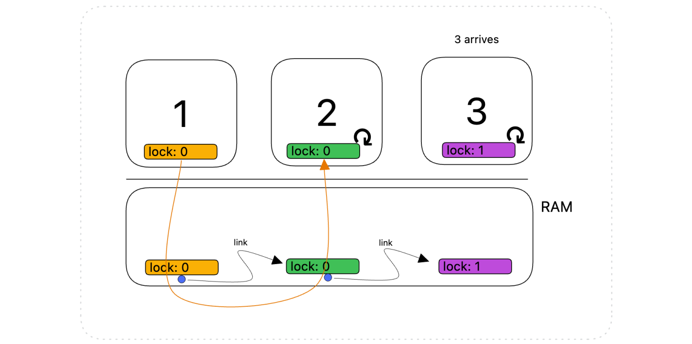

# Concurrency  

> "Linux is probably the most complex multi-process program among all the ones that exist now." 

Concurrency is when a program consists of activities that can overlap in execution. A program can be characterized by two properties:

- **Safety**: nothing bad happens.
- **Liveness**: makes progress and is not just stuck. 

Regarding concurrency we can highlights these aspects:

- **Deadlock** between tasks: due to mutual exclusion, hold-and-wait, no preemption, and circular wait conditions.
- **Priority inversion** is a scheduling scenario where a high priority task is delayed by a lower priority task due to locking. The bad concurrency model inverts the priority model

**Kernel concurrency** is a critical aspect of Linux kernel development, distinct from user space concurrency. It involves managing and synchronizing multiple threads within the **kernel space**. This includes:

- **Interrupts**: Handling asynchronous events that can occur at almost any time.
- **Kernel Preemption**: Allowing for the interruption of kernel tasks to enhance system responsiveness and multitasking capabilities.
- **Multiple Processors**: Ensuring the kernel's ability to run on multi-processor systems, which introduces complexities in resource sharing and synchronization.

## Preemption

In a preemptive kernel, the kernel allows a process to be preempted while it is running in kernel mode. This means that the kernel can interrupt a process to give CPU time to another process.

This enables higher responsiveness as the system can switch tasks even when a process is executing in kernel mode. 
Widely used in real-time operating systems where response time is critical.

From Linux kernel version 2.6 onward, the kernel became optionally preemptive. Preemption points **in the kernel** include:

1. When an interrupt handler exits, before returning to kernel-space;
2. When kernel code becomes preemptible again ( `preempt_count=0` )
3. If a task in the kernel implicitly/explicitly calls `schedule()`
4. The kernel sets the `TIF_NEED_RESCHED` flag in the current thread's descriptor to indicate that the scheduler needs to run.

How `preempt_count`variable works actually? It is used to ensure a safe context switch that keeps track of the preemptions:

- `preempt_count=0` when the process enters kernel mode
- increase by 1 on lock acquisition (critical section)
- increase by 1 on interrupt

As long as `preempt_count > 0` the kernel cannot switch.

## Synchronization

Developers with a thorough grasp of kernel concurrency can exploit advanced features like:

- **Fine-Grained Locking**: This involves locking at a more granular level, improving system performance and reducing contention.
- **Specialized Synchronization Primitives**: The kernel provides various primitives tailored for specific synchronization
- **Lockless Algorithms**: These allow for efficient data handling without traditional locking mechanisms.

### Locking

On SMP (Symmetric Multi-Processing) machines the spinlock is the basic ingredient.
**Spinning locks** continuously poll the lock until it becomes available while a sleeping lock (semaphores in Linux) (more overhead) waits until it is notified that the lock is available.
The key points of spin lock: 

- Useful when **lock for a short period of time**. It's wise to hold the spin locks for less than the duration of 2 context switches, or just try to hold the spin locks for as little time as possible.
- Used in interrupt handlers, whereas semaphores cannot be used because they sleep. (Processes in kernel can't sleep!)

Variants of spinning locks are: 

- **Readwrite locks**: distinguish between readers and writers, where multiple readers can access an object simultaneously, whereas only one writer is allowed at a time. 
- **Seqlocks**: to prevent starvation of writers, a counter starting from 0 is used to track the number of writers holding the lock. Each writer increments the counter both at locking/unlocking phase. The counter permits to determine if any writes are currently in progress: if the counter is even, it means that no writes are taking place. Conversely, if the counter is odd, it indicates that a write is currently holding the lock. Similarly readers check the counter when trying to lock: if the counter is odd, it means busy wait. If even the reader does the work but before releasing, it checks if the counter changed (in case it does again the work). `jiffies` is the variable that stores a Linux machine's uptime, is frequently read but written rarely by the timer interrupt handler: a seqlock is thus used for machines that do not have atomic 64 bit read.
- **Lockdep**: it enables to report deadlocks before they actually occur in the kernel, which is equally impacted by the problem of deadlocks. When `CONFIG_PROVE_LOCKING`, **lockdep** detects violations of locking rules keeping track of locking sequences through a graph.

#### Multi-CPU concurrency: MCS lock

**MCS (Mellor-Crummey and Scott) Locks** are a type of synchronization mechanism particularly noted for being **cache-aware spinlocks**: MCS locks solve the cache ping-pong problem by using a **queue system**. 

1. **Queue-Based Locking Mechanism**: MCS locks maintain a queue of waiting threads. Each thread in the queue spins on a **local** variable in the **local cache**, reducing the need for frequent memory access, which is common in traditional spinlocks.
2. **Localized Spinning**: In an MCS lock, a thread waits for a signal from its predecessor in the queue. This means that **it only needs to monitor a local variable**, which is likely to be in its cache line. 

### Lock-free

This part delves into the realm of lock-free algorithms, which are essential for high-performance concurrent systems. 

#### Primitives and basic problems

Let's break down each part for a clearer understanding:

1. **Per-CPU Variables**: In a multi-core or multi-processor environment, the Linux kernel maintains data specific to each CPU using per-CPU variables: thereby eliminating the need for synchronization mechanisms like locks. 
2. **The Atomic API**: Atomic operations are fundamental in concurrent programming, especially in kernel development. An `atomic` operation is executed entirely as a single, indivisible step, which is crucial in multi-threaded contexts. The atomic API in the Linux kernel provides a set of functions and macros that perform atomic operations, such as adding to, subtracting from, or setting a value. These operations are used to manipulate shared data safely between different threads or interrupt handlers without causing race conditions: the operation will be atomic, meaning that it will be completed in its entirety, or not at all. Atomic operations that can be used to safely increment a shared counter, such as `atomic_inc()`, `atomic_add()`, and `atomic_add_return()`. These operations are implemented using special CPU instructions such as x86’s "lock" prefix or ARM’s "LDREX" and "STREX" instructions. 
3. **CAS (Compare-and-Swap) Primitive**: Compare-and-Swap is a powerful synchronization primitive used in multi-threaded programming. It is a single atomic operation that compares the contents of a memory location to a given value and, only if they are the same, modifies the contents of that memory location to a new given value. This atomicity is crucial to ensure that no other thread has altered the data between the steps of reading and writing. CAS is widely used in the implementation of lock-free data structures and algorithms. 
	- **The ABA Problem**: The ABA problem is a classical issue encountered in concurrent programming when using CAS operations. It occurs when a memory location is read (A), changed to another value (B), and then changed back to the original value (A) before a CAS operation checks it. The CAS operation sees that the value at the memory location hasn’t changed (still A) and proceeds, unaware that it was modified in between. This can lead to incorrect behaviour in some algorithms, as the change-and-reversion can have side effects or meanings that the CAS operation fails to recognize.

#### Readers/writers

The readers/writers problem is a common challenge in managing access to shared data by multiple threads where some threads read data (readers) and others modify it (writers).  
One synchronization technique used in the Linux kernel is the **Read Copy Update** (RCU) mechanism. 

The core idea of RCU is to allow readers to access data without any locks. In this way readers don't need to acquire locks, they can access shared data with minimal overhead, which is particularly advantageous in high-concurrency environments. 

When a writer needs to update a data structure, instead of modifying the structure in-place and potentially disrupting readers, RCU creates a copy of the structure and applies the changes to this copy. Once the updated copy is ready, the system switches pointers so that subsequent readers see the updated structure. The old data structure is not immediately freed; instead, it is marked for later reclamation once all pre-existing readers that might be accessing it have finished.

In the Linux kernel, RCU is widely used for various purposes, such as managing network routes, file system mounts, and other data structures where the pattern of frequent reads and infrequent updates is common.

#### Memory models

Memory models define how memory operations in one thread are seen by others in a multiprocessor environment. Different models have varying levels of order enforcement and visibility, influencing how multi-threaded programs behave and are synchronized. 

- **Sequential Model**: Theoretically the strongest but impractical, ensuring program and memory order are the same.
	- Defined by Leslie Lamport's in the 1979 paper: How to Make a Multiprocessor Computer That Correctly Executes Multiprocess Programs"
	- Define $<_p$ the program order of the instructions in a single thread and $<_m$ as the order in which these are visibile in the shared memory (also referred to as the happens-before relation).
	- A multiprocessor is called sequentially consistent iff for all pairs of instructions $\left(I_{p, i}, I_{p, j}\right)$ you have that $I_{p, i}<_p I_{p, j} \rightarrow I_{p, i}<_m I_{p, j}$
	- In practice the operations of each individual processor appear in this sequence in the order specified by its program.
- **Total Store Order (TSO)**: Used in x86 intel processors, involves FIFO store buffers allowing delayed writes. 
	- Processors use a local write queue, or **store buffer**, to mitigate the delays caused by memory latency when they issue a store command. Once a write operation is completed and the data reaches the shared memory, it becomes visible to all processors. 
	- Despite the sequence of operations,**loads may appear to be reordered in relation to stores** due to the buffering of write operations. This means that reads can sometimes retrieve updated values before the writes are fully propagated through the system.
	- To ensure sequentially consistent behavior, especially at crucial points within a program, processors can use specific instructions known as "memory barriers" like the `mfence` instruction. The `mfence` instruction acts as a full memory barrier, ensuring that each thread completes its pending write operations to memory before initiating any read operations.
- **Partial Store Order (PSO)**: Used in ARM, treats memory as if each processor has its own copy. **Writes can be reordered**, lacking a mechanism for simultaneous write visibility across processors.
	- The PSO model can allow data races due to the absence of a forced happens-before relation. Synchronization instructions like _release_ and _acquire_ are necessary to commit writes to shared memory and avoid data races. 

PSO is the linux memory model: the least common denominator all CPU families that run the Linux kernel. The Linux Kernel Memory Model (LKMM) it's mainly based on the primitives `smp_store_release (W[release])` and `smp_load_acquire(R[acquire])`, which are used to create happens‑before arcs between different threads.

#### Data races

Compilers can reorder instructions, affecting perceived memory models. 
High-level languages provide mechanisms to enforce certain memory orderings:

- **Fences/Barriers**: These are special instructions that prevent certain types of reordering of memory operations, ensuring that operations are completed as perceived in the program's order.

Fences help in avoiding incorrect read operations that might arise due to data races in concurrent environments.

##### Great powers, great responsibilities 

- **Performance Consideration**: Overuse of fences can lead to performance degradation as they restrict the processor's ability to reorder instructions for efficient execution.
- **Strategic Placement**: It's crucial to strategically place fences where necessary, rather than using them indiscriminately, to balance correctness and performance.

#### LKMM

The linux memory model is the least common denominator all CPU families that run the Linux kernel. At its core,  it's **essentially, PSO.**

The LKMM employs specific C language instructions, known as primitives, to manage memory ordering **across different threads**. Two such critical primitives are `smp_store_release` (notated as `W[release]`) and `smp_load_acquire` (notated as `R[acquire]`). 

These primitives play a pivotal role in establishing **happens-before** "relationship arcs" between concurrent threads. 

