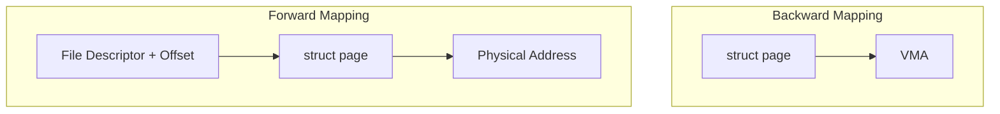

# Virtual memory

Linux, similar to other OSs, uses virtual memory to manage memory. Virtual memory  creates the perception of a larger memory space, even when physical memory is limited: a computer can overcome memory shortages by temporarily moving data from RAM to disk storage. 


The kernel treats physical pages as the basic unit of memory management. 

The kernel represents every physical page with a `struct page` structure which doesn't describe the data contained in it , but the properties of the physical page. 

The important point to understand is that the page structure is associated with physical pages, not virtual pages. Therefore, what the structure describes is transient at best. Even if the data contained in the page continues to exist, it might not always be associated with the same page structure because of swapping and so on. 

Some main concept to keep in mind:

- **Virtual Memory Area** (VMA) is a region in a process's virtual address space which main purpose is to handle mappings of virtual memory into physical memory.
    - VMA can be mapped to a file (with backing store) or be anonymous (e.g., stack, heap).
    - Anonymous areas (heap, stack, bss) initially map to a zero page and employ Copy-On-Write (COW) if written.
    -  Backing store areas are derived from PT_LOAD segments in the ELF file.
    - shared or private.
    - Permissions: Readable, writable, executable.
    - `VM_IO` flag indicates mapping of a device's I/O space.
    - VMAs are created by a process using the `mmap()` function.
- **Paging** is a memory management scheme that eliminates the need for contiguous allocation of physical memory. It allows the physical address space of a process to be non-contiguous, which helps in efficiently utilizing memory and simplifies memory management.
- Demand Paging: Pages are loaded into memory only when they are accessed, not all at once.
- Page faults occur when a process accesses a page not present in memory.
- Linux uses a [red-black tree](../../../BSc(italian)/Algoritmi%20e%20Principi%20dell'Informatica/src/12.Alberi%20e%20grafi.md##Alberi%20rosso-neri) of VMAs for efficient. 
- **Process Address Space** is the range of addressable memory for each process which includes text (code), data, heap, and stack segments.


## Kernel address space

**Kernel Logical Addresses** are a subset of kernel addresses that are directly mapped to physical memory. They are used for memory that is frequently accessed or needs to be accessed quickly, such as memory used by DMA (Direct Memory Access).

- Directly mapped to physical addresses starting from 0.
- Correspond to contiguous physical memory.
- Accessible by Direct Memory Access (DMA).
- Managed using the `kmalloc` function.

For the most part, only hardware devices require physically contiguous memory allocation but for performance, most kernel code uses `kmalloc()`.

**Kernel Virtual Addresses** are not directly mapped to physical memory. They are helpful in situations where the kernel needs to allocate large buffers but can't find a continuous block of physical memory. The allocation and management of these addresses are done using the `vmalloc` function.
 
- Not contiguous in physical memory.
- Ideal for large buffers where contiguous physical memory is scarce.
- Managed using the `vmalloc` function.

## Page Allocation

In the Linux kernel, each memory zone is characterized by the total size of its pages and an array of lists of free page ranges. When the kernel requires contiguous pages and free pages are available, it utilizes the **buddy algorithm** and a couple of others.

### Buddy Algorithm

The buddy algorithm aims to reduce the need for splitting large free memory blocks when smaller requests are made. This is important for two reasons:

1. The kernel often needs contiguous pages for Direct Memory Access (DMA).
2. Using larger, 4 MB pages instead of smaller ones decreases the frequency of Translation Lookaside Buffer (TLB) misses.

This algorithm manages the merging/splitting of memory blocks:

- **Allocation**: To allocate a block of a given size, the kernel first checks the free list of the requested size and higher. If a block of the requested size is available, it is allocated immediately. If not, a larger block is split into two smaller blocks, with one half being allocated and the other returned to the free list. This process may recur as necessary.
- **Deallocation**: Upon freeing memory, the kernel checks if there is a free 'buddy' block adjacent to the one being freed. If so, the two blocks are merged into a single larger block. This process is recursive.


   - It works by dividing memory into blocks of various sizes, which are **powers of 2**. When a request for memory is made, the Buddy System finds the smallest block that will satisfy the request. If a block is larger than needed, it's split into "buddies."
   - The Buddy System is efficient for managing varying sizes of memory requests and for minimizing fragmentation.
 


### Beyond the Buddy Algorithm

Allocating and freeing data structures is one of the most common operations inside any kernel. The Buddy System, while efficient for larger allocations, is not ideal for these smaller structures due to potential internal fragmentation and the need for synchronization via locks. 
Therefore, Linux kernel buffers its request through two additional fast allocators:

1. **Quicklists**: used to optimize the allocation of frequently used small objects, particularly for per-CPU allocations.
   - They are essentially a list of pre-allocated memory pages or blocks for certain types of objects, allowing for rapid allocation without having to frequently query the general-purpose memory allocators.
   - Quicklists can reduce contention on global resources in a multiprocessor system.
3. **Slab Allocator**: the slab layer acts as a generic data structure caching layer for kernel objects such as file objects, task structures, etc.:
   - When an object of that type is needed, it can be quickly allocated from a pre-existing  memory chunk called slab, reducing the overhead of frequent allocations.
   - The Slab Allocator is not a replacement for the Buddy System but rather a higher-level memory manager that works on top of it. It uses the Buddy System for obtaining larger chunks of memory, which are then subdivided into slabs. The slab allocator provides two main classes of caches:
		- **Dedicated**: These are caches that are created in the kernel for commonly used objects (e.g., `mm_struct`, `vm_area_struct` ,etc...). 
		- **Generic** (size-N and size-N(DMA)): These are general purpose caches, which in most cases are of sizes corresponding to powers of two.


### Zonal page allocation in Linux

Physical memory can be organized into **NUMA** banks or nodes.


Zonal Page Allocation is a memory management strategy which aims to allocate memory physically near the CPU requesting it. For this the memory is organized hierarchically in zones.
**Zones** contain information about the total size and lists of free page ranges.

| Zone         | Description                | Physical Memory |
| ------------ | -------------------------- | --------------- |
| ZONE_DMA     | DMA-able pages             | < 16MB          |
| ZONE_NORMAL  | Normally addressable pages | 16 ~ 896MB      |
| ZONE_HIGHMEM | Dynamically mapped pages   | > 896MB         |

## Physical Address Space in Linux

Unlike file-mapped VMAs, anonymous VMAs don't have a direct file backing on the disk. **Common Uses are**:

- **Heap**: For dynamically allocated memory in a process (e.g., using `malloc` in C). 
- **Stack**: To store function call frames, local variables, etc.
- **System Calls**: In scenarios like using `mmap` without a file descriptor or with the `MAP_ANONYMOUS` flag.

Obv anonymous pages are typically initialized to zero upon first access, contrasting with file-backed pages, which are initialized with the corresponding file content.

Anonymous pages can be moved to a swap area on the disk to free up physical memory, and they are frequently used with COW, particularly during process forking (`fork` system call), where the child process initially shares the same pages as its parent, and duplication of pages occurs only upon modification by either process.

### User space page caching

Linux's User Space Page Caching goal is to cache data **from the filestystem** in RAM.
Disk data, upon being read, is cached in the Page Cache, represented as a collection of `struct page`, each describing a memory page's properties and status.

This `struct page` describes **physical page** (where actual data is) attributes in memory, containing essential details like mappings, counters, and flags.

```c
// Representation of a page of memory in the Linux kernel
struct page {
    unsigned long flags;         // Status flags for the page
    atomic_t _count;             // Reference count
    struct address_space *mapping; // Pointer to the address space
    pgoff_t index;               // Offset within the address space
    struct list_head lru;        // LRU list linkage
};
```

Exits two **mapping mechanisms:**

1. **Forward Mapping (`file descriptor + offset -> struct page`):** Enables direct access to the physical page containing a file's data at a specified offset.
2. **Backward Mapping (`struct page -> [VMA]`):** Facilitates invalidation of page table entries for shared or CoW (Copy-on-Write) pages across different processes, crucial for managing file-backed pages.





To manage memory pressure (no infinite RAM), Linux employs a **Page Frame Reclaim Algorithm** which organizes pages based on their activity into 'active' and 'inactive' lists within each memory zone.
Linux uses the **clock algorithm** as PFRA, which approximates well the LRU (Least Recently Used) strategy (ideal LRU is not achievable in practice because you would have to precisely track the last usage timestamp). Clock algorithm is simple: 

- Pages are organized in 2 circular lists:
	   - **Inactive List**: Pages initially reside here. Pages move to the 'active' list after two accesses, indicating they are used regularly.
	   - **Active List**: Contains pages that have been accessed multiple times.
- If a page's reference bit (R) is 0, indicating it hasn't been used recently, that page is evicted. If the reference bit is 1, it is cleared, and the clock hand moves to the next page.


The PFRA is triggered under certain conditions based on a **zone-based watermark** model to ensure enough free pages are always available for requests. 


Simplifying: 

- **Pages High**: If free pages fall below this level, `kswapd` periodically runs the PFRA.
- **Pages Low**: When free pages hit this level, it triggers a deferred `kswapd` invocation.
- **Pages Min**: At this critical level, the buddy allocator itself will invoke the PFRA to free up pages.
