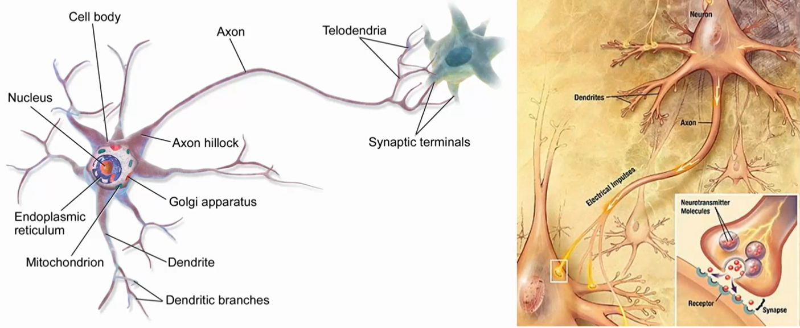
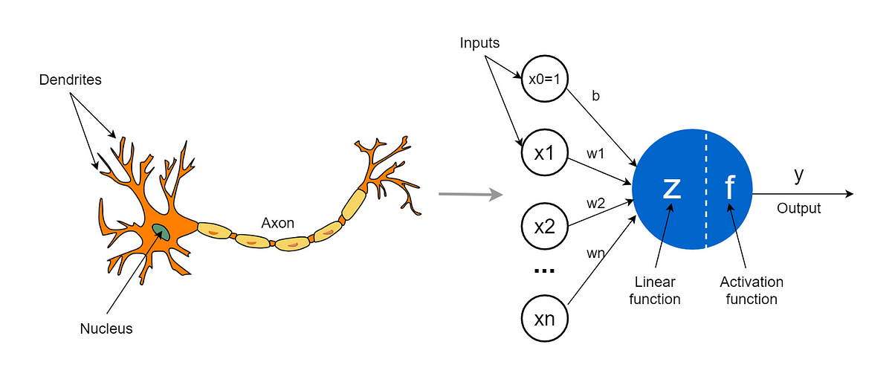
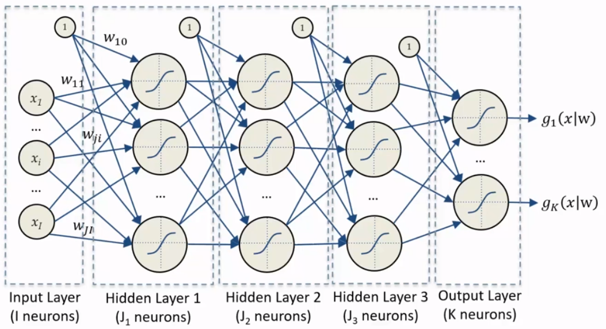

# From perceptron to Feed Forward Neural Networks

The concept of neural networks has been around since the 1950s. Initially, it involved building hardware that could mimic human-like behaviour and perform tasks that only humans were thought to be able to do. 
## Perceptron

A perceptron can be seen as a mathematical model of the neurons. We want to mimic this non-linear system where there is a sort of **threshold**: the signals arrive from other neurons, but only if the sum of signals exceeds the threshold the neuron activates.

The basic structure of a perceptron can be seen as:

$$
y= \begin{cases}1 & \text { if } \sum_{i=1}^{n} w_{i} x_{i}+b>0 \\ -1 & \text { otherwise }\end{cases}
$$

In this equation, $x_{1}, x_{2}, \ldots, x_{n}$ are the input features, $w_{1}, w_{2}, \ldots, w_{n}$ are the weights assigned to each input feature, $b$ is the bias term, and $y$ is the output of the perceptron. The perceptron calculates the dot product of the weights and inputs, adds the bias term, and then applies the activation function (which in this case is a step function). If the result is greater than zero, the output is 1 , and if it is less than or equal to zero, the output is -1 .

It's a **non-linear** function of a linear combination: the inputs are combined linearly (sum of weighted inputs plus a bias), and then this result is transformed by a **non-linear** function (the activation function).

Why this non-linearity is so important? 

- Linear models can only represent linear relationships. Non-linear functions in neural networks can approximate a wider range of functions, including intricate and complex relationships in data. 
- Non-linear activation functions also allow for the stacking of layers in deep neural networks which would not be possible with linear functions which would collapse into a single linear layer. 
- Many real-world phenomena are non-linear, so non-linear representations are necessary to accurately reflect them.

Sometimes the bias is just seen as another parameter $w_0$.

## Feedforward Neural Networks

Feedforward neural networks are typically represented by composing together many different functions. 
The model is associated with a **directed acyclic graph** describing how the functions are composed together. 

These networks have only information flowing forward in a **chain of functions** (that's why are called **feed-forward** neurons) called **layers**.

The depth of the model is determined by the number of layers in the chain. 

The structure is as it follows:

$$
z_{i}=f\left(\sum_{j=1}^{n} w_{i j} x_{j}+b_{i}\right)
$$

In a feedforward neural network, the computation of each layer is performed using this equation, where $x_{1}, x_{2}, \ldots, x_{n}$ are the input features, $w_{i j}$ is the weight of the connection between the input $j$ and the output $i$, $b_i$ is the bias term for the output $\mathrm{i}$, and $z_{i}$ is the output of the layer for the output $i$.

### Hebbian learning 

> "The strength of a synapse increases according to the simultaneous activation of the relative input and the desired target" *(Donald Hebb, The Organization of Behaviour, 1949)*

**Hebbian learning** is a rule in neural networks that adjusts the strength of connections between neurons based on their activity. It states that if two neurons are active simultaneously, their connection is strengthened. This is known as "Hebb's rule" or "Hebbian learning rule".
The weight of the connection between $A$ and $B$ neurons is calculated using:

$$w_i^{k+1}=w_i^k+\Delta w_i^k$$
$$\Delta w_i^k=\eta\cdot x_i^k\cdot t^k$$

Where we have:

- $\eta$ : learning rate 
- $x_i^k$ : the $i^{th}$ input of neuron $A$ at time $k$
- $t^k$ : the desired output of neuron $B$ at time $k$

Starting from a random initialization, the weights are updated for each sample individually in an **online** way. Only update the weights if the sample is not predicted correctly.

### Universal approximation theorem (Kurt Hornik, 1991)

> "A single hidden layer feedforward neural network with $S$ shaped activation functions can approximate any measurable function to any desired degree of accuracy on a compact set" (Kurt Hornik, 1991)

Which basically means that FFNN can represent any function but actually:

- finding the necessary weights may not be possible for a learning algorithm.
- In the worst case scenario, an exponential number of hidden units may be needed.
- The layer may become unreasonably large and fail to learn and generalize effectively.

Starting from a random initialization, the weights are fixed one sample at the time (online) and only if the sample is not correctly predicted. The weight of the connection between $A$ and $B$ neurons is calculated using:

$$
\left\{\begin{array}{l}
w_i^{k+1}=w_i^k+\Delta w_i^k \\
\Delta w_i^k=\eta \cdot x_i^k \cdot t^k
\end{array}\right.
$$

We are trying to minimize the cost function or loss function of the neural network. The cost function measures how well the neural network is performing on a given set of training examples. By minimizing this cost function, we aim to improve the accuracy and performance of the neural network model.
To find the minimum of a generic function, we compute the partial derivatives of the loss function in respect to the parameters and set them to zero
$$
\frac{\partial J(w)}{\partial w}=0
$$
