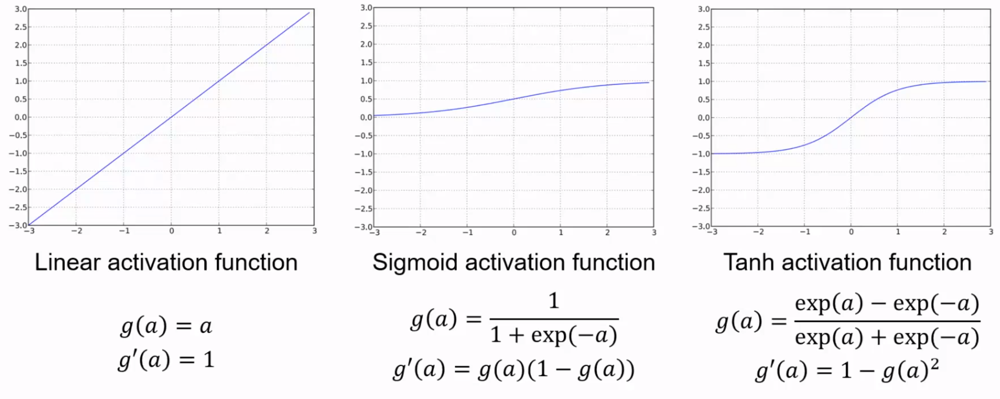

# FFNN in practice

## Training and overfitting 

We will discuss some refinements that will make feedforward neural networks more effective in practice. 

Some terms to keep in mind:

- **Training dataset**: the available data
- **Training set**: the data used to learn model parameters
- **Test set**: the data used to perform final model assessment
- **Validation set**: the data used to perform model selection
- **Training data**: used to train the model (fitting + selection)
- **Validation data**: used to assess the model quality (selection + assessment)
- **Cross-validation**: is the use of the training dataset to both train the model (parameter fitting + model selection) and estimate its error on new data
	- When lots of data are available use a Hold Out set and perform validation
	- When having few data available use Leave-One-Out Cross-Validation (LOOCV)
	- K-fold Cross-Validation is a good trade-off (sometime better than LOOCV)

## Hyperparameters

While model parameters are estimated from data during training, model **hyperparameters** are set manually. 

Hyperparameters: 

- Number of neurons and layers
- **Activation functions**
- **Error functions**
- **Gradient descent algorithm**
- **Batch dimension**
- Validation set dimension
- **Weight optimization**
- **Batch normalization**
- **Learning rate optimization** 

### Activation functions 

The specific type of activation function used can have a significant impact on the network's ability to learn and model different types of patterns and relationships.
In general effective/used activation functions are characterized by a $S$-shape (not like a linear one).
Activation functions must be **differentiable** to permit training.

**Sigmoid**, maps the input values to the range between 0 and 1 , which is useful for binary classification tasks. If the output of the sigmoid function is greater than 0.5 , it is considered "activated," and the node produces an output of 1 . If the output is less than 0.5 , it is considered "deactivated," and the node produces an output of 0 .
$$
f(x)=\frac{1}{1+e^{-x}}
$$

**Tanh** does the same binary mapping but between $-1$ and $1$.
$$
f(x)=\frac{e^x-e^{-x}}{e^x+e^{-x}}
$$

**Softmax**, used commonly in classification tasks, can map the input to a vector of values between 0 and 1, which sum adds up to 1. It is useful to output probability distribution.

The **ReLu** function is very popular: 

$$
f(x)=x+=\operatorname{ReLU}(x)=\max (0, x)
$$

However, the Relu has some potential disadvantages:

1. Non-differentiable at zero
2. Non-zero centered output
3. Unbounded.
4. **Dying Neurons**: Sometimes, Relu neurons can be pushed into a state where they become inactive for almost all inputs. This means that gradients do not flow backward through these neurons and they essentially "die", leading to decreased learning capability.

The **Leaky ReLU** fix for the "dying ReLU" problem: 

$$f(x)=\begin{cases}x & \text{if } x\geq0\\0.01x& \text{otherwise}\end{cases}$$

The **ELU** tries to make the mean activations closer to zero which speeds up learning. $\alpha$ is tuned by hand: 

$$f(x)=\begin{cases}x&\quad \text{if x}\geq0\\\alpha(e^x-1)&\quad \text{otherwise} \end{cases}$$

### Error functions

An error function, or "loss function," is used to measure how well a feedforward neural network (FFNN) can predict the desired output given input data. It guides the optimization process during training.

To use an error function in an FFNN:

- Define the error function based on the task, such as mean squared error (MSE) for regression or binary cross-entropy loss for binary classification. The binary cross-entropy loss is calculated as the negative log likelihood of the predicted probabilities. 
- Calculate the error by applying the error function to the predicted and true outputs.
- Backpropagate the error through the network using an optimization algorithm, like stochastic gradient descent (SGD), to update the weights and biases.
- Evaluate the error to assess performance on the training and validation/test data.

Common error functions used in FFNNs include:

- Mean squared error (MSE) for regression tasks.
- Binary cross-entropy loss for binary classification tasks.
- Categorical cross-entropy loss for multi-class classification tasks.
- Hinge loss for binary classification tasks, commonly used in support vector machines (SVMs).

Other error functions can also be used depending on the task requirements.

### Gradient descent algorithms

Closed-form solutions are practically never available so we can use iterative solutions (**gradient descent**):

- Initialize the weights to a random value
- Decrease towards the direction of decrease
- Iterate until convergence 

$$w^{k+1}=w^k-\left.\eta \frac{\partial J(w)}{\partial w}\right|_{w^k}$$
#### Batch gradient descent

$$\frac{\partial E(w)}{\partial w}=\frac{1}{N} \sum_n^N \frac{\partial E\left(x_n, w\right)}{\partial w}$$

#### Stochastic gradient descent (SGD)

Use a single sample, unbiased, but with high variance.

$$\frac{\partial E(w)}{\partial w} \approx \frac{\partial E_{S G D}(w)}{\partial w}=\frac{\partial E\left(x_n, w\right)}{\partial w}$$

####  Mini-batch gradient descent 

$$\frac{\partial E(w)}{\partial w} \approx \frac{\partial E_{M B}(w)}{\partial w}=\frac{1}{M} \sum_{n \in \text { Minibatch }}^{M<N} \frac{\partial E\left(x_n, w\right)}{\partial w}$$

Use a subset of samples, good trade off variance-computation.

### Weight Initialization

There are different approaches:

- **Zeros**: it does not work! All gradient would be zero, no learning will happen.
- **Big Numbers**: bad idea, if unlucky might take very long to converge
- $w \sim N\left(0, \sigma^2=0.01\right)$ : good for small networks, but it might be a problem for deeper neural networks
- $w_{i, j} \sim \mathcal{N}\left(0, \frac{1}{n_{i}}\right)$ where $n_i$ is the number of inputs to the network layer. This makes the total variance of activations equal to $1$.  It depends on the number of inputs of each layer, it's something "dynamic". 

Performing similar reasoning for the gradient Glorot & Bengio found
$$
n_{\text {out }} \operatorname{Var}\left(w_j\right)=1
$$
To accommodate for this, **Xavier** propose $w \sim N\left(0, \frac{2}{n_{\text {in }}+n_{\text {out }}}\right)$ The default initialization of Tensorflow is this.  

More recently he proposed, for rectified linear units, $w \sim N\left(0, \frac{2}{n_{i n}}\right)$

Note that considerations over the variance are important to ensure stable learning:

- if all weights are initialized with large values there is a risk of exploding gradients. 
- On the other hand, if all weights are initialized with small values, there is a risk of vanishing gradients.

### Batch normalization

Inputs with a zero mean and unit variances boost network convergence. 

Batch normalization is a technique used to address internal covariate shift. 

A BatchNorm layer is introduced to standardize inputs and outputs of each layer. This layer consists of two weights per batch: 

- a scale factor (mean) 
- a bias factor (variance)

In practice during training, mean and stddev are computed for each minibatch.
### Learning Rate

The learning rate **hyperparameter** of gradient descent algorithm can be set (to achieve better performance) using different approaches. 

It can be fixed, but actually the approaches where it's **adaptive** are more used.

## Optimizations techniques

We will see 3 techniques:

- Early stopping
- Weight decay 
- Dropout 

Whose highlights are: 

- **Early stopping** wastes data but works out of the box. No hyperparameter. Early stopping is also possible to the trick to put "all together" epochs/number of neurons in one "last training". 
- **Weight decay** you have to select for best gamma. We need to tune hyperparameter.
- **Dropout** you have to select best probability to dropout. 

### Early stopping  

The training can be stopped according to a set of hyperparameters. 

Online estimate of the generalization error

An online estimate is used to predict the behaviour of your network on UD. It provides an estimate of the performance you should expect when you stop the network. By training multiple networks with early stopping, you can compare them by analysing the validation error.

### Weight Decay

Using weight regularization the weights in the model are constrained to be smaller: smaller weights can help with better generalization. 

To achieve this, . This forces the gradient to decrease the overall norm of the weights. To determine the best value for the regularization parameter, again cross-validation is possible:  training the model with different values and choose the one that yields the best results.

The most common form of weight decay is L2 regularization: 

- To the loss function is added a **penalty term** proportional to the sum of the squares of the weights .

$$\text{L2 Penalty} = \lambda \sum_{i=1}^{n} w_i^2$$

The penalty term is also multiplied by a regularization parameter (often denoted as $\lambda$). 

### Dropout

The Dropout works by randomly selecting a subset of neurons and turning them off during each epoch of the training phase. This forces the network to learn redundant representations of features, which helps in reducing overfitting. 
Each epoch, a different set of neurons is turned off according to the **dropout probability**, denoted as $p$, which is a hyperparameter. 
The final network is an ensemble of different "subnets". The weights are scaled to average the output of these subnets.

## Vanishing and exploding Gradient

The vanishing gradient problem occurs when the gradients of the parameters with respect to the loss function become very small. This problem is particularly prominent when using activation functions such as **Sigmoid** or **Tanh**.

The vanishing gradient problem inhibits effective learning in **deep** networks because the backpropagation algorithm, which adjusts the parameters based on these gradients, requires gradient multiplications. When the gradient is close to zero or less than 1, these multiplications can cause the gradient to vanish, resulting in little to no learning.

A similar issue is the **exploding gradient**: if the gradient keeps getting multiplied at each layer, it can grow exponentially leading to unstable and unreliable training.

The **ReLU** activation function is a solution to both gradient explosion and vanishing, since it has a "efficient gradient propagation":

$$
g(a)=\operatorname{ReLu}(a)=\max (0, a)
$$

Or the **Leaky ReLU** which fix the"dying neurons" problem is also a good alternative.
Leaky ReLU ensures that the gradient is non-zero even when the neuron is inactive. 
Other variations include the **ELU**, which is parametric, and the **Randomized ReLu**, with randomly chosen slope.
