# Image Classification

Computer vision  is an interdisciplinary scientific field that can be summarize to everything that makes computer able to understand the  high level understanding of digits from images or videos.

In recent years, there has been a significant shift towards using deep learning for understanding the content of digital images and videos. **Deep learning** has become the go-to approach for solving visual recognition problems, such as image classification.

We will focus on the first visual recognition problem ever introduced, which is **image classification**: by addressing this problem, we aim to gain a deeper understanding of its complexity without the use of deep learning techniques.

## Traditional classifiers

### Local (Spatial) Filter

Local (Spatial) transformations mix all the pixels locally "around" a given pixel.
These transformations can be written as:

$$
G(r, c)=T_{U}[I](r, c)
$$

Where:

- $I$ is the input image to be transformed
- $U$ identifies the region, "a neighborhood
- $T_u$ is a function which returns an image that for each output pixel $(r, c)$ is defined by all neighbors input pixels $U$ to input pixel $(r,c)$

The simplest possible transformation $T$ is a **linear** combination:

$$
T[I](r, c)=\sum_{(u, v) \in U} w(u, v) * I(r+u, c+v)
$$

Weights can be thought of as a filter $h$ which completely determines the operation.

### Linear Classifier

To feed images to a neural network (NN), we use column-wise unfolding to convert the image into a vector shape. The length of this vector is determined by the image dimensions, where $R$ represents the number of rows, $C$ represents the number of columns, and we multiply this by 3 to account for the three color channels (RGB).

In this vector representation, each element corresponds to the intensity of a specific color in a pixel of the image. This means that each color is represented by $R \times C$ pixels, with values ranging from 0 to 255.

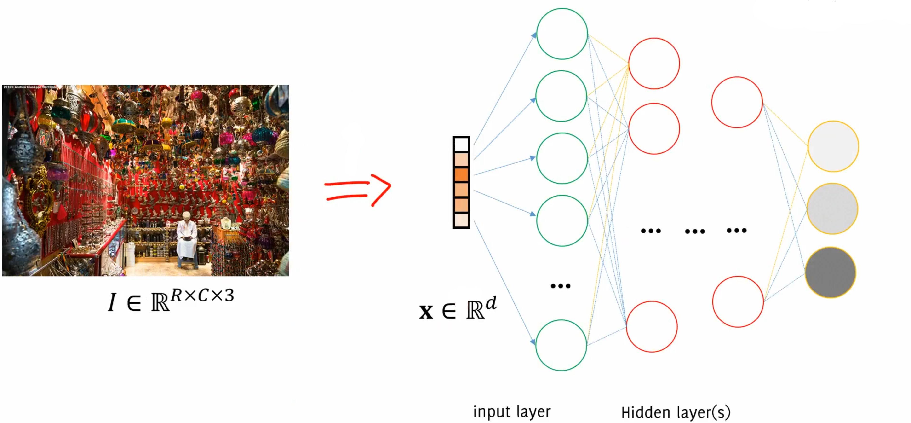 

For classification tasks, the output of the NN is typically a vector with a length equal to the number of classes, where each element in this vector represents the score associated with a particular class in the input image.
The high dimensionality of the problem poses a challenge when using traditional NN: even with smaller images, the number of parameters can still be in the billions. 

### The problem with traditional classifiers 

Image Classification is a challenging problem and actually "traditional" classifiers are not helping at all.
The main challenges of a image classification problem are:

- **Dimensionality**: Images are very high-dimensional image data
- **Label ambiguity**: Images with a huge amount of content can be ambiguous (more than one label can correctly be assigned)
- **Transformations**: images of a the same subject can be very different because deformations, lightning changes, occlusion, background clutter, scale differences, a lot of variability in the same class 
- **Perceptual similarity**: the most important problem is that perceptual similarity in images is not related to pixel-similarity. Differences between pixels is not the same difference between "concepts". This is way simple classifier like Nearest Neighborhood Classifiers and linear classifier are not fit to classify images. What really happens is the perceptual similarity which is not related to Euclidean distance between pixels (which is what actually traditional classifiers do).  

## Convolutional Neural Networks 

Convolutional neural networks (CNNs) are specifically optimized for processing image data. They use convolution operations to **extract features** from the input. 
The CNN is a multi-layered architecture that turns the input image into a vector shape which is inputted into a traditional NN for classification purposes.

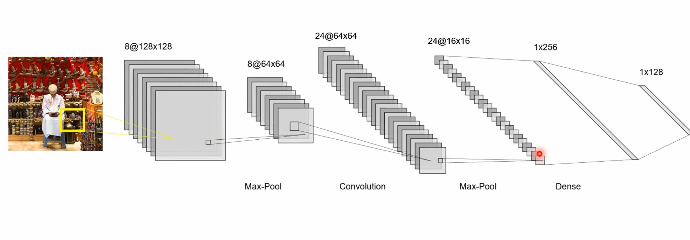

The output size of a convolutional layer is called a **feature map**. The size of the feature map depends on three hyperparameters:

- **Depth**: corresponds to the **number of filters** in the layer (filters represented as the weights over the connection to another neuron), each of which looking for different characteristics in the input. The set of neurons belonging to different filters and connected to the same input region is the same depth column.
- **Stride**: number of pixel of which perform translations over the input image. This parameter allows to set the domain of the depth columns, because each depth column is linked to only one fraction of the input.
- **Zero-Padding**: often used to match input and output shapes.

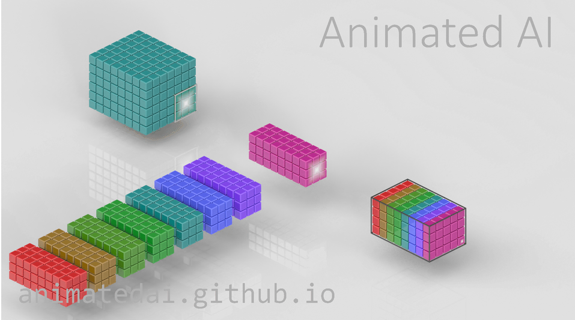

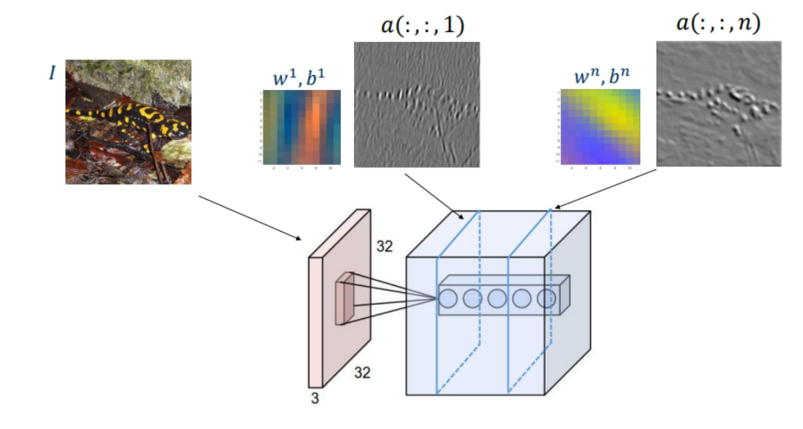

[Animated AI](https://animatedai.github.io/)

The convolutional layers "merge" the filters with are extracting features. In particular similarities between the filters. 

Activation layers introduce non-linearities in the network to differentiate CNN from linear classifiers. They are scalar functions that operate on each value of the volume, and do not change its size.

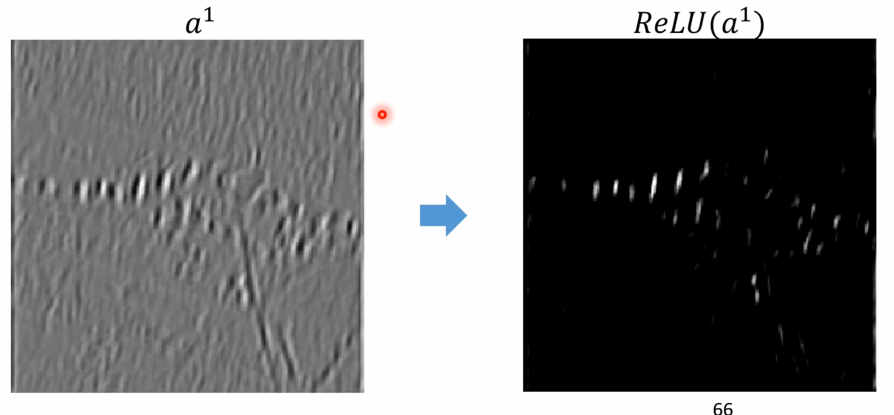

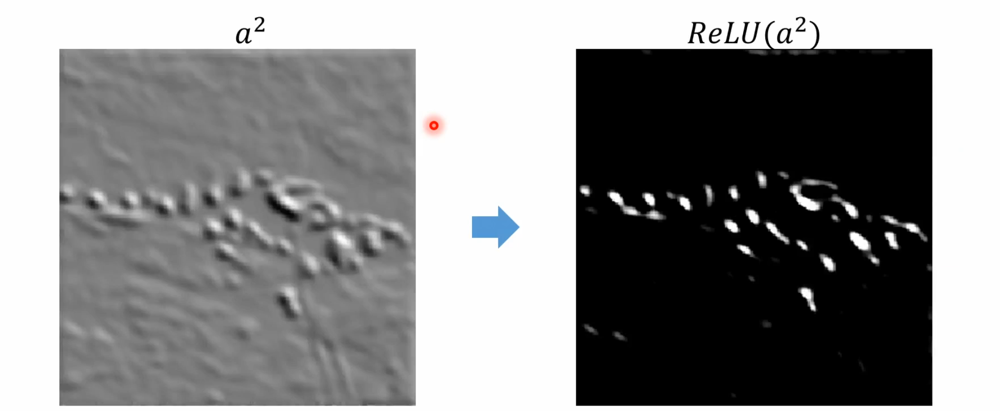

The ReLu performs a tresholding on the feature maps but may suffer from vanishing gradient and dying neurons, so the Leaky variant is preferred. It acts separately on each layer. Other variants can be the Tanh and Sigmoid, but are preferred in MLP architectures.

Pooling layers 

These layers reduce the spatial size of the volume, leaving the depth untouched. They operate on each layer of the input volume and resizes it. most popular one is the MAX one which using the max operation:

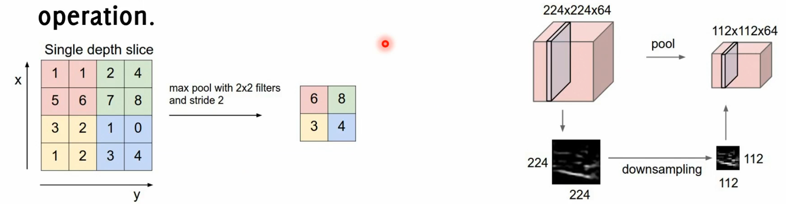

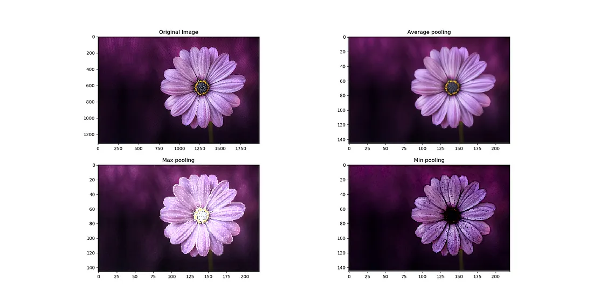

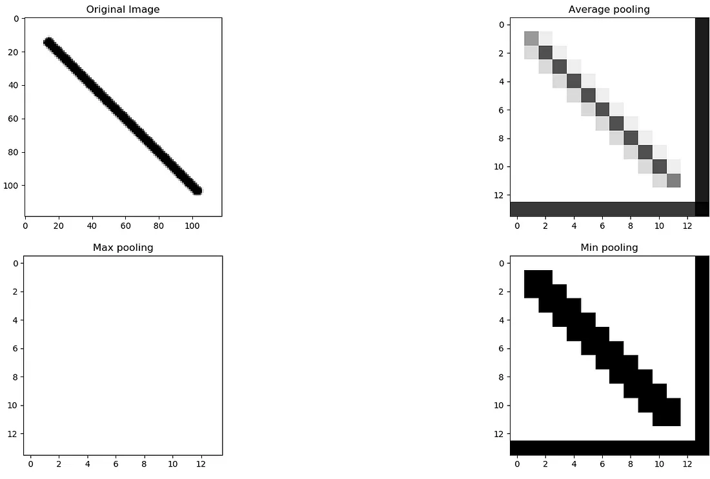

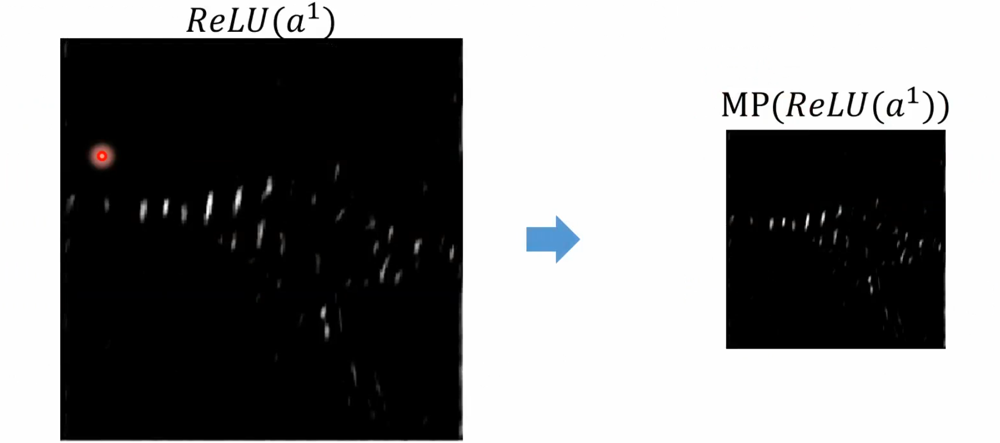

And at the end we have **dense layers** 

The spatial dimension is lost and the CNN stacks the hidden layers. It's called dense because each output neuron is connected to each input neuron. This contains the CNN network found features through which we perform the final classification. In fact, the last layer (FC layer) has the same size as the number of classes, and provides a score for the input image to belong to each class. They're useful because they can summarize the feature extraction results using single numeric values that will be used by successive layers. 

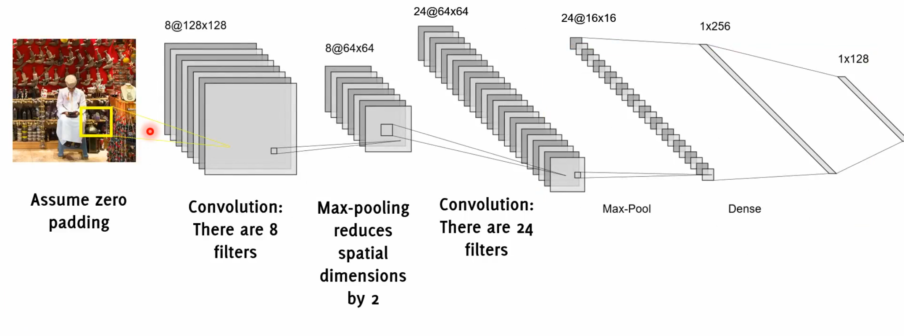

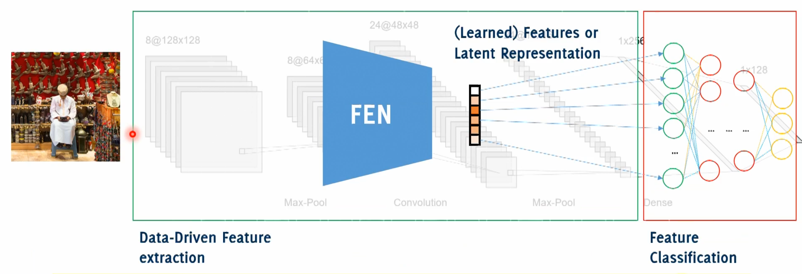

At the end there is a multi layer perceptron which operates on feature. 
Latent representation

The CNN structure is particularly fitting for image processing because of 3 main characteristics:

1. **Sparse interaction**: not every neuron is connected to the others. Each one is only connected to a region of the input. Each output value in a layer only depends on a specific region in the input which is called the receptive field for that output. As we go deeper into the network, the receptive field becomes wider. This increased width is achieved through operations like maxpooling, convolutions, and stride greater than 1. 
2. **Weight sharing**: all the neurons in a given slice of a feature map share the same weights and bias. This sharing of parameters reduces the total number of parameters in the network. The assumption is made that if a particular feature is useful to compute at a certain spatial position (x, y), it should also be useful to compute at a different position (x2, y2). However, note that this assumption may not always hold true, especially when trying to identify localized features.
3. **Translation invariance**: by design (multiple filters), a CNN is **insensitive** to small transformations of the input

## Extras 

### Data augmentation

Deep learning models are data-hungry. Data augmentation involves applying various transformations to the dataset to artificially increase its size. Geometric transformations (such as shift, rotation, affine/perspective distortion, shear ...) and photometric transformations (such as adding noise, modifying average intensity, image contrast ...) are used. 
It is important to choose transformations that do not impact key features and preserve the input label.
In general, transformations can be also class-specific: to address class imbalance by creating more examples for the minority class for example. 
To further improve prediction accuracy, test time augmentation (TTA) can be performed:

1. Randomly augment each test image to create augmented images $A_l(I)_l$.
2. Make predictions for each augmented image using the CNN: $p_i = CNN(A_l(I))$.
3. Take the average predictions of each augmented image: $p = Avg(\{p_l\}_l)$.

### Transfer learning

A CNN consists of a feature extraction section, which is powerful and general purpose, and a classifier, which is task-specific.

We can use a pre-trained model's convolutional layers as a **feature extractor**, as they are effective and general. The FC layers, on the other hand, are specific and tailored to solve a particular problem.

In transfer learning, only the FC layers are trained. This is a good option when there is limited training data and the pre-trained model aligns with the problem. 

**Fine tuning** involves retraining the entire CNN while initializing the convolutional layers with the pre-trained model. This is useful when there is enough training data or when the task differs. Lower learning rates are used in fine tuning.

### Famous CNN architectures and innovative approaches 

- **AlexNet**(2012): To counteract overfitting, they introduce: 
	- RELU (also faster than tanh)
	- Dropout (0.5), weight decay and norm layers (not used anymore)
	- Maxpooling
- **VGG16** (2014): a deeper variant of the *AlexNet* convolutional structure where smaller filters are used while focusing on the role of network depth. The idea: "smaller filter but deeper network".  Multiple convolution in a sequence achieve large receptive fields (than larger filters in a single layer) with less parameters and more nonlinearities.
- **Network in Network (NiN):** NiN approach refers to embedding one network inside another. In the NiN architecture, the standard convolutional layer is replaced by the **Mlpconv layers**: a typical convolutional layer involves applying a convolutional operation on the input using a set of filters, followed by an activation function (like RELU) while a **Mlpconv layer** involves a sequence of fully connected (FC) layers followed by an activation (RELU). The significant distinction here is that there's a mini-network (an MLP) that consists of a few fully connected layers and RELUs.The main motivation behind using the NiN architecture is to allow for more complex patterns and relationships in the data with the same spatial footprint. This gives the layer a better ability (or a more powerful functional approximation) than a traditional convolutional layer, which is usually a linear operation followed by a non-linear activation.
- **Global Averaging Pooling Layers:** Traditional CNNs often have fully connected layers towards the end of the network. The Global Average Pooling (GAP) layer is introduced as an alternative to these fully connected layers: it takes the average of each feature map from the previous layer and outputs a single value for each feature map. The operation reduces the spatial dimensions of the feature maps to a 1x1 size: $F_k=\frac{1}{N} \sum_{(x, y)} f_k(x, y)$. By taking the average of feature maps, it preserves the most essential information while simplifying the network's structure. The rationale behind GAP is that fully connected layers, especially those at the end of CNNs, come with a large number of parameters. This not only increases computational costs but also makes the network more prone to overfitting. Overall GAP layers: 
	- **Reduced Parameters:** GAP layers introduce no additional parameters. This results in lighter networks, which are faster to train and less prone to overfitting.
	- **Softmax Classification:** Directly after GAP, a softmax function allows for efficient and effective classification.
	- **Interpretability:** GAP offers a more interpretable connection between feature maps and class outputs. This connection becomes handy in tasks like localization, where we want to know where in the image a certain feature or class is predominantly present.
	- **Structural Regularization:** By removing FC layers and introducing GAP, the model structure itself acts as a form of regularization. This inherently reduces overfitting chances.
	- **Robustness:** Networks using GAP demonstrate increased robustness to spatial transformations. The **shift sensitivity problem** in MLP occurs when a CNN is trained mostly on centered images. This means that if an image is shifted to a side or corner, the CNN may struggle to classify it correctly. GAP mitigates the shift sensitivity problem by averaging out the spatial information. This means the model can handle images that are resized, rotated, or otherwise spatially modified with less degradation in performance.
	- **Flexibility in Image Sizes:** Unlike some traditional CNN architectures which require fixed-sized input images, models with GAP can classify images of various sizes.
- **GoogLeNet (or Inception v1)** (2014): there's a unique approach to manage computational demands, especially as the network depth increases: **inception modules** are visualized as mini "networks within the primary network" or "localized structures." Working together, these modules capture a diverse array of features at different scales, thus boosting the network's pattern recognition capabilities:
	1. **Strategy:** The solution adopted is to leverage multiple filter sizes (like 3×33×3 and 5×55×5) simultaneously at the same level within the network.
	2. **Merging Outputs:** After processing through these filters, the output activation maps from each filter size are merged together using a method called **concatenation**. This effectively combines the feature maps to generate a richer representation of the input.
	3. **Zero Padding:** To ensure that the spatial size of the feature maps remains consistent, zero padding is used. This technique pads the edges of the feature maps with zeros, allowing filters to cover the entirety of the map without reducing its dimensions.
	4. **Deepening Activation Maps:** While the spatial dimensions are preserved, the depth of the activation map increases significantly. 
- (Residual Network) **ResNet (2015)**: it starts with the idea that simply adding more layers to a network does not always lead to better performance. And intriguingly, this performance plateau or degradation wasn't due to overfitting, as the same trend was observed in training error as well. The core understanding was that very deep models are inherently harder to optimize compared to their shallower counterparts. The solution was to use **Identity Shortcut Connection:**
	- It mitigated the vanishing gradient problem, enabling training of deeper models. 
	- It did not introduce any additional parameters, keeping the model's complexity in check. 
	- In cases where earlier layers were already performing well, the new layers could approximate an identity mapping. This meant that if a previous network was optimal, the weights of the new layers could tend towards zero, allowing information to flow through the identity connection. 
- **MobileNet**: reduce the number of parameters and of operations to embed networks in mobile application.  
- The other stuff like **ResNeXt**, **DenseNet** and **EfficientNet** are the last families of models ..?

