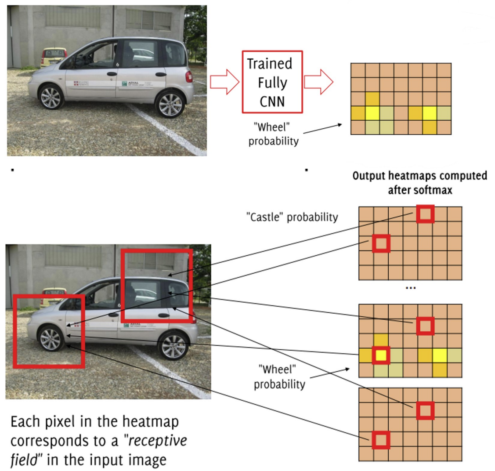
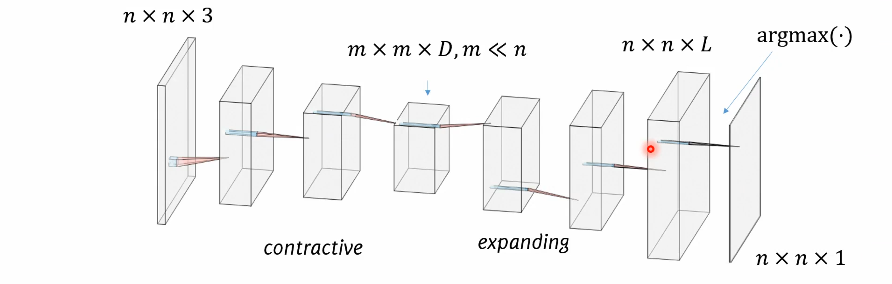

# Image Segmentation

Image segmentation involves partitioning an image into multiple segments or groups of pixels, aiming to identify pixel groups that belong together:

- Group similar-looking pixels for efficiency.
- Divide images into coherent objects.

Actually image segmentation can be divided into: 

- **Semantic Segmentation**: Assigns a label to each pixel in an image, without differentiating between different instances of the same object within a category.
- **Instance Segmentation**: Similar to semantic segmentation but also differentiates between different instances of the same object/category.

There are two types of segmentation:

- **Unsupervised Segmentation**: Group similar-looking pixels based on characteristics like color, texture, etc., without using any training data.
- **Supervised Segmentation**: Involves using labeled training data where each pixel is associated with a class label.

## Simple semantic segmentation approaches 

Simple solutions are:

- **direct heatmap predictions**: Assigning predicted labels from a heatmap to corresponding receptive fields. Provides a coarse estimate.
- **Only convolutions**: Avoids pooling; uses only convolutional and activation layers. Results in a small receptive field and inefficiency.
- **Shift and Stich**: Assume there is a downsampling ratio $f$ between tric size of input and of the output heatmap
	   - Uses a downsampling ratio $f$ between the input and output heatmap.
	    - Computes heatmaps for all $\boldsymbol{f}^2$ shifts of the input.
	    - Interleaves the heatmaps to form a full-sized image.
	    - Can be efficiently implemented via the à trous algorithm (dilating filters instead of repeated operations).

### Heatmaps and up-sampling

**Heatmaps** are visual data displays. They use color gradients to represent different data values.
It's possible to use heatmaps to show how convolutional filters are activated in an image. The heatmap pixels, corresponds to **receptive fields**, mark where these activations occur. These fields essentially indicate the precise spots in the input image where the associated features are detected or activated most frequently.

For image segmentation, the last layer of a CNN generates a heatmap with a unique channel per class. Each heatmap slice reflects the probability (between 0 and 1) of a pixel belonging to a specific class. These values are generally lower resolution than the original image.

Heatmaps are also crucial in object detection and object segmentation.

A label map is created by applying a threshold to the probabilities from the softmax function. Every pixel is then assigned to the class with the highest probability. This means that each pixel is associated with the class that has the highest heatmap value.

The significance of having a unique heatmap channel for each class is vital. Every channel in a heatmap indicates the likelihood of a pixel being part of a certain class. Thus, to make an accurate prediction all probabilities must be considered.

#### Upsampling 

Upsampling is a process that is used in convolutional neural networks (CNNs) to increase the size of the feature maps produced by the network, particularly useful in heatmap prediction. 
Upsampling is essentially the opposite of pooling or downsampling, increasing output resolution. 

**Image segmentation**'s primary goal necessitates the classification of each pixel in an image, often dealing with the tension between **location** (local information) and **semantics** (global information). Here, local information directs 'where', while global information resolves 'what'.

The key to balancing the location/semantics tension is the combination of coarse and fine layers. 

The first part of the architecture uses deep features to encode semantic information. The second half is designed to upsample the predictions for each image pixel. As the network gets deeper, the extracted features become more abstract and semantically rich, helping the network to identify complex patterns.
Once the semantics are encoded in the deep layers, the network includes layers for feature map **upsampling**. Multiple techniques can be applied at this stage.

Actually is possible to make up-sampling:

1. **Nearest Neighbor Upsampling**: This is a simpler method of increasing the size of an image or feature map by replicating the values of the original pixels. It involves resizing the original image or feature map by inserting zero-valued pixels between the original pixels and then setting the value of each new pixel to the value of the closest original pixel. It is a simple and fast method of upsampling that can be used in a convolutional neural network (CNN).
2. **Max Unpooling**: This involves saving the positions of the maxima during max pooling and then placing the values back into their original positions during max unpooling, thereby recovering spatial position information.
3. **Transpose Convolution**: Increases the surface area of the input volume (by adding zeros) followed by convolution. This method increases the size of the output through learnable filters, which are learned during training, thereby increasing the surface area while reducing depth.
4. **Prediction Upsampling**: Employs convolutions with fractional stride filters to enlarge the image. However, the results from this method are often not optimal.
5. **Skip Connections**: Used in CNN architectures that compress and then expand, like U-Net. Transpose convolution layers in such networks also take inputs from earlier layers with larger surface areas, thus obtaining spatial information from them and feature or classification information from the latter layers. Additionally, deviations are added to earlier layers in the compressing network with skip connections linked to transpose convolutions. This results in multiple networks with different resolutions, rather than a single network with one output.

