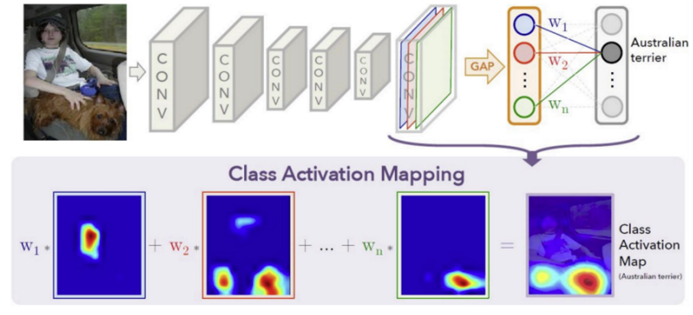

# Image Localization

While segmentation aims to classify each pixel, **localization** is a step beyond classification: it refers to the task of identifying the location of objects within an image, typically represented as bounding boxes. The process involves:

1. **Object Classification**: Assigning the object to a predefined category.
2. **Object Localization**: Pinpointing the object's position using a bounding box with coordinates (x, y, h, w).

Training of this process requires a dataset of images labeled with both the category and **bounding box coordinates**:

- A label $l$ from a fixed set of categories $\Lambda$;
- The coordinates $(x, y, h, w)$ of the bounding box enclosing that object, $I \rightarrow$ $(x, y, h, w, l)$

So, there are substantially 2 predictions to make:

- the class label: softmax loss $\delta$ can be used, through categorical crossentropy
- Bounding Box coordinates are found through regression loss $\left\|\left[x^{\prime}, y^{\prime}, w^{\prime}, h^{\prime}\right]-[x, y, w, h]\right\|_2$

### Weakly Supervised Localization

The idea of Weakly supervised localization (WSL) is to give limited or imprecise training data: only labels are given as the input to the network, and the network itself identifies and designs the area that contributed the most to the final classification. This is why it is termed as "**weakly** supervised."
We can do this using Class Activation Map (**CAM**).

### CAM 

Beyond regularization, GAP aids in localizing regions important for classification. Attaching a post-GAP vector and a fully Connected layer permits us to highlight image areas crucial for class prediction, computed as $M_{c}(x, y)=\sum_{k} w_{k}^{c} f_{k}(x, y)$ (?) 
Basically a **CAM** is a combination of:

- the output of a Global Average Pooling (GAP) layer
- a vector of class-specific weights from a Fully Connected (FC) layer.
	- the weights are used to combine the activation maps from the last volume to generate the Class Activation Map (CAM).

CAM usually results in a low-resolution region that represents the relevant parts of the image. Hence, an up-sampling might be needed to resize the CAM to match with the original image size, thus facilitating their superimposition.
Remember: FC weights guide the combination of activation maps, while CAM visually demonstrates the parts of the image critical for neural network's decision-making process.

#### CAM flavors 

- **CAM (Class Activation Map)**: CAM is used to generate a heatmap for a particular class in a CNN, highlighting the regions of the input image most relevant for predicting that class.
	- **How It Works**: it requires a specific architecture: global average pooling (GAP) followed by a dense layer. $M_c(x, y)=\sum_k w_k^c f_k(x, y)$, where $w_k^c$ are the weights from the GAP layer to the output for class $c$, and $f_k(x, y)$ is the activation of feature map $k$ at position $(x, y)$.
	- **(dis)Advantages**: CAM is limited to specific network architectures with GAP before the final classification layer.
- **Grad-CAM (Gradient-weighted Class Activation Map)**: It offers a flexible method for creating class activation maps for a variety of CNN models, including those without GAP.
	- **How It Works**: It uses the gradients of the target class entering the final convolutional layer to determine the importance of each neuron. It calculates the gradient of the target class score with regards to feature maps of the convolutional layer. These gradients weight the feature maps, creating a basic localization map that highlights the significant regions for prediction.
	- **Advantages**: It produces the same size, low-resolution images, which then can be upscaled. Consequently, the final image has high overlap with the input.
- **Augmented Grad-CAM**: An enhanced version of Grad-CAM that aims to improve the resolution and quality of the heatmaps.
    - **Technique**: Applies different transformations (like rotation, scaling, etc.) to multiple low-resolution heatmaps of the input image to reconstruct a high-resolution heatmap.
    - **Advantages**: Combines information from Grad-CAM across various augmented versions of the input image.
- Extra: **RISE (Randomized Input Sampling for Explanation)**:  a shift to **black-box** paradigm: RISE makes multiple versions of the input image by using **random** masks. Every mask hides different parts of the image.
   - **How It Works**: For every new version of the image, the class score (which is the probability of the target class) is calculated. By looking at the scores from all of these images, RISE finds out which parts contribute most to the class score. If a part always gets a high score when it's visible, it's considered more important. The final results can be shown as a heatmap or a saliency map, which highlights these important parts on the original image.
   - **Advantages**: RISE can be used with any type of neural network because it doesn't rely on the network's internal setup.

