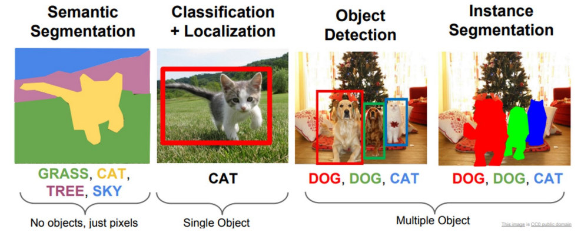

# Object detection

The challenge combines both challenges of object detection and semantic segmentation: do semantic segmentation and at same time separate each object instance. 

Object detection encompasses identifying and localinzig multiple objects within an image. It involves not only classifying objects but also determining their positions.

- **Early Methods**:
	- **The sliding window** technique involves moving a fixed-size window across an image, at every position using a classifier to determine whether an object of interest is present within that window.
	    - The window "slides" across the image, both horizontally and vertically, often at varying scales (sizes) to detect objects at different resolutions.
	    - At each position, the region within the window is fed into a classifier (like a CNN) to assess whether it contains the object of interest.
	    - This process generates a set of bounding boxes where the classifier predicts the presence of an object.
	    - **Computational Intensity**: Scanning the entire image at multiple scales and positions is computationally expensive.
	    - **Bad accuracy**: The technique may miss objects that don't fit well into the window or generate false positives.
	- **Region proposal** algorithms aim to identify bounding boxes that could potentially contain an object within the image. Before deep learning, algorithms with high recall but low precision tactics were used. The process involves utilizing a region proposal algorithm to determine potential object areas and then using a Convolutional Neural Network (CNN) to classify the image within each proposed region.
- **Modern Approaches**: Use DL, particularly CNNs, which have significantly improved accuracy and efficiency. These include two-stage detectors like R-CNN (and its variants Fast R-CNN, Faster R-CNN) and one-stage detectors like YOLO (You Only Look Once) and SSD (Single Shot Multibox Detector).
	- **Improvements over simple approaches**:
	    - **Efficiency**: Modern object detectors process an entire image in one go, eliminating the need for exhaustive sliding window scanning.
	    - **Accuracy**: They are more accurate in detecting objects of various sizes and shapes, thanks to advanced network architectures and training techniques.
	    - **Speed**: Techniques like YOLO and SSD are optimized for real-time detection, making them suitable for applications like video surveillance and autonomous driving.

### R-CNN (Region-based Convolutional Neural Network)

The main differences between R-CNN, Fast R-CNN, and Faster R-CNN lie in their approach to object detection and the efficiency with which they process images. These models represent a progression in the field of computer vision, where each subsequent version improves upon the previous one in terms of speed and accuracy. Let's break down the key differences:

1. **R-CNN (Region-based Convolutional Neural Network)**:
   - **Approach**: R-CNN uses selective search to generate region proposals (potential bounding boxes) and then runs a convolutional neural network (CNN) on each of these proposed regions separately to classify the objects. After that, it uses regression to refine the bounding boxes.
   - **Drawback**: The main drawback of R-CNN is its speed. Because it processes each region proposal independently, it is very slow and computationally expensive.

2. **Fast R-CNN**:
   - **Improvement over R-CNN**: Fast R-CNN improves on R-CNN by passing the entire image through the CNN only once to generate a convolutional feature map. From this feature map, it then extracts region proposals and uses a Region of Interest (RoI) pooling layer to reshape them into a fixed size, so that they can be fed into a fully connected layer for classification and bounding box regression.
   - **Advantage**: This approach is significantly faster than R-CNN as it avoids redundant computations on the multiple region proposals and it streamlines the process by using a single CNN for the entire image.

3. **Faster R-CNN**:
   - **Key Innovation**: The most significant improvement in Faster R-CNN is the introduction of the Region Proposal Network (RPN). The RPN is a fully convolutional network that predicts object bounds and scores at each position of the feature map, thus eliminating the need for the selective search algorithm used in R-CNN and Fast R-CNN.
   - **Performance**: Faster R-CNN unifies the region proposal and object detection steps into one single network, making it even faster and more efficient than Fast R-CNN.

the process of proposing object bounds (region proposal) is indeed integrated within the classification network, making the system more of a unified or monolithic structure.

**R-CNN** (Region-based Convolutional Neural Network) combines region proposals algorithms with CNN-based classification.
Its main limitations is that it isn't end-to-end trainable and requires separate stages for proposing and classifying. 

### Fast R-CNN

Fast R-CNN, an advancement over R-CNN, introduces the use of **Region of Interest** (ROI) pooling. This operation enables the network to handle regions of varying sizes and shapes by extracting fixed-size feature vectors. 
Fast R-CNN primarily utilizes the ROI pooling following a region proposal step in the object detection networks, aiding in proposing various regions or candidate object bounding boxes for classification. This component allows for precise object detection and localization by bridging the gap between region proposal and object classification.
The efficiency of Fast R-CNN facilitates end-to-end training with a single CNN execution. 

### Faster R-CNN

Rather than using the ROI extraction algorithm, we train a **Region Proposal Network** (RPN), a Fully Convolutional Neural Network that employs a 3x3 filter size: 

- The RPN operates at the final convolution layers, using the same feature maps for classification. 
- It enhances the efficiency of Fast R-CNN by pinpointing regions with the highest object detection potential using fixed-size bounding boxes, or anchors. These anchors align with potential objects and allow for end-to-end training of the detection model.

The training process involves sequential training of both the RPN and Fast R-CNN components, incorporating four losses: RPN classification and regression, final classification score, and final bounding box coordinates. This integrated approach of region proposal and feature extraction in a single pass makes the network more efficient than its counterparts.

Certainly! Let's clarify the role of the Region Proposal Network (RPN) and anchors in Faster R-CNN, based on the OCR scan you provided:

1. **Goal of RPN with Anchors**:
   - The RPN is designed to propose regions of interest (RoIs) in an image that might contain objects. It does this by associating each spatial location in the feature map with multiple anchor boxes. 
   - Each anchor box represents a potential RoI and is defined with different scales (sizes) and aspect ratios. For example, if \( k = 9 \), this could mean 3 different scales and 3 different aspect ratios for each anchor.

2. **Intermediate Layer in RPN**:
   - The intermediate layer in the RPN is a standard convolutional neural network (CNN) layer. It processes the output of the feature extraction network (like a backbone CNN architecture) using filters (typically 256 filters of size 3x3).
   - This layer reduces the dimensionality of the feature map and maps each region to a lower-dimensional vector (output size \( H \times W \times 256 \)).

3. **Output of RPN**:
   - The RPN generates \( H \times W \times k \) candidate anchors

   - For each anchor, it estimates "objectiveness" scores, which predict the likelihood of an anchor containing an object. This is essentially a binary classification problem: whether an anchor contains an object or not.

4. **Classification (Cls) Layer in RPN**:
   - This layer is a stack of convolutional layers (typically 1x1 in size) and is responsible for predicting the object probability for each anchor.
   - It outputs \( 2k \) scores for each spatial location on the feature map. Each pair of scores corresponds to a specific anchor and indicates the probability of that anchor containing an object.

5. **Regression (Reg) Layer in RPN**:
   - Alongside the classification layer, the regression layer is trained to adjust each of the \( k \) predicted anchors to better match the object ground truth.
   - It outputs \( 4k \) estimates for the bounding box coordinates. These are the refinements for each anchor, adjusting their position and size to more accurately enclose the objects.

6. **Training the RPN with Different Anchors**:
   - If there's a need to predict different anchors (e.g., different sizes or aspect ratios), there's no need to design a different RPN. Instead, the training labels associated with different anchors are redefined. This flexibility allows the RPN to adapt to various object sizes and shapes by altering the training procedure rather than the network architecture itself.

7. **Overall Function of RPN**:
   - The RPN acts as an efficient method for generating high-quality region proposals. It uses a shared convolutional feature map to make the process fast and integrated within the overall network architecture. The combination of classification for objectness and regression for bounding box adjustments makes the RPN a crucial component in the object detection pipeline of Faster R-CNN.

Training:

Of course! Let's simplify the training process for Faster R-CNN:

1. **First, Train the RPN**:
   - Keep the main part of the network (the backbone) unchanged.
   - Train only the RPN part. This step focuses on finding the right areas in the image (region proposals) and doesn't worry about what the objects are.

1. **Train the RPN with a Frozen Backbone Network**:
   - Initially, the backbone network (which is the feature extraction part of the model, like VGG or ResNet) is kept frozen, meaning its weights are not updated.
   - During this phase, only the layers specific to the RPN are trained. This step focuses on learning good region proposals based on bounding box locations and objectness scores, ignoring the specific object classes.
   - The training uses a multi-task loss that combines classification loss (for objectness) and regression loss (for bounding box coordinates).

2. **Next, Train the Object Detection Part (Fast R-CNN)**:
   - Use the regions found by the RPN to train the Fast R-CNN.
   - Now, update the entire network, including the backbone. This helps the model learn to identify what objects are in the proposed regions.

2. **Train Fast R-CNN with RPN Proposals**:
   - After the RPN is trained, use the region proposals generated by it to train the Fast R-CNN part of the model.
   - In this step, the entire Fast R-CNN model, including the backbone network, is fine-tuned. This means that the weights of the backbone are now allowed to update.
   - This stage trains the model to classify the proposed regions into specific object classes and further refine the bounding box coordinates.

3. **Then, Go Back and Improve the RPN**:
   - After the Fast R-CNN is trained, fine-tune the RPN again. This time, use the improved backbone.
   - This makes the RPN better at proposing regions now that the backbone is better at understanding the image.

3. **Fine-Tune the RPN with the Updated Backbone**:
   - Once the Fast R-CNN part is trained, the next step is to fine-tune the RPN again, but this time using the newly updated backbone network.
   - This step ensures that the RPN can generate better region proposals using the improved feature extraction capabilities of the fine-tuned backbone.

4. **Finally, Fine-Tune the Whole Model**:
   - Freeze the backbone and RPN so they don’t change anymore.
   - Focus on making small improvements to the last part of the network. This fine-tunes how the model classifies objects and determines their exact location in the image.

4. **Final Fine-Tuning of Faster R-CNN**:
   - Finally, freeze the backbone network and the RPN to keep their weights fixed.
   - Focus on fine-tuning only the last layers of the Faster R-CNN model, which are responsible for the final object classification and bounding box regression.
   - This step fine-tunes the model's ability to accurately classify objects and precisely predict their bounding boxes.

### YOLO

YOLO, or "You Only Look Once," is a state-of-the-art, **real-time** object detection system that simplifies object detection into a single regression problem, solved by a large Convolutional Neural Network (CNN). 

YOLO turns the entire object detection into a single regression problem. This problem goes from image pixels to boundary box coordinates and class probability. This regression problem is solved by using a large Convolutional Neural Network (CNN).

YOLO divides the input image into a grid. Each grid cell is responsible for detecting objects that fall into it. Each cell predicts a certain number of bounding boxes. For each bounding box, the model predicts the coordinates, the confidence score (how confident it is that a box contains an object), and the probability distribution over all the potential classes.

**Combined Prediction**: The detection is the combination of the confidence score and the class probability.

Certainly! Here's a summarized version of how YOLO manages to detect large objects:

1. **Bounding Boxes Extend Beyond Grid Cells**: Each grid cell predicts bounding boxes that can be larger than the cell itself, allowing for the detection of large objects.
2. **Center of Object Determines Responsibility**: A grid cell is responsible for detecting an object if the object's center falls within that cell, regardless of the object's size.
3. **Variety in Box Sizes and Ratios**: Cells predict bounding boxes of various sizes and aspect ratios, accommodating different object dimensions.
4. **Use of Non-Maximum Suppression (NMS)**: NMS helps in selecting the most accurate bounding box from overlapping predictions, ensuring correct detection of large objects.
5. **Training on Diverse Data**: YOLO is trained on datasets with objects of varying sizes, enabling it to learn how to adjust bounding boxes to accurately encompass large objects.

### Siamese Networks

Siamese Networks are unique neural network models designed to compare the similarities of inputs, making them ideal for tasks like image matching and face verification. Instead of categorizing inputs, these networks evaluate how similar or dissimilar they are, suiting them for comparison-based applications such as face recognition and signature verification.
Key aspects of Siamese Networks include:

- **Feature Extraction Over Classification**: Unlike typical classification networks, Siamese Networks focus on **extracting latent features** that provide a meaningful representation of images. These features capture patterns crucial for the comparison tasks rather than direct classification.
- **Distance-Based Comparison**: **extracted Image features** are then compared based on the distance between latent representations. The closest match is determined by the smallest distance in this **latent space**. 
	- **Optimization**: The network is trained to effectively recognize different classes by optimizing weights. This is aimed at making sure images from the same class are closer in latent space as compared to those from different classes. 
- **Loss Functions**:
    - **Contrastive Loss**: This loss function is used to train the network on pairs of images, focusing on minimizing distances between similar images and maximizing distances between dissimilar ones.
    - **Triplet Loss**: Another approach to training, where the network learns from triplets of images:
	    - an anchor
	    - a positive example (same class)
	    - a negative example (different class)
		The goal is to ensure that the distance between the anchor and the positive example is smaller than the distance between the anchor and the negative example, by a margin `m`.
- **Decision-making strategies**: Different can be adopted, such as searching for the template that is closest to the input image. The process of image verification involves to associate the input with the class which minimizes the average distance between the input to the templates. The reliability of identification depends on a certain threshold.

