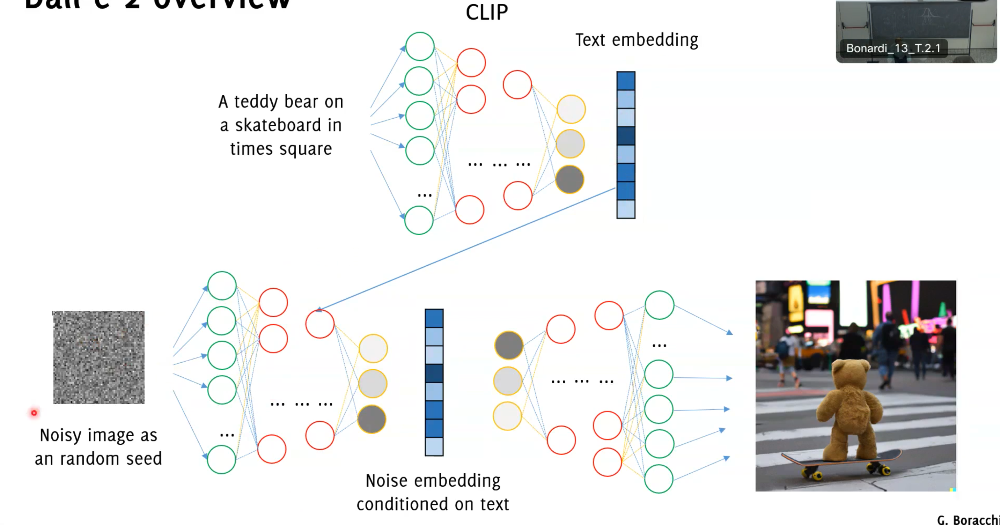

# Autoencoders and GAN

## Autoencoders

TODO

Auto encoders 

'self supervised learning' ?

Latent space 

Images live in a very difficult to describe manifold in a huge dimensional space

## GANs

GANs are a class of artificial intelligence algorithms used in unsupervised machine learning. The uses of GANs are extensive, ranging from **image generation** to photo-realistic image modification, image-to-image translation and style transfer. They are applied in art and design to craft realistic images or artworks. More applications can be found in video game design, film, and other visual media where they are used for the generation of realistic environments or characters. 
GANs consist of two components: a generator ($G$) and a discriminator ($D$).

- The generator creates content, and the discriminator evaluates it against reality.
- The goal is for the generator to produce outputs so convincing that the discriminator cannot differentiate between real and fake.

More formally:

- Discriminator $D$ estimates the probability of a given sample coming from the real dataset. 
- Generator $G$  outputs synthetic samples starting from a **noise** input $z$. It is trained to capture the real data distribution so that its generative samples can be as real as possible, or in other words, can trick the discriminator to offer a high probability.

GANs are trained starting with a Generator that creates low-quality replicas and a Discriminator which recognizes them easily. As the training develops, the Generator's ability to fabricate high-quality images improves simultaneously as the Discriminator gains prowess in identifying counterfeits. 
At the end the discriminator $\mathcal{D}$ is discarded and only $\mathcal{G}$ is kept as generative model.

### Training GANs

The Generative Adversarial Network (GAN) training is unstable, necessary to carefully synchronize the two steps . 

- The training is rather unstable, 
- Training by standard tools: backpropagation and dropout
- Theoretical analysis provided in the paper
- Generator does not use $\boldsymbol{S}$ directly during training
- Generator performance is difficult to assess quantitatively
- There is no explicit expression for the generator, it is provided in an implicit form $\rightarrow$ you cannot compute the likelihood of a sample w.r.t. the learned GAN

A good discriminator is such:

- $\mathcal{D}\left(\boldsymbol{s}, \theta_d\right)$ is maximum when $\mathbf{s} \in S$ (true image from the training set)
- $1-\mathcal{D}\left(\boldsymbol{s}, \theta_d\right)$ is maximum when $\mathbf{s}$ was generated from $\mathcal{G}$
- $1-\mathcal{D}\left(\mathcal{G}\left(\mathbf{z}, \theta_g\right), \theta_d\right)$ is maximum when $\boldsymbol{z} \sim \phi_Z$

Training $\mathcal{D}$ consists in maximizing the binary cross-entropy

$$
\max _{\theta_d}\left(\mathrm{E}_{s \sim \phi_S}\left[\log \mathcal{D}\left(\boldsymbol{s}, \theta_d\right)\right]+\mathrm{E}_{z \sim \phi_Z}\left[\log \left(1-\mathcal{D}\left(\mathcal{G}\left(\mathbf{z}, \theta_g\right), \theta_d\right)\right)\right]\right)
$$

Written using mathematical expectation rather than sum on minibatches A good generator $\mathcal{G}$ makes $\mathcal{D}$ to fail, thus minimizes the above

$$
\min _{\theta_g} \max _{\theta_d}\left(\mathrm{E}_{s \sim \phi_S}\left[\log \mathcal{D}\left(\boldsymbol{s}, \theta_d\right)\right]+\mathrm{E}_{Z \sim \phi_Z}\left[\log \left(1-\mathcal{D}\left(\mathcal{G}\left(\mathbf{z}, \theta_g\right), \theta_d\right)\right)\right]\right)
$$

Solve by an iterative numerical approach:

$$
\min _{\theta_g} \max _{\theta_d}\left(\mathrm{E}_{s \sim \phi_S}\left[\log \mathcal{D}\left(\boldsymbol{s}, \theta_d\right)\right]+\mathrm{E}_{z \sim \phi_Z}\left[\log \left(1-\mathcal{D}\left(\mathcal{G}\left(\mathbf{z}, \theta_g\right), \theta_d\right)\right)\right]\right)
$$

Alternate:

- $k$-steps of Stochastic Gradient Ascent w.r.t. $\theta_d$, keep $\theta_g$ fixed and solve
$$
\max _{\theta_d}\left(\mathrm{E}_{s \sim \phi_S}\left[\log \mathcal{D}\left(\boldsymbol{s}, \theta_d\right)\right]+\mathrm{E}_{z \sim \phi_Z}\left[\log \left(1-\mathcal{D}\left(\mathcal{G}\left(\mathbf{z}, \theta_g\right), \theta_d\right)\right)\right]\right)
$$
- 1-step of Stochastic Grandient Descent w.r.t. $\theta_g$ being $\theta_d$ fixed
$$
\min _{\theta_g}\left(\mathrm{E}_{s \sim \phi_S}\left[\log \mathcal{D}\left(\boldsymbol{s}, \theta_d\right)\right]+\mathrm{E}_{Z \sim \phi_Z}\left[\log \left(1-\mathcal{D}\left(\mathcal{G}\left(\mathbf{z}, \theta_g\right), \theta_d\right)\right)\right]\right)
$$
and since the first term does not depend on $\theta_g$, this consists in minimizing
$$
\min _{\theta_g}\left(\mathrm{E}_{z \sim \phi_Z}\left[\log \left(1-\mathcal{D}\left(\mathcal{G}\left(\mathbf{z}, \theta_g\right), \theta_d\right)\right)\right]\right)
$$

We'll delve into the mathematical underpinnings of these metrics and their relevance in training GANs. However, it's crucial to understand that while these theories are sound, their practical application can be challenging.

Given a noise variable $z$ (usually normally or uniformly distributed) and a dataset $x$, we define the following distributions:

- $p_Z$ as the data distribution over noise $z$
- $p_g$ as the generator's distribution over data $\mathrm{x}$
- $p_r$ as the data distribution over real samples $\mathrm{x}$

**2. Key Metrics: Kullback-Leibler Divergence (KLD) and Jensen-Shannon Divergence (JSD):**

- **KLD** measures how one probability distribution diverges from a second, expected distribution. It's **asymmetric** and may cause issues when measuring similarity between equally important distributions. 
Kullback-Lieber Divergence (KLD) aims to measure how a probability distribution $p$ diverges from a second expected probability distribution $q$ so that:
$$
D_{K L}(p \| q)=\int_x p(x) \log \frac{p(x)}{q(x)} d x
$$

- **JSD** improves upon KLD by being symmetric, smoother, and bounded in the [0,1] range. It's crucial in GANs for its balanced approach. Jensen-Shannon Divergence (KLD) aims to measure how a probability distribution $p$ diverges from a second expected probability distribution $q$ so that:

$$
D_{J S}(p \| q)=\frac{1}{2} D_{K L}\left(p \| \frac{p+q}{2}\right)+\frac{1}{2} D_{K L}\left(q \| \frac{p+q}{2}\right)
$$

According to its formulation, JSD is symmetric by design, is bounded in the $[0,1]$ range, and is smoother than KLD.
We want to improve the discriminator $D$ ability to accurately recognize real data coming from distribution $p_r(x)$ maximizing $\mathbb{E}_{x \sim p_r(x)}[\log D(x)]$
Moreover, given the fake samples $G(z) \sim p_Z(z)$ is expected to output a probability $D(G(z))$ close to zero maximizing $\mathbb{E}_{Z \sim p_z(z)}[\log (1-D(G(z)))]$
The generator is instead trained to increase its chances of producing good quality fake examples and with a high probability managing to deceive $D$. For this purpose, its goal is to minimize:

$$\mathbb{E}_{z \sim p_Z(z)}[\log (1-D(G(z)))]=\mathbb{E}_{x \sim p_g(x)}[\log (1-D(x))]$$

$D$ and $G$ are playing a [**minimax**](../../../BSc(italian)/Foundations%20of%20Artificial%20Intelligence/src/02.Adversarial%20Search.md#Minimax%20Search) game in which we should optimize the following loss function:

$$
\min _G \max _D L(G, D)=\mathbb{E}_{\left(x \sim p_r(x)\right.}[\log (D(x))]+\mathbb{E}_{x \sim p_g(x)}[\log (1-D(x))]
$$

where $\mathbb{E}_{x \sim p_r(x)}[\log (D(x))]$ has no impact on $G$ during gradient descent updates

Given the minmax loss function just defined, the optimal value of $D(x)$ can be found solving the following integral:
$$
L(G, D)=\int_x\left(p_r(x) \log (D(x))+p_g(x) \log (1-D(x))\right) d x
$$

Let $\tilde{x}=D(x), A=p_r(x), B=p_g(x)$. Since we can safely ignore the integral as $x$ is sampled over all the possible values, the argument of the integral $f(\tilde{x})$ becomes:
$$
f(\tilde{x})=A \log (\tilde{x})+B \log (1-\tilde{x})
$$

By deriving with respect to $\tilde{x}$ we obtain that:
$$
\frac{d f(\tilde{x})}{d \tilde{x}}=A \frac{1}{\ln 10} \frac{1}{\tilde{x}}-B \frac{1}{\ln 10} \frac{1}{1-\tilde{x}}=\frac{1}{\ln 10} \frac{A-(A+B) \tilde{x}}{\tilde{x}(1-\tilde{x})}
$$

Thus, by setting $\frac{d f(\tilde{x})}{d \tilde{x}}=0$, we get the best value for the discriminator:
$$
D^*(x)=\tilde{x}=\frac{A}{A+B}=\frac{p_r(x)}{p_r(x)+p_g(x)} \in[0,1]
$$

Once the generator is trained to its optimal $p_g \approx p_r$ and then $D^*(x)=\frac{1}{2}$
When both $G$ and $D$ are at their optimal values, we have $p_g=p_r$ and $D^*(x)=\frac{1}{2}$ and the loss function becomes:
$$
\begin{array}{l}
L\left(G^*, D^*\right)=\int_x\left(p_r(x) \log \left(D^*(x)\right)+p_g(x) \log \left(1-D^*(x)\right)\right) d x \\
=\log \frac{1}{2} \int_x p_r(x) d x+\log \frac{1}{2} \int_x p_g(x) d x \\
=-2 \log 2
\end{array}
$$

According to the previously defined formula, the Jensen-Shannon Divergence between $p_r$ and $p_g$ can be written as:
$$
\begin{array}{l}
D_{J S}\left(p_r \| p_g\right)=\frac{1}{2} D_{K L}\left(p_r \| \frac{p_r+p_g}{2}\right)+\frac{1}{2} D_{K L}\left(p_g \| \frac{p_{\mathrm{r}}+p_g}{2}\right) \\
=\frac{1}{2}\left(\log 2+\int_x p_r(x) \log \frac{p_r(x)}{p_r(x)+p_g(x)} d x\right)+\frac{1}{2}\left(\log 2+\int_x p_g(x) \log \frac{p_g(x)}{p_r(x)+p_g(x)} d x\right) \\
=\frac{1}{2}\left(\log 4+L\left(G, D^*\right)\right)
\end{array}
$$

Essentially the loss function of a GAN quantifies the similarity between the generative data distribution $p_g$ and the real sample distribution $p_r$ by JSD when the discriminator is optimal:
$$
L\left(G, D^*\right)=2 D_{J S}\left(p_r \| p_g\right)-2 \log 2
$$

The best $G^*$ that replicates the real data distribution leads the loss function to reach the following minimum:
$$
L\left(G^*, D^*\right)=-2 \log 2
$$

This is the theoretical results, actually in reality it's not possible. Why?

? Practical application of these theories can be challenging, highlighting the difference between theoretical models and real-world scenarios.
 Highlights the discrepancy between theoretical models and actual results, questioning the feasibility of achieving theoretical outcomes in practice. ? 

Mathematical underpinnings of KLD and JSD are significant in training GANs.

- Presents the method for finding the optimal value of the discriminator and its role in the loss function.
- Explains how the optimal generator replicates the real data distribution, impacting the loss function.

### Conditional GANs for Controlled Output

Moving forward, we'll explore conditional GANs, which allow for more control over the output by feeding class information into the models. This approach enables us to generate specific categories of outputs, a step closer to tailored creativity in machine learning.

- Conditional GANs allow for more controlled outputs by incorporating class information into models.
- This enables generation of specific categories of outputs.

## DALLE 2 

DALL-E 2 a powerful machine learning models from OpenAl that generates digital images from natural language descriptions

It is not based on GANs but on diffusion models, a more recent generative model.
... but how to feed text to a generative model?
We need some help from an external model: CLIP

CLIP
Clip is a huge model, trained from image captions to generate consistent representations of both images and text

CLIP is trained by contrastive loss from a training set of images and their caption

DALL-E 2 is a robust machine learning model by OpenAI. It generates digital images using natural language descriptions. However, DALL-E 2 does not rely on Generative Adversarial Networks (GANs). Instead, it uses a current generative model known as diffusion models. 

But, how does text get fed into a generative model? That's where CLIP comes into play.

CLIP is a large-scale model, designed to create consistent image and text representations. It leverages image captions for its training. CLIP's training is conducted through contrastive loss from a dataset comprised of images and corresponding captions.

Image generation was considered the "holy grail" of imaging research up to less than 10 years ago

Different architectures of neural networks made this possible. Still, the practical impact of generative models was kind of limited.

Text embedding and superior quality in image generation has lead to astonishing performance, opening new perspective applications.

> "Behind these models there is no black magic or "human-like feelings", but rather expert training from a huge amount of data... it is important to know how these work!"

We've previously established that an ability to learn could be seen as a form of intelligence. If we accept this premise, it seems plausible that our deep learning models, through their learning capabilities, exhibit a form of intelligence.
Intelligence is a multifaceted concept with definitions spanning various fields like computer science, philosophy, and psychology. In its essence, intelligence could be seen as the capacity of a living being, or even a machine, to demonstrate certain behaviors or abilities that qualify it as intelligent. This brings us to the intriguing concept of creativity.
Creativity might be considered an evolution of intelligence. It could be seen as the ability to generalize what has been learned and to create something new and comparable to the learned concepts. This bridges us to the idea of genius, which might be described as the capacity to generalize creativity across different domains, creating something entirely novel and outside existing schemas.
Are our deep learning models genuinely creative, or do they simply replicate existing patterns? It's a fascinating area to explore, especially in the context of generative deep learning.
In closing, I encourage you to reflect on the implications of these technologies. The lines between reality and artificial generation are blurring. As you navigate information, especially online, be aware that not everything is as it seems. This underscores the importance of critical thinking in the digital age.
