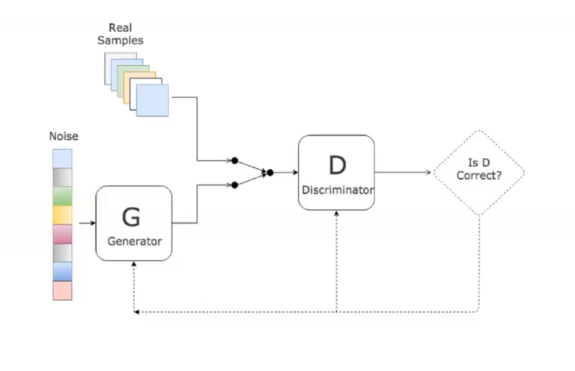
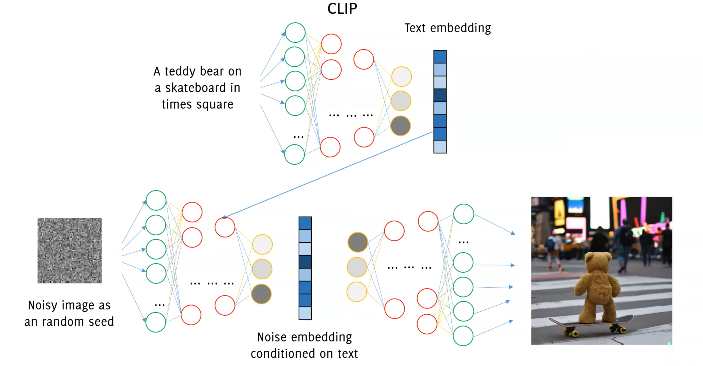

# Autoencoders and GAN

## Autoencoders

Autoencoders unlike traditional methods that rely on labeled data, introduce a 'self-supervised learning' approach.
They are designed to encode input data, like images, into a lower-dimensional 'latent space' and then reconstruct it back to the original form. 

The latent space is a lower-dimensional space where the compressed data resides. It's in this space that the autoencoder learns to capture and represent the core attributes of the input data. 

> "Images live in a very difficult to describe manifold in a huge dimensional space"

Autoencoders are the first step to introduce **Generative Models**. Actually, autoencoders approach does not work since we do not know the distribution of proper latent representation (or it is very difficult to estimate).

What about using Autoencoders as Generative Models? This approach does not work since we do not know the distribution of proper latent representation (or it is very difficult to estimate).

## GANs

GANs are a class of artificial intelligence algorithms used in unsupervised machine learning. The uses of GANs are extensive, ranging from **image generation** to photo-realistic image modification, image-to-image translation and style transfer. They are applied in art and design to craft realistic images or artworks. More applications can be found in video game design, film, and other visual media where they are used for the generation of realistic environments or characters. 
GANs consist of two components: a generator ($G$) and a discriminator ($D$).

- The generator creates content, and the discriminator evaluates it against reality.
- The goal is for the generator to produce outputs so convincing that the discriminator cannot differentiate between real and fake.

More formally:

- Discriminator $D$ estimates the probability of a given sample coming from the real dataset. 
- Generator $G$  outputs synthetic samples starting from a **noise** input $z$. It is trained to capture the real data distribution so that its generative samples can be as real as possible, or in other words, can trick the discriminator to offer a high probability.

GANs are trained starting with a Generator that creates low-quality replicas and a Discriminator which recognizes them easily. As the training develops, the Generator's ability to fabricate high-quality images improves simultaneously as the Discriminator gains prowess in identifying counterfeits. 
At the end the discriminator $\mathcal{D}$ is discarded and only $\mathcal{G}$ is kept as generative model.

### Training GANs

The Generative Adversarial Network (GAN) training is unstable, necessary to carefully synchronize the two steps . 

- The training is rather unstable, 
- Training by standard tools: backpropagation and dropout
- Generator does not use $\boldsymbol{S}$ directly during training
- Generator performance is difficult to assess quantitatively
- There is no explicit expression for the generator, it is provided in an implicit form $\rightarrow$ you cannot compute the likelihood of a sample w.r.t. the learned GAN

A good discriminator is such:

- $\mathcal{D}\left(\boldsymbol{s}, \theta_d\right)$ is maximum when $\mathbf{s} \in S$ (true image from the training set)
- $\mathcal{D}\left(\boldsymbol{s}, \theta_d\right)$ is minimum when $\mathbf{s}$ was generated from $\mathcal{G}$
- $1-\mathcal{D}\left(\mathcal{G}\left(\mathbf{z}, \theta_g\right), \theta_d\right)$ is maximum when $\boldsymbol{z} \sim \phi_Z$

where $\theta_g$ and $\theta_d$ are network parameters, $s$ in $\mathbb{R}^n$ is an input image (either real or generated by $G$ ) and $z\in\mathbb{R}^d$ is some random noise to be fed to the generator.
Training $\mathcal{D}$ consists in maximizing the binary cross-entropy:

$$
\max _{\theta_d}\left(\mathrm{E}_{s \sim \phi_S}\left[\log \mathcal{D}\left(\boldsymbol{s}, \theta_d\right)\right]+\mathrm{E}_{z \sim \phi_Z}\left[\log \left(1-\mathcal{D}\left(\mathcal{G}\left(\mathbf{z}, \theta_g\right), \theta_d\right)\right)\right]\right)
$$

Written using mathematical expectation rather than sum on minibatches, a good generator $\mathcal{G}$ makes $\mathcal{D}$ to fail, thus minimizes the above:

$$
\min _{\theta_g} \max _{\theta_d}\left(\mathrm{E}_{s \sim \phi_S}\left[\log \mathcal{D}\left(\boldsymbol{s}, \theta_d\right)\right]+\mathrm{E}_{Z \sim \phi_Z}\left[\log \left(1-\mathcal{D}\left(\mathcal{G}\left(\mathbf{z}, \theta_g\right), \theta_d\right)\right)\right]\right)
$$

Solve by an iterative numerical approach:

$$
\min _{\theta_g} \max _{\theta_d}\left(\mathrm{E}_{s \sim \phi_S}\left[\log \mathcal{D}\left(\boldsymbol{s}, \theta_d\right)\right]+\mathrm{E}_{z \sim \phi_Z}\left[\log \left(1-\mathcal{D}\left(\mathcal{G}\left(\mathbf{z}, \theta_g\right), \theta_d\right)\right)\right]\right)
$$

Alternate:

- $k$-steps of Stochastic Gradient Ascent w.r.t. $\theta_d$, keep $\theta_g$ fixed and solve
$$
\max _{\theta_d}\left(\mathrm{E}_{s \sim \phi_S}\left[\log \mathcal{D}\left(\boldsymbol{s}, \theta_d\right)\right]+\mathrm{E}_{z \sim \phi_Z}\left[\log \left(1-\mathcal{D}\left(\mathcal{G}\left(\mathbf{z}, \theta_g\right), \theta_d\right)\right)\right]\right)
$$
- 1-step of Stochastic Gradient Descent w.r.t. $\theta_g$ being $\theta_d$ fixed
$$
\min _{\theta_g}\left(\mathrm{E}_{s \sim \phi_S}\left[\log \mathcal{D}\left(\boldsymbol{s}, \theta_d\right)\right]+\mathrm{E}_{Z \sim \phi_Z}\left[\log \left(1-\mathcal{D}\left(\mathcal{G}\left(\mathbf{z}, \theta_g\right), \theta_d\right)\right)\right]\right)
$$
and since the first term does not depend on $\theta_g$, this consists in minimizing
$$
\min _{\theta_g}\left(\mathrm{E}_{z \sim \phi_Z}\left[\log \left(1-\mathcal{D}\left(\mathcal{G}\left(\mathbf{z}, \theta_g\right), \theta_d\right)\right)\right]\right)
$$

At the end of the day $D$ and $G$ are playing a [**minimax**](../../../BSc(italian)/Foundations%20of%20Artificial%20Intelligence/src/02.Adversarial%20Search.md#Minimax%20Search) game.
Essentially the loss function of a GAN quantifies the similarity between the generative data distribution $p_g$ and the real sample distribution $p_r$.

### Conditional GANs for Controlled Output

Moving forward, we'll explore conditional GANs, which allow for more control over the output by feeding class information into the models. This approach enables us to generate specific categories of outputs, a step closer to tailored creativity in machine learning.

- Conditional GANs allow for more controlled outputs by incorporating class information into models.
- This enables generation of specific categories of outputs.

## DALLE 3

DALL-E 3 a powerful machine learning models from OpenAl that generates digital images from natural language descriptions.

DALL-E 3 does not rely on GANs but instead uses **diffusion models**, which are newer generative models. But how to input text into a generative model? CLIP.

### CLIP

Clip is a huge model, trained from image captions to generate consistent representations of both images and text
CLIP is trained by contrastive loss from a training set of images and their caption.
To input text into a generative model like DALL-E 3, CLIP is used. 

Image generation was considered the "holy grail" of **imaging research** up to less than 10 years ago.
Different architectures of neural networks made this possible. Still, the practical impact of generative models was kind of limited.
Text embedding and superior quality in image generation has lead to astonishing performance, opening new perspective applications.

> "Behind these models there is no black magic or "human-like feelings", but rather **expert training** from a huge amount of data... it is important to know how these work!"
