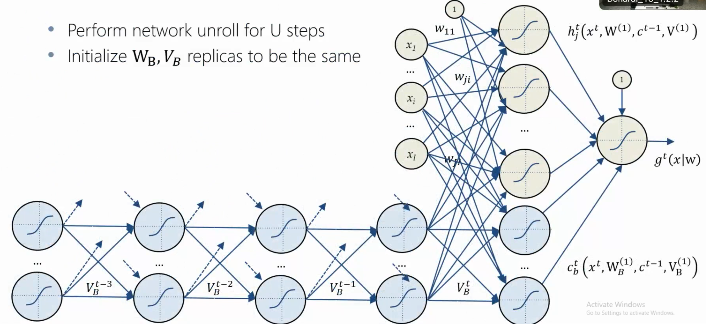

# Recurrent Neural Networks

We've only discussed static datasets, unchanging over time till now: 

- **Static** datasets are unchanging over time.
- **Dynamic** datasets change over time and require special handling.
    
To handle **Dynamic Datasets** two main approaches exists: 

- **Memoryless models**: take only the current input into account, without memory or retention of past inputs or outputs.
	- Autoregressive Models
	- Feedforward Neural Networks
- **Models with memory**: Recurrent Neural Networks

Recurrent Neural Networks are a type of neural network designed for sequential data processing:

- time series
- natural language
- audio

Their "recurrent" component, which allows for operations consistency across the input sequence.

A RNN has a "context" network which acts as a memory. In principle this recurrent part of the network acts as an infinite memory. This is achieved through hidden states that effectively 'remember' past inputs. 

How to implement this in a neural network? 
An hidden layer stores recurrent units or neurons that recall past inputs, essential for sequential data processing. **There are hidden states that keep evolving with each input in the sequence**. They get 'updated' to reflect the information they've accumulated from all past inputs up to that point.

## BPTT

Backpropagation Through Time (BPTT) is an adaptation of the normal backpropagation algorithm, is designed for sequential data. 

In usual neural networks, backpropagation calculates the gradient of loss function for each weight, determining how a change in weight influences the total error, and adjusts the weights to minimize this error.

But in the unique structure of RNNs, not just the current input but also previous ones influence the output: the temporal dependencies hence introduced complicate the training process.

> "When you have a loop, you can always unroll the iterations of them" 

**BPTT** unrolls the RNN over the sequence's time. Each time step is treated as a distinct layer in a deep network, transforming the network into a standard deep neural framework with each layer representing a time step in the initial RNN.

Here's a step-by-step overview of BPTT:

1. **Forward Pass**: Just like in standard backpropagation, BPTT begins with a forward pass through the network. For an RNN, this means processing the entire sequence from the first time step to the last, updating the hidden states based on the recurrent connections at each step.
2. **Compute Loss**
3. **Backward Pass**: Next, the gradients of this loss are propagated backward through the network. Unlike standard backpropagation, this involves going backward through each time step, accumulating gradients as we move back in time. **Since the same weights are used at each time step, the gradients from all time steps are summed up.**\*
4. **Update Weights**
    

\* Let's explain better "the same weights are used at each time step, the gradients from all time steps are summed up." : the same weights are used at each time step and the loss gradients calculated at each time step are summed up. This **cumulative gradient** is then used to update the weights. 

But it's clear that there are a potential issue with this **cumulated gradient**: if the sequence is very long, the gradients can become very small (vanish) or very large (explode).

This problem is particularly pronounced in RNNs with extensive recurrent parts.

So at the end:

- In scenarios where the task doesn't necessitate retaining long-term context, RNNs are often preferred due to their simplicity and computational efficiency. 
- If the task needs long-term context, **Long Short-Term Memory networks** (LSTMs) are the superior option. 

## LSTM 

**Long Short-Term Memory (LSTM) Networks** are specifically designed to address the vanishing gradient problem.
LSTMs achieve this through a specialized architecture that includes memory cells and gates, allowing them to maintain a **balance between long-term memory and short-term** inputs. 

### Vanilla Long Short Term Memory (LSTM) Neural Network

The fundamental building block of an LSTM network is the memory cell. These cells are designed to store information for long periods. Each cell has the capability to add or remove information, controlled through structures called gates.
There are three types of **Gates in LSTM**:

- **Input Gate**: Determines how much of the new information should be added to the cell state.
- **Forget Gate**: Decides what information should be discarded from the cell state.
- **Output Gate**: Determines the next hidden state, which is a filtered version of the cell state and will be used for predictions and transferring information to the next time step.

The forget gate first decides what information to discard from the previous cell state.

Simultaneously, the input gate and a creation of a new candidate values layer decide what new information to add to the cell state.
The output gate decides what part of the current cell state will make it to the output.

The idea is to have some gate mechanism where you can "write", "keep" or "read" information in the memory cells whenever the gate is turned on

These gates are not physical gates but mathematical functions that regulate the flow of information in and out of the cell state of each LSTM unit.

The gates control how the LSTM processes this data: deciding what new information to keep (input gate), what old information to discard (forget gate), and what information to use for making predictions or passing along to the next time step (output gate). These gates operate as filters, selectively allowing information to pass through or be modified, which makes LSTMs capable of handling complex tasks like language translation, where understanding context and remembering relevant information over time is crucial.
This filtering mechanism ensures that the network can maintain and update a memory (the cell state) of what's important, discard what's no longer relevant, and use the most pertinent information to make decisions or predictions. 

In an LSTM network, each unit in the hidden layer is replaced by an LSTM unit or cell. An LSTM unit is more complex than a standard RNN unit and includes several gates. These gates are integrated within each LSTM unit and operate at each time step.

The LSTM does have the ability to remove or add information to the cell state, carefully regulated by structures called gates.

Gates are a way to optionally let information through. They are composed out of a sigmoid neural net layer and a pointwise multiplication operation.

represents “completely keep this while a 00 represents "completely get rid of this".

A slightly more dramatic variation on the LSTM is the Gated Recurrent Unit, or GRU, introduced by [Cho, et al. (2014)](http://arxiv.org/pdf/1406.1078v3.pdf). It combines the forget and input gates into a single “update gate.” It also merges the cell state and hidden state, and makes some other changes. The resulting model is simpler than standard LSTM models, and has been growing increasingly popular.

### BiLSTM

Bidirectional Long Short Term Memory (BiLSTM) Neural Network

BiLSTM, or Bidirectional Long Short-Term Memory, is an extension of the traditional LSTM with a **bidirectional processing**: unlike standard LSTMs which process data in a forward direction (from past to future), BiLSTMs process data in both forward and backward directions. 

This means that for any given point in the input sequence, the BiLSTM has contextual information from both the past and the future relative to that point.

The BiLSTM simply does this using two LSTM layers that are run in parallel: 

- one processes the data from start to end (forward pass)
- and the other processes the data from end to start (backward pass). 

The outputs of these two layers are then combined at each time step.
