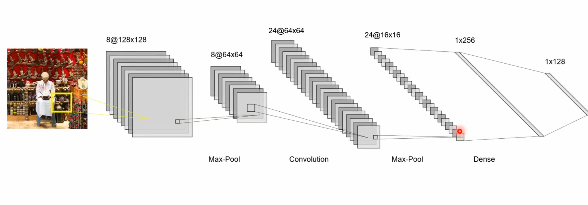
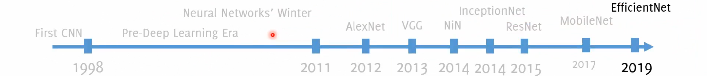

# Image Classification

Computer vision is an interdisciplinary scientific field that can be summarize to everything that makes computer able to understand the  high level understanding of digits from images or videos.

In the past, techniques and algorithms relied heavily on mathematical and statistical explanations of images. 

Today, **Deep learning** has become the go-to approach for solving visual recognition problems, such as image classification.

We will focus on the first visual recognition problem ever introduced, which is **image classification**: by addressing this problem, we aim to gain a deeper understanding of its complexity without the use of deep learning techniques.

## Traditional image classification with NN 

The **traditional** approach to image classification with neural networks involves **Local (Spatial) transformations**.
Spatial transformations mix all the pixels locally "around" a given pixel.

 

Traditional classifiers basic ingredient is the use of **Local Transformations of pixels**.
Defined in terms of **pixel neighbourhood** can be mathematically represented as:

$$G(r, c) = T_{U}[I](r, c)$$

where $I$ is the input image, $U$ identifies the region around a pixel, and $T_U$ is a transformation function. The output image $G$ at each pixel $(r, c)$ is defined by the neighbouring pixels $U$ of the corresponding input pixel $(r, c)$.

A basic type of these transformations is a linear one. A linear transformation can be written as: 
   $$ T[I](r, c) = \sum_{(u, v) \in U} w(u, v) * I(r+u, c+v) $$

In this formula, the weights $w(u, v)$ act as a filter $h$, dictating the operation applied to the input image.

A **Vector Representation of Images for Neural Networks** is necessary for feeding images into a neural network (NN), they are unfolded into a vector. 

### The problem with traditional classifiers 

Image Classification is a challenging problem and actually "traditional" classifiers are not helping at all.
The main challenges of a image classification problem are:

- **Dimensionality**: Images are very high-dimensional image data
- **Label ambiguity**: Images with a huge amount of content can be ambiguous (more than one label can correctly be assigned)
- **Transformations**: images of a the same subject can be very different because deformations, lightning changes, occlusion, background clutter, scale differences, a lot of variability in the same class 
- **Perceptual similarity**: the most important problem is that perceptual similarity in images is not related to pixel-similarity. Differences between pixels is not the same difference between "concepts". What really happens is the perceptual similarity which is not related to Euclidean distance between pixels (which is what actually traditional classifiers do).  

## Convolutional Neural Networks 

Convolutional neural networks (CNNs) are specifically optimized for processing image data. They use convolution operations to **extract features** from the input. 

### Convolutional layers

Convolutional layers are the main thing in CNN: 

- **Mix** all the components of the input applying a set of filters across the input **volume** to create activation maps: each filter is a distinct linear combination of the input components and contributes to a different "slice" of the **output volume**
- The **depth of the filters** in a convolutional layer is determined based on the depth of the input it processes. For instance, in the case of RGB images, each filter will have a depth of three to accommodate the three color channels


Visualization stuff here: [Animated AI](https://animatedai.github.io/) .
The size of the output of conv layer depends on three hyperparameters:

- **Depth**: corresponds to the **number of filters** in the layer (filters represented as the weights over the connection to another neuron), each of which looking for different characteristics in the input. The set of neurons belonging to different filters and connected to the same input region is the same depth column.
- **Stride**: number of pixel of which perform translations over the input image. This parameter allows to set the domain of the depth columns, because each depth column is linked to only one fraction of the input.
- **Padding**: often used to match input and output shapes.


### Pooling layers 

These layers reduce the spatial size of the volume, leaving the depth untouched. They operate on each layer of the input volume and resizes it. most popular one is the **MAX** one which using the max operation:


But also other kind of pooling exist:


### Dense layers

And at the end we have **dense layers**: "dense" because each output neuron is connected to each input neuron. 



### Why CNN architecture works for image classification


The CNN structure is particularly fitting for image processing because of 3 main characteristics:

1. **Sparse interaction**: not every neuron is connected to the others. Each one is only connected to a region of the input. Each output value in a layer only depends on a specific region in the input which is called the receptive field for that output. As we go deeper into the network, the receptive field becomes wider. This increased width is achieved through operations like max-pooling, convolutions, and stride greater than 1. 
2. **Weight sharing**: all the neurons in a given slice of a feature map share the same weights and bias. This sharing of parameters reduces the total number of parameters in the network. The assumption is made that if a particular feature is useful to compute at a certain spatial position (x, y), it should also be useful to compute at a different position (x2, y2). However, note that this assumption may not always hold true, especially when trying to identify localized features.
3. **Translation invariance**: by design (multiple filters), a CNN is **insensitive** to small transformations of the input


### Example of CNN for Image Classification


```python
import keras
from keras.utils import np_utils
from keras.models import Sequential, Model
from keras.layers import Dense, Activation, Flatten, GlobalAveragePooling2D, Dropout
from keras.layers import Conv2D, MaxPooling2D, AveragePooling2D, Dropout
from keras.applications import MobileNet, VGG16
patchsize = 64
pool_size = (2,2)
kernel_size = (3,3)
nb_filters = 8
model = Sequential()
model.add(Conv2D(nb_filters, (3,3) , input_shape=(patchsize, patchsize, 3), padding = "same"))
model.add(Activation('relu'))
model.add(MaxPooling2D(pool_size = pool_size))
model.add(Conv2D(nb_filters*2, (3,3), padding = "same"))
model.add(Activation('relu'))
model.add(Conv2D(nb_filters*2, (3,3), padding = "same"))
model.add(Activation('relu'))
model.add(MaxPooling2D(pool_size = pool_size))
model.add(Conv2D(nb_filters*3, (5,5), padding = "same"))
model.add(Activation('relu'))
model.add(Conv2D(nb_filters*3, (5,5), padding = "same"))
model.add(Activation('relu'))
model.add(MaxPooling2D(pool_size = pool_size))
model.add(GlobalAveragePooling2D())
model.add(Dense(64))
model.add(Activation('relu'))
model.add(Dropout(0.5))
model.add(Dense(16))
model.add(Activation('relu'))
model.add(Dropout(0.5))
model.add(Dense(5))
model.add(Activation('softmax'))
```


- This network is a good example of a typical CNN for image classification, with alternating convolutional and pooling layers followed by fully connected layers.
- In Keras sequential model each `model.add()` call adds a layer sequentially: each `Activation('relu')` is applied tto the output of the immediately preceding layer in the model.
- The use of ReLU activation functions and a Softmax output is standard in such networks.
- The network's architecture is fixed in terms of input size and depth, making it suitable for a specific type of image data.
- Regularization through Dropout is crucial for generalization, especially when dealing with complex datasets prone to overfitting.
- Note that his is not a fully convolutional network (FCN). While it includes several convolutional layers, it also contains Dense (fully connected) layers, particularly toward the end of the network. FCNs typically do not include dense layers and are more commonly used for tasks like semantic segmentation.


## Extras 

### Data augmentation

Deep learning models are data-hungry. Data augmentation involves applying various transformations to the dataset to artificially increase its size. Geometric transformations (such as shift, rotation, affine/perspective distortion, shear ...) and photometric transformations (such as adding noise, modifying average intensity, image contrast ...) are used. 
It is important to choose transformations that do not impact key features and preserve the input label.
In general, transformations can be also class-specific: to address class imbalance by creating more examples for the minority class for example. 
To further improve prediction accuracy, test time augmentation (TTA) can be performed:

1. Randomly augment each test image to create augmented images $A_l(I)_l$.
2. Make predictions for each augmented image using the CNN: $p_i = CNN(A_l(I))$.
3. Take the average predictions of each augmented image: $p = Avg(\{p_l\}_l)$.

### Transfer learning

A CNN consists of a **feature extraction** section, which is powerful and general purpose, and a classifier, which is task-specific.


We can use a pre-trained model's convolutional layers as a **feature extractor**, as they are effective and general. The FC layers, on the other hand, are specific and tailored to solve a particular problem.

In **transfer learning**, only the **feature classification layers** are trained. This is a good option when there is limited training data and the pre-trained model aligns with the problem. 

**Fine tuning** involves retraining the entire CNN while initializing the convolutional layers with the pre-trained model. This is useful when there is enough training data or when the task differs. **Lower learning rates are used in fine tuning.**

### Famous CNN architectures and innovative approaches 



- **AlexNet**(2012): To counteract overfitting, they introduce: 
	- RELU (also faster than tanh)
	- Dropout (0.5), weight decay and norm layers (not used anymore)
	- Maxpooling
- **VGG16** (2014): a deeper variant of the *AlexNet* convolutional structure where smaller filters are used while focusing on the role of network depth. The idea: "smaller filter but deeper network".  Multiple convolution in a sequence achieve large receptive fields (than larger filters in a single layer) with less parameters and more nonlinearities.
- **Network in Network (NiN):** NiN approach refers to embedding one network inside another. In the NiN architecture, the standard convolutional layer is replaced by the **Mlp conv layers**: a typical convolutional layer involves applying a convolutional operation on the input using a set of filters, followed by an activation function (like RELU) while a **Mlpconv layer** involves a sequence of fully connected (FC) layers followed by an activation (RELU). The significant distinction here is that there's a mini-network (an MLP) that consists of a few fully connected layers and RELUs.The main motivation behind using the NiN architecture is to allow for more complex patterns and relationships in the data with the same spatial footprint. This gives the layer a better ability (or a more powerful functional approximation) than a traditional convolutional layer, which is usually a linear operation followed by a non-linear activation.
- **GoogLeNet (or Inception v1)** (2014): there's a unique approach to manage computational demands, especially as the network depth increases: **inception modules** are visualized as mini "networks within the primary network" or "localized structures". Working together, these modules capture a diverse array of features at different scales, thus boosting the network's pattern recognition capabilities:
	1. **Strategy:** The solution adopted is to leverage multiple filter sizes (like 3×33×3 and 5×55×5) simultaneously at the same level within the network.
	2. **Merging Outputs:** After processing through these filters, the output activation maps from each filter size are merged together using a method called **concatenation**. This effectively combines the feature maps to generate a richer representation of the input.
	3. **Zero Padding:** To ensure that the spatial size of the feature maps remains consistent, zero padding is used. This technique pads the edges of the feature maps with zeros, allowing filters to cover the entirety of the map without reducing its dimensions.
	4. **Deepening Activation Maps:** While the spatial dimensions are preserved, the depth of the activation map increases significantly. 
- (Residual Network) **ResNet (2015)**: it starts with the idea that simply adding more layers to a network does not always lead to better performance. And intriguingly, this performance plateau or degradation wasn't due to overfitting, as the same trend was observed in training error as well. The core understanding was that very deep models are inherently harder to optimize compared to their shallower counterparts. The solution was to use **Identity Shortcut Connection:**
	- It mitigated the vanishing gradient problem, enabling training of deeper models. 
	- It did not introduce any additional parameters, keeping the model's complexity in check. 
	- The network can learn to use the full layer or just the shortcut depending on what's best for the data. In cases where earlier layers were already performing well, the new layers could approximate an identity mapping. This meant that if a previous network was optimal, the weights of the new layers could tend towards zero, allowing information to flow through the identity connection. 


- **MobileNet**: reduce the number of parameters and of operations to embed networks in mobile application.  

## Extra: cheat sheet to compute parameters and output shapes

| Layer Type | Parameters Calculation | Output Shape Calculation |
| ---- | ---- | ---- |
| **Input Layer** | $0$ | - |
| **Convolutional Layer** | $F*(k_w * k_h * d_{in} + 1)$ | $(w_{out}, h_{out}, d_{out}=\|F\|)$ |
| **Dense Layer** | $d_{out} * (d_{in} + 1)$ | $(d_{out})$ |
| **Batch Normalization** | $4 * d_{in}$ | - |
| **Pooling Layers** | $0$ | $(w_{out}, h_{out}, d_{out}$ |
| **Flatten Layer** | $0$ | $(w_{in} * h_{in} * d_{in})$ |
| **Global Pooling Layers** | $0$ | $(d_in)$ |
