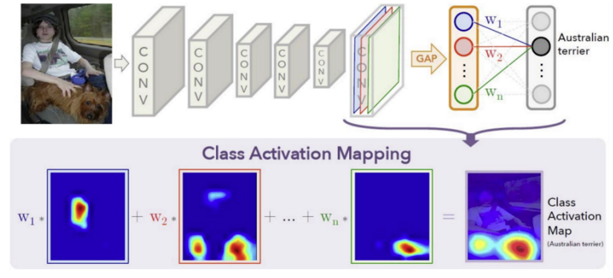

# Image Localization

While segmentation aims to classify each pixel, **localization** is a step beyond classification: it refers to the task of identifying the location of objects within an image, typically represented as bounding boxes. The process involves:

1. **Object Classification**: Assigning the object to a predefined category.
2. **Object Localization**: Pinpointing the object's position using a bounding box with coordinates (x, y, h, w).

Training of this process requires a dataset of images labeled with both the category and **bounding box coordinates**:

- A label $l$ from a fixed set of categories $\Lambda$;
- The coordinates $(x, y, h, w)$ of the bounding box enclosing that object, $I \rightarrow$ $(x, y, h, w, l)$

So, there are substantially 2 predictions to make:

- the class label: SoftMax loss $\delta$ can be used, through categorical cross entropy
- Bounding Box coordinates are found through regression loss $\left\|\left[x^{\prime}, y^{\prime}, w^{\prime}, h^{\prime}\right]-[x, y, w, h]\right\|_2$

### Weakly Supervised Localization

The idea of Weakly supervised localization (WSL) is to give limited or imprecise training data: only labels are given as the input to the network, and the network itself identifies and designs the area that contributed the most to the final classification. This is why it is termed as "**weakly** supervised."
We can do this using Class Activation Map (**CAM**).

## Global Averaging Pooling Layer

GAP, or Global Average Pooling, is a method used in CNNs to decrease the size of feature maps. Instead of preserving all the spatial dimensions, it takes the average of each feature map. 

Beyond regularization, **GAP** aids in localizing regions important for classification. Attaching a post-GAP vector and a fully Connected layer permits us to highlight image areas crucial for class prediction, computed as $M_{c}(x, y)=\sum_{k} w_{k}^{c} f_{k}(x, y)$ (?) 

The formula \( M_{c}(x, y) = \sum_{k} w_{k}^{c} f_{k}(x, y) \) represents the process of generating a Class Activation Map (CAM) for a specific class \( c \) in a Convolutional Neural Network (CNN). Let's break down the components of this formula:

1. **\( M_{c}(x, y) \)**: 
   - This represents the activation map for a particular class \( c \). The map is a 2D image where each element (pixel) \( (x, y) \) indicates the importance of that

location in contributing to the decision that the input image belongs to class \( c \).

2. **\( \sum_{k} \)**: 
   - This symbol denotes a summation over \( k \), which indexes the feature maps produced by the last convolutional layer of the CNN.

3. **\( w_{k}^{c} \)**: 
   - These are the weights from the fully connected layer of the CNN, specifically the weights that connect the \( k^{th} \) feature map

to the output node corresponding to class \( c \). These weights signify the importance of the \( k^{th} \) feature map in identifying class \( c \).

4. **\( f_{k}(x, y) \)**: 
   - This represents the activation of the \( k^{th} \) feature map at the spatial location \( (x, y) \). In other words, it's the value of the \( k^{th} \) feature map at a particular pixel location.

So, putting it all together, \( M_{c}(x, y) \) is computed by taking each feature map \( f_{k} \), multiplying it by the corresponding weight \( w_{k}^{c} \) that signifies its importance for class \( c \), and then summing up these weighted feature maps. The result is a 2D heatmap where each pixel value indicates how much

**Global Averaging Pooling Layers:** Traditional CNNs often have fully connected layers towards the end of the network. The Global Average Pooling (GAP) layer is introduced as an alternative to these fully connected layers: it takes the average of each feature map from the previous layer and outputs a single value for each feature map. The operation reduces the spatial dimensions of the feature maps to a 1x1 size: $F_k=\frac{1}{N} \sum_{(x, y)} f_k(x, y)$. By taking the average of feature maps, it preserves the most essential information while simplifying the network's structure. The rationale behind GAP is that fully connected layers, especially those at the end of CNNs, come with a large number of parameters. This not only increases computational costs but also makes the network more prone to overfitting. Overall GAP layers: 
	- **Reduced Parameters:** GAP layers introduce no additional parameters. This results in lighter networks, which are faster to train and less prone to overfitting.
	- **Softmax Classification:** Directly after GAP, a softmax function allows for efficient and effective classification.
	- **Interpretability:** GAP offers a more interpretable connection between feature maps and class outputs. This connection becomes handy in tasks like localization, where we want to know where in the image a certain feature or class is predominantly present.
	- **Structural Regularization:** By removing FC layers and introducing GAP, the model structure itself acts as a form of regularization. This inherently reduces overfitting chances.
	- **Robustness:** Networks using GAP demonstrate increased robustness to spatial transformations. The **shift sensitivity problem** in MLP occurs when a CNN is trained mostly on centered images. This means that if an image is shifted to a side or corner, the CNN may struggle to classify it correctly. GAP mitigates the shift sensitivity problem by averaging out the spatial information. This means the model can handle images that are resized, rotated, or otherwise spatially modified with less degradation in performance.
	- **Flexibility in Image Sizes:** Unlike some traditional CNN architectures which require fixed-sized input images, models with GAP can classify images of various sizes.

## CAM 

Basically a **CAM** is a combination of:

- the output of a Global Average Pooling (GAP) layer
- a vector of class-specific weights from a Fully Connected (FC) layer, where the weights are used to combine the activation maps from the last volume to generate the Class Activation Map (CAM).

CAM usually results in a low-resolution region that represents the relevant parts of the image. Hence, an up-sampling might be needed to resize the CAM to match with the original image size, thus facilitating their superimposition.
Remember: FC weights guide the combination of activation maps, while CAM visually demonstrates the parts of the image critical for neural network's decision-making process.

### CAM flavours 

- **CAM (Class Activation Map)**: CAM is used to generate a heatmap for a particular class in a CNN, highlighting the regions of the input image most relevant for predicting that class.
	- **How It Works**: it requires a specific architecture: global average pooling (GAP) followed by a dense layer. $M_c(x, y)=\sum_k w_k^c f_k(x, y)$, where $w_k^c$ are the weights from the GAP layer to the output for class $c$, and $f_k(x, y)$ is the activation of feature map $k$ at position $(x, y)$.
	- **(dis)Advantages**: CAM is limited to specific network architectures with GAP before the final classification layer.
- **Grad-CAM (Gradient-weighted Class Activation Map)**: It offers a flexible method for creating class activation maps for a variety of CNN models, including those without GAP. 
	- **How It Works**: It uses the spatial information present (gradients) entering the final convolutional layer to determine the importance of each neuron. These gradients are then used to weigh the activation maps from the convolutional layers, essentially highlighting which parts of the map are most important for the model’s output. The resulting localization map (often visualized as a heatmap overlaid on the original image) shows the regions that played a significant role in the model's decision, providing insights into what the model is 'looking at' when making a prediction.
	- **Advantages**: It produces the same size, low-resolution images, which then can be upscaled. Consequently, the final image has high overlap with the input.
- **Augmented Grad-CAM**: An enhanced version of Grad-CAM that aims to improve the resolution and quality of the heatmaps.
    - **Technique**: Applies different transformations (like rotation, scaling, etc.) to multiple low-resolution heatmaps of the input image to reconstruct a high-resolution heatmap.
    - **Advantages**: Combines information from Grad-CAM across various augmented versions of the input image.
- Extra: **RISE (Randomized Input Sampling for Explanation)**: a shift to **black-box** paradigm: RISE makes multiple versions of the input image by using **random** masks. Every mask hides different parts of the image.
   - **How It Works**: For every new version of the image, the class score (which is the probability of the target class) is calculated. By looking at the scores from all of these images, RISE finds out which parts contribute most to the class score. If a part always gets a high score when it's visible, it's considered more important. The final results can be shown as a heatmap or a saliency map, which highlights these important parts on the original image.
   - **Advantages**: RISE can be used with any type of neural network because it doesn't rely on the network's internal setup.
   