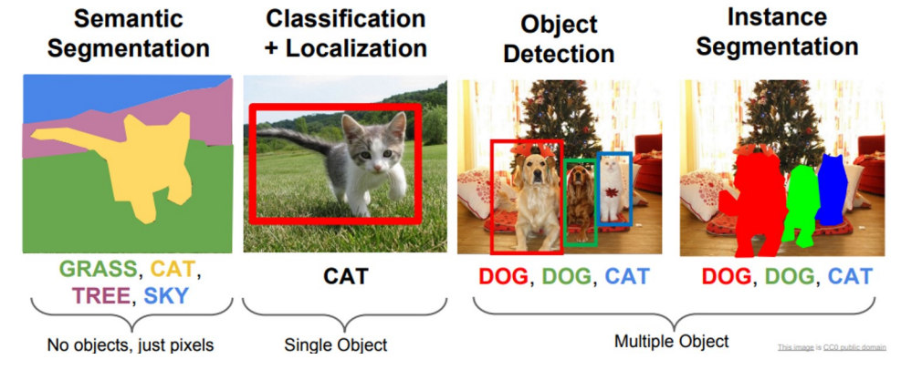

# Object detection

The challenge combines both challenges of object detection and semantic segmentation: do semantic segmentation and at same time separate each object instance. 

Object detection encompasses identifying and localinzig multiple objects within an image. It involves not only classifying objects but also determining their positions.

- **Early Methods**:
	- **The sliding window** technique involves moving a fixed-size window across an image, at every position using a classifier to determine whether an object of interest is present within that window.
	    - The window "slides" across the image, both horizontally and vertically, often at varying scales (sizes) to detect objects at different resolutions.
	    - At each position, the region within the window is fed into a classifier (like a CNN) to assess whether it contains the object of interest.
	    - This process generates a set of bounding boxes where the classifier predicts the presence of an object.
	    - **Computational Intensity**: Scanning the entire image at multiple scales and positions is computationally expensive.
	    - **Bad accuracy**: The technique may miss objects that don't fit well into the window or generate false positives.
	- **Region proposal** algorithms aim to identify bounding boxes that could potentially contain an object within the image. Before deep learning, algorithms with high recall but low precision tactics were used. The process involves utilizing a region proposal algorithm to determine potential object areas and then using a Convolutional Neural Network (CNN) to classify the image within each proposed region.
- **Modern Approaches**: Use DL, particularly CNNs, which have significantly improved accuracy and efficiency. These include two-stage detectors like R-CNN (and its variants Fast R-CNN, Faster R-CNN) and one-stage detectors like YOLO (You Only Look Once) and SSD (Single Shot Multibox Detector).
	- **Improvements over simple approaches**:
	    - **Efficiency**: Modern object detectors process an entire image in one go, eliminating the need for exhaustive sliding window scanning.
	    - **Accuracy**: They are more accurate in detecting objects of various sizes and shapes, thanks to advanced network architectures and training techniques.
	    - **Speed**: Techniques like YOLO and SSD are optimized for real-time detection, making them suitable for applications like video surveillance and autonomous driving.

### R-CNN (Region-based Convolutional Neural Network)

The main differences between R-CNN, Fast R-CNN, and Faster R-CNN lie in their approach to object detection and the efficiency with which they process images. These models represent a progression in the field of computer vision, where each subsequent version improves upon the previous one in terms of speed and accuracy. Let's break down the key differences:

1. **R-CNN (Region-based Convolutional Neural Network)**:
   - **Approach**: R-CNN uses selective search to generate region proposals (potential bounding boxes) and then runs a convolutional neural network (CNN) on each of these proposed regions separately to classify the objects. After that, it uses regression to refine the bounding boxes.
   - **Drawback**: The main drawback of R-CNN is its speed. Because it processes each region proposal independently, it is very slow and computationally expensive.
2. **Fast R-CNN**:
   - **Improvement over R-CNN**: Fast R-CNN improves on R-CNN by passing the entire image through the CNN only once to generate a convolutional feature map. From this feature map, it then extracts region proposals and uses a Region of Interest (RoI) pooling layer to reshape them into a fixed size, so that they can be fed into a fully connected layer for classification and bounding box regression.
   - **Advantage**: This approach is significantly faster than R-CNN as it avoids redundant computations on the multiple region proposals and it streamlines the process by using a single CNN for the entire image.
3. **Faster R-CNN**:
   - **Key Innovation**: The most significant improvement in Faster R-CNN is the introduction of the Region Proposal Network (RPN). The RPN is a fully convolutional network that predicts object bounds and scores at each position of the feature map, thus eliminating the need for the selective search algorithm used in R-CNN and Fast R-CNN.
   - **Performance**: Faster R-CNN unifies the region proposal and object detection steps into one single network, making it even faster and more efficient than Fast R-CNN.

### YOLO

YOLO, or "You Only Look Once," is a state-of-the-art, **real-time** object detection system that simplifies object detection into a single regression problem, solved by a large Convolutional Neural Network (CNN). 

YOLO turns the entire object detection into a single regression problem. This problem goes from image pixels to boundary box coordinates and class probability. This regression problem is solved by using a large Convolutional Neural Network (CNN).

YOLO divides the input image into a grid. Each grid cell is responsible for detecting objects that fall into it. Each cell predicts a certain number of bounding boxes. For each bounding box, the model predicts the coordinates, the confidence score (how confident it is that a box contains an object), and the probability distribution over all the potential classes.

**Combined Prediction**: The detection is the combination of the confidence score and the class probability.

Here's a summarized version of how YOLO manages to detect large objects:

1. **Bounding Boxes Extend Beyond Grid Cells**: Each grid cell predicts bounding boxes that can be larger than the cell itself, allowing for the detection of large objects.
2. **Center of Object Determines Responsibility**: A grid cell is responsible for detecting an object if the object's center falls within that cell, regardless of the object's size.
3. **Variety in Box Sizes and Ratios**: Cells predict bounding boxes of various sizes and aspect ratios, accommodating different object dimensions.
4. **Use of Non-Maximum Suppression (NMS)**: NMS helps in selecting the most accurate bounding box from overlapping predictions, ensuring correct detection of large objects.
5. **Training on Diverse Data**: YOLO is trained on datasets with objects of varying sizes, enabling it to learn how to adjust bounding boxes to accurately encompass large objects.

### Siamese Networks

Siamese Networks are unique neural network models designed to compare the similarities of inputs, making them ideal for tasks like image matching and face verification. Instead of categorizing inputs, these networks evaluate how similar or dissimilar they are, suiting them for comparison-based applications such as face recognition and signature verification.
Key aspects of Siamese Networks include:

- **Feature Extraction Over Classification**: Unlike typical classification networks, Siamese Networks focus on **extracting latent features** that provide a meaningful representation of images. These features capture patterns crucial for the comparison tasks rather than direct classification.
- **Distance-Based Comparison**: **extracted Image features** are then compared based on the distance between latent representations. The closest match is determined by the smallest distance in this **latent space**. 
	- **Optimization**: The network is trained to effectively recognize different classes by optimizing weights. This is aimed at making sure images from the same class are closer in latent space as compared to those from different classes. 
- **Loss Functions**:
    - **Contrastive Loss**: This loss function is used to train the network on pairs of images, focusing on minimizing distances between similar images and maximizing distances between dissimilar ones.
    - **Triplet Loss**: Another approach to training, where the network learns from triplets of images:
	    - an anchor
	    - a positive example (same class)
	    - a negative example (different class)
		The goal is to ensure that the distance between the anchor and the positive example is smaller than the distance between the anchor and the negative example, by a margin `m`.
- **Decision-making strategies**: Different can be adopted, such as searching for the template that is closest to the input image. The process of image verification involves to associate the input with the class which minimizes the average distance between the input to the templates. The reliability of identification depends on a certain threshold.

