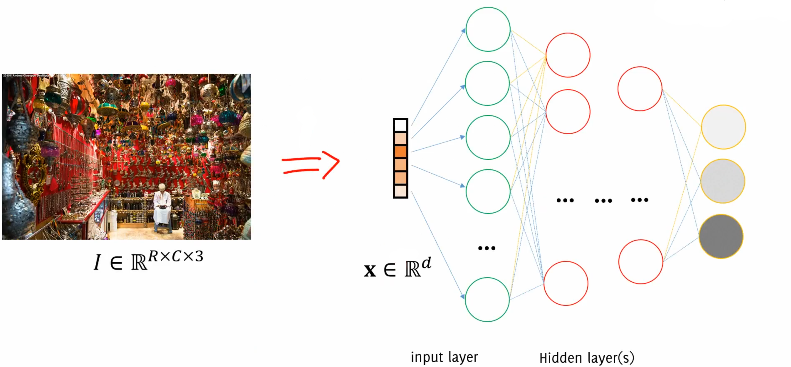
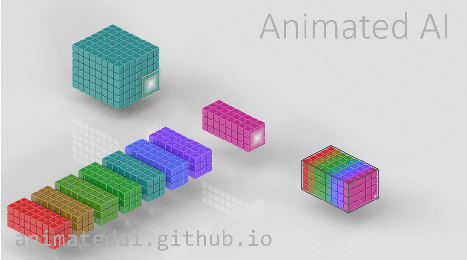
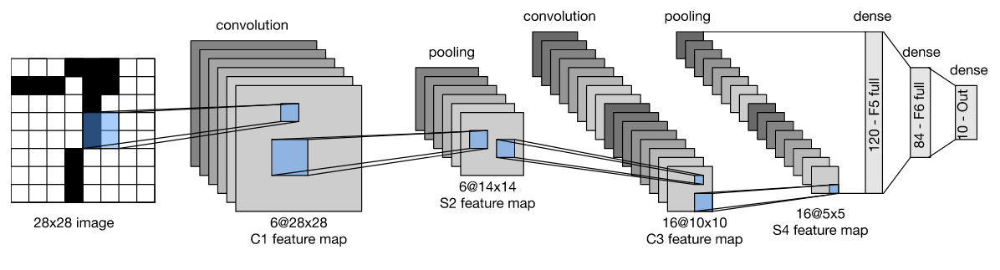
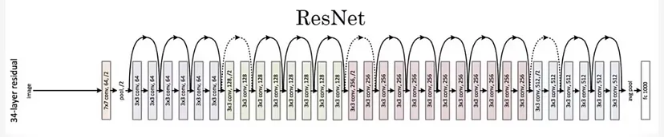

# From perceptron to Feed Forward Neural Networks

The concept of neural networks has been around since the 1950s. Initially, it involved building hardware that could mimic human-like behaviour and perform tasks that only humans were thought to be able to do. 
## Perceptron


A perceptron can be seen as a mathematical model of the neurons. We want to mimic this non-linear system where there is a sort of **threshold**: the signals arrive from other neurons, but only if the sum of signals exceeds the threshold the neuron activates.

The basic structure of a perceptron can be seen as:

$$
y= \begin{cases}1 & \text { if } \sum_{i=1}^{n} w_{i} x_{i}+b>0 \\ -1 & \text { otherwise }\end{cases}
$$

In this equation, $x_{1}, x_{2}, \ldots, x_{n}$ are the input features, $w_{1}, w_{2}, \ldots, w_{n}$ are the weights assigned to each input feature, $b$ is the bias term, and $y$ is the output of the perceptron. The perceptron calculates the dot product of the weights and inputs, adds the bias term, and then applies the activation function (which in this case is a step function). If the result is greater than zero, the output is 1 , and if it is less than or equal to zero, the output is -1 .

It's a **non-linear** function of a linear combination: the inputs are combined linearly (sum of weighted inputs plus a bias), and then this result is transformed by a **non-linear** function (the activation function).

Why this non-linearity is so important? 

- Linear models can only represent linear relationships. Non-linear functions in neural networks can approximate a wider range of functions, including intricate and complex relationships in data. 
- Non-linear activation functions also allow for the stacking of layers in deep neural networks which would not be possible with linear functions which would collapse into a single linear layer. 
- Many real-world phenomena are non-linear, so non-linear representations are necessary to accurately reflect them.

Sometimes the bias is just seen as another parameter $w_0$.

## Feedforward Neural Networks

Feedforward neural networks are typically represented by composing together many different functions. 
The model is associated with a **directed acyclic graph** describing how the functions are composed together. 

These networks have only information flowing forward in a **chain of functions** (that's why are called **feed-forward** neurons) called **layers**.

The depth of the model is determined by the number of layers in the chain. 


The structure is as it follows:

$$
z_{i}=f\left(\sum_{j=1}^{n} w_{i j} x_{j}+b_{i}\right)
$$

In a feedforward neural network, the computation of each layer is performed using this equation, where $x_{1}, x_{2}, \ldots, x_{n}$ are the input features, $w_{i j}$ is the weight of the connection between the input $j$ and the output $i$, $b_i$ is the bias term for the output $\mathrm{i}$, and $z_{i}$ is the output of the layer for the output $i$.

### Hebbian learning 

> "The strength of a synapse increases according to the simultaneous activation of the relative input and the desired target" *(Donald Hebb, The Organization of Behaviour, 1949)*

**Hebbian learning** is a rule in neural networks that adjusts the strength of connections between neurons based on their activity. It states that if two neurons are active simultaneously, their connection is strengthened. This is known as "Hebb's rule" or "Hebbian learning rule".
The weight of the connection between $A$ and $B$ neurons is calculated using:

$$w_i^{k+1}=w_i^k+\Delta w_i^k$$
$$\Delta w_i^k=\eta\cdot x_i^k\cdot t^k$$

Where we have:

- $\eta$ : learning rate 
- $x_i^k$ : the $i^{th}$ input of neuron $A$ at time $k$
- $t^k$ : the desired output of neuron $B$ at time $k$

Starting from a random initialization, the weights are updated for each sample individually in an **online** way. Only update the weights if the sample is not predicted correctly.

### Universal approximation theorem (Kurt Hornik, 1991)

> "A single hidden layer feedforward neural network with $S$ shaped activation functions can approximate any measurable function to any desired degree of accuracy on a compact set" (Kurt Hornik, 1991)

Which basically means that FFNN can represent any function but actually:

- finding the necessary weights may not be possible for a learning algorithm.
- In the worst case scenario, an exponential number of hidden units may be needed.
- The layer may become unreasonably large and fail to learn and generalize effectively.

Starting from a random initialization, the weights are fixed one sample at the time (online) and only if the sample is not correctly predicted. The weight of the connection between $A$ and $B$ neurons is calculated using:

$$
\left\{\begin{array}{l}
w_i^{k+1}=w_i^k+\Delta w_i^k \\
\Delta w_i^k=\eta \cdot x_i^k \cdot t^k
\end{array}\right.
$$

We are trying to minimize the cost function or loss function of the neural network. The cost function measures how well the neural network is performing on a given set of training examples. By minimizing this cost function, we aim to improve the accuracy and performance of the neural network model.
To find the minimum of a generic function, we compute the partial derivatives of the loss function in respect to the parameters and set them to zero
$$
\frac{\partial J(w)}{\partial w}=0
$$


# FFNN in practice

## Training and overfitting 

We will discuss some refinements that will make feedforward neural networks more effective in practice. 

Some terms to keep in mind:

- **Training dataset**: the available data
- **Training set**: the data used to learn model parameters
- **Test set**: the data used to perform final model assessment
- **Validation set**: the data used to perform model selection
- **Training data**: used to train the model (fitting + selection)
- **Validation data**: used to assess the model quality (selection + assessment)
- **[Cross-validation](05.Model%20Evaluation.md#Model%20Evaluation)**: is the use of the training dataset to both train the model (parameter fitting + model selection) and estimate its error on new data
	- When lots of data are available use a Hold Out set and perform validation
	- When having few data available use Leave-One-Out Cross-Validation (LOOCV)
	- K-fold Cross-Validation is a good trade-off (sometime better than LOOCV) 
## Hyperparameters

While model parameters are estimated from data during training, model **hyperparameters** are set manually. 

Hyperparameters: 

- Number of neurons and layers
- **Activation functions**
- **Error functions**
- **Gradient descent algorithm**
- **Batch dimension**
- Validation set dimension
- **Weight optimization**
- **Batch normalization**
- **Learning rate optimization** 

### Activation functions 

The specific type of activation function used can have a significant impact on the network's ability to learn and model different types of patterns and relationships.
In general effective/used activation functions are characterized by a $S$-shape (not like a linear one).
Activation functions must be **differentiable** to permit training.

**Sigmoid**, maps the input values to the range between 0 and 1 , which is useful for binary classification tasks. If the output of the sigmoid function is greater than 0.5 , it is considered "activated," and the node produces an output of 1 . If the output is less than 0.5 , it is considered "deactivated," and the node produces an output of 0 .
$$
f(x)=\frac{1}{1+e^{-x}}
$$

**Tanh** does the same binary mapping but between $-1$ and $1$.
$$
f(x)=\frac{e^x-e^{-x}}{e^x+e^{-x}}
$$

**Softmax**, used commonly in classification tasks, can map the input to a vector of values between 0 and 1, which sum adds up to 1. It is useful to output probability distribution.


The **ReLu** function is very popular: 

$$
f(x)=x+=\operatorname{ReLU}(x)=\max (0, x)
$$

However, the Relu has some potential disadvantages:

1. Non-differentiable at zero
2. Non-zero centered output
3. Unbounded.
4. **Dying Neurons**: Sometimes, Relu neurons can be pushed into a state where they become inactive for almost all inputs. This means that gradients do not flow backward through these neurons and they essentially "die", leading to decreased learning capability.

The **Leaky ReLU** fix for the "dying ReLU" problem: 

$$f(x)=\begin{cases}x & \text{if } x\geq0\\0.01x& \text{otherwise}\end{cases}$$

The **ELU** tries to make the mean activations closer to zero which speeds up learning. $\alpha$ is tuned by hand: 

$$f(x)=\begin{cases}x&\quad \text{if x}\geq0\\\alpha(e^x-1)&\quad \text{otherwise} \end{cases}$$


#### Activation Functions Cheatsheet

**Hidden layers activation functions**

| Name | Description | Common use |
| ---- | ---- | ---- |
| **ReLU** | Outputs the input if it's positive, otherwise outputs zero. | Default choice for hidden layers. Good for avoiding the vanishing gradient problem. |
| **Leaky ReLU** | Similar to ReLU but allows a small gradient when the unit is not active. | Useful when facing the problem of dead neurons in ReLUs. |
| **Sigmoid** | Outputs a value between 0 and 1. | Useful in binary classification within the hidden layers for non-linear problems. |
| **Tanh** | Outputs a value between -1 and 1. | Similar to Sigmoid but normalized around zero. Good when the data is centered around zero. |
| **ELU** | Exponential Linear Unit, similar to ReLU but smoother. | Can help improve learning characteristics compared to ReLU. |

**Output layer activation functions**

| Name | Description | Common use |
| ---- | ---- | ---- |
| **Softmax** | Converts outputs to probability distribution (sums up to 1). | Commonly used for multi-class classification problems. Useful when the outputs are mutually exclusive. |
| **Sigmoid** | Outputs a value between 0 and 1. | Used for binary classification problems. Ideal when the outputs are independent. |
| **Linear** | No activation (output = input). | Used in regression problems where you need a range of real-valued outputs. |
| **Softplus** | Smooth approximation of ReLU. | Useful in regression problems for non-negative outputs. |

### Error functions

An error function, or "loss function," is used to measure how well a feedforward neural network (FFNN) can predict the desired output given input data. It guides the optimization process during training.

To use an error function in an FFNN:

- Define the error function based on the task, such as mean squared error (MSE) for regression or binary cross-entropy loss for binary classification. The binary cross-entropy loss is calculated as the negative log likelihood of the predicted probabilities. 
- Calculate the error by applying the error function to the predicted and true outputs.
- Backpropagate the error through the network using an optimization algorithm, like stochastic gradient descent (SGD), to update the weights and biases.
- Evaluate the error to assess performance on the training and validation/test data.

Common error functions used in FFNNs include:

- Mean squared error (MSE) for regression tasks.
- Binary cross-entropy loss for binary classification tasks.
- Categorical cross-entropy loss for multi-class classification tasks.
- Hinge loss for binary classification tasks, commonly used in support vector machines (SVMs).

Other error functions can also be used depending on the task requirements.


| Error Function             | Description                                             | Common Use |
| -------------------------- | ------------------------------------------------------- | ---------- |
| **Mean Squared Error (MSE)** | Measures the average of the squares of the errors.      | Used in regression tasks where continuous values are predicted. |
| **Binary Cross-Entropy Loss** | Measures the performance of a binary classification model. | Used for binary classification tasks. Calculates the negative log likelihood of the predicted probabilities. |
| **Categorical Cross-Entropy Loss** | Measures the performance of a multi-class classification model. | Used for multi-class classification tasks. Ideal for mutually exclusive classes. |
| **Hinge Loss** | Used to maximize the margin between decision boundary and data points. | Commonly used in Support Vector Machines (SVMs) and also applicable for binary classification tasks in neural networks. |


### Gradient descent algorithms

Closed-form solutions are practically never available so we can use iterative solutions (**gradient descent**):

- Initialize the weights to a random value
- Decrease towards the direction of decrease
- Iterate until convergence 

$$w^{k+1}=w^k-\left.\eta \frac{\partial J(w)}{\partial w}\right|_{w^k}$$
#### Batch gradient descent

$$\frac{\partial E(w)}{\partial w}=\frac{1}{N} \sum_n^N \frac{\partial E\left(x_n, w\right)}{\partial w}$$

#### Stochastic gradient descent (SGD)

Use a single sample, unbiased, but with high variance.

$$\frac{\partial E(w)}{\partial w} \approx \frac{\partial E_{S G D}(w)}{\partial w}=\frac{\partial E\left(x_n, w\right)}{\partial w}$$

####  Mini-batch gradient descent 

$$\frac{\partial E(w)}{\partial w} \approx \frac{\partial E_{M B}(w)}{\partial w}=\frac{1}{M} \sum_{n \in \text { Minibatch }}^{M<N} \frac{\partial E\left(x_n, w\right)}{\partial w}$$

Use a subset of samples, good trade off variance-computation.

### Weight Initialization

There are different approaches:

- **Zeros**: it does not work! All gradient would be zero, no learning will happen.
- **Big Numbers**: bad idea, if unlucky might take very long to converge
- $w \sim N\left(0, \sigma^2=0.01\right)$ : good for small networks, but it might be a problem for deeper neural networks
- $w_{i, j} \sim \mathcal{N}\left(0, \frac{1}{n_{i}}\right)$ where $n_i$ is the number of inputs to the network layer. This makes the total variance of activations equal to $1$.  It depends on the number of inputs of each layer, it's something "dynamic". 

Performing similar reasoning for the gradient Glorot & Bengio found
$$
n_{\text {out }} \operatorname{Var}\left(w_j\right)=1
$$
To accommodate for this, **Xavier** propose $w \sim N\left(0, \frac{2}{n_{\text {in }}+n_{\text {out }}}\right)$ The default initialization of Tensorflow is this.  

More recently he proposed, for rectified linear units, $w \sim N\left(0, \frac{2}{n_{i n}}\right)$


Note that considerations over the variance are important to ensure stable learning:

- if all weights are initialized with large values there is a risk of exploding gradients. 
- On the other hand, if all weights are initialized with small values, there is a risk of vanishing gradients.

### Batch normalization

Batch normalization is a layer which aims to standardize inputs and outputs of each layer. 
It does this by normalizing the activations of each layer to have zero mean and unit variance. 

Batch normalization does not directly address the issue of vanishing gradients, but it can make the network more robust to the initialization of the parameters, which may allow the gradients to propagate more easily through the layers.

In practice during training, mean and stddev are computed for each minibatch.

### Learning Rate

The learning rate **hyperparameter** of gradient descent algorithm can be set (to achieve better performance) using different approaches. 

It can be fixed, but actually the approaches where it's **adaptive** are more used.

## Optimizations techniques

We will see 3 techniques:

- Early stopping
- Weight decay 
- Dropout 

Whose highlights are: 

- **Early stopping** wastes data but works out of the box. No hyperparameter. Early stopping is also possible to the trick to put "all together" epochs/number of neurons in one "last training". 
- **Weight decay** you have to select for best gamma. We need to tune hyperparameter.
- **Dropout** you have to select best probability to dropout. 

### Early stopping  

The training can be stopped according to a set of hyperparameters. 


Online estimate of the generalization error

An online estimate is used to predict the behaviour of your network on UD. It provides an estimate of the performance you should expect when you stop the network. By training multiple networks with early stopping, you can compare them by analysing the validation error.

### Weight Decay

Using weight regularization the weights in the model are constrained to be smaller: smaller weights can help with better generalization. 

To achieve this, . This forces the gradient to decrease the overall norm of the weights. To determine the best value for the regularization parameter, again cross-validation is possible:  training the model with different values and choose the one that yields the best results.

The most common form of weight decay is L2 regularization: 

- To the loss function is added a **penalty term** proportional to the sum of the squares of the weights .

$$\text{L2 Penalty} = \lambda \sum_{i=1}^{n} w_i^2$$

The penalty term is also multiplied by a regularization parameter (often denoted as $\lambda$). 

### Dropout

The Dropout works by randomly selecting a subset of neurons and turning them off during each epoch of the training phase. This forces the network to learn redundant representations of features, which helps in reducing overfitting. 
Each epoch, a different set of neurons is turned off according to the **dropout probability**, denoted as $p$, which is a hyperparameter. 
The final network is an ensemble of different "subnets". The weights are scaled to average the output of these subnets.

## Vanishing and exploding Gradient

The vanishing gradient problem occurs when the gradients of the parameters with respect to the loss function become very small. This problem is particularly prominent when using activation functions such as **Sigmoid** or **Tanh**.

The vanishing gradient problem inhibits effective learning in **deep** networks because the backpropagation algorithm, which adjusts the parameters based on these gradients, requires gradient multiplications. When the gradient is close to zero or less than 1, these multiplications can cause the gradient to vanish, resulting in little to no learning.

A similar issue is the **exploding gradient**: if the gradient keeps getting multiplied at each layer, it can grow exponentially leading to unstable and unreliable training.

The **ReLU** activation function is a solution to both gradient explosion and vanishing, since it has a "efficient gradient propagation":

$$
g(a)=\operatorname{ReLu}(a)=\max (0, a)
$$

Or the **Leaky ReLU** which fix the"dying neurons" problem is also a good alternative.
Leaky ReLU ensures that the gradient is non-zero even when the neuron is inactive. 
Other variations include the **ELU**, which is parametric, and the **Randomized ReLu**, with randomly chosen slope.


# Image Classification

Computer vision is an interdisciplinary scientific field that can be summarize to everything that makes computer able to understand the  high level understanding of digits from images or videos.

In the past, techniques and algorithms relied heavily on mathematical and statistical explanations of images. 

Today, **Deep learning** has become the go-to approach for solving visual recognition problems, such as image classification.

We will focus on the first visual recognition problem ever introduced, which is **image classification**: by addressing this problem, we aim to gain a deeper understanding of its complexity without the use of deep learning techniques.

## Traditional image classification with NN 

The **traditional** approach to image classification with neural networks involves **Local (Spatial) transformations**.
Spatial transformations mix all the pixels locally "around" a given pixel.

 

Traditional classifiers basic ingredient is the use of **Local Transformations of pixels**.
Defined in terms of **pixel neighbourhood** can be mathematically represented as:

$$G(r, c) = T_{U}[I](r, c)$$

where $I$ is the input image, $U$ identifies the region around a pixel, and $T_U$ is a transformation function. The output image $G$ at each pixel $(r, c)$ is defined by the neighbouring pixels $U$ of the corresponding input pixel $(r, c)$.

A basic type of these transformations is a linear one. A linear transformation can be written as: 
   $$ T[I](r, c) = \sum_{(u, v) \in U} w(u, v) * I(r+u, c+v) $$

In this formula, the weights $w(u, v)$ act as a filter $h$, dictating the operation applied to the input image.

A **Vector Representation of Images for Neural Networks** is necessary for feeding images into a neural network (NN), they are unfolded into a vector. 

### The problem with traditional classifiers 

Image Classification is a challenging problem and actually "traditional" classifiers are not helping at all.
The main challenges of a image classification problem are:

- **Dimensionality**: Images are very high-dimensional image data
- **Label ambiguity**: Images with a huge amount of content can be ambiguous (more than one label can correctly be assigned)
- **Transformations**: images of a the same subject can be very different because deformations, lightning changes, occlusion, background clutter, scale differences, a lot of variability in the same class 
- **Perceptual similarity**: the most important problem is that perceptual similarity in images is not related to pixel-similarity. Differences between pixels is not the same difference between "concepts". What really happens is the perceptual similarity which is not related to Euclidean distance between pixels (which is what actually traditional classifiers do).  

## Convolutional Neural Networks 

Convolutional neural networks (CNNs) are specifically optimized for processing image data. They use convolution operations to **extract features** from the input. 

### Convolutional layers

Convolutional layers are the main thing in CNN: 

- **Mix** all the components of the input applying a set of filters across the input **volume** to create activation maps: each filter is a distinct linear combination of the input components and contributes to a different "slice" of the **output volume**
- The **depth of the filters** in a convolutional layer is determined based on the depth of the input it processes. For instance, in the case of RGB images, each filter will have a depth of three to accommodate the three color channels




Visualization stuff here: [Animated AI](https://animatedai.github.io/) .
The size of the output of conv layer depends on three hyperparameters:

- **Depth**: corresponds to the **number of filters** in the layer (filters represented as the weights over the connection to another neuron), each of which looking for different characteristics in the input. The set of neurons belonging to different filters and connected to the same input region is the same depth column.
- **Stride**: number of pixel of which perform translations over the input image. This parameter allows to set the domain of the depth columns, because each depth column is linked to only one fraction of the input.
- **Padding**: often used to match input and output shapes.


### Pooling layers 

These layers reduce the spatial size of the volume, leaving the depth untouched. They operate on each layer of the input volume and resizes it. most popular one is the **MAX** one which using the max operation:


But also other kind of pooling exist:


### Dense layers

And at the end we have **dense layers**: "dense" because each output neuron is connected to each input neuron. 


### Why CNN architecture works for image classification


The CNN structure is particularly fitting for image processing because of 3 main characteristics:

1. **Sparse interaction**: not every neuron is connected to the others. Each one is only connected to a region of the input. Each output value in a layer only depends on a specific region in the input which is called the receptive field for that output. As we go deeper into the network, the receptive field becomes wider. This increased width is achieved through operations like max-pooling, convolutions, and stride greater than 1. 
2. **Weight sharing**: all the neurons in a given slice of a feature map share the same weights and bias. This sharing of parameters reduces the total number of parameters in the network. The assumption is made that if a particular feature is useful to compute at a certain spatial position (x, y), it should also be useful to compute at a different position (x2, y2). However, note that this assumption may not always hold true, especially when trying to identify localized features.
3. **Translation invariance**: by design (multiple filters), a CNN is **insensitive** to small transformations of the input




### Example of CNN for Image Classification


```python
import keras
from keras.utils import np_utils
from keras.models import Sequential, Model
from keras.layers import Dense, Activation, Flatten, GlobalAveragePooling2D, Dropout
from keras.layers import Conv2D, MaxPooling2D, AveragePooling2D, Dropout
from keras.applications import MobileNet, VGG16
patchsize = 64
pool_size = (2,2)
kernel_size = (3,3)
nb_filters = 8
model = Sequential()
model.add(Conv2D(nb_filters, (3,3) , input_shape=(patchsize, patchsize, 3), padding = "same"))
model.add(Activation('relu'))
model.add(MaxPooling2D(pool_size = pool_size))
model.add(Conv2D(nb_filters*2, (3,3), padding = "same"))
model.add(Activation('relu'))
model.add(Conv2D(nb_filters*2, (3,3), padding = "same"))
model.add(Activation('relu'))
model.add(MaxPooling2D(pool_size = pool_size))
model.add(Conv2D(nb_filters*3, (5,5), padding = "same"))
model.add(Activation('relu'))
model.add(Conv2D(nb_filters*3, (5,5), padding = "same"))
model.add(Activation('relu'))
model.add(MaxPooling2D(pool_size = pool_size))
model.add(GlobalAveragePooling2D())
model.add(Dense(64))
model.add(Activation('relu'))
model.add(Dropout(0.5))
model.add(Dense(16))
model.add(Activation('relu'))
model.add(Dropout(0.5))
model.add(Dense(5))
model.add(Activation('softmax'))
```


- This network is a good example of a typical CNN for image classification, with alternating convolutional and pooling layers followed by fully connected layers.
- In Keras sequential model each `model.add()` call adds a layer sequentially: each `Activation('relu')` is applied tto the output of the immediately preceding layer in the model.
- The use of ReLU activation functions and a Softmax output is standard in such networks.
- The network's architecture is fixed in terms of input size and depth, making it suitable for a specific type of image data.
- Regularization through Dropout is crucial for generalization, especially when dealing with complex datasets prone to overfitting.
- Note that his is not a fully convolutional network (FCN). While it includes several convolutional layers, it also contains Dense (fully connected) layers, particularly toward the end of the network. FCNs typically do not include dense layers and are more commonly used for tasks like semantic segmentation.


## Extras 

### Data augmentation

Deep learning models are data-hungry. Data augmentation involves applying various transformations to the dataset to artificially increase its size. Geometric transformations (such as shift, rotation, affine/perspective distortion, shear ...) and photometric transformations (such as adding noise, modifying average intensity, image contrast ...) are used. 
It is important to choose transformations that do not impact key features and preserve the input label.
In general, transformations can be also class-specific: to address class imbalance by creating more examples for the minority class for example. 
To further improve prediction accuracy, test time augmentation (TTA) can be performed:

1. Randomly augment each test image to create augmented images $A_l(I)_l$.
2. Make predictions for each augmented image using the CNN: $p_i = CNN(A_l(I))$.
3. Take the average predictions of each augmented image: $p = Avg(\{p_l\}_l)$.

### Transfer learning

A CNN consists of a **feature extraction** section, which is powerful and general purpose, and a classifier, which is task-specific.


We can use a pre-trained model's convolutional layers as a **feature extractor**, as they are effective and general. The FC layers, on the other hand, are specific and tailored to solve a particular problem.

In **transfer learning**, only the **feature classification layers** are trained. This is a good option when there is limited training data and the pre-trained model aligns with the problem. 

**Fine tuning** involves retraining the entire CNN while initializing the convolutional layers with the pre-trained model. This is useful when there is enough training data or when the task differs. **Lower learning rates are used in fine tuning.**

### Famous CNN architectures and innovative approaches 


- **AlexNet**(2012): To counteract overfitting, they introduce: 
	- RELU (also faster than tanh)
	- Dropout (0.5), weight decay and norm layers (not used anymore)
	- Maxpooling
- **VGG16** (2014): a deeper variant of the *AlexNet* convolutional structure where smaller filters are used while focusing on the role of network depth. The idea: "smaller filter but deeper network".  Multiple convolution in a sequence achieve large receptive fields (than larger filters in a single layer) with less parameters and more nonlinearities.
- **Network in Network (NiN):** NiN approach refers to embedding one network inside another. In the NiN architecture, the standard convolutional layer is replaced by the **Mlp conv layers**: a typical convolutional layer involves applying a convolutional operation on the input using a set of filters, followed by an activation function (like RELU) while a **Mlpconv layer** involves a sequence of fully connected (FC) layers followed by an activation (RELU). The significant distinction here is that there's a mini-network (an MLP) that consists of a few fully connected layers and RELUs.The main motivation behind using the NiN architecture is to allow for more complex patterns and relationships in the data with the same spatial footprint. This gives the layer a better ability (or a more powerful functional approximation) than a traditional convolutional layer, which is usually a linear operation followed by a non-linear activation.
- **GoogLeNet (or Inception v1)** (2014): there's a unique approach to manage computational demands, especially as the network depth increases: **inception modules** are visualized as mini "networks within the primary network" or "localized structures". Working together, these modules capture a diverse array of features at different scales, thus boosting the network's pattern recognition capabilities:
	1. **Strategy:** The solution adopted is to leverage multiple filter sizes (like 3×33×3 and 5×55×5) simultaneously at the same level within the network.
	2. **Merging Outputs:** After processing through these filters, the output activation maps from each filter size are merged together using a method called **concatenation**. This effectively combines the feature maps to generate a richer representation of the input.
	3. **Zero Padding:** To ensure that the spatial size of the feature maps remains consistent, zero padding is used. This technique pads the edges of the feature maps with zeros, allowing filters to cover the entirety of the map without reducing its dimensions.
	4. **Deepening Activation Maps:** While the spatial dimensions are preserved, the depth of the activation map increases significantly. 
- (Residual Network) **ResNet (2015)**: it starts with the idea that simply adding more layers to a network does not always lead to better performance. And intriguingly, this performance plateau or degradation wasn't due to overfitting, as the same trend was observed in training error as well. The core understanding was that very deep models are inherently harder to optimize compared to their shallower counterparts. The solution was to use **Identity Shortcut Connection:**
	- It mitigated the vanishing gradient problem, enabling training of deeper models. 
	- It did not introduce any additional parameters, keeping the model's complexity in check. 
	- The network can learn to use the full layer or just the shortcut depending on what's best for the data. In cases where earlier layers were already performing well, the new layers could approximate an identity mapping. This meant that if a previous network was optimal, the weights of the new layers could tend towards zero, allowing information to flow through the identity connection. 



- **MobileNet**: reduce the number of parameters and of operations to embed networks in mobile application.  

## Extra: cheat sheet to compute parameters and output shapes

| Layer Type | Parameters Calculation | Output Shape Calculation |
| ---- | ---- | ---- |
| **Input Layer** | $0$ | - |
| **Convolutional Layer** | $F*(k_w * k_h * d_{in} + 1)$ | $(w_{out}, h_{out}, d_{out}=\|F\|)$ |
| **Dense Layer** | $d_{out} * (d_{in} + 1)$ | $(d_{out})$ |
| **Batch Normalization** | $4 * d_{in}$ | - |
| **Pooling Layers** | $0$ | $(w_{out}, h_{out}, d_{out}$ |
| **Flatten Layer** | $0$ | $(w_{in} * h_{in} * d_{in})$ |
| **Global Pooling Layers** | $0$ | $(d_in)$ |


# Image Segmentation

Image segmentation involves partitioning an image into multiple segments or groups of pixels, aiming to identify pixel groups that belong together:

- Group similar-looking pixels for efficiency.
- Divide images into coherent objects.

Actually image segmentation can be divided into: 

- **Semantic Segmentation**: Assigns a label to each pixel in an image, without differentiating between different instances of the same object within a category.
- **Instance Segmentation**: Similar to semantic segmentation but also differentiates between different instances of the same object/category.

There are two types of segmentation:

- **Unsupervised Segmentation**: Group similar-looking pixels based on characteristics like color, texture, etc., without using any training data.
- **Supervised Segmentation**: Involves using labelled training data where each pixel is associated with a class label.

## Simple semantic segmentation approaches 

Simple solutions are:

- **Direct heatmap predictions**: Assigning predicted labels from a heatmap to corresponding receptive fields. Provides a coarse estimate.
- **Only convolutions**: Avoids pooling; uses only convolutional and activation layers. Results in a small receptive field and inefficiency.
- **Shift and Stich**: Assume there is a down sampling ratio $f$ between the size of input and of the output heatmap.
	- Uses a down sampling ratio $f$ between the input and output heatmap.
	- Computes heatmaps for all $f^2$ shifts of the input.
	- Interleaves the heatmaps to form a full-sized image.

### Heatmaps

**Heatmaps** are visual data displays. They use colour gradients to represent different data values.
It's possible to use heatmaps to show how convolutional filters are activated in an image. The heatmap pixels, corresponds to **receptive fields**, mark where these activations occur. These fields essentially indicate the precise spots in the input image where the associated features are detected or activated most frequently.

For image segmentation, the last layer of a CNN generates a heatmap with a unique channel per class. Each heatmap slice reflects the probability (between $0$ and $1$) of a pixel belonging to a specific class. These values are generally lower resolution than the original image.

### Up-sampling 

Up-sampling is a process that is used in convolutional neural networks (CNNs) to increase the size of the feature maps produced by the network, particularly useful in heatmap prediction. 
Up-sampling is essentially the opposite of pooling or down-sampling, increasing output resolution. 

**Image segmentation**'s primary goal necessitates the classification of each pixel in an image, often dealing with the tension between **location** (local information 'where') and **semantics** (global information 'what'). 

The key to balancing the location/semantics tension is the combination of coarse and fine layers. 

The first part of the architecture uses deep features to encode semantic information. The second half is designed to **up sample** the predictions for each image pixel. As the network gets deeper, the extracted features become more abstract and semantically rich, helping the network to identify complex patterns.
Once the semantics are encoded in the deep layers, the network includes layers for feature map **up-sampling**. Multiple techniques can be applied at this stage.


Different way to do up-sampling:

1. **Nearest Neighbour Up-sampling**: This is a simpler method of increasing the size of an image or feature map by replicating the values of the original pixels. It involves resizing the original image or feature map by inserting zero-valued pixels between the original pixels and then setting the value of each new pixel to the value of the closest original pixel. It is a simple and fast method of upsampling that can be used in a convolutional neural network (CNN).
2. **Max Unpooling**: This involves saving the positions of the maxima during max pooling and then placing the values back into their original positions during max unpooling, thereby recovering spatial position information.
3. **Transpose Convolution**: Increases the surface area of the input volume (by adding zeros) followed by convolution. This method increases the size of the output through **learnable filters**, which are learned during training, thereby increasing the surface area while reducing depth.
4. **Prediction Upsampling**: Employs convolutions with fractional stride filters to enlarge the image. However, the results from this method are often not optimal.
5. **Skip Connections**: In architectures like U-Net, skip connections directly connect the feature maps from downsampling (encoder) layers to the upsampling (decoder) layers. Skip connections indirectly improve the quality of the upsampling process. They enable the network to use fine-grained details along with high-level semantic information, which is especially important in tasks like super-resolution or any task that requires detailed reconstruction of an image. 

### U-Net

U-Net is a robust, efficient, and highly adaptable architecture that has set a standard in medical image segmentation and has applications in various image segmentation tasks. 

U-Net has a distinctive "U-shaped" architecture. It consists of two paths: a contracting (downsampling) path and an expansive (upsampling) path, which gives it the U-shaped appearance.

Its design effectively combines these two paths: 

- the context captured in the downsampling path: 
	- The contracting path is a part of the convolutional network that includes repeated application of convolution and pooling operations to reduce the size of the feature map.
	- The number of feature channels is doubled at each downsampling step.
- the localization ability in the upsampling path:
	- The upsampled feature map is then concatenated with the corresponding cropped feature map from the contracting path.

A key component of the U-Net is the **skip connections** that connect the contracting path to the expansive path. These connections provide the expansive path with context information to better localize and learn representations.

Image segmentation models like as U-Net, typically have an output shape of (`Height, Width, C`), where `C` is the number of classes. Each pixel in the output has `C` values, indicating the probability distribution across the classes. 
A softmax activation function is often used across the `C` channels.


# Image Localization

While segmentation aims to classify each pixel, **localization** is a step beyond classification: it refers to the task of identifying the location of objects within an image, typically represented as bounding boxes. The process involves:

1. **Object Classification**: Assigning the object to a predefined category.
2. **Object Localization**: Pinpointing the object's position using a bounding box with coordinates (x, y, h, w).

Training of this process requires a dataset of images labeled with both the category and **bounding box coordinates**:

- A label $l$ from a fixed set of categories $\Lambda$;
- The coordinates $(x, y, h, w)$ of the bounding box enclosing that object, $I \rightarrow$ $(x, y, h, w, l)$

So, there are substantially 2 predictions to make:

- the class label: SoftMax loss $\delta$ can be used, through categorical cross entropy
- Bounding Box coordinates are found through regression loss $\left\|\left[x^{\prime}, y^{\prime}, w^{\prime}, h^{\prime}\right]-[x, y, w, h]\right\|_2$

### Weakly Supervised Localization

The idea of Weakly supervised localization (WSL) is to give limited or imprecise training data: only labels are given as the input to the network, and the network itself identifies and designs the area that contributed the most to the final classification. This is why it is termed as "**weakly** supervised."
We can do this using Class Activation Map (**CAM**).

## Global Averaging Pooling Layer

GAP, or Global Average Pooling, is a method used in CNNs to decrease the size of feature maps. Instead of preserving all the spatial dimensions, it takes the average of each feature map. 

Beyond regularization, **GAP** aids in localizing regions important for classification. Attaching a post-GAP vector and a fully Connected layer permits us to highlight image areas crucial for class prediction, computed as $M_{c}(x, y)=\sum_{k} w_{k}^{c} f_{k}(x, y)$ (?) 

The formula \( M_{c}(x, y) = \sum_{k} w_{k}^{c} f_{k}(x, y) \) represents the process of generating a Class Activation Map (CAM) for a specific class \( c \) in a Convolutional Neural Network (CNN). Let's break down the components of this formula:

1. **\( M_{c}(x, y) \)**: 
   - This represents the activation map for a particular class \( c \). The map is a 2D image where each element (pixel) \( (x, y) \) indicates the importance of that

location in contributing to the decision that the input image belongs to class \( c \).

2. **\( \sum_{k} \)**: 
   - This symbol denotes a summation over \( k \), which indexes the feature maps produced by the last convolutional layer of the CNN.

3. **\( w_{k}^{c} \)**: 
   - These are the weights from the fully connected layer of the CNN, specifically the weights that connect the \( k^{th} \) feature map

to the output node corresponding to class \( c \). These weights signify the importance of the \( k^{th} \) feature map in identifying class \( c \).

4. **\( f_{k}(x, y) \)**: 
   - This represents the activation of the \( k^{th} \) feature map at the spatial location \( (x, y) \). In other words, it's the value of the \( k^{th} \) feature map at a particular pixel location.

So, putting it all together, \( M_{c}(x, y) \) is computed by taking each feature map \( f_{k} \), multiplying it by the corresponding weight \( w_{k}^{c} \) that signifies its importance for class \( c \), and then summing up these weighted feature maps. The result is a 2D heatmap where each pixel value indicates how much


**Global Averaging Pooling Layers:** Traditional CNNs often have fully connected layers towards the end of the network. The Global Average Pooling (GAP) layer is introduced as an alternative to these fully connected layers: it takes the average of each feature map from the previous layer and outputs a single value for each feature map. The operation reduces the spatial dimensions of the feature maps to a 1x1 size: $F_k=\frac{1}{N} \sum_{(x, y)} f_k(x, y)$. By taking the average of feature maps, it preserves the most essential information while simplifying the network's structure. The rationale behind GAP is that fully connected layers, especially those at the end of CNNs, come with a large number of parameters. This not only increases computational costs but also makes the network more prone to overfitting. Overall GAP layers: 
	- **Reduced Parameters:** GAP layers introduce no additional parameters. This results in lighter networks, which are faster to train and less prone to overfitting.
	- **Softmax Classification:** Directly after GAP, a softmax function allows for efficient and effective classification.
	- **Interpretability:** GAP offers a more interpretable connection between feature maps and class outputs. This connection becomes handy in tasks like localization, where we want to know where in the image a certain feature or class is predominantly present.
	- **Structural Regularization:** By removing FC layers and introducing GAP, the model structure itself acts as a form of regularization. This inherently reduces overfitting chances.
	- **Robustness:** Networks using GAP demonstrate increased robustness to spatial transformations. The **shift sensitivity problem** in MLP occurs when a CNN is trained mostly on centered images. This means that if an image is shifted to a side or corner, the CNN may struggle to classify it correctly. GAP mitigates the shift sensitivity problem by averaging out the spatial information. This means the model can handle images that are resized, rotated, or otherwise spatially modified with less degradation in performance.
	- **Flexibility in Image Sizes:** Unlike some traditional CNN architectures which require fixed-sized input images, models with GAP can classify images of various sizes.

## CAM 

Basically a **CAM** is a combination of:

- the output of a Global Average Pooling (GAP) layer
- a vector of class-specific weights from a Fully Connected (FC) layer, where the weights are used to combine the activation maps from the last volume to generate the Class Activation Map (CAM).


CAM usually results in a low-resolution region that represents the relevant parts of the image. Hence, an up-sampling might be needed to resize the CAM to match with the original image size, thus facilitating their superimposition.
Remember: FC weights guide the combination of activation maps, while CAM visually demonstrates the parts of the image critical for neural network's decision-making process.

### CAM flavours 

- **CAM (Class Activation Map)**: CAM is used to generate a heatmap for a particular class in a CNN, highlighting the regions of the input image most relevant for predicting that class.
	- **How It Works**: it requires a specific architecture: global average pooling (GAP) followed by a dense layer. $M_c(x, y)=\sum_k w_k^c f_k(x, y)$, where $w_k^c$ are the weights from the GAP layer to the output for class $c$, and $f_k(x, y)$ is the activation of feature map $k$ at position $(x, y)$.
	- **(dis)Advantages**: CAM is limited to specific network architectures with GAP before the final classification layer.
- **Grad-CAM (Gradient-weighted Class Activation Map)**: It offers a flexible method for creating class activation maps for a variety of CNN models, including those without GAP. 
	- **How It Works**: It uses the spatial information present (gradients) entering the final convolutional layer to determine the importance of each neuron. These gradients are then used to weigh the activation maps from the convolutional layers, essentially highlighting which parts of the map are most important for the model’s output. The resulting localization map (often visualized as a heatmap overlaid on the original image) shows the regions that played a significant role in the model's decision, providing insights into what the model is 'looking at' when making a prediction.
	- **Advantages**: It produces the same size, low-resolution images, which then can be upscaled. Consequently, the final image has high overlap with the input.
- **Augmented Grad-CAM**: An enhanced version of Grad-CAM that aims to improve the resolution and quality of the heatmaps.
    - **Technique**: Applies different transformations (like rotation, scaling, etc.) to multiple low-resolution heatmaps of the input image to reconstruct a high-resolution heatmap.
    - **Advantages**: Combines information from Grad-CAM across various augmented versions of the input image.
- Extra: **RISE (Randomized Input Sampling for Explanation)**: a shift to **black-box** paradigm: RISE makes multiple versions of the input image by using **random** masks. Every mask hides different parts of the image.
   - **How It Works**: For every new version of the image, the class score (which is the probability of the target class) is calculated. By looking at the scores from all of these images, RISE finds out which parts contribute most to the class score. If a part always gets a high score when it's visible, it's considered more important. The final results can be shown as a heatmap or a saliency map, which highlights these important parts on the original image.
   - **Advantages**: RISE can be used with any type of neural network because it doesn't rely on the network's internal setup.
   


# Object detection

The challenge combines both challenges of object detection and semantic segmentation: do semantic segmentation and at same time separate each object instance. 


Object detection encompasses identifying and localinzig multiple objects within an image. It involves not only classifying objects but also determining their positions.

- **Early Methods**:
	- **The sliding window** technique involves moving a fixed-size window across an image, at every position using a classifier to determine whether an object of interest is present within that window.
	    - The window "slides" across the image, both horizontally and vertically, often at varying scales (sizes) to detect objects at different resolutions.
	    - At each position, the region within the window is fed into a classifier (like a CNN) to assess whether it contains the object of interest.
	    - This process generates a set of bounding boxes where the classifier predicts the presence of an object.
	    - **Computational Intensity**: Scanning the entire image at multiple scales and positions is computationally expensive.
	    - **Bad accuracy**: The technique may miss objects that don't fit well into the window or generate false positives.
	- **Region proposal** algorithms aim to identify bounding boxes that could potentially contain an object within the image. Before deep learning, algorithms with high recall but low precision tactics were used. The process involves utilizing a region proposal algorithm to determine potential object areas and then using a Convolutional Neural Network (CNN) to classify the image within each proposed region.
- **Modern Approaches**: Use DL, particularly CNNs, which have significantly improved accuracy and efficiency. These include two-stage detectors like R-CNN (and its variants Fast R-CNN, Faster R-CNN) and one-stage detectors like YOLO (You Only Look Once) and SSD (Single Shot Multibox Detector).
	- **Improvements over simple approaches**:
	    - **Efficiency**: Modern object detectors process an entire image in one go, eliminating the need for exhaustive sliding window scanning.
	    - **Accuracy**: They are more accurate in detecting objects of various sizes and shapes, thanks to advanced network architectures and training techniques.
	    - **Speed**: Techniques like YOLO and SSD are optimized for real-time detection, making them suitable for applications like video surveillance and autonomous driving.

### R-CNN (Region-based Convolutional Neural Network)

The main differences between R-CNN, Fast R-CNN, and Faster R-CNN lie in their approach to object detection and the efficiency with which they process images. These models represent a progression in the field of computer vision, where each subsequent version improves upon the previous one in terms of speed and accuracy. Let's break down the key differences:

1. **R-CNN (Region-based Convolutional Neural Network)**:
   - **Approach**: R-CNN uses selective search to generate region proposals (potential bounding boxes) and then runs a convolutional neural network (CNN) on each of these proposed regions separately to classify the objects. After that, it uses regression to refine the bounding boxes.
   - **Drawback**: The main drawback of R-CNN is its speed. Because it processes each region proposal independently, it is very slow and computationally expensive.
2. **Fast R-CNN**:
   - **Improvement over R-CNN**: Fast R-CNN improves on R-CNN by passing the entire image through the CNN only once to generate a convolutional feature map. From this feature map, it then extracts region proposals and uses a Region of Interest (RoI) pooling layer to reshape them into a fixed size, so that they can be fed into a fully connected layer for classification and bounding box regression.
   - **Advantage**: This approach is significantly faster than R-CNN as it avoids redundant computations on the multiple region proposals and it streamlines the process by using a single CNN for the entire image.
3. **Faster R-CNN**:
   - **Key Innovation**: The most significant improvement in Faster R-CNN is the introduction of the Region Proposal Network (RPN). The RPN is a fully convolutional network that predicts object bounds and scores at each position of the feature map, thus eliminating the need for the selective search algorithm used in R-CNN and Fast R-CNN.
   - **Performance**: Faster R-CNN unifies the region proposal and object detection steps into one single network, making it even faster and more efficient than Fast R-CNN.

### YOLO

YOLO, or "You Only Look Once," is a state-of-the-art, **real-time** object detection system that simplifies object detection into a single regression problem, solved by a large Convolutional Neural Network (CNN). 

YOLO turns the entire object detection into a single regression problem. This problem goes from image pixels to boundary box coordinates and class probability. This regression problem is solved by using a large Convolutional Neural Network (CNN).

YOLO divides the input image into a grid. Each grid cell is responsible for detecting objects that fall into it. Each cell predicts a certain number of bounding boxes. For each bounding box, the model predicts the coordinates, the confidence score (how confident it is that a box contains an object), and the probability distribution over all the potential classes.

**Combined Prediction**: The detection is the combination of the confidence score and the class probability.

Here's a summarized version of how YOLO manages to detect large objects:

1. **Bounding Boxes Extend Beyond Grid Cells**: Each grid cell predicts bounding boxes that can be larger than the cell itself, allowing for the detection of large objects.
2. **Center of Object Determines Responsibility**: A grid cell is responsible for detecting an object if the object's center falls within that cell, regardless of the object's size.
3. **Variety in Box Sizes and Ratios**: Cells predict bounding boxes of various sizes and aspect ratios, accommodating different object dimensions.
4. **Use of Non-Maximum Suppression (NMS)**: NMS helps in selecting the most accurate bounding box from overlapping predictions, ensuring correct detection of large objects.
5. **Training on Diverse Data**: YOLO is trained on datasets with objects of varying sizes, enabling it to learn how to adjust bounding boxes to accurately encompass large objects.

### Siamese Networks

Siamese Networks are unique neural network models designed to compare the similarities of inputs, making them ideal for tasks like image matching and face verification. Instead of categorizing inputs, these networks evaluate how similar or dissimilar they are, suiting them for comparison-based applications such as face recognition and signature verification.
Key aspects of Siamese Networks include:

- **Feature Extraction Over Classification**: Unlike typical classification networks, Siamese Networks focus on **extracting latent features** that provide a meaningful representation of images. These features capture patterns crucial for the comparison tasks rather than direct classification.
- **Distance-Based Comparison**: **extracted Image features** are then compared based on the distance between latent representations. The closest match is determined by the smallest distance in this **latent space**. 
	- **Optimization**: The network is trained to effectively recognize different classes by optimizing weights. This is aimed at making sure images from the same class are closer in latent space as compared to those from different classes. 
- **Loss Functions**:
    - **Contrastive Loss**: This loss function is used to train the network on pairs of images, focusing on minimizing distances between similar images and maximizing distances between dissimilar ones.
    - **Triplet Loss**: Another approach to training, where the network learns from triplets of images:
	    - an anchor
	    - a positive example (same class)
	    - a negative example (different class)
		The goal is to ensure that the distance between the anchor and the positive example is smaller than the distance between the anchor and the negative example, by a margin `m`.
- **Decision-making strategies**: Different can be adopted, such as searching for the template that is closest to the input image. The process of image verification involves to associate the input with the class which minimizes the average distance between the input to the templates. The reliability of identification depends on a certain threshold.


# Autoencoders and GAN

## Autoencoders

Autoencoders unlike traditional methods that rely on labeled data, introduce a 'self-supervised learning' approach.
They are designed to encode input data, like images, into a lower-dimensional 'latent space' and then reconstruct it back to the original form. 

The latent space is a lower-dimensional space where the compressed data resides. It's in this space that the autoencoder learns to capture and represent the core attributes of the input data. 

> "Images live in a very difficult to describe manifold in a huge dimensional space"


Autoencoders are the first step to introduce **Generative Models**. Actually, autoencoders approach does not work since we do not know the distribution of proper latent representation (or it is very difficult to estimate).

## GANs

GANs are a class of artificial intelligence algorithms used in unsupervised machine learning. The uses of GANs are extensive, ranging from **image generation** to photo-realistic image modification, image-to-image translation and style transfer. They are applied in art and design to craft realistic images or artworks. More applications can be found in video game design, film, and other visual media where they are used for the generation of realistic environments or characters. 
GANs consist of two components: a generator ($G$) and a discriminator ($D$).

- The generator creates content, and the discriminator evaluates it against reality.
- The goal is for the generator to produce outputs so convincing that the discriminator cannot differentiate between real and fake.

More formally:

- Discriminator $D$ estimates the probability of a given sample coming from the real dataset. 
- Generator $G$  outputs synthetic samples starting from a **noise** input $z$. It is trained to capture the real data distribution so that its generative samples can be as real as possible, or in other words, can trick the discriminator to offer a high probability.


GANs are trained starting with a Generator that creates low-quality replicas and a Discriminator which recognizes them easily. As the training develops, the Generator's ability to fabricate high-quality images improves simultaneously as the Discriminator gains prowess in identifying counterfeits. 
At the end the discriminator $\mathcal{D}$ is discarded and only $\mathcal{G}$ is kept as generative model.

### Training GANs

The Generative Adversarial Network (GAN) training is unstable, necessary to carefully synchronize the two steps . 

- The training is rather unstable, 
- Training by standard tools: backpropagation and dropout
- Generator does not use $\boldsymbol{S}$ directly during training
- Generator performance is difficult to assess quantitatively
- There is no explicit expression for the generator, it is provided in an implicit form $\rightarrow$ you cannot compute the likelihood of a sample w.r.t. the learned GAN

A good discriminator is such:

- $\mathcal{D}\left(\boldsymbol{s}, \theta_d\right)$ is maximum when $\mathbf{s} \in S$ (true image from the training set)
- $\mathcal{D}\left(\boldsymbol{s}, \theta_d\right)$ is minimum when $\mathbf{s}$ was generated from $\mathcal{G}$
- $1-\mathcal{D}\left(\mathcal{G}\left(\mathbf{z}, \theta_g\right), \theta_d\right)$ is maximum when $\boldsymbol{z} \sim \phi_Z$

where $\theta_g$ and $\theta_d$ are network parameters, $s$ in $\mathbb{R}^n$ is an input image (either real or generated by $G$ ) and $z\in\mathbb{R}^d$ is some random noise to be fed to the generator.
Training $\mathcal{D}$ consists in maximizing the binary cross-entropy:

$$
\max _{\theta_d}\left(\mathrm{E}_{s \sim \phi_S}\left[\log \mathcal{D}\left(\boldsymbol{s}, \theta_d\right)\right]+\mathrm{E}_{z \sim \phi_Z}\left[\log \left(1-\mathcal{D}\left(\mathcal{G}\left(\mathbf{z}, \theta_g\right), \theta_d\right)\right)\right]\right)
$$

Written using mathematical expectation rather than sum on minibatches, a good generator $\mathcal{G}$ makes $\mathcal{D}$ to fail, thus minimizes the above:

$$
\min _{\theta_g} \max _{\theta_d}\left(\mathrm{E}_{s \sim \phi_S}\left[\log \mathcal{D}\left(\boldsymbol{s}, \theta_d\right)\right]+\mathrm{E}_{Z \sim \phi_Z}\left[\log \left(1-\mathcal{D}\left(\mathcal{G}\left(\mathbf{z}, \theta_g\right), \theta_d\right)\right)\right]\right)
$$

Solve by an iterative numerical approach:

$$
\min _{\theta_g} \max _{\theta_d}\left(\mathrm{E}_{s \sim \phi_S}\left[\log \mathcal{D}\left(\boldsymbol{s}, \theta_d\right)\right]+\mathrm{E}_{z \sim \phi_Z}\left[\log \left(1-\mathcal{D}\left(\mathcal{G}\left(\mathbf{z}, \theta_g\right), \theta_d\right)\right)\right]\right)
$$

Alternate:

- $k$-steps of Stochastic Gradient Ascent w.r.t. $\theta_d$, keep $\theta_g$ fixed and solve
$$
\max _{\theta_d}\left(\mathrm{E}_{s \sim \phi_S}\left[\log \mathcal{D}\left(\boldsymbol{s}, \theta_d\right)\right]+\mathrm{E}_{z \sim \phi_Z}\left[\log \left(1-\mathcal{D}\left(\mathcal{G}\left(\mathbf{z}, \theta_g\right), \theta_d\right)\right)\right]\right)
$$
- 1-step of Stochastic Gradient Descent w.r.t. $\theta_g$ being $\theta_d$ fixed
$$
\min _{\theta_g}\left(\mathrm{E}_{s \sim \phi_S}\left[\log \mathcal{D}\left(\boldsymbol{s}, \theta_d\right)\right]+\mathrm{E}_{Z \sim \phi_Z}\left[\log \left(1-\mathcal{D}\left(\mathcal{G}\left(\mathbf{z}, \theta_g\right), \theta_d\right)\right)\right]\right)
$$
and since the first term does not depend on $\theta_g$, this consists in minimizing
$$
\min _{\theta_g}\left(\mathrm{E}_{z \sim \phi_Z}\left[\log \left(1-\mathcal{D}\left(\mathcal{G}\left(\mathbf{z}, \theta_g\right), \theta_d\right)\right)\right]\right)
$$

At the end of the day $D$ and $G$ are playing a [**minimax**](../../../BSc(italian)/Foundations%20of%20Artificial%20Intelligence/src/02.Adversarial%20Search.md#Minimax%20Search) game.
Essentially the loss function of a GAN quantifies the similarity between the generative data distribution $p_g$ and the real sample distribution $p_r$.

### Conditional GANs for Controlled Output

Moving forward, we'll explore conditional GANs, which allow for more control over the output by feeding class information into the models. This approach enables us to generate specific categories of outputs, a step closer to tailored creativity in machine learning.

- Conditional GANs allow for more controlled outputs by incorporating class information into models.
- This enables generation of specific categories of outputs.

## DALLE 3

DALL-E 3 a powerful machine learning models from OpenAl that generates digital images from natural language descriptions.

DALL-E 3 does not rely on GANs but instead uses **diffusion models**, which are newer generative models. But how to input text into a generative model? CLIP.

### CLIP

Clip is a huge model, trained from image captions to generate consistent representations of both images and text
CLIP is trained by contrastive loss from a training set of images and their caption.
To input text into a generative model like DALL-E 3, CLIP is used. 


Image generation was considered the "holy grail" of **imaging research** up to less than 10 years ago.
Different architectures of neural networks made this possible. Still, the practical impact of generative models was kind of limited.
Text embedding and superior quality in image generation has lead to astonishing performance, opening new perspective applications.

> "Behind these models there is no black magic or "human-like feelings", but rather **expert training** from a huge amount of data... it is important to know how these work!"


# Recurrent Neural Networks

We've only discussed static datasets, unchanging over time till now: 

- **Static** datasets are unchanging over time.
- **Dynamic** datasets change over time and require special handling.
    
To handle **Dynamic Datasets** two main approaches exists: 

- **Memoryless models**: take only the current input into account, without memory or retention of past inputs or outputs.
	- Autoregressive Models
	- Feedforward Neural Networks
- **Models with memory**: Recurrent Neural Networks


Recurrent Neural Networks are a type of neural network designed for sequential data processing:

- time series
- natural language
- audio

Their "recurrent" component, which allows for operations consistency across the input sequence.

A RNN has a "context" network which acts as a memory. In principle this recurrent part of the network acts as an infinite memory. This is achieved through hidden states that effectively 'remember' past inputs. 

How to implement this in a neural network? 
An hidden layer stores recurrent units or neurons that recall past inputs, essential for sequential data processing. **There are hidden states that keep evolving with each input in the sequence**. They get 'updated' to reflect the information they've accumulated from all past inputs up to that point.


## BPTT

Backpropagation Through Time (BPTT) is an adaptation of the normal backpropagation algorithm, is designed for sequential data. 

In usual neural networks, backpropagation calculates the gradient of loss function for each weight, determining how a change in weight influences the total error, and adjusts the weights to minimize this error.

But in the unique structure of RNNs, not just the current input but also previous ones influence the output: the temporal dependencies hence introduced complicate the training process.

> "When you have a loop, you can always unroll the iterations of them" 

**BPTT** unrolls the RNN over the sequence's time. Each time step is treated as a distinct layer in a deep network, transforming the network into a standard deep neural framework with each layer representing a time step in the initial RNN.

Here's a step-by-step overview of BPTT:

1. **Forward Pass**: Just like in standard backpropagation, BPTT begins with a forward pass through the network. For an RNN, this means processing the entire sequence from the first time step to the last, updating the hidden states based on the recurrent connections at each step.
2. **Compute Loss**
3. **Backward Pass**: Next, the gradients of this loss are propagated backward through the network. Unlike standard backpropagation, this involves going backward through each time step, accumulating gradients as we move back in time. **Since the same weights are used at each time step, the gradients from all time steps are summed up.**\*
4. **Update Weights**
    

\* Let's explain better "the same weights are used at each time step, the gradients from all time steps are summed up." : the same weights are used at each time step and the loss gradients calculated at each time step are summed up. This **cumulative gradient** is then used to update the weights. 

But it's clear that there are a potential issue with this **cumulated gradient**: if the sequence is very long, the gradients can become very small (vanish) or very large (explode).

This problem is particularly pronounced in RNNs with extensive recurrent parts.

So at the end:

- In scenarios where the task doesn't necessitate retaining long-term context, RNNs are often preferred due to their simplicity and computational efficiency. 
- If the task needs long-term context, **Long Short-Term Memory networks** (LSTMs) are the superior option. 

## LSTM 

**Long Short-Term Memory (LSTM) Networks** are specifically designed to address the vanishing gradient problem.
LSTMs achieve this through a specialized architecture that includes memory cells and gates, allowing them to maintain a **balance between long-term memory and short-term** inputs. 

The fundamental building block of an LSTM network is the memory cell. 

In an LSTM network, each unit in the hidden layer is replaced by an LSTM unit or cell. 

These cells are designed to store information for long periods. Each cell has the capability to add or remove information, controlled through structures called gates.

There are three types of **Gates in LSTM**:

- **Input Gate**: Determines how much of the new information should be added to the cell state.
- **Forget Gate**: Decides what information should be discarded from the cell state.
- **Output Gate**: Determines the next hidden state, which is a filtered version of the cell state and will be used for predictions and transferring information to the next time step.

To summarize:

- The gates are not physical gates but mathematical functions that regulate the flow of information in and out of the cell state of each LSTM unit
- The idea is to have some gate mechanism where it's possible to "write", "keep" or "read" information in the memory cells whenever the gate is turned on
- These gates operate as filters, selectively allowing information to pass through or be modified, which makes LSTMs capable of handling complex tasks like language translation, where understanding context and remembering relevant information over time is crucial.

A slightly more dramatic variation on the LSTM is the Gated Recurrent Unit, or GRU, introduced by [Cho, et al. (2014)](http://arxiv.org/pdf/1406.1078v3.pdf). It combines the forget and input gates into a single “update gate.” It also merges the cell state and hidden state, and makes some other changes. The resulting model is simpler than standard LSTM models, and has been growing increasingly popular.

### BiLSTM

Bidirectional Long Short Term Memory (BiLSTM) Neural Network


BiLSTM, or Bidirectional Long Short-Term Memory, is an extension of the traditional LSTM with a **bidirectional processing**: unlike standard LSTMs which process data in a forward direction (from past to future), BiLSTMs process data in both forward and backward directions. 

This means that for any given point in the input sequence, the BiLSTM has contextual information from both the past and the future relative to that point.

The BiLSTM simply does this using two LSTM layers that are run in parallel: 

- one processes the data from start to end (forward pass)
- and the other processes the data from end to start (backward pass). 

The outputs of these two layers are then combined at each time step.


# seq2seq

Sequence-to-sequence (seq2seq) learning is used to convert a sequence of input data into a sequence of output data. It's frequently used in NLP context.


The target sentence is generated in the target language, word by word, until the end-of-sequence token (`<EOS>`) is produced.
Different tokens are necessary: 

`<PAD>`: During training, examples are fed to the network in batches. The inputs in these batches need to be the same width. This is used to pad shorter inputs to the same width of the batch
`<EOS>`: Needed for batching on the decoder side. It tells the decoder where a sentence ends, and it allows the decoder to indicate the same thing in its outputs as well.
`<UNK>`: On real data, it can vastly improve the resource efficiency to ignore words that do not show.
up often enough in your vocabulary by replace those with this character.
`<SOS>/<GO>`: This is the input to the first time step of the decoder to let the decoder know when to start generating output.

Encoding text is a serious thing: words lives in an high dimensional space but **very sparse** -> curse of dimensionality . 

That's why we used **word embedding**, which helps simplify the process and improve performance. Word embedding turns a word to a lower‐dimensional numerical vector space. 

Different approaches regarding **local representations**:
	- **N-Grams**: A sequence of $n$ items from a given text. It focus on capturing the local sequence of words and their context. The goal is predict the probability of a sentence given the previous words, called "context". Determine $P\left(s=w_{1}, \ldots, w_{k}\right)$ in some domain of interest. 
	- **Bag-of-words**: A representation of text that describes the occurrence of words within a document.
	- **1-of-N-coding**: Also called 'one-hot' coding. Each word in the vocabulary is represented as a vector with a $1$ in the position corresponding to the word's index in the vocabulary and $0$ elsewhere. For example, if the corpus contains the words "cat", "dog", and "bird", the one-hot vectors for these words might be $[1,0,0],[0,1,0]$, and $[0,0,1]$, respectively.


## Word2Vec

Word2Vec is a popular and influential NLP model. There are two main architectures of Word2Vec:

1. **Skip-Gram**:  uses a target word to predict context words. 
2. **CBOW (Continuous Bag of Words)**: This model works the other way around: predicts a target word from a set of context words surrounding it. The context is represented as a bag of words, meaning the order of words does not affect prediction.

The computational complexity of Word2Vec training is $n \times m + m \times \log |V|$ with:

- $n$: This represent the dimensionality of the word vectors. 
- $m$: the size of the context window.
- $|V|$: number of **unique words** of the vocabulary.

## Attention Mechanism in Seq2Seq Models

In sequence-to-sequence (Seq2Seq) models with attention, the decoder has an attention mechanism that allows it to focus on different parts of the input sequence while generating the output sequence. 

The attention mechanism works by first computing a set of attention weights, which are used to weight the different parts of the input sequence when generating the output. These weights are computed using a function that takes as input the current hidden state of the decoder, $h_{t}$, and the hidden states of the encoder, $h_{1}, h_{2}, \ldots, h_{n}$. The attention weights, $a_{1}, a_{2}, \ldots, a_{n}$, are then computed applying the SoftMax function on the scores, as:

$$
a_{i}=\frac{\exp \left(e_{i}\right)}{\sum_{j=1}^{n} \exp \left(e_{j}\right)}
$$

where $e_{i}$ is an attention score computed as:

$$
\begin{gathered}
\qquad e_{i}=\operatorname{score}\left(h_{t}, h_{i}\right) \\
\operatorname{score}\left(\boldsymbol{h}_{t}, \overline{\boldsymbol{h}}_{s}\right)= \begin{cases}\boldsymbol{h}_{t}^{\top} \boldsymbol{W} \overline{\boldsymbol{h}}_{s} & \text { [Luong's multiplicative style] } \\
\boldsymbol{v}_{a}^{\top} \tanh \left(\boldsymbol{W}_{1} \boldsymbol{h}_{t}+\boldsymbol{W}_{2} \overline{\boldsymbol{h}}_{s}\right) & \text { [Bahdanau's additive style] }\end{cases}
\end{gathered}
$$

The idea is to give the decoder more information about the source sequence (the input to the encoder) when generating each target word. The attention mechanism allows the decoder to "pay attention" to different parts of the source sequence at each time step, rather than only considering the final hidden state of the encoder.

The function $\operatorname{score}(\cdot, \cdot)$ can be any function that takes two hidden states as input and outputs a **scalar attention score**. A common choice is to use a **dot product** or a multi-layer perceptron (MLP) to compute the attention score.

The attention mechanism can be thought of as a way to selectively weight different parts of the input sequence when generating the output, allowing the decoder to focus on the most relevant parts of the input when generating each output time step.

## Transformers 

Transformers revolutionize sequence processing by focusing on **attention**. Unlike RNNs, they don't process one element at a time but look at other tokens to gather context and update token representations. 

A Transformer model is made of:

- **Scaled Dot-Product Attention:** Dynamically focuses on parts of the input with scaling to maintain stability.
- **Multi-Head Attention:** Runs multiple attention mechanisms in **parallel** to capture different aspects of the input.
- **Position-wise Feed-Forward Networks:** Applies neural networks to each position separately for further transformation.
- **Embeddings and SoftMax:** Converts tokens to vector representations and predicts the next token using a probability distribution.
- **Positional Encoding:** Adds information about token positions to retain the sequential nature of the input.

This is implemented through:

- **Query:** current item for which the Transformer is trying to understand the context or find relevant information.
- **Key:** each key is associated with a particular part of the input and indicates the presence of information relevant to the query.
- **Value:** actual information that corresponds to each key.

Using Query, Key, and Value facilitates parallel execution and training. Attention is computed as a dot product of the query (a linear transformation of the input) and the keys (a linear transformation of the output):

$$Attention(q,k,v)=\text{softmax}\left(\frac{q\cdot k^T}{\sqrt{d_k}}\cdot v\right)$$

The Self-Attention mechanism is inherently permutation invariant and does not rely on the position or order of words in a sequence. To make self-attention sensitive to word order, **positional encoding** is employed.

Positional encoding ensures that the input representation includes both the embeddings for tokens (standard practice) and positions (crucial for Transformers). Although fixed sinusoidal functions were initially used for positional encodings, state-of-the-art Transformers like BERT, RoBERTa, and GPT-2 have evolved to learn positional encodings instead.


