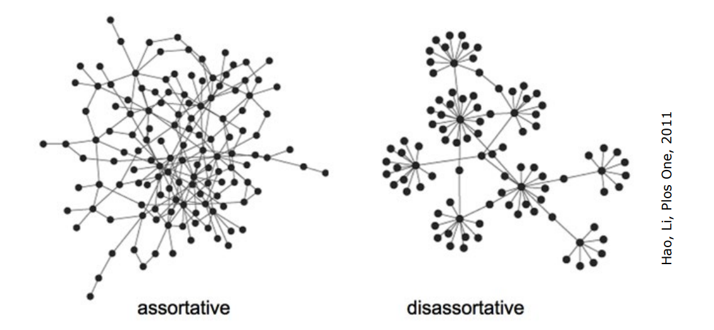

# Networks properties 

 Discussed basic properties like **node distances**, **network diameter**, and **average distance**.
- Introduced **network efficiency** as an alternative measure, particularly useful for unconnected networks.

#### 1. **Distance and Diameter**

   - **Distance**: Length (in number of links) of the shortest path connecting two nodes \(i\) and \(j\), denoted as $d_{ij}$.
   - **Diameter (D)** and **Average Distance (d)**:
     - $D = \max(d_{ij})$
     - $d = \frac{1}{N(N-1)} \sum_{i \neq j} d_{ij}$
   - **Efficiency**: Used even if the network is not connected, $E = \langle \frac{1}{d_{ij}} \rangle$, with $\frac{1}{d_{ij}} = 0$ if path $i \rightarrow j$ does not exist.

**Clustering (or Transitivity) Coefficient** quantifies "local link density" by counting the triangles in the network.

**Local Clustering Coefficient** $c_i$ of node $i$:
$$c_i = \frac{e_i}{\frac{k_i(k_i - 1)}{2}}$$

Where $k_i$ is the degree of $i$ and $e_i$ the number of links directly connecting neighbors of $i$.

$e_i$ are the links of neighbors (not consider the link between the **ego** and the node $i$). This coefficient represent a local property of node $i$. 

| Network | Size | Clustering coefficient | Average path length |
| :---: | :---: | :---: | :---: |
| Internet, domain level [13] | 32711 | 0.24 | 3.56 |
| Internet, router level [13] | 228298 | 0.03 | 9.51 |
| WwW [14] | 153127 | 0.11 | 3.1 |
| E-mail [15] | 56969 | 0.03 | 4.95 |
| Software [16] | 1376 | 0.06 | 6.39 |
| Electronic circuits [17] | 329 | 0.34 | 3.17 |
| Language [18] | 460902 | 0.437 | 2.67 |
| Movie actors [5, 7] | 225226 | 0.79 | 3.65 |
| Math. co-authorship [19] | 70975 | 0.59 | 9.50 |
| Food web [20, 21] | 154 | 0.15 | 3.40 |
| Metabolic system [22] | 778 | - | 3.2 |

Small World property? 

The average distance $d \cong \frac{log N}{log < k >}$ grows "slowly" with $N$ ("small-world" effect) 
Large" networks (=large N) have a relatively small average distance.

   - **Global Clustering Coefficient (C)**: Average of local clustering coefficients, $C = \langle c_i \rangle$.

**Ego** network of node $i$ 

**Degree and Strength of a Node**

   - **Degree $k_i$** in undirected network: Number of links connected to node $i$.
   - **Strength $s_i$** in a weighted network: Total weight of the links connected to node $i$.
   
In a directed network, distinct in-, out-, and total degree/strength.

**Degree Distribution**

   - **Degree Distribution $P(k)$**: Fraction of nodes having exactly degree $k$.
   - **Cumulative Degree Distribution**: Fraction of nodes with degree $\geq k$.
   - **Moments of Degree Distribution**: $\langle k^r \rangle = \sum k^r P(k)$, where $r$ is the order of the moment.

The degree distribution $P(k)$ of a network specifies the fraction of nodes having exactly degree $k$ (=the probability that a randomly selected node has degree $k$ ):

$$
P(k)=\frac{\# \text { nodes with degree } k}{N}, \quad \sum_k P(k)=1
$$

It is often more practical to consider the cumulative degree distribution:

$$
\bar{P}(k)=\frac{\# \text { nodes with degree } \geq k}{N}=\sum_{h=k}^{k_{\max }} P(h), \quad \bar{P}\left(k_{\min }\right)=1
$$

The $r$-moments of the degree distribution $P(k)$ are:

$$
<k^r>=\sum_k k^r P(k) \quad, \quad r=1,2, \ldots
$$

The first moment $(r=1)$ is the average degree $<k>=\sum_k k P(k)=\frac{1}{N} \sum_i k_i=\frac{2 L}{N}$.

   - **Homogeneous Network**: All nodes have the same degree.
   - **Heterogeneous Network (Real-World)**: Broad degree distribution, some nodes are highly connected (hubs), while most have few connections.

The **degree distribution of nearest neighbours** $Q(h)$ specifies the fraction of nodes' neighbours having exactly degree $h$ (=the probability that a randomly selected neighbour of a randomly selected node has degree $h$ ):

It is not $P(k)$ but it is **biased towards highest degrees**:

$$
Q(h)=\frac{\text { n. of links from nodes of degree } h}{\text { n. of links from nodes of any degree }}=\frac{h(P(h) N)}{\sum_k k(P(k) N)}=\frac{h P(h)}{<k>}
$$

Thus the average degree of nearest neighbours $k_{n n}$ is:
$$
k_{n n}=\sum_h h Q(h)=\sum_h \frac{h^2 P(h)}{<k>}=\frac{<k^2>}{<k>}=\frac{<k>^2+\sigma^2}{<k>}=<k>+\frac{\sigma^2}{<k>}
$$
which is larger than $<k>$ provided $\sigma^2 \neq 0$ (non strictly homogeneous network).

If **variance** is not equal to zero, $Q(h)$ is always higher than $P(k)$ . 

The "friendship paradox"  my friends have more friends than I have: applications in finding hub nodes.

" It's not just an impression, it has mathematical foundations: if I navigate randomly along the network is more probable to encounter a node with a lot of links .. will follow people which has more followers than me " <- to fix 

To fix: 
with some simulations  ... 
This has implication with vaccination, if I randomly sample nodes in a population I will probably find nodes with average degree, if I vaccinate only their neighbors with more probability I can effectively decrease the epidemy. The difference is relevant

**Correlated Networks**

There is a correlation between $P(k)$ with $Q(k)$ , there is a correlation between nodes with degree k with neighbors with $Q(k)$ ? 

**Degree Correlation**: Probability that the neighbor of a degree-$k$ node has degree $h$ depends on $k$.

In assortative networks, high-degree nodes connect to high-degree nodes. In disassortative networks, the opposite is true.

List all nodes with degree k
find all neighbors 
make a mean of their degree 

Correlations can be captured by the average nearest neighbors degree function:
$$
k_{n n}(k)=\sum_h h Q(h \mid k)
$$
which in practice is computed by
$$
k_{n n}(k)=\frac{1}{N_k} \sum_{i \mid k_i=k} \frac{1}{k} \sum_j a_{i j} k_j
$$
where $N_k$ is the number of nodes with degree $k\left(\sum_k N_k=N\right)$.

On the right high degree nodes are connected more prevalently with node with low degree
Viceversa on the left high degree nodes are connected with high degree nodes 

social networks are typically assortative 
technological networks are typically disassortative

Note that not always this correlation is noticeable ... maybe there isn't a relevant degree correlation. For example the previous image are completely artificial.  

#### 7. **Complex Networks**
   - Characterized by broad degree distribution, small-world property, and higher clustering coefficient than randomly generated networks.

### Interpretation and Applications
- The clustering coefficient and degree distribution are crucial in understanding network dynamics, such as information flow and disease spread.
- Correlated networks and complex network characteristics provide insights into the formation and behavior of real-world networks, impacting areas like social network analysis and technological infrastructure design.

## Clustering Coefficient

- A significant focus is on the **clustering coefficient**, a measure of local network density around individual nodes.
- The global clustering coefficient is calculated by averaging individual node coefficients, providing insight into the overall network structure.
- The coefficient is used to understand **information flow** and structural density in networks, with high values indicating dense connections in social networks.

## Degree Distribution in Networks

- The lecture covers the importance of **degree distribution**, analyzing the frequency of nodes with specific connection counts.
- Highlights the presence of highly connected nodes (hubs) in social networks and their impact on network dynamics.

## Degree Correlation

- Explores the concept of **degree correlation**, examining the likelihood of similarly connected nodes being connected to each other.
- Differentiates between **assortative** and **disassortative** networks, influencing the understanding of network structures and behaviors.

## Concluding Remarks

- Concludes that complex networks are characterized by their wide degree distribution, small average distances, and high clustering coefficients.
- These features distinguish real-world networks from simpler forms, indicating non-random formation processes.

In network theory, the interpretation of weights assigned to connections between nodes can significantly influence our understanding and analysis of the network. We can consider two primary conventions regarding the interpretation of these weights:

1. **Higher Weight Signifies Stronger Relationship**:
   - Under this convention, a higher weight on a connection implies a stronger, more significant, or more positive relationship between the nodes.
   - This approach is often used in social networks, where the weight might represent the frequency of interactions, the strength of friendship, or the intensity of collaboration.
   - Mathematically, if nodes $i$ and $j$ are connected with a high weight $w_{ij}$, it suggests a strong affinity or close proximity between them.
   - Example: In a social network, a higher weight could indicate frequent communication or strong friendship ties.

2. **Higher Weight as a Penalty (Indicative of Distance)**:
   - In this interpretation, a higher weight signifies a penalty, representing a longer distance or greater difficulty in traversing the link.
   - This approach is common in networks where weights represent costs, such as transportation or logistical networks.
   - Here, a higher weight $w_{ij}$ between nodes $i$ and $j$ could indicate a longer distance to travel or a more significant barrier to communication.
   - Example: In a transportation network, a higher weight might correspond to a longer travel time or greater cost between two locations.

Both interpretations have valid applications depending on the context of the network. The key is to align the weight's meaning with the network's purpose and the nature of the connections it represents. Understanding this distinction is crucial for accurately modeling and analyzing network behavior and dynamics.
