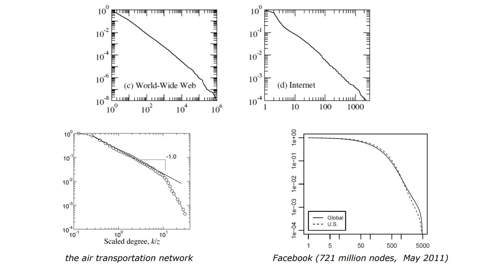
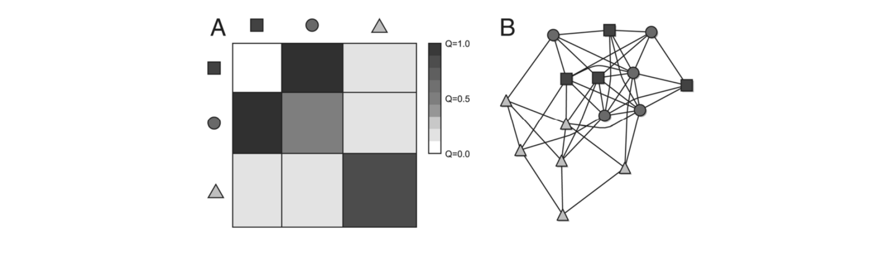
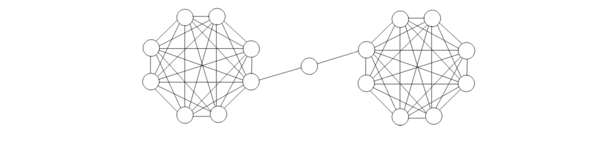

# Network models 

We continue our in-depth exploration of the structural properties of networks, delving into a new chapter titled "Network Models." These models represent algorithms that generate networks with particular properties, aiming to emulate the formation processes of real-world networks. The literature presents a multitude of such models, each offering unique perspectives.

## Random (Erdos-Renyi) networks 

Erdös-Rényi Networks:
- In this model, a network is formed by connecting L randomly extracted pairs of N nodes, resulting in an average degree $\langle k\rangle=2 L / N$. The degree distribution in these networks is Poisson-distributed for large $\mathrm{N}$, with a typical scale of node degree $k_i=\langle k\rangle$.
- An alternative Erdös-Rényi model involves starting from a graph with $\mathrm{N}$ nodes and no links, then connecting each pair of nodes with a given probability $p$. The resulting degree distribution is binomial.
- Key properties include a giant component emerging when $\langle k\rangle>1$, an average distance that grows logarithmically with $\mathrm{N}$ (indicating a small-world effect), and a clustering coefficient that tends to zero as $\mathrm{N}$ increases.

## Scale-free (Barabasi-Albert) networks

Scale-Free (Barabási-Albert) Networks:
- These networks are generated by adding one node at a time, connecting it preferentially to nodes with higher degrees. This "preferential attachment" results in a network with few highly connected nodes ("hubs") and many scarcely connected nodes. "Rich gets richer" 
- The Barabási-Albert algorithm, inspired by the growth of the World Wide Web, starts with an arbitrary number of connected nodes $(\mathrm{mO})$ and grows by adding new nodes, each with a number of links $(\mathrm{m} \leq \mathrm{m} 0$ ) that connect preferentially to existing nodes with high degrees.
- In large networks, the degree distribution follows a power-law function $P(k) \approx k^{-\alpha}$, and the network exhibits a small-world effect with the average distance tending to grow logarithmically. The clustering coefficient in such networks tends to zero.

- Small-world (Watts-Strogatz) networks)

Is it true that in a lot of real network I find a degree distribution which is a power-law function. 

Examples where all have scale-free property but only the first two are power-law (approximal with a line). The third one seems something hybrid where at some point there is a change of pendency of a line. The forth one is something that still is scale-free but there is a more complex structure and there isn't the power-law property.  

Simple, regular networks are a basic form, where each node consistently has the same number of connections. However, real networks often evolve spontaneously, rarely exhibiting such uniform structure. A fundamental model to study is the Erdos-Renyi network, also known as random or casual networks. This model serves as a baseline for comparison, helping to identify significant deviations in specific networks.

In the Erdos-Renyi model, we define the number of nodes and randomly establish links between them. For large $\mathrm{N}$, the degree is Poisson-distributed with $\langle k\rangle=2 L / N$, where $\mathrm{L}$ is the number of links and $\mathrm{N}$ is the number of nodes. The network has a giant component if $\langle k\rangle>1$, and the average distance grows slowly with $\mathrm{N}$, exhibiting a "small-world" effect. As $\mathrm{N}$ grows, the clustering coefficient tends towards zero, indicating large networks have vanishing clustering.

An alternative model involves assigning a random probability to each potential link between nodes. This approach, too, results in networks with specific properties, where the occurrence of links is a stochastic process. The Erdos-Renyi model highlights the concept of a reference network, against which others can be compared.

Another influential model is the Barabasi-Albert algorithm, introduced by Reika Albert and her collaborator in 2000 . This model creates networks by adding nodes one at a time, each with a predefined number of links. The key feature of this model is "preferential attachment," where nodes with more connections are more likely to gain new ones, embodying the "rich get richer" phenomenon. This leads to a power-law distribution in the network's connectivity. The network contains few very connected nodes ("hubs") and many scarcely connected nodes. For large $\mathrm{N}$, the degree distribution follows a power-law function $P(k) \approx k^{-\alpha}$. The network is strongly heterogeneous, and as it grows, its properties, like average distance and clustering coefficient, exhibit specific trends.

The course also explores the concept of scale-free networks, characterized by a power-law degree distribution. These networks are studied for their structural properties and real-world applications, such as understanding the spread of diseases in social networks. Notably, the World Wide Web is an example of a scale-free network, where anyone can contribute to its growth.

Finally, the course delves into the statistical and mathematical foundations underlying these network models, including differential equations and probabilistic distributions. By understanding these models, we can better comprehend the complex structures of real-world networks and their implications.

Barabási-Albert algorithm inspired by the WWW growth
WWW is a perfect example of a "growth free" network where there is an emergent phenomen 
self-organized. 

 
Then for $N \rightarrow \infty$ :
- the average degree tends to $\langle k\rangle=2 m$ and the **degree distribution** to the power-law $P(k) \approx k^{-3}$

How to compute $k^{-3}$ ? the degree distribution (the "continuum approach"):
- After $t$ steps, the network has $m_0+t$ nodes and $\cong m t$ links.
- At each step $t$, the prob. for node $i$ to be selected by one of new links is $k_i / \sum_j k_j$.
- Approximating the degree $k_i$ with a continuous variable, its increase rate is
$$
\frac{d k_i}{d t}=m \frac{k_i}{\sum_j k_j}=\frac{k_i}{2 t}
$$
because $\left(\sum_j k_j\right) / 2=m t$ is the number of links.
- Solving the differential equation for a node inserted at time $t_i$ with $k_i\left(t_i\right)=m$ :
$$
k_i(t)=m\left(\frac{t}{t_i}\right)^{0.5}
$$

It's interesting to note the importance of $t$ here. "Rich get richer" effect ... the older is the node the more is "naturally advantageous" .  

Based on continuum approach (what is continuum approach?) 

- $\left\langle k^2 \right\rangle$ and thus the variance $\sigma^2=\left\langle k^2>-<k\right\rangle^2$ diverge $(P(k)$ has a "heavy tail")
- the average distance tends to $d \approx \log N / \log \log N$ ("small-world" effect)
- the clustering coefficient $C$ vanishes as $C \approx$ $(\log N)^2 / N \rightarrow 0$

Two (of the many) generalizations of the Barabasi-Albert algorithm:

Dorogovtsev-Mendes-Samukhin (DMS) model, to get a power law degree distribution $P(k) \approx k^{-\gamma}$ with arbitrary $\gamma \in(2, \infty)$.

Modifies the preferential attachment probability that a link of the new node $i$ connects to the existing node $j$
$$
\text { from } \frac{k_j}{\sum_h k_h} \quad \text { to } \frac{k_j+k_0}{\sum_h\left(k_h+k_0\right)}
$$

By choosing a value $k_0 \in(-m, \infty)$, it is proved that $\gamma=3+k_0 / m$  <- This variant make possible to modulate the degree distribution using $k_0$. This is useful to modelling real networks. 

Holme-Kim (HK) model, to get a non-vanishing (large) clustering coefficient $C$.

Forces the creation of triangles by alternating (in a probabilistic fashion) preferential attachment steps and triad formation steps.

## Small World problem (Watts-Strogatz) networks 

What is the crucial aspect/fact which makes "small world" property?

In typical real-world networks, the average distance $d=\left\langle d_{i j}\right\rangle$ turns out to be surprisingly small.

Empirically, it is observed that $d$ increases "slowly" with $N$ ("small-world" effect).

Watts and Strogatz (1998) demonstrated that adding a few long-distance connections to a regular network yields a dramatic decrease of $d$.

The ring is pathological 

Start from a regular "ring" graph with $N$ nodes, where each node is connected to the $m$ right neighbors and to the $m$ left-neighbors (=each node has exactly degree $2 m$ ).
The network has large clustering coefficient (typical of "regular" networks)
$$
C=\frac{3 m-3}{4 m-2}
$$
and the average distance is also large (grows linearly with $N$ )
$$
d=\frac{N}{4 m}
$$

"Rewiring": Scan all nodes $i=1,2, \ldots, N$. Consider all the links $i \leftrightarrow j$ connecting $i$ to its right neighbors and, with probability $p$, break the connection to $j$ and redirect it to a randomly selected node.
If $p$ is small, the local properties are not significantly modified:
- the degree distribution remains concentrated around the average degree (unchanged!) $\langle k\rangle=2 m$
- the clustering coefficient $C$ does not vary significantly
But the birth of few, "long distance" connections is sufficient to yield a dramatic decrease of the average distance, which passes from $d \approx N$ to
$$
d \approx \log N
$$

The idea of "6 degree" is very popular and typically indicates that between a person and another person there are exactly 6 people. 

Why Erdos-Rényi ? 

Stochastic block-model 

Syntethic models are a lot and this model is a sort of generalization to build a network based on the concept of "group" or membership. Based on the concept of groups we can define the probability of connecting two nodes (or two groups). 

It is a "block" generalization of Erdös-Rényi networks.

The model is completely defined by:
- the number of nodes $N$ and the number of groups (blocks) $B$
- a partition of the nodes, i.e., the group membership $b_i$ of each node $i$
- the probabilities $p_{r s}=p_{s r}$ that a node in group $r$ is linked to a node in group $s$ (including $r=s$ )

We can then (based on probabilities on connecting nodes between different groups (or the same group) define a matrix adjacency. 

It is a general, versatile model for large-scale networks, suitable to parameter identification via statistical inference techniques. 

Examples: 

- Random 
- Modular 
- Core-periphery: example the idea of public transportation where it's easy to move from periphery to the core but not between periphery to the periphery

## Node centrality 

The centrality of a node is a measure of its importance in the network.

Degree
The importance of a node can trivially be captured by the number $k_i$ of its neighbors (i.e. interactions, communication channels, sources-destinations of information, etc.).
$\square$ The "hubs" are the most central nodes.

In weighted networks, use the strength $s_i$.

Considering "central" a node which has an high number of connections is a simple measure but we can also consider "central" according to other criteria. 

For example the betweenness of node $i$ is the number of shortest paths than pass through $i$ . 
Betweenness can be a valid and very useful property to consider in the computation of centrality in some models/networks. 

### Closeness centrality 

Another option is the Closeness centrality

A node is central if, on average, it is close (=short distance) to all other nodes: it has better access to information, more direct influence on other nodes, etc.

The average distance from $i$ to all the other nodes is:
$$
l_i=\frac{1}{N-1} \sum_j d_{i j}
$$

The closeness centrality is defined as
$$
c_i=\frac{1}{l_i}=\frac{N-1}{\sum_j d_{i j}}
$$

If the network is directed, we must distinguish between in- and out-closeness.
If the network is weighted, several (non trivial) generalized definitions are available.

### Eigenvector centrality 

> " I'm important if I'm friend of important people "

It's just called eigenvector because it's computed using eigenvectors of the adjiancy matrix. 

The centrality $\gamma_i$ is (proportional to) the sum of the centralities of the neighbors (i.e., a node is important if it relates to important nodes).
$$
\gamma_i=\alpha \sum_j a_{i j} \gamma_j
$$

Letting $\gamma=\left[\begin{array}{llll}\gamma_1 & \gamma_2 & \ldots & \gamma_N\end{array}\right]^T$ and $\lambda=1 / \alpha$, we obtain the eigenvector equation
$$
A \gamma=\lambda \gamma
$$

If the network is connected ( $=A$ is irreducible), the centralities $\gamma_i$ are given by the only solution with $\lambda>0, \gamma_i>0$ for all $i$ (Frobenius-Perron theorem).
- applications in social networks (who is the most influential individual?) "sociologi quantitativi"
- applications in web searching (with some modifications: Google "PageRank" which is the most important webpage?)
- another modification is Katz (or alpha-) centrality: $\gamma_i=\alpha \sum_j a_{i j} \gamma_j+\beta$ just a variant to solve some degeneration problem of the eigenvector centrality in not completely connected networks. 

### Authorities and Hubs

In directed networks, we can take into account the different role of in- and outlinks.
"authority" score $x_i$ : a node with large $x_i$ is pointed by highly ranked nodes
"hub" score $y_i:$ a node with large $y_i$ points to highly ranked nodes
$$
x_i=\alpha \sum_j a_{j i} y_j \quad y_i=\beta \sum_j a_{i j} x_j
$$

For example, in the World Trade Network:
- "authorities" (= nodes with large $x_i$ ) are countries with large import flows ("consumers")
- "hubs" (= nodes with large $y_i$ ) are countries with large export flows ("producers")

Duality 

China as an old strong hub and now authority in the World Trade Network. 

## Random walks on networks

A random walk is a path formed by a sequence of random steps.
The term is first attributed to Karl Pearson [Nature, 1905].

Applications in ecology, economics, psychology, computer science, physics, chemistry, biology, etc.
Many variants:

- discrete vs continuous time
- uniform vs non-uniform step
- Markovian vs non-Markovian process
- etc.

Basically unlimited applications in all science fields. 

In a binary (unweighed) network, the random walker in node $i$ chooses an out-link $i \rightarrow j$ with uniform probability:
$$
p_{i j}=\frac{a_{i j}}{k_i^{o u t}}
$$

In a weighted network, the out-link is chosen with probability proportional to its weight:
$$
p_{i j}=\frac{w_{i j}}{\sum_j w_{i j}}=\frac{w_{i j}}{s_i^{\text {out }}}
$$
$P=\left[p_{i j}\right]$ is the $N \times N$ transition matrix.

$\pi_{i, t}=$ state probability $=$ probability of being in node $i$ at time $t\left(\sum_i \pi_{i, t}=1 \forall t\right)$
$\pi_t=\left(\begin{array}{llll}\pi_{1, t} & \pi_{2, t} & \cdots & \pi_{N, t}\end{array}\right)$ evolves according to the Markov chain equation
$$
\pi_{t+1}=\pi_t P \quad, \quad \pi_{i, t+1}=\pi_{1, t} p_{1 i}+\pi_{2, t} p_{2 i}+\cdots+\pi_{N, t} p_{N i}
$$

If the network is strongly connected $\Rightarrow$

$\Rightarrow$ the transition matrix $P=\left[p_{i j}\right]$ is irreducible $\Rightarrow$
$\Rightarrow$ there exists a unique stationary state probability distribution $\pi=\pi P$, which is strictly positive $\left(\pi_i>0\right.$ for all $\left.i\right)$.
$$
\begin{array}{c}
\pi_i=\text { fraction of time spent on node } i \\
=\text { centrality of node } i
\end{array}
$$

Nothing new:

- If undirected networks, $\pi_i$ is the (rescaled) node strength $\pi_i=$ $s_i / \Sigma_j s_j$
- In directed networks, $\pi_i$ turns out to be mostly **correlated** to the **in-strength** $s_i^{\text {in }}$ (example: $W W W$).

Example: the World Trade Network (2008)
The trading system can be modelled as a directed, weighted network: $w_{i j}$ is the export (million US dollars) from country $i$ to country $j$
- The strongly connected component includes $N=181$ countries ( $94 \%$ of the total).
- The network is extremely dense $\left(\frac{L}{N(N-1)}=0.65\right) \ldots$
- ... and very heterogeneous (multi-scale) in node degrees, node strengths, and link weights.

Random world centrality is  defined only if the network is **strongly connected**. 
Most directed networks are rarely connected.

The trick? Teleportation. 

If for example a random walker end into a node without outgoing links the random walker with teleportation can go wherever. 
This complete changes the model. The network is fully connected, there will be always a solution the algorithm to solve centrality in the network. 

PageRank ("Google") centrality

The solution to $\pi=\pi P$ is not unique or non positive, or the Markov chain might be not even well definec

Teleportation: at each time step, the random walker has probability $\gamma>0$ to jump to a randomly selected node.
$$
p_{i j} \rightarrow p_{i j}^{\prime}=(1-\gamma) \frac{w_{i j}}{s_i^{o u t}}+\gamma \frac{1}{N}
$$

The network becomes complete (all-to-all) thus connected $\Rightarrow$ there exists a unique strictly positive solution to $\pi=\pi P^{\prime}$.
$\pi_i=$ PageRank of node $i$
A proper value for $y$ ?
Not too large (the network would be heavily modified) nor too small ( $\pi_i$ too sensitive to $\gamma$ ). The standard (Google) value is $\gamma=0.15$.

The revolution of PageRank is that the rank is derived "naturally" from the self-organize internet structure. I have an high rank only if the other nodes are links pointed to me, there is (theoretically) no other way to have an high rank. This is the "revolution" ... a completely natural emerged rank. 

https://mathscinet.ams.org/mathscinet/freetools/collab-dist?

