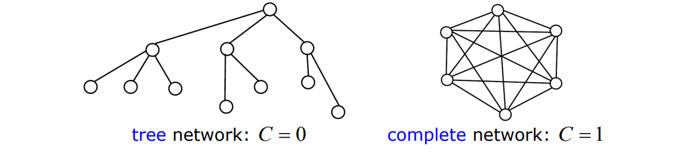

# Networks

A network is represented by a graph with $N$ nodes (or vertices) and $L$ links (or edges).

- **Undirected Networks**: No direction associated with links.
- **Directed Networks**: Links have a specified direction.
- **Weighted Networks**: Links have weights representing the strength or capacity of the connection.

Representation of networks using **adjacency** matrices.

Typically $A$ is a sparse matrix (small density)
$$\rho=\frac{L}{N(N-1)} \text { (dir.) or } \rho=\frac{L}{N(N-1) / 2} \text { (undir.). }$$

Concept of **Graph Degree**: Number of links connected to a node.

A weighted network is described by the $N \times N$ weight matrix $W=\left[w_{i j}\right]$ :
$w_{i j}>0$ if the link $i \rightarrow j$ exists, $w_{i j}=0$ otherwise

The Laplacian matrix is a key mathematical tool used in the analysis of complex networks. It is derived from the adjacency matrix of a graph and provides valuable insights into the structure and properties of the network. Here are some reasons why the Laplacian matrix is significant:

The $N \times N$ Laplacian matrix
$$
L=\operatorname{diag}\left(k_1, k_2, \ldots, k_N\right)-A
$$
is an alternative network representation, where:
$$
l_{i i}=k_i, \quad i=1,2, \ldots, N
$$
$l_{i j}=-1$ if the link $i \leftrightarrow j$ exists, $l_{i j}=0$ otherwise $(i \neq j)$

The Laplacian matrix of an undirected graph is a matrix representation that reflects the structure of the graph. It is defined as L = D - A, where D is the degree matrix (a diagonal matrix where each diagonal element, D_ii, is the degree of node i), and A is the adjacency matrix of the graph (a square matrix where A_ij = 1 if there is an edge between nodes i and j, and A_ij = 0 otherwise). The Laplacian matrix is used in various applications in graph theory, including the analysis of network dynamics and connectivity.

is symmetric and zero-row-sum

## Basic properties 

### Density 

Number of links over the maximum number of theoretically possible numbers of links in the network. 

$$\rho=\frac{L}{N(N-1)}$$

 Discussed basic properties like **node distances**, **network diameter**, and **average distance**.
- Introduced **network efficiency** as an alternative measure, particularly useful for unconnected networks.

### Distance and Diameter

   - **Distance**: Length (in number of links) of the shortest path connecting two nodes \(i\) and \(j\), denoted as $d_{ij}$.
   - **Diameter (D)** and **Average Distance (d)**:
     - $D = \max(d_{ij})$
     - $d = \frac{1}{N(N-1)} \sum_{i \neq j} d_{ij}$
   - **Efficiency**: Used even if the network is not connected, $E = \langle \frac{1}{d_{ij}} \rangle$, with $\frac{1}{d_{ij}} = 0$ if path $i \rightarrow j$ does not exist.

From the distance matrix, we can define the following metrics:

- Average Distance (d): This is calculated as the average length of the shortest paths between all pairs of nodes. The formula for the average distance is given by $\bar{d}=\frac{\sum_{i\neq j}d_{ij}}{N(N-1)}$, where $d_{ij}$ is the distance between nodes $i$ and $j$, and $N$ is the total number of nodes in the network.

- Diameter (D): The diameter of a network is the length of the longest shortest path between any two nodes in the network. Mathematically, it's defined as $D=\max_{i,j}d_{ij}$, where $d_{ij}$ is the shortest path length between nodes $i$ and $j$.

- Betweenness Centrality: it is calculated as the number of all shortest paths in the network that pass through the given node.

- Efficiency: The efficiency of a network, applicable even in nonconnected networks, is defined as $E=\langle\frac1{d_{ij}}\rangle$,where $d_{ij}$ is the distance between nodes $i$ and $j$, and the average is taken over.  
$$E(G)=\frac1{N(N-1)}\sum_{i\neq j\in V}\frac1{d_{ij}}$$

 

### Clustering Coefficient

**Clustering (or Transitivity) Coefficient** quantifies "local link density" by counting the triangles in the network.

- A significant focus is on the **clustering coefficient**, a measure of local network density around individual nodes.
- The global clustering coefficient is calculated by averaging individual node coefficients, providing insight into the overall network structure.
- The coefficient is used to understand **information flow** and structural density in networks, with high values indicating dense connections in social networks.

**Local Clustering Coefficient** $c_i$ of node $i$:
$$c_i = \frac{e_i}{\frac{k_i(k_i - 1)}{2}}$$

Where $k_i$ is the degree of $i$ and $e_i$ the number of links directly connecting neighbors of $i$.

$e_i$ are the links of neighbors (not consider the link between the **ego** and the node $i$). This coefficient represent a local property of node $i$. 

Clustering coefficient of a tree is zero (think of the triangles).  

| Network | Size | Clustering coefficient | Average path length |
| :---: | :---: | :---: | :---: |
| Internet, domain level [13] | 32711 | 0.24 | 3.56 |
| Internet, router level [13] | 228298 | 0.03 | 9.51 |
| WwW [14] | 153127 | 0.11 | 3.1 |
| E-mail [15] | 56969 | 0.03 | 4.95 |
| Software [16] | 1376 | 0.06 | 6.39 |
| Electronic circuits [17] | 329 | 0.34 | 3.17 |
| Language [18] | 460902 | 0.437 | 2.67 |
| Movie actors [5, 7] | 225226 | 0.79 | 3.65 |
| Math. co-authorship [19] | 70975 | 0.59 | 9.50 |
| Food web [20, 21] | 154 | 0.15 | 3.40 |
| Metabolic system [22] | 778 | - | 3.2 |

Small World property? 

The average distance $d \cong \frac{log N}{log < k >}$ grows "slowly" with $N$ ("small-world" effect) 
Large" networks (=large N) have a relatively small average distance.

   - **Global Clustering Coefficient (C)**: Average of local clustering coefficients, $C = \langle c_i \rangle$.

**Ego** network of node $i$ 

In network theory, the interpretation of weights assigned to connections between nodes can significantly influence our understanding and analysis of the network. We can consider two primary conventions regarding the interpretation of these weights:

1. **Higher Weight Signifies Stronger Relationship**:
   - Under this convention, a higher weight on a connection implies a stronger, more significant, or more positive relationship between the nodes.
   - This approach is often used in social networks, where the weight might represent the frequency of interactions, the strength of friendship, or the intensity of collaboration.
   - Mathematically, if nodes $i$ and $j$ are connected with a high weight $w_{ij}$, it suggests a strong affinity or close proximity between them.
   - Example: In a social network, a higher weight could indicate frequent communication or strong friendship ties.

2. **Higher Weight as a Penalty (Indicative of Distance)**:
   - In this interpretation, a higher weight signifies a penalty, representing a longer distance or greater difficulty in traversing the link.
   - This approach is common in networks where weights represent costs, such as transportation or logistical networks.
   - Here, a higher weight $w_{ij}$ between nodes $i$ and $j$ could indicate a longer distance to travel or a more significant barrier to communication.
   - Example: In a transportation network, a higher weight might correspond to a longer travel time or greater cost between two locations.

Both interpretations have valid applications depending on the context of the network. The key is to align the weight's meaning with the network's purpose and the nature of the connections it represents. Understanding this distinction is crucial for accurately modeling and analyzing network behavior and dynamics.

## Degree Distribution in Networks

- The lecture covers the importance of **degree distribution**, analyzing the frequency of nodes with specific connection counts.
- Highlights the presence of highly connected nodes (hubs) in social networks and their impact on network dynamics.

**Degree and Strength of a Node**

   - **Degree $k_i$** in undirected network: Number of links connected to node $i$.
   - **Strength $s_i$** in a weighted network: Total weight of the links connected to node $i$.
   
In a directed network, distinct in-, out-, and total degree/strength.

**Degree Distribution**

   - **Degree Distribution $P(k)$**: Fraction of nodes having exactly degree $k$.
   - **Cumulative Degree Distribution**: Fraction of nodes with degree $\geq k$.
   - **Moments of Degree Distribution**: $\langle k^r \rangle = \sum k^r P(k)$, where $r$ is the order of the moment.

The degree distribution $P(k)$ of a network specifies the fraction of nodes having exactly degree $k$ (=the probability that a randomly selected node has degree $k$ ):

$$
P(k)=\frac{\# \text { nodes with degree } k}{N}, \quad \sum_k P(k)=1
$$

It is often more practical to consider the cumulative degree distribution:

$$
\bar{P}(k)=\frac{\# \text { nodes with degree } \geq k}{N}=\sum_{h=k}^{k_{\max }} P(h), \quad \bar{P}\left(k_{\min }\right)=1
$$

The $r$-moments of the degree distribution $P(k)$ are:

$$
<k^r>=\sum_k k^r P(k) \quad, \quad r=1,2, \ldots
$$

The first moment $(r=1)$ is the average degree $<k>=\sum_k k P(k)=\frac{1}{N} \sum_i k_i=\frac{2 L}{N}$.

   - **Homogeneous Network**: All nodes have the same degree.
   - **Heterogeneous Network (Real-World)**: Broad degree distribution, some nodes are highly connected (hubs), while most have few connections.

The **degree distribution of nearest neighbours** $Q(h)$ specifies the fraction of nodes' neighbours having exactly degree $h$ (=the probability that a randomly selected neighbour of a randomly selected node has degree $h$ ):

It is not $P(k)$ but it is **biased towards highest degrees**:

$$
Q(h)=\frac{\text { n. of links from nodes of degree } h}{\text { n. of links from nodes of any degree }}=\frac{h(P(h) N)}{\sum_k k(P(k) N)}=\frac{h P(h)}{<k>}
$$

Thus the average degree of nearest neighbours $k_{n n}$ is:
$$
k_{n n}=\sum_h h Q(h)=\sum_h \frac{h^2 P(h)}{<k>}=\frac{<k^2>}{<k>}=\frac{<k>^2+\sigma^2}{<k>}=<k>+\frac{\sigma^2}{<k>}
$$
which is larger than $<k>$ provided $\sigma^2 \neq 0$ (non strictly homogeneous network).

If **variance** is not equal to zero, $Q(h)$ is always higher than $P(k)$ . 

The "friendship paradox"  my friends have more friends than I have: applications in finding hub nodes.

" It's not just an impression, it has mathematical foundations: if I navigate randomly along the network is more probable to encounter a node with a lot of links .. will follow people which has more followers than me " <- to fix 

To fix: 
with some simulations  ... 
This has implication with vaccination, if I randomly sample nodes in a population I will probably find nodes with average degree, if I vaccinate only their neighbors with more probability I can effectively decrease the epidemy. The difference is relevant

**Correlated Networks**

There is a correlation between $P(k)$ with $Q(k)$ , there is a correlation between nodes with degree k with neighbours with $Q(k)$ ? 

**Degree Correlation**: Probability that the neighbour of a degree-$k$ node has degree $h$ depends on $k$.

In assortative networks, high-degree nodes connect to high-degree nodes. In disassortative networks, the opposite is true.

In a degree-correlated network, the probability $P(h|k)$ that the neighbour of a node with degree $k$ has degree $h$ depends on $k$. Correlations in such a network can be captured by the average nearest neighbour degree function:
$$k_{nn}(k) = \sum_h h P(h|k)$$
Practically, this function is computed as:
$$k_{nn}(k) = \frac{1}{N(k)} \sum_{i|k_i=k} \frac{1}{k} \sum_j a_{ij} k_j$$
where $N(k)$ is the number of nodes with degree $k$.

In an assortative network, high-degree nodes tend to connect to other high-degree nodes. Conversely, in a disassortative network, high-degree nodes tend to connect to low-degree nodes.

The $k_{nn}(k)$ formula is used to calculate the average degree of the neighbors of nodes with a given degree $k$ in a network. Here's a breakdown to help interpret this formula:

1. **Average Degree of Neighbors ($k_{nn}(k)$)**: 
   - $k_{nn}(k)$ represents the average degree of the neighboring nodes for all nodes with degree $k$.
   - It's a function of $k$, meaning that for each degree value $k$, you can calculate a different $k_{nn}(k)$.

2. **Components of the Formula**:
   - $\sum_{i|k_i=k}$: This sum is over all nodes $i$ that have degree $k$. 
   - $\frac{1}{k} \sum_j a_{ij} k_j$: For each node $i$, you sum over all its neighbors $j$. The term $a_{ij}$ is an element of the adjacency matrix, indicating whether a link exists between nodes $i$ and $j$. If a link exists, you take the degree of the neighbor $k_j$ into this sum.
   - $\frac{1}{N(k)}$: After summing over all nodes with degree $k$, the sum is averaged by dividing by $N(k)$, the total number of nodes with degree $k$.

3. **Interpretation**:
   - If $k_{nn}(k)$ increases with $k$, it suggests an assortative network where high-degree nodes tend to connect with other high-degree nodes.
   - If $k_{nn}(k)$ decreases with $k$, it indicates a disassortative network where high-degree nodes tend to connect with low-degree nodes.
   - A constant $k_{nn}(k)$ across different values of $k$ suggests no specific preference or correlation in the degrees of connected nodes.

In summary, $k_{nn}(k)$ provides insight into the degree correlation patterns within a network, revealing how nodes of a certain degree tend to connect with other nodes of specific degrees.

Degree Correlation

- Explores the concept of **degree correlation**, examining the likelihood of similarly connected nodes being connected to each other.
- Differentiates between **assortative** and **disassortative** networks, influencing the understanding of network structures and behaviors.

- Concludes that complex networks are characterized by their wide degree distribution, small average distances, and high clustering coefficients.
- These features distinguish real-world networks from simpler forms, indicating non-random formation processes.

List all nodes with degree k
find all neighbors 
make a mean of their degree 

Correlations can be captured by the average nearest neighbors degree function:
$$
k_{n n}(k)=\sum_h h Q(h \mid k)
$$
which in practice is computed by
$$
k_{n n}(k)=\frac{1}{N_k} \sum_{i \mid k_i=k} \frac{1}{k} \sum_j a_{i j} k_j
$$
where $N_k$ is the number of nodes with degree $k\left(\sum_k N_k=N\right)$.

On the right high degree nodes are connected more prevalently with node with low degree
Viceversa on the left high degree nodes are connected with high degree nodes 

social networks are typically assortative 
technological networks are typically disassortative

Note that not always this correlation is noticeable ... maybe there isn't a relevant degree correlation. For example the previous image are completely artificial.  

### Strongly connected component

It is common to classify components based on their specific properties or the extent of their connectivity. We often refer to highly interconnected sub-sections of a graph as "Strongly Connected Components" or "Giant Out Components" indicating intensive links and relations among its nodes. At the same time, certain components might demonstrate no connectivity or weak connections, forming what we describe as "Disconnected Components". 

Algorithm:

1) For each node of the directed graph check if it's in "communication" with each other node. Where communication means that $x$ must have a path to $y$ but also $y$ must have one to $x$ (the graph is **directed**)

After finding the SCC we can also identify:

- **in**: set of nodes with links that are pointing to the SCC 
- **out**: set of nodes with links that are reachable from the SCC 
- **tubes**: links that are connecting nodes in the in set with nodes of out set

## Random walks on networks

A random walk is a path formed by a sequence of random steps.
The term is first attributed to Karl Pearson [Nature, 1905].

Applications in ecology, economics, psychology, computer science, physics, chemistry, biology, etc.
Many variants:

- discrete vs continuous time
- uniform vs non-uniform step
- Markovian vs non-Markovian process
- etc.

Basically unlimited applications in all science fields. 

In a binary (unweighed) network, the random walker in node $i$ chooses an out-link $i \rightarrow j$ with uniform probability:
$$
p_{i j}=\frac{a_{i j}}{k_i^{o u t}}
$$

In a weighted network, the out-link is chosen with probability proportional to its weight:
$$
p_{i j}=\frac{w_{i j}}{\sum_j w_{i j}}=\frac{w_{i j}}{s_i^{\text {out }}}
$$
$P=\left[p_{i j}\right]$ is the $N \times N$ transition matrix.

$\pi_{i, t}=$ state probability $=$ probability of being in node $i$ at time $t\left(\sum_i \pi_{i, t}=1 \forall t\right)$
$\pi_t=\left(\begin{array}{llll}\pi_{1, t} & \pi_{2, t} & \cdots & \pi_{N, t}\end{array}\right)$ evolves according to the Markov chain equation
$$
\pi_{t+1}=\pi_t P \quad, \quad \pi_{i, t+1}=\pi_{1, t} p_{1 i}+\pi_{2, t} p_{2 i}+\cdots+\pi_{N, t} p_{N i}
$$

If the network is strongly connected $\Rightarrow$

$\Rightarrow$ the transition matrix $P=\left[p_{i j}\right]$ is irreducible $\Rightarrow$
$\Rightarrow$ there exists a unique stationary state probability distribution $\pi=\pi P$, which is strictly positive $\left(\pi_i>0\right.$ for all $\left.i\right)$.
$$
\begin{array}{c}
\pi_i=\text { fraction of time spent on node } i \\
=\text { centrality of node } i
\end{array}
$$

Nothing new:

- If undirected networks, $\pi_i$ is the (rescaled) node strength $\pi_i=$ $s_i / \Sigma_j s_j$
- In directed networks, $\pi_i$ turns out to be mostly **correlated** to the **in-strength** $s_i^{\text {in }}$ (example: $W W W$).

Example: the World Trade Network (2008)
The trading system can be modelled as a directed, weighted network: $w_{i j}$ is the export (million US dollars) from country $i$ to country $j$
- The strongly connected component includes $N=181$ countries ( $94 \%$ of the total).
- The network is extremely dense $\left(\frac{L}{N(N-1)}=0.65\right) \ldots$
- ... and very heterogeneous (multi-scale) in node degrees, node strengths, and link weights.

Random world centrality is  defined only if the network is **strongly connected**. 
Most directed networks are rarely connected.

The trick? Teleportation. 

If for example a random walker end into a node without outgoing links the random walker with teleportation can go wherever. 
This complete changes the model. The network is fully connected, there will be always a solution the algorithm to solve centrality in the network. 

PageRank ("Google") centrality

The solution to $\pi=\pi P$ is not unique or non positive, or the Markov chain might be not even well definec

Teleportation: at each time step, the random walker has probability $\gamma>0$ to jump to a randomly selected node.
$$
p_{i j} \rightarrow p_{i j}^{\prime}=(1-\gamma) \frac{w_{i j}}{s_i^{o u t}}+\gamma \frac{1}{N}
$$

The network becomes complete (all-to-all) thus connected $\Rightarrow$ there exists a unique strictly positive solution to $\pi=\pi P^{\prime}$.
$\pi_i=$ PageRank of node $i$
A proper value for $y$ ?
Not too large (the network would be heavily modified) nor too small ( $\pi_i$ too sensitive to $\gamma$ ). The standard (Google) value is $\gamma=0.15$.

The revolution of PageRank is that the rank is derived "naturally" from the self-organize internet structure. I have an high rank only if the other nodes are links pointed to me, there is (theoretically) no other way to have an high rank. This is the "revolution" ... a completely natural emerged rank. 

### Transition Matrix of a Random Walker

This transition matrix represents the probabilities of a random walker moving from one node i to any of the j nodes. The probabilities are not symmetric because each row is normalized with k_i.

The transition probability from node i to node j is given by:

$$p_{ij} = \frac{a_{ij}}{k_i^{at}}$$

https://mathscinet.ams.org/mathscinet/freetools/collab-dist

In the case of an undirected network, the random walk centrality corresponds to the strength of each node. It can be calculated using the formula:

$$i = \frac{k_i}{\sum_{j}^{N}k_j}$$

## Node centrality 

- Closeness Centrality: The closeness centrality of a node is
 defined as the inverse of the average distance from that node
 to all other nodes in the network. The formula is $C_i=\frac{N-1}{\sum_id_{ij}}$ where $d_{ij}$ is the distance from node $i$ to node $j$, and $N$ is the number of nodes.
(centrality is higher if average distance to other notes is lower )  

The centrality of a node is a measure of its importance in the network.

Degree
The importance of a node can trivially be captured by the number $k_i$ of its neighbors (i.e. interactions, communication channels, sources-destinations of information, etc.).
$\square$ The "hubs" are the most central nodes.

In weighted networks, use the strength $s_i$.

Considering "central" a node which has an high number of connections is a simple measure but we can also consider "central" according to other criteria. 

For example the betweenness of node $i$ is the number of shortest paths than pass through $i$ . 
Betweenness can be a valid and very useful property to consider in the computation of centrality in some models/networks. 

### Closeness centrality 

Another option is the Closeness centrality

A node is central if, on average, it is close (=short distance) to all other nodes: it has better access to information, more direct influence on other nodes, etc.

The average distance from $i$ to all the other nodes is:
$$
l_i=\frac{1}{N-1} \sum_j d_{i j}
$$

The closeness centrality is defined as
$$
c_i=\frac{1}{l_i}=\frac{N-1}{\sum_j d_{i j}}
$$

If the network is directed, we must distinguish between in- and out-closeness.
If the network is weighted, several (non trivial) generalized definitions are available.

### Eigenvector centrality 

> " I'm important if I'm friend of important people "

It's just called eigenvector because it's computed using eigenvectors of the adjacency matrix. 

The centrality $\gamma_i$ is (proportional to) the sum of the centralities of the neighbors (i.e., a node is important if it relates to important nodes).

$$
\gamma_i=\alpha \sum_j a_{i j} \gamma_j
$$

Letting $\gamma=\left[\begin{array}{llll}\gamma_1 & \gamma_2 & \ldots & \gamma_N\end{array}\right]^T$ and $\lambda=1 / \alpha$, we obtain the eigenvector equation

$$
A \gamma=\lambda \gamma
$$

If the network is connected ( $=A$ is irreducible), the centralities $\gamma_i$ are given by the only solution with $\lambda>0, \gamma_i>0$ for all $i$ (Frobenius-Perron theorem).
- applications in social networks (who is the most influential individual?) "sociologi quantitativi"
- applications in web searching (with some modifications: Google "PageRank" which is the most important webpage?)
- another modification is Katz (or alpha-) centrality: $\gamma_i=\alpha \sum_j a_{i j} \gamma_j+\beta$ just a variant to solve some degeneration problem of the eigenvector centrality in not completely connected networks. 

Eigenvector centrality is a measure of the influence of a node in a network. It assigns relative scores to all nodes in the network based on the principle that connections to high-scoring nodes contribute more to the score of the node in question than equal connections to low-scoring nodes. The formula for eigenvector centrality (\(x_i\)) for a node \(i\) in a network can be described as follows:

$$ x_i = \frac{1}{\lambda} \sum_{j=1}^{n} a_{ij} x_j$$

Here, \(x_i\) is the eigenvector centrality of node \(i\), \(a_{ij}\) is an element of the adjacency matrix \(A\) of the network (where \(a_{ij} = 1\) if nodes \(i\) and \(j\) are connected and 0 otherwise), \(n\) is the number of nodes in the network, and \(\lambda\) is a constant (specifically, the largest eigenvalue of the adjacency matrix \(A\)). 

In matrix form, this can be written as:

\[ Ax = \lambda x \]

Where \(x\) is the eigenvector of \(A\) corresponding to the eigenvalue \(\lambda\). The centrality values are given by the entries of the eigenvector associated with the largest eigenvalue. This largest eigenvalue ensures that the centrality scores are positive. Eigenvector centrality is particularly useful in understanding the influence of nodes in a network where connections to highly connected nodes are more influential than connections to sparsely connected nodes.

### Authorities and Hubs

In directed networks, we can take into account the different role of in- and outlinks.
"authority" score $x_i$ : a node with large $x_i$ is pointed by highly ranked nodes
"hub" score $y_i:$ a node with large $y_i$ points to highly ranked nodes

$$
x_i=\alpha \sum_j a_{j i} y_j \quad y_i=\beta \sum_j a_{i j} x_j
$$

For example, in the World Trade Network:
- "authorities" (= nodes with large $x_i$ ) are countries with large import flows ("consumers")
- "hubs" (= nodes with large $y_i$ ) are countries with large export flows ("producers")

Duality 

China as an old strong hub and now authority in the World Trade Network. 

## Bipartite network 

A bipartite network is described by the $p \times q$ (rectangular) incidence matrix, typically denoted by $B$. 

We can project the bipartite network onto $S$  (on of the two sets) in a projected network where the weight of the link between nodes $i$ and $j$ is calculated as the number of neighbours that $i$ and $j$ have in common in set $S$ in original network. 

To obtain the weight matrix $W$ of the projected network, we can follow these steps:

1. Compute $M = B^T B$, where $B^T$ denotes the transpose of matrix $B$. This multiplication will give us an intermediate matrix $M$.
2. Set the diagonal entries of $M$ to zero 

This matrix $M$ will correspond to the weight matrix $W$ of the projected network.