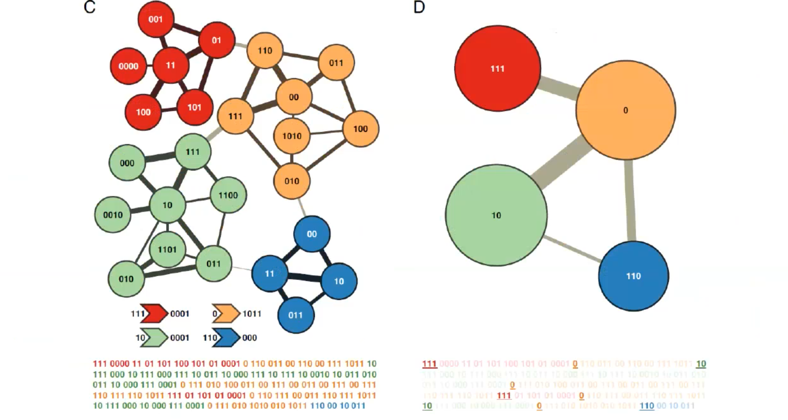
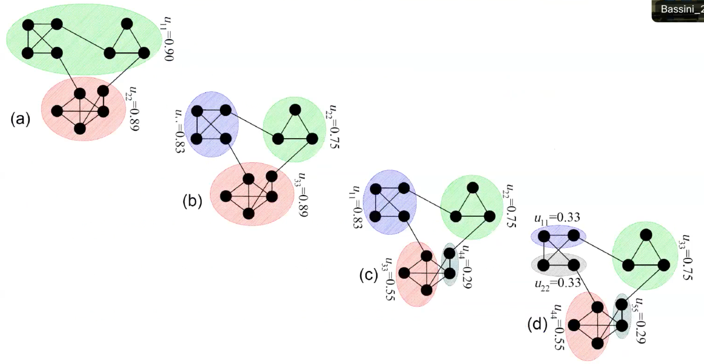
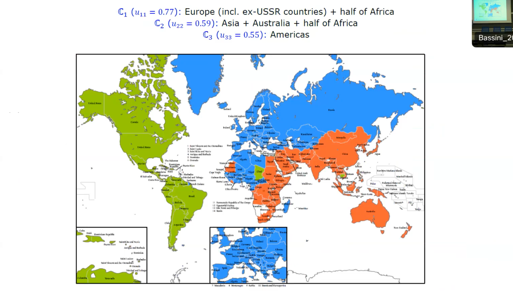
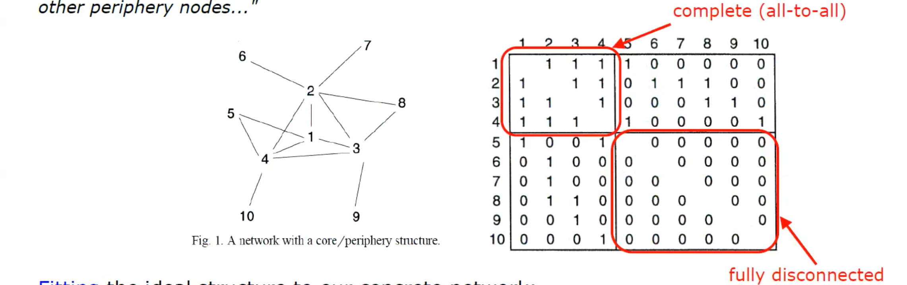
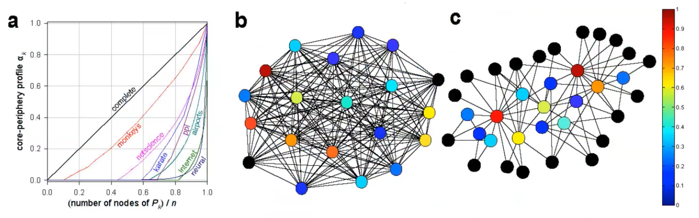

# Mesoscale Network Analysis 

Meso means that we are analyzing properties that are not in micro or macro scale but something in the middle. 
There are structure in the middle zone?

Mesoscale network analysis encompasses both community detection and core-periphery analysis. Here are the key points for each:

## Community analysis

Community analysis, also known as **graph clustering**, involves identifying groups of nodes within a network that have strong connections within the group but weak connections to nodes outside of the group. 

Fun fact: **Echo chambers** refer to situations where people are exposed only to opinions and information (through media, like they are trapped in a community) that align with their own beliefs and perspectives, thus reinforcing their existing views.

### Modularity optimization

**Modularity** is a measure of the degree to which the links within a community are denser than what would be expected by chance. It quantifies the strength of connections within a community, surpassing random link placement based on node degree alone.

$$Q=(\text{fraction of links internal to communities}) -(\text{expected fraction of such links})$$

$$Q=\frac{1}{2L}\sum_{C_h}\sum_{i,j\in C_h}\left[a_{ij}-\frac{k_ik_j}{2L}\right]$$

Finding an exact solution for optimizing modularity is very difficult to achieve in practice. However, there are several suboptimal algorithms that can be used instead. The most commonly used and efficient algorithm is the Louvain method. This method involves moving nodes to neighboring communities in order to increase modularity. After this step, a meta-network of these communities is built.

Modularity in network theory refers to the degree to which a network can be divided into distinct communities or modules. The concept is defined and interpreted as follows:

**Interpretation:**
- The modularity \( Q \) measures the fraction of links within communities minus the expected fraction of such links in a null model (a random network with the same degree sequence). 
- A high value of \( Q \) (close to 1) indicates strong community structure, meaning that there are dense connections within communities and sparse connections between them.
- The goal of modularity optimization is to find a partition of the network that maximizes the value of \( Q \), revealing the underlying community structure.

Modularity is a crucial concept in understanding the structure and function of complex networks, as it helps identify subnetworks or groups within a larger network that are more densely interconnected compared to the rest of the network.

### Communities by random walkers 

The idea: random walkers tend to remain within a community due to denser internal connections. Communities should have large persistence probabilities, indicating longer times spent by random walkers within them​​.

**Infomap**, based on information theoretic coding of random paths, is a notable implementation​​.

#### Infomap 

The Infomap algorithm is a network analysis method used for detecting communities in networks. It leverages the concept of information flow on the network to reveal community structure. Here's an explanation of how it works:

1. **Random Walks as a Proxy for Information Flow**: Infomap uses random walks to mimic the flow of information in a network. The basic idea is that a random walker (an agent moving from node to node) tends to get trapped for longer periods in communities.
2. **Minimizing the Description Length of Random Walks**: The algorithm aims to find a community division that minimizes the description length of these random walks. Description length here refers to the amount of information required to describe the path of a random walker. It's a measure derived from **information theory**.
3. **Two-Level Description**: Infomap uses a two-level description of the random walk:
    - At the first level, each community is assigned a unique code.
    - At the second level, individual nodes within a community are given unique codes.
4. **Encoding the Random Walks**: During a random walk, when the walker stays within the same community, only the second-level code (node code) is used. When the walker moves to a different community, both the first-level (community code) and the second-level codes are used. This dual coding scheme tends to be more efficient when the walker spends long periods within the same community, highlighting the community structure.
5. **Optimization Process**: Infomap **iteratively** adjusts the community assignments to minimize the overall description length of the random walks. The more efficient the description (i.e., the shorter the description length), the better the community structure the algorithm has uncovered.
6. **Result**: The output of the algorithm is a partition of the network into communities where the information flow (as approximated by random walks) is efficiently described, indicating strong internal community structure and weaker between-community interactions.
    
Infomap is particularly effective for networks where the flow of information is a relevant characteristic, and it's widely used due to its efficiency and the quality of the communities it detects.

### Lumped Markov Chain 

The concept of "lumping" in Markov chains refers to simplifying a chain by aggregating certain states into a single state under specific conditions. 

The dynamics of the random walker on an aggregate level, or "meta-network" at stationarity ($\pi_0=\pi$), are described by the lumped Markov matrix $U$.
Given this:

- The Partition Matrix $H$ is used to determine which original state belongs to which aggregated state. It helps map each node to its respective community.
- The Original Transition Matrix $P$ shows the probabilities of transitioning from one state to another in a single time step in the original Markov chain.
- The Stationary Distribution $\pi$ represents the long-term probabilities of being in each original state, indicating the steady-state probabilities.

The lumped Markov matrix is mathematically defined as:

$$
U = [\operatorname{diag}(\pi H)]^{-1} H^{\prime} \operatorname{diag}(\pi) P H
$$

Inside $U$, the $u_{c d}$ is the probability that the random walker is in any of the nodes of $\mathbb{C}_d$ at time $t+1$, given it was in any of the nodes of $\mathbb{C}_c$ at time $t$. 

The diagonal terms $u_{c c}$ of the lumped Markov matrix $U$ are known as **persistence probabilities**. 
They represent the fraction of time a random walker spends within the links/nodes of a community $\mathbb{C}_c$. 
For undirected networks, $u_{c c}$ measures the fraction of total internal strength to total strength within a community:
$$
u_{c c}=\frac{\sum_{i \in \mathbb{C}_c} s_i^{\text{int}}}{\sum_{i \in \mathbb{C}_c} s_i}
$$

or for undirected and and unweighted:

$$
u_{cc}=\frac{\text{total internal degree}}{\text{total degree}}
$$

A high $u_{cc}$ value, approaching 1, indicates that the community is more of a "trap" for the random walker, consistently representing a significant community $\mathbb{C}$.

The effectiveness of this approach relies on the assumption that the random walker is in a network with a **stationary distribution**. Stationarity implies that the walker's long-term behavior is predictable and stable.

#### $\alpha$-Communities and $\alpha$-Partitions

The concepts of $\alpha$-communities and $\alpha$-partitions provide a framework for analyzing communities in networks based on a set quality level, denoted as $0<\alpha<1$:

- A set $\mathbb{C}_c$ is considered an $\alpha$-community if the persistence probability $u_{c c} \geq \alpha$.
- A partition $\mathbb{P}_q=\left\{\mathbb{C}_1, \mathbb{C}_2, \ldots, \mathbb{C}_q\right\}$ is an $\alpha$-partition if all its constituent sets $\mathbb{C}_1, \mathbb{C}_2, \ldots, \mathbb{C}_q$ are $\alpha$-communities, i.e., $\min _c u_{c c} \geq \alpha$.

The general algorithm is:

1. Set the quality level $\alpha$.
2. Generate a set of "good" candidate partitions with varying numbers $q$ of clusters.
3. Select the $\alpha$-partition that has the largest $q$, indicating the finest decomposition that meets the desired quality level.

Example: the European Union emerges as a strong $\alpha$-community, particularly in terms of internal commerce. The geopolitical influence of China in Africa is also evident, demonstrating the utility of community analysis in complex global economic dynamics.

## Core-periphery analysis 

The **Core-Periphery Paradigm** conceptualizes networks as a dense core with a sparsely connected periphery.

## Block-Modelling

Block-modelling is a type of structure where there are central nodes that are connected to a few peripheral nodes, but the peripheral nodes are not connected to each other.

But this is a "too crude separation".

## K-shell Decomposition

k-Core decomposition is a technique used to organize a network into layers or shells based on node connectivity.

- **k-Core**: The k-core of a network is defined as the maximal subgraph $S$ where each node has an internal degree $deg_s \geq k$. This means each node in the k-core has at least $k$ connections within the subgraph.
- **k-Shell**: The k-shell refers to the set of nodes that belong to the $k$-core but not to the $(k+1)$-core. This distinction allows the network to be organized into "concentric" layers, with each layer representing a different level of connectivity.

The union of all $k$-shells with $k' \geq k$ forms the k-core of the network. This hierarchical decomposition helps in identifying and analysing the structure and influence of nodes within the network.

## Core-Periphery Profile in Network Analysis

The Core-Periphery Profile is a heuristic procedure used to order nodes in a network from the periphery to the core. This ordering is based on the nodes' strength and their **persistence probabilities**.

The process of ordering nodes from the most peripheral to the most central involves:

1. Starting with the node $i$ having the minimal strength.
2. Generating a sequence of sets $\{i\}=S_1 \subset S_2 \subset \cdots \subset S_N = \{1,2, \ldots, N\}$, by adding, at each step, the node with the minimal persistence probability $\alpha_1, \alpha_2, \ldots, \alpha_N$.

The sequence $0 = \alpha_1 \leq \alpha_2 \leq \cdots \leq \alpha_N = 1$ constitutes the Core-Periphery profile, where $\alpha_k$ denotes the coreness of the node added at step $k$. 

The Core-Periphery score, $C$, is the normalized area (within the range $[0,1]$) between this profile and that of a complete network. The shape and growth of the Core-Periphery profile curve provide insights into the amount of nodes that are genuinely peripheral within the network.

