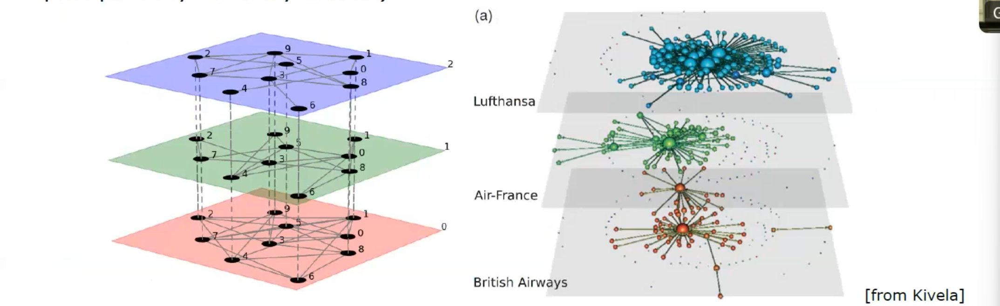

# Link Prediction 

Networks are used to model interactions observed in field/laboratory experiments, or obtained through data processing, etc.

Many existing interactions might be overlooked (also, a few observed interactions might be artificial).

Main assumption: the observed network $A^O$ is a "noisy" observation of a true network $A^{\text {true }}$.

Problem: reconstruct $A^{\text {true }}$ given $A^O$.

Applications:
- find missing links (perhaps suggesting ad-hoc experiments)
- delete spurious links
- in time-varying networks, predict future links (e.g., who will be your future friends?)

How to quantify the structural (topological) similarity of nodes $(i, j)$ ?\

- Number of common neighbours: $s_{i j}=\left|B_i \cap B_j\right|=\left(A^2\right)_{i j}=\underline{n \text {. of length-2 paths }}$
- ... many variations (normalizations e.g. by functions of the degrees $k_i, k_j$ )
- generalization: consider paths $(i, j)$ longer than 2 (Katz index)
$$
s_{i j}=\beta A_{i j}+\beta^2\left(A^2\right)_{i j}+\beta^3\left(A^3\right)_{i j}+\cdots=\left[(I-\beta A)^{-1}-I\right], 0<\beta<1 / \lambda_{\max }(A)
$$
- ... Katz index truncated at some power
- Preferential attachment index: $s_{i j}=k_i k_j$
- Resource allocation index: $s_{i j}=\sum_{h \in\left(B_i \cap B_j\right)} 1 / k_h$
- ...many others

## Recommender systems

$U=\left\{u_1, u_2, \ldots, u_m\right\}:$ set of users
$O=\left\{o_1, o_2, \ldots, o_n\right\}$ : set of objects

The set of objects owned by each user $u_i$ is coded by the bipartite network $B=\left[b_{i j}\right]$ :
$$
b_{i j}=1 \text { if } u_i \text { owns } o_j, \quad b_{i j}=0 \text { otherwise }
$$
- user degree (number of objects owned by $i$ ):
$$
k\left(u_i\right)=\sum_j b_{i j}
$$
- object degree (number of users owning $j$ ):
$$
k\left(o_j\right)=\sum_i b_{i j}
$$

Problem: assuming $u_i$ likes the objects she/he owns (=not purchased at random), predict (and recommend) which more object(s) she/he could like.

A naive solution (global ranking method): recommend the objects $o_j$ with the larc degree $k\left(o_j\right)$ (=the object owned by the largest number of users).
The recommendation list is the same for all users (no personalization):

A less naive solution (content based filtering): define a similarity among objects, and recommend to user $u_i$ the objects $o_j$ most similar to those already owned.
This is a personal recommendation system - still the network is not used.

## Advanced Network Models

- 
- **Temporal networks**: 
- **Multi layer**: Multilayer networks (nodes are connected by different sets of intra-layer linl plus possibly inter-layer links)

- **Higher-order interactions (Hypergraphs)**: node to node connects are not only pairwise. Pairwise interactions are in some applications limited. Maybe we would like to model interaction of 3 or 4 or more. 

**Further readings on topics not included in the program:**  

- Multilayer networks: M Kivela, A Arenas, M Barthelemy, JP Gleeson, Y Moreno, MA Porter, [Multilayer networks](https://piccardi.faculty.polimi.it/VarieCsr/Papers/Kivela2014.pdf), Journal of Complex Networks 2014 | S Boccaletti, G Bianconi, R Criado, CI del Genio, J Gomez-Gardenes, M Romance, I Sendina-Nadal, Z Wang, M Zanin, [The structure and dynamics of multilayer networks](https://piccardi.faculty.polimi.it/VarieCsr/Papers/Boccaletti2014.pdf), Physics Reports 2014  
    
- Temporal networks: P Holme, J Saramaki, [Temporal networks](https://piccardi.faculty.polimi.it/VarieCsr/Papers/Holme2012.pdf), Physics Reports 2012  
    
- Spatial networks: M Barthélemy, [Spatial networks](https://piccardi.faculty.polimi.it/VarieCsr/Papers/Barthelemy2011.pdf), Physics Reports 2011
- Adaptive networks: T Gross, B Blasius, [Adaptive coevolutionary networks: a review](https://piccardi.faculty.polimi.it/VarieCsr/Papers/Gross2008.pdf), Journal of the Royal Society Interface 2008
- Hypergraphs: Battiston F, Cencetti G, Iacopini I, Latora V, Lucas M, Patania A, Young JG, Petri G, [Networks beyond pairwise interactions: Structure and dynamics](https://piccardi.faculty.polimi.it/VarieCsr/Papers/Battiston2020.pdf), Physics Reports 2020

1. **Networks as Interaction Models**: Networks are used to model interactions between various entities like people or objects. Understanding how these interactions are recorded, through methods like field observations and data collection, is crucial. This is particularly relevant in studying social media and demographic data.
    
2. **Challenges in Interpreting Interactions**: There's an emphasis on the potential for unobserved or misinterpreted interactions. For instance, in telephonic interceptions or laboratory settings, certain communications might be missed or inaccurately interpreted, which can lead to false conclusions.
    
3. **Reconstructing Real Networks**: Identifying irrelevant interactions within a network is a key challenge. The lesson covers approaches to reconstruct real networks from observed data and the significance of having an accurate network model, especially in fields like biochemistry.
    
4. **Link Suggestion in Dynamic Networks**: The lesson addresses the concept of link suggestion in changing networks, focusing on identifying potential missing links. This involves assessing node similarity, with the hypothesis that similar nodes are more likely to form a link.
    
5. **Network Similarity Components**: Network similarity is dissected into two components:
    
    - Structural similarity, based on shared connections (like common friends in social networks).
    - Individual characteristics, including personal attributes like education, age, or interests, which are especially significant in professional networks such as LinkedIn.
6. **Topological Similarity**: This aspect is centered on predicting potential links through shared connections, using various algorithms and indicators for measuring similarity.
    
7. **Quantifying User Similarity in Recommender Systems**: The lesson also covers methods for determining similarity between users, like shared interests and purchase history. This is vital in recommender systems, where suggestions are based on user similarities and behavior patterns.
    
8. **Advanced Network Concepts**: The lesson introduces concepts like temporal networks, which consider the changing nature of networks over time, and multi-layer networks, involving interactions across different levels or layers.
    
9. **Higher-Order Interactions**: The lesson touches on higher-order interactions (involving more than two agents) and their representation in networks.
    
10. **Network Analysis Tools and Resources**: The lesson concludes with an overview of various tools and resources for network analysis, encouraging further study and experimentation.

## Networks as Critical Infrastructures: Robustness 

Robustness (or resiliency) is the ability of a system to provide and maintain ar acceptable level of service in the face of faults and challenges to normal operatid

For networks, typical faults are modeled as:

- the removal of a link
- the removal of a node, with all links incident to it

Are some topologies more resilient than others?
How to identify the most fragile nodes/links?

failures: nodes/links are removed at random
attacks: the most important nodes/links (i.e., the most central, or the most loaded) are
purposely removed

How to measure the level of service after a fraction $f$ of nodes (or links) has been removed?

A few purely topological proxies (i.e., no knowledge of the network function):

- relative size of the largest connected component
$$
\frac{S}{N}
$$
- average distance (undefined if the network splits in components)
$$
d=\frac{1}{N(N-1)} \sum_{i, j(i \neq j)} d_{i j}
$$
- efficiency
$$
E=\frac{1}{N(N-1)} \sum_{i, j(i \neq j)} \frac{1}{d_{i j}}
$$

"Una coppia non connessa contribuisce 0 alla efficienza della rete"

Failures and attacks on Erdös-Rényi and Scale-Free networks

- Failures: random removal hardly impacts on hubs (they are rare): SF nets (slightly) more resilient (no threshold).
- Attacks on higher degree nodes: in SF nets hubs are crucial for connectivity, which
is therefore destroyed much faster than in ER nets.

A scale-free network is 

robust with respect to failures: if a node is removed at random (with all its links), connected fraction of the network remains large and the average distance remains small

fragile with respect to attacks: if nodes are removed starting from those with highest degree, the connectivity rapidly decays.

Identifying the critical elements in infrastructures

centralities:
degree
closeness,
betweenness

information centrality (node): loss of efficiency after removal of all links incident in node $i$
$$
I_i=\frac{\Delta E_i}{E}>0
$$

information centrality (link) : loss of efficiency after removal of link $i \rightarrow j$ 

## Cascades of failures

How breakdown phenomena propagate over the network?

Applications: power distribution, financial systems

A simple (but reasonable) model (Motter and Lai, 2002):

- every pair of nodes $(i, j)$ exchanges one unit of material (energy, information,...) along the shortest path

at time $t=0$ the load of each node $i$ is proportional to its betweenness $b_i(0)$

- each node $i$ has a maximum capacity $C_i=(1+\alpha) b_i(0)(\alpha>0:$ tolerance parameter $)$

Failure or attack: one node is removed the betweennesses $b_i$ of all nodes change (and thus their load) some more node fails if $b_i>C_i$ the betweennesses $b_i$ of all nodes change ... 

One of our metrics we can use to analyze the impact of the failure/attack is $G=S / N$ which is the largest fraction of nodes still connected.

Homogeneous networks (renyi) extremely robust

Scale free both random failure but soprattutto with an attack they are less robust. 

we'll delve into the concept of network robustness and resilience. These terms, often used interchangeably, refer to the ability of a network to maintain acceptable service levels in the face of adverse events. For example, in the context of human neurology, this might mean compensating for the loss of function in one part of the brain by redistributing tasks among other parts. In network terms, this could be analogous to the loss of a node and its connected links.

We will also explore how different network structures respond to failures or targeted attacks. For instance, in scale-free networks, like the Barabasi-Albert model, a few highly connected nodes play a critical role in maintaining network integrity. In contrast, Erdös-Rényi networks, characterized by a uniform distribution of connections, demonstrate different resilience patterns. We'll use practical examples to illustrate these points.

A key focus will be on network efficiency and how it is impacted by node removals. Efficiency here refers to the average inverse shortest path length in the network. In disconnected networks, we consider the efficiency contribution from non-connected pairs as zero, which helps in calculating efficiency even when the network is partially disconnected.

We'll compare the resilience of homogeneous networks (where nodes have roughly the same number of connections) with scale-free networks (characterized by a few highly connected nodes) under different conditions, such as random failures versus targeted attacks. These comparisons will highlight the inherent vulnerabilities in different network types.

Additionally, we will look into modularity, a measure of the strength of division of a network into modules (communities). Understanding modularity helps in identifying sub-networks that are densely connected internally but have fewer connections with other sub-networks. This concept is crucial in understanding the structure and function of complex networks.

Finally, we will introduce dynamic systems on networks, examining how variables evolve over time and how interconnected agents within a network influence collective dynamics. This will lead into discussions on contagion models and consensus problems, vital for understanding the spread of diseases or information across networks.

This comprehensive exploration of network theories and dynamics, aided by practical software tools like Gephi, will provide a robust foundation for understanding complex systems and their behaviors.

Basic assumption:
 Homogeneous mixing among individuals
 $y(t)$ = "the total number who are ill"at time $t$ (infectious, thus infectives)

$x(t)$ = denotes the number of individuals still}
$z(t)$ = "the number who have been removed by recovery and death"(recovered)

