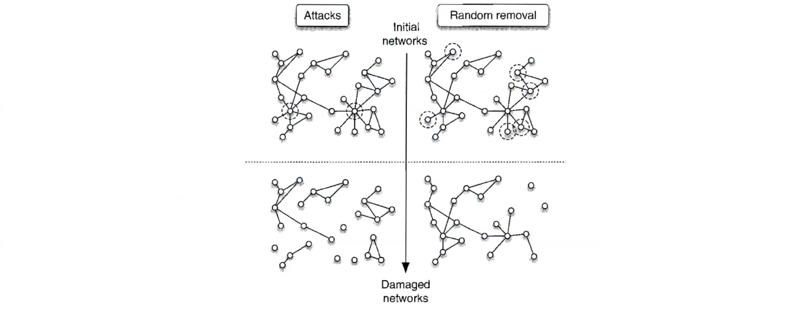

# Link prediction

Networks are crucial in modeling interactions observed in experiments or data processing. However, it's essential to consider that many interactions might be overlooked and some observed ones might be artificial: which means that the observed network $A^O$ is a "noisy" observation of the actual network $A^{\text{true}}$.

Reconstruct $A^{\text{true}}$ given $A^O$ has multiple applications:

- Finding missing links, which can suggest ad-hoc experiments.
- Deleting spurious links.
- Predicting future links in time-varying networks, such as forecasting future friendships.

Different way to do quantifying structural similarity of nodes, examples:

- **Common Neighbours**: check for each pair of nodes the number of common neighbours and then sort them based on this "score". In an undirected, unweighted network with adjacency matrix $a_{ij}$, the number of common neighbours of nodes $i$ and $j$ is $(A^2)_{ij}$ .
- **Katz index**: a generalization of common neighbours $$s_{ij}=\beta A_{ij}+\beta^2(A^2)_{ij}+\beta^3(A^3)_{ij}+\cdots$$
- **Preferential Attachment Index** to sort the nodes $s_{ij} = k_i k_j$. The nodes with highest $s_ij$ should be connected.
- **Resource allocation** which doesn't consider just the common neighbours but also how many links has this neighbour. The rationale here is that a neighbour with a lot of links *doesn't allocate too much resources to $i$ and $j$"* so it's not relevant in the similarity score. $$s_{ij}=\Sigma_{h\in(B_i\cap B_j)}\frac{1}{k_h}$$
## Recommender Systems

A similar formulation of the link prediction problem is to consider a set of users $U = \{u_1, u_2, \ldots, u_m\}$ and a set of objects $O = \{o_1, o_2, \ldots, o_n\}$.

The **Bipartite Network Representation** represent the user-object relationships $B = [b_{ij}]$ where:
  
$$b_{ij} = 1 \text{ if } u_i \text{ owns } o_j, \quad b_{ij} = 0 \text{ otherwise }$$

We can then define:

- User Degree $k(u_i) = \sum_j b_{ij}$ as Number of objects owned by user $i$ 
- Object Degree $k(o_j) = \sum_i b_{ij}$ as the number of users owning object $j$.
  
Assuming users like the objects they own, predict and recommend additional objects they might like.

- **Global Ranking Method**: Recommend objects with the largest degree $k(o_j)$, implying the most commonly owned objects. This approach lacks personalization.
- **Content-Based Filtering**: Define object similarity and recommend to user $u_i$ objects most similar to those they already own. This method offers personal recommendations without utilizing network structure.

In **collaborative filtering**, the main assumption is that similar users like similar objects.

$$\hat{b}_{ij}=\frac{s_{i1}b_{1j}+s_{i2}b_{2j}+\cdots+s_{im}b_{mj}}{s_{i1}+s_{i2}+\cdots+s_{im}}=\frac{\sum_{l=1}^{m}s_{il}b_{lj}}{\sum_{l=1}^{m}s_{il}}$$

The score assigned to the (non-existing) pair $u_i$ and $o_j$. So basically we are looking to the strength on the projected graph where $i$ and $l$ will be users. We are looking at the strength of the relationship between user $i$ and user $l$ weighted by a factor $b_{lj}$ .

After found $b_{ij}$ (the "score of recommendation" of object $j$ to user $i$) we can also quantify the similarity between users:

- **topological similarity**: number of objects in common
$$s_{il}=\sum_{j=1}^nb_{ij}b_{lj}$$
- **cosine-similarity**: each user has a score to object he owns $r_i =(r_{i1},r_{i2},\dots)$  and then just measure the difference between vectors: $$s_{il}=\frac{r_i\cdot r_l}{|r_i||r_l|}$$

# Robustness 

The robustness or resiliency of a network refers to the network's ability to maintain acceptable levels of service despite network faults.
Network faults are generally modelled as either:

- **Failures**: Random removal of nodes/links.
- **Attacks**: Targeted removal of crucial nodes/links (most central or most loaded).

We can measure the impact of removing a fraction $f$ of nodes or links by looking the **loss of efficiency** after removal of all links incident to node $i$:

$$I_i = \frac{\Delta E_i}{E} > 0$$

Different network structures, like the Barabasi-Albert and Erdös-Rényi models, have different responses when nodes or links are removed. 

- **Erdös-Rényi Networks Under Stress**: Homogeneous networks are robust.
- **Scale-Free Networks Under Stress**: while removing random nodes doesn't significantly impact connectivity, targeting high-degree nodes rapidly decays connectivity. So they are pretty **fragile** to **attacks**.

## Motter and Lai model of network breakdown

Understanding the propagation of breakdown phenomena can be interesting.

- Nodes exchange units of material along the shortest path.
- At $t=0$, node load is proportional to betweenness $b_i(0)$.
- Node capacity $C_i = (1 + \alpha) b_i(0)$, with $\alpha$ as the tolerance parameter.

The key part is that: 

- Failure/attack leads to changes in betweenness and thus their load
- The subsequent change of loads can create other node fails since $b_i>C_i$
- These other node failures change the betweennesses $b_i$: the cycle repeats 

At the end $G = S / N$ is used as a metric with $S$ as the size of the largest connected component of the network after a failure or attack has occurred.

