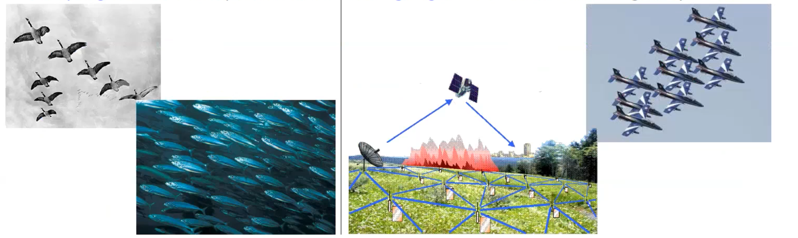

# Networked Dynamical Networks

Each node hosts a (perhaps elementary) dynamical system 

(define the local dynamics of each isolated node)

Pairs of dynamical systems interact through the link connecting them 
(define the rules of interaction)

What is the collective behavior of the network?
(answer: often more complex (qualitatively) than that of the isolated node)
Does it depend on the topological structure of the network?
(answer: yes, definitely)

Cascades of failures is a first simple example of Networked Dynamical Networks. 

## Contagion and epidemics

Probabilistic cellular automata are used to model the spread of infectious diseases over the network but also of products' adoption, opinions, etc.

- Finite State Set: node (=individual) $i$ is in state $s^i \in \Sigma=\{1,2, \ldots, \sigma\}$ at time $t$
e.g.:
$\Sigma=\{$ Susceptible, Infected, Recovered $\}$ in epidemics $\Sigma=\{$ Non adopter, Adopter $\}$ in marketing

- Local Rules (=contagion mechanism): the next state $s_{t+1}^i$ depends (according to probabilistic rules) on $s_t^i$ and on the state $s_t^j$ of the neighbors

## Consensus and synchronization 

# Contagion and epidemics on networks 

Probabilistic cellular automata are used to model the spread of infectious disea over the network.

Finite state set: node (=individual) $i$ is in state $s^l\in\Sigma=\{1,2,\ldots,\sigma\}$ at time $t$ e.g.:
 $\Sigma=\{Susceptible, Infected, Recovered\}$
 in epidemics

Local rules = contagion mechanism: the next state $s_{t+1}^i$ depends (according to probabilistic rules) on $s_t^i$ and on the state $s_t^j$ of the neighbours

Example: the SIS process at time $t$, each node is

- susceptible(S)=it is healthy but can potentially be infected 
- infected (I) (= it is infected and capable of transmitting the infection)

LOCAL RULES: At each time step (of length $\Delta):$

- **infection**: a node $i$ in state S becomes I with probability $\beta I_i\Delta$, i.e. proportional to the number $I_{i}$ of infected neighbours.
- **recovering**: a node in state I returns **S** with probability $\gamma\Delta$

What is the global behaviour of the epidemics?
How topology of the network impact the spreading of the virus?

An homogeneous network at first approximation can be considered that the degree of each node can be approximated to the average $k$. 

homogeneous (or almost homogeneous)

In a network:

- if $\beta\leq\frac\gamma{<k>}\Longrightarrow$ the fraction $y(t)$ of infected tends to $O$(=the epidemic dies out)
- if $\beta>\frac\gamma{<k>}$ $\Longrightarrow$ the fraction $y$ of infected increases with the transmission rate $\beta$

This result is consistent with the classical epidemiology (Kermack and McKendrick, 1927):

$\gamma$ is a biological parameter. This means that exists a epidemic threshold.
No epidemic can survive if the transmission rate is below the epidemic threshold.

Our parameters are basically $\beta$ and $<k>$ (lockdown). 

In a heterogeneous (for example scale-free) network
(Pastor-Satorras and Vespignani, 2001):

- the epidemic threshold is $\beta_c=\gamma<k>/<k^2>$, then it may tend to $0$ for large networks $(N\to\infty)$ 

$\gamma(t)$ never vanishes, whatever the value of the transmission rate $\beta$ 

the nodes with larger degree are rare but have a larger degree large probability of being infected

Presence of hubs in a scale-free network is crucial for the epidemic. 

How can we model the epidemic dynamics when the network is strongly inhomogeneous? 
We have a system of differential equations

We must model $y$ separately for each ensemble of nodes having the same degree $k$ .

$$
\gamma_{k}\left(t\right)=-\gamma y_{k}(t)+\beta\Theta_{k}(t)(1-\gamma_{k}(t))\:,\:k=k_{\operatorname*{min}},\ldots,k_{\operatorname*{max}}
$$

$\Theta_{k}(t)=(n.ofneighbors\times prob.thata neighbor is I)= k\stackrel{\sim}{j}(t)=k(\sum_hhP(h)y_h(t))/<k>.$

$At\:the\:equilibrium\:(\dot{y}_k=0)$ 
 we obtain

Thus the prevalence $\gamma_k$ grows with $k$ and tends to $1ask\to\infty$ (=nodes with a very large number of connections are rare but, most likely, they are infected).

The (global) prevalence is given by

$$
y(t)=\Sigma_{k}P(k)y_{k}(t)
$$

Articoli bomba:

- Not existence of epidemic threshold Pastor-Satorras 2001 
	- "if the network is heterogeneous the epedimic is able to survive with arbitrarily small transmission rate $\beta$ but with vanishing prevalence $y$"
- Small world
- Barabasi albert on scale free algorithm 

Immunization of homogeneous/heterogeneous networks immunization $=$ vaccination policy aimed at eradicating the epidemic $(y\to0)$ = fraction of vaccinated nodes

 If nodes to be vaccinates are selected at random: $g=$ prob. that a randomly chosen susceptible is

$$
\beta\big(1-y(t)\big)\implies\beta(1-g)\big(1-y(t)\big)
$$

which is equivalent to replace $\beta$ —》 $\beta(1-g).$

With the immunization we are able to eradicating the epidemic $y \rightarrow 0$ and also we can define the threshold of number of people we need to vaccinate to eradicate the population: What is the vaccination fraction $g_c$ above which the epidemic is eradicated?

Homogeneous networks (random vaccination)
no epidemic below the threshold $\beta<\beta_{c}=\frac{\gamma}{<k>}\quad\Longrightarrow\quad\beta(1-g)<\frac{\gamma}{<k>}$

$$
g>g_{c}=1-\frac{\gamma}{\beta<k>}
$$

If $g>g_c$ nodes are vaccinated at random, the epidemic is eradicated $(y\to0)$.

Heterogeneous networks (random vaccination)
no epidemic below the threshold $\beta<\beta_{c}=\frac{\gamma<k>}{<k^{2}>}\quad\Longrightarrow\quad\beta(1-g)<\frac{\gamma<k>}{<k^{2}>}$

$$
g>g_{c}=1-\frac{\gamma<k>}{\beta<k^{2}>}
$$

If $<k^2>\to\infty$ (scale-free nets with large $N)$ then $g_c\to1;$ need to vaccinate al population.

This is coherent with the previous "Pastor-Satorras 2001" results. 

But this is random vaccination, with a targeted vaccination, like a "target attacks" on the network. (Obviously starting with the one with highest degree). 

Problem: how to identify the network (then the hubs) in a real-world population?

# Epidemics on networks

Example: the SIS process At time $t$, each node is

susceptible $( S) ( = $itishealthybutcanpotentiallybeinfected$) $,on infected (I) (= it is infected and capable of transmitting the infection)

LOCAL RULES: At each time step (of length $\Delta):$

infection: a node $i$ in state S becomes I with probability $\beta I_i\Delta$, i.e. proportional to the number $I_i$ of infected neighbors

recovering: a node in state I returns S with probability $\gamma\Delta$

What is the global behaviour of the epidemics? 

SIR model 

" Ondata epidemica che arriva e poi finisce "
"Numero di infetti torna a zero"
"onda" 
epidemia stagionale magari 
(infectious, unaffected and recovered)

SIS model

Non é caratterizzata da un'onda ma é caratterizzata da un'onda . Infected $\leftrightarrow$  susceptible ó

More complex models (just a qlance...)
- Non-elementary contagion mechanisms (saturation, mean-field dependence, ... ) is considering a variable population based on (for example) Birth/death/infection processes so Epidemics on adaptive networks

Models of influence propagation ("social contagion")

"Viral" news/opinion/idea/video/post is a popular expression which remembers epidemics . 

They model the diffusion in a network-structured population of - information (news, rumor, opinion, ... ) behavior (adoption of a product/service, food/smoking habits, The main mechanism of propagation is "social contagion" (word-of-mouth). Assumptions: two states $E=\{lnactive , Active\}$ progressive contagion {once turned to $Active$, a node remains such forever} 

analysis: given the initial active set So ("seed set"), find the final active set 
optimization: find the initial active set So, subject to the budget I maximize the final active set

### Linear Threshold (LT) model

A node becomes Active when the (weighted) count of Active neighbors exceeds a
certain threshold.

### Independent Cascade (IC) model

A node which becomes Active has exactly one chance to activate each Inactive
neighbor.

the model is stochastic.

Like "it's just one shot when a node becomes active"

# Consensus in Networked Multi-Agent Systems

Both for analysis and project problems (I want to study consensus or I want to engineer consensus)

CONSENSUS Given a set of agents (=dynamical systems):
 Bass o "consensus" means to reach an agreement regarding a certain quantity of interest, that depends on the state of all agents;
algorithm" (or protocol) is the interaction rule that specifies the consensus information exchange between agent.

designing the consensus of multi-agent systems Analyzing the consensus phenomena...

Agents are connected through a network **communication only with neighbors**
Each node $i=1,2,...,N$ hosts a system $\dot{x}_{i}(t)=f(x_{i}(t),u_{i}(t))$, continuous-time model
 $x_i(t+1)=f(x_i(t),u_i(t))$, discrete-time model

$u_i(t)$ = $input$ = interaction with other systems

Consensus between undistinguishable agents 

Consensus is:

$$x_1=x_2=\cdots=x_N\mathrm{~for~}t\to\infty $$
Constrained consensus if you specify consensus on a **specific value**. 

The critical question here is :

> "Can consensus be reached with partial exchange of information only (=local, distributed, decentralized)?"

The typical example here is "integrator":

A graph of nodes where each node integrates the input. 

Derivate of $\dot x(t)$ is equal to the $u(t)$ which means that you are integrating the function over time. 
This is the local dynamic. It's the simplest one. 

Consensus in a network of $N$ integrator agents Each node hosts the "simplest" linear system: $\dot{x}_{i}(t)=u_{i}(t),\quad i=1,2,...,N,\quad x_{i}$ scalar.

Undirected, connected network, $V_i=\{j|a_{ij}=1\}=$ neighbors of $i$ diffusive" interaction: proportional to the state unbalance

$$
\dot{x}_i(t)=u_i(t)=\sum_{j\in V_i}\bigl(x_j(t)-x_i(t)\bigr)
$$

$\dot{x}=-Lx$
where $L=diag(k_1,k_2,...,k_N)-A$ is the $N\times N$ Laplacian matrix of the network

The collective dynamics of $x=[x_1\quad x_2\quad...\quad x_N]^T$ are governed by

The collective dynamics depend on the graph topology!

Sistemata da chat : 

In the context of consensus analysis and engineering in multi-agent systems, the fundamental concept of "consensus" refers to the process where a group of agents, which are dynamical systems, agree upon a certain quantity of interest. This quantity is determined based on the state of all agents. To facilitate this process, an "algorithm" or "protocol" is employed, defining the rules for information exchange and interactions among agents.

When designing and analyzing consensus phenomena in multi-agent systems, it is crucial to consider that agents are interconnected through a communication network and can only exchange information with their immediate neighbors. Each agent, represented as a node in a network, follows a specific model: a continuous-time model $\dot{x}_{i}(t)=f(x_{i}(t),u_{i}(t))$ or a discrete-time model $x_i(t+1)=f(x_i(t),u_i(t))$, where $u_i(t)$ represents the interaction input with other systems.

The goal of consensus is to ensure that all agents (nodes) reach the same state over time, formally expressed as $x_1=x_2=\cdots=x_N\mathrm{~~for~~}t\to\infty$. This can also be constrained to achieving consensus on a specific value.

A critical aspect of consensus in these systems is determining whether it can be reached with only partial (local, distributed, decentralized) exchange of information. A typical example of such a system is the "integrator," where each node in the graph integrates input over time. The simplest local dynamic in this context is represented by a network of $N$ integrator agents, each hosting a linear system $\dot{x}_{i}(t)=u_{i}(t)$.

In an undirected and connected network, the interaction between nodes is "diffusive," meaning it is proportional to the state unbalance between each node and its neighbors. The dynamics of each node are given by:

$$\dot{x_i}(t)=u_i(t)=\sum_{j\in V_i}\left(x_j(t)-x_i(t)\right)$$

Here, $L=diag(k_1,k_2,...,k_N)-A$ represents the $N\times N$ Laplacian matrix of the network, influencing the collective dynamics of the system, denoted by $x=[x_1\quad x_2\quad...\quad x_N]^T$. Notably, these collective dynamics are dependent on the graph topology.

In the Laplacian matrix $L:$ 

- The diagonal elements $L_{ii}$ represent the degree of node $i$.
- The off-diagonal elements $L_{ij}$ (where $i\neq j$) are the negative of the
 adjacency matrix elements, typically -1 if nodes $i$ and $j$ are connected, and $0$ otherwise.

The Laplacian matrix has several important properties:

1. Row sums and column sums are zero, reflecting the principle of conservation of flow in the network.
2. It is symmetric for undirected graphs.
3. It is semi-positive definite.
4. The smallest eigenvalue is 0, and the corresponding eigenvector is a constant vector (due to the row sum property).

In the context of consensus, the Laplacian matrix is fundamental because its properties determine how quickly and effectively a consensus can be reached in the network. The eigenvalues and eigenvectors of the Laplacian, in particular, provide insights into the network's connectivity and the speed of convergence to consensus.

In principle, infinite consensus states but only one is possible which depends on the graph topology. 

Since $\Sigma_i\dot{x}_i=0$, it turns out that $\Sigma_i\chi_i(t)=\sum_i\chi_i(0)=C$ (constant). Thus the only feasible equilibrium $\bar{x}$ has

$$ \bar{x}_{1}=\bar{x}_{2}=\cdots=\bar{x}_{N}=(1/N)\sum_{i}x_{i}(0) $$

$\lambda_{1}=0$ governs the (trivial) dynamics along the eigenvector $[1,1,...,1]^{\mathrm{T}}.$ 

**Conservation of the Sum of States**: The equation $\Sigma_i\dot{x}_i=0$ suggests that the sum of the rate of change of states over all nodes in the network is zero. This implies conservation in the system – the total "quantity" represented by the states $x_i$​ of the nodes doesn't increase or decrease over time; it's merely redistributed among the nodes.

Given the conservation of the total state, the only feasible equilibrium state $\overline{x}$ for all nodes, where equilibrium means no node's state is changing anymore (i.e., consensus is reached), is the average of all the initial states. Mathematically, this is expressed as:

$$ \bar{x}_{1}=\bar{x}_{2}=\cdots=\bar{x}_{N}=(1/N)\sum_{i}x_{i}(0) $$
This equation states that each node's final state (at consensus) will be the average of all nodes' initial states.

the eigenvector $[1,1,...,1]^{\mathrm{T}}.$  This eigenvector represents the state where all nodes have the same value, which is the essence of consensus. The zero eigenvalue governs this "trivial" dynamics, meaning it's associated with the unchanging, conserved aspect of the system where all nodes are in agreement. The dynamics are "trivial" in the sense that no complex evolution of the system is happening once this state is reached – all nodes simply hold the same value.
    

In summary, this explanation emphasizes that in a network operating under a consensus protocol, the final state where all nodes agree is predetermined by the initial conditions and the structure of the network. The system conserves the total sum of all individual states, leading to an equilibrium where each node ends up at the average of all initial states.

Undirected network : if connected, consensus is reached and consensus value is the arithmetic average of all initial states.

Directed network : if connected, consensus is reached considering the laplacian with $k_{out}$ . Only if the network is strongly connected consensus is reached. In maniera spiccia "ovviamente l'informazione deve poter diffondersi in tutta la rete".  

We found out that there is a consensus value which is weighted average . 

----

In network theory, the behavior of consensus differs significantly between undirected and directed networks, and this is reflected in the way consensus values are reached.

**Undirected Network**: In an undirected network, if the network is connected, consensus is inevitably reached. The value of this consensus is the arithmetic mean of all initial states of the nodes in the network. This implies that the network's structure allows for an equal distribution and sharing of information among all nodes, leading to a uniform consensus state where every node agrees on the average of all initial states.

Directed Network: The scenario in directed networks is more complex. Consensus is still achievable, but it depends on the network's connectivity. A
 key pointis the consideration of the Laplacian matrix with $k_{out}$, where $k_{out}$
 represents the out-degree of the nodes. Consensus in a directed network is only guaranteed if the network is strongly connected, meaning information can freely spread throughout the entire network. In a more colloquial sensey "obviously, information must be able to disseminate across the whole

 network."
 In a directed network, a consensus value is a weighted average of the initial
 states. This is mathematically represented as:

$$
x=\sum_iw_ix_i(0)
$$

where $\sum_iw_i=1$.Here, $w_i$ are weights that depend on the network topology, and $\alpha$ is the weighted average. These weights $[w_1,w_2,...,w_N]$
 are actually the components of a left eigenvector of the Laplacian matrix $L_{4}$ corresponding to the eigenvalue $\lambda_1=0.$ The Laplacian matrix for directed networks is defined as $L_{ii}=k_i^{out}$ and $L_{ij}=-\alpha_{ij}$ for $i\neq j.$

 An important condition for convergence to the average initial state is when
 :he network is balanced, meaning each node's in-degree $k_i^{in}$ is equal to its out-degree $k_i^{out}$ .In such cases, $\alpha$ becomes the average of the initial states, expressed as:

$$
\alpha=\left(\frac1N\sum_ix_i(0)\right)
$$
 Finally, the speed at which a network reaches consensus is dominated by the
 first sub-dominant eigenvalue of $L_S=(L+L^T)/2$,where $L^\mathrm{T}$ is the
 transpose of the Laplacian matrix. This eigenvalue gives an indication of how
 quickly the consensus state will be achieved in the network.

Possible extensions:
- different forms of the coupling function $u_i = h(x)$
- network design for optimizing consensus performance
- other (less trivial) agent models (linear or nonlinear)
- time-varying network topology (e.g., mobile agents) (think about AI agents/robots which are moving and have a limited range to communicate information )
- consensus on oscillatory behavior: synchronization

In the context of network theory, particularly when dealing with weighted networks, the "strength" of a node is a concept that extends the idea of a node's degree (which is the number of connections or edges a node has) to account for the weights of these connections.
In an unweighted network, the degree of a node is simply the count of how many edges are connected to it. However, in a weighted network, where each edge has a numerical value or weight (indicating the intensity or capacity of the connection), the strength of a node is defined as the sum of the weights of all edges connected to it.
Mathematically, if we represent the weight of the edge between nodes $i$ anc $j$ as $w_{ij}$, the strength $s_i$ of node $i$ can be expressed as:

$$ s_i=\sum_jw_{ij} $$ 

---

