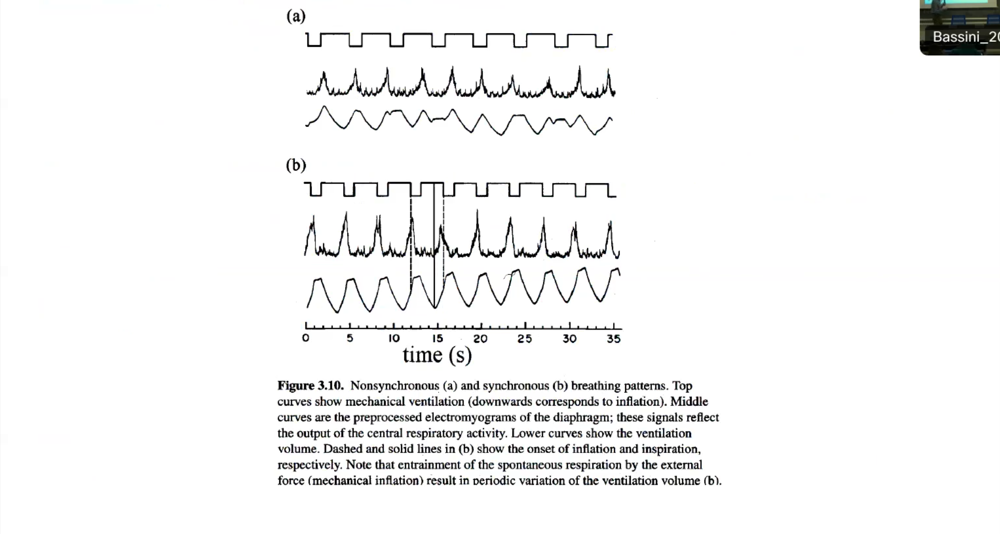
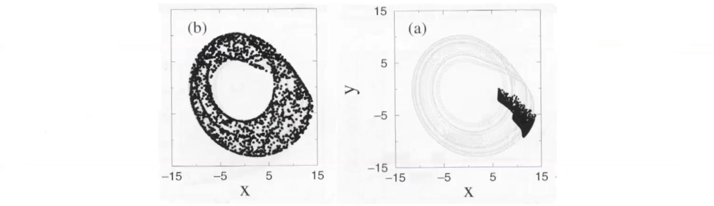
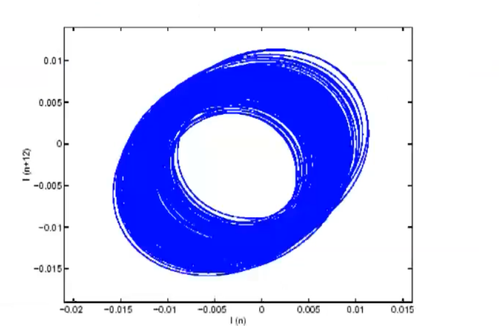
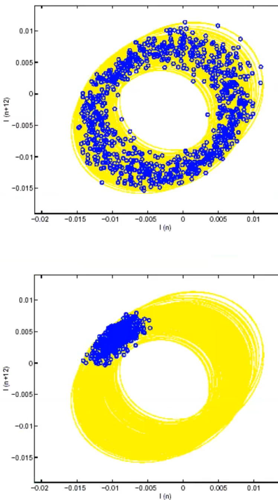

# Synchronization

## Phase synchronization and complete synchronization

Synchronization is the adjustment of the rhythms of two (or more) **oscillators** due to their weak interaction.

When independent, the two clocks (=oscillators) have slightly different velocities. When connected through a common support (=weak interaction), the clocks have perfectly identical velocities (=rhythm adaptation).

Synchronization is the process where two or more devices adjust to match each other's rhythms. For instance, two clocks running at different speeds can synchronize to move at the same pace when connected.

$\epsilon$ is the coupling strength, $f_1, f_2$ are the non-interacting **oscillators** frequencies, and $F_1, F_2$ are the interacting frequencies. Synchronization (no difference in frequencies) can only occur if the difference in $f_1, f_2$ is small. Synchronization can happen with a very small $\epsilon$ (coupling strength) but it requires a smaller difference in frequencies.

To talk about synchronization, the interacting elements must be oscillators when independent (and not together)! 

(example) It's interesting to see not only machine-machine synchronization but also human-machine synchronization:

Coordination of respiration rhythm and wing beat in the flight of migratory geese: 
![]

## Phase synchronization of chaotic oscillators

Phase of chaotic oscillators

The phase $\Phi(t)$ of a chaotic oscillator should be defined as a monotonically increasing variable which parameterizes the system solution.

A chaotic oscillator's path is non-periodic; it never passes through the same point twice. If it did, based on the differential equation of the Cauchy problem, it would imply that the system is periodic, which contradicts the chaotic nature of the oscillator. However, it can be proven that the oscillator can come infinitely close to the same point. This is typical of chaotic attractors.

Phase of a chaotic oscillator: projecting the attractor It is possible when the attractor has a suitable geometric structure.

For different parameter values, the above phase definition is impossible due to the shape of the attractor.

In some cases, defining the phase by attractor projection becomes possible after a simple variable change.

"parametrizzazione in maniera monotona the trajectory" 

Example: Rössler system, Lorenz system (vary famous)

--- 

another way to find the parametrization which defines me a phase is to define the crossing of a suitably Poincará section. 

$\Phi(t)$ is defined to (linearly) increase of 2$\pi$ between two consecutive crossings of a suitably defined Poincaré section $\Pi.$

The phase projection of a chaotic oscillator is possible when the attractor (the set of numeric values) has an appropriate geometric structure. The phase definition is impossible for certain parameter values due to the shape of the attractor. For the Rössler and Lorenz systems, $\Phi(t)$ is defined to increase by 2$\pi$ between two sequential crossings of a specific Poincaré section $\Pi.

Remember that the crossings of Poincaré sections are not periodically.
A very practical Poincaré section corresponds to the maxima of one of the state variables. 

This allows one to associate a phase variable to a (chaotic) time series (even if no model is available). 

I may not fully understand the system, but by measuring and analyzing a time series' local maximums, I can comprehend the phase variable. This can be beneficial in various applications. By detecting this variable's maximum peaks, we are essentially observing its intersection with a cross section at its peak, a powerful tool. Even without deep knowledge of the system or its components, this allows us to track the system's movement and define a monotonically increasing phase.

Example: prey-predator system (Rosenzweig-MacArthur)

### Synchronization of a chaotic oscillator by a periodic forcing input

The text revolves around the synchronization of a chaotic oscillator by a periodic forcing input. The two main elements are the periodic oscillator and the chaotic oscillator. The periodic oscillator has its own phase and frequency, which is the derivative of the phase as it linearly increases. The chaotic oscillator is controlled by the periodic oscillator. The two are considered synchronized when their difference is limited, unlike the scenario with two periodic oscillators where their constant difference was significant.

Synchronization of a chaotic oscillator by a periodic forcing input

· $\Phi_u(t)$ is the phase of the periodic forcing input $( \omega= $d$\Phi_u( t) /$d$t) $ · $\Phi(t)$ is the phase of the chaotic oscillator $(\Omega=\lim_{t\to\infty}\Phi(t)/t)$

The oscillator is synchronized with the input (phase synchronization) if
 

The phase difference can vary in time, but should remain bounded. Remark: $|\Phi(t)-\Phi_u(t)|<$ const if and only if

$\Omega=\omega$

The text appears to discuss the synchronization of a chaotic oscillator by means of a periodic input force. 

This discusses synchronization of a chaotic oscillator through a periodic force. Periodic oscillators have a unique characteristic where they have their phase and frequency. For these oscillators, their frequency is essentially the derivative of the phase because the phase increases linearly.

Here, the chaotic oscillator is controlled or driven by the periodic oscillator. The mean frequency of the chaotic oscillator, as described here, indicates that the two oscillators are synchronized. This synchronization is defined when the difference between the two is limited unlike before when two periodic oscillators were being discussed where their constant difference was used.

The following symbols represent different elements of the equation:

· $\Phi_u(t)$ is the phase of the periodic forcing input $(\omega=d\Phi_u( t) /dt)$
· $\Phi(t)$ is the phase of the chaotic oscillator $(\Omega=\lim_{t\to\infty}\Phi(t)/t)$

The oscillator is said to be synchronized with the input (phase synchronization) if the phase difference varies over time but remains **bounded**. 

Remark: $$|\Phi(t)-\Phi_u(t)|< \text{const}$$
if and only if $\Omega=\omega$, meaning the synchronization is achieved only when the chaotic oscillator's average frequency equals the periodic oscillator's frequency.

Stroboscopic diagrams are used to discuss the states of synchronization, with dots representing the state value at time intervals that are multiples of $2\pi/\omega$. 

In an unsynchronized state, dots are scattered throughout the attractor, indicating a distributed phase between $-\pi$ and $\pi$. However, during synchronization, the dots converge within a narrow phase interval. 

Discerning what occurs without synchronization (on the left) and with synchronization (on the right) involves these two panels. The diagrams are stroboscopic; that is, they depict the system at different intervals, using a dot to indicate its state. Researchers add a dot every time the input completes a cycle. 

On the left, without synchronization, the points (or system states) appear dispersed. However, during synchronization (on the right), they concentrate within a very narrow region. This means the chaotic path essentially takes a similar amount of time to complete a cycle like the input. 

The only change between the left and right is the speed at which the chaotic path is traversed - it's more sporadic on the left, but becomes reinforced on the right. The input system, operating periodically, imposes a rotation rhythm on the chaotic system without diminishing their chaotic features.

Again, a dot is added each time the system completes a cycle. Without synchronization, the dots representing the system state are dispersed. However, with synchronization, they are concentrated within a narrow region. This indicates the chaotic path typically takes an equivalent amount of time as the input to complete a cycle. The only difference in both states is the speed the chaotic path is traversed. It's sporadic without synchronization, but more consistent with it. Synchronization doesn't hamper the chaotic nature of the system, instead imposing a rotational rhythm.

### Halobacterium salinarium example

Example: imperfect synchronization in the locomotion of Halobacterium Salinarium. 
It is a ciliated bacterium moving in a fluid, which commutes direction every few seconds

> "... and here the level of perversion of the experimenter rises, which is already (in my opinion) quite high. Let's shoot him periodically flashes of light."

Under periodic light stimuli ( flash sequences) of intensity/amplitude $A$, the commuting intervals tend
to synchronize with the period $T$ of the stimuli.

An interesting finding was that synchronization led to an adaptation to the forcing rhythm, reducing both longer and shorter intervals, causing the mean commuting interval to gravitate towards the stimuli period. 
However, for some $(A,T)$, some flashes **fail** to induce commutation:

For $T = 9$ and $T = 6$ we can clearly see **imperfect synchronization**: long intervals of "apparent" synchronization (=the bacterium commutes with the frequency of the input) are interrupted by sudden "phase jumps" (=the bacterium commutes only once for two flashes).

## Complete synchronization

Consider two systems $\Sigma_1$ e $\Sigma_2:$

- identical (same $f^{\prime})\colon\quad\dot{x}^{\prime}=f(x^{\prime},u^{\prime})\quad,\dot{x}^{\prime\prime}=f(x^{\prime\prime},u^{\prime\prime})$ 
- in chaotic regime when isolated $(u^{\prime}(t)=u^{\prime\prime}(t)=0\quad\forall t\:)$ 
- interacting uni- or bi-directionally: $u^{\prime}=g(x^{\prime},x^{\prime\prime})$ , $u^{\prime\prime}=g(x^{\prime\prime},x^{\prime})$

$\Sigma_1$ and $\Sigma_2$ are completely synchronized if are:

$$
\lim_{t\to\infty}\lvert x^{\prime}(t)-x^{\prime\prime}(t)\rvert=0
$$

- The definition implies that the synchronized state $x^{\prime}(t)=x^{\prime\prime}(t)$ must be asymptotically stable at least locally.
- Contrasting with phase synchronization, which only requires the same average frequency (with uncorrelated amplitudes), complete synchronization necessitates perfect coincidence in both frequency and amplitude of the behaviors of the two systems.
- For achieving complete synchronization, the interaction between the systems may need to be strong, as opposed to weak interactions.
- Interestingly, complete synchronization maintains the chaotic nature of the individual systems.
- More generally, the systems need not be identical but merely similar (e.g., having the same state equations but slightly different parameters). In such cases, the criterion for synchronization is relaxed to $|x^{\prime}(t)-x^{\prime\prime}(t)|<$ constant, allowing for some degree of difference in their evolution.

## Synchronization of networked oscillators

The Kuramoto Model, created by Yoshiki Kuramoto in 1984, is a key framework for studying synchronization in complex systems, especially those with interconnected oscillators. 
The Kuramoto Model is particularly notable for its ability to describe the shift from disorder to order in a system of oscillators that are linked together, providing important information about the critical points where this transition occurs. 

There is nonlinear coupling between the rotors, denoted by $\nu(i)$ which represents the neighbors of rotor $i$. The equation describing the coupling is given by:

$$
\frac{\mathrm{d}\phi_i}{\mathrm{d}t}=\omega_i+K\sum_{j\in V(i)}\sin(\phi_j-\phi_i)
$$

To quantify synchronization, we introduce the "order parameter" $r(t)$ which represents the centre of mass of the oscillators. The behavior of $r(t)$ determines the degree of synchronization:

- If $r(t)\to0$, there is no synchronization.
- If $r(t)\to1$, all rotors are synchronized, meaning they have identical $\frac{\mathrm{d}\phi_i}{\mathrm{d}t}$ values.
- If $r(t)$ tends to a nonzero value, a fraction of the oscillators is synchronized.

We have $N$ oscillators on a complete network with coupling strength $K=\frac{K^0}{N}$. The dynamics of each oscillator is described by the equation $\frac{\mathrm{d}\phi_i}{\mathrm{d}t}=\omega_i+\frac{K^0}{N}\sum_j\sin(\phi_j-\phi_i)$.

By combining this with the equation $r(t)\mathrm{e}^{\mathrm{i}\psi(t)}=\frac{1}{N}\sum_{j=1}^{N}\mathrm{e}^{\mathrm{i}\phi_j(t)}$, we can derive:
$$
\frac{\mathrm{d}\phi_i}{\mathrm{d}t}=\omega_i+K^0r\sin(\psi-\phi_i)
$$

The coupling term depends on the "mean phase" $\psi$. The coupling strength, $K^0$$r$ increases with $r$. This is called positive feedback, where the more synchronized oscillators there are, the greater the chance of capturing the remaining ones.

The Kuramoto model is a mathematical model used to describe synchronization phenomena in complex systems, particularly systems of oscillators. It's defined as follows:

- Each oscillator in the system is represented by a phase $\theta_i(t)$ which evolves over time.
- The rate of change of the phase of each oscillator is influenced by its natural frequency $\omega_i$ and by a sum that accounts for the interaction with every other oscillator in the system.
- The strength of coupling between oscillators is represented by a constant $K$.

The basic form of the Kuramoto model for $N$ coupled oscillators is given by the equation:

$$\frac{d\theta_i}{dt} = \omega_i + \frac{K}{N} \sum_{j=1}^{N} \sin(\theta_j - \theta_i)$$

Here, \( \theta_i \) is the phase of the \( i^{th} \) oscillator, \( \omega_i \) is its natural frequency, \( K \) is the coupling strength, and \( N \) is the total number of oscillators.

The order parameter \( r \) is used to measure the degree of phase synchronization among oscillators and is defined as:

$$r e^{i\psi} = \frac{1}{N} \sum_{j=1}^{N} e^{i\theta_j}$$

where \( \psi \) is the average phase. The order parameter \( r \) varies between 0 and 1, where 0 indicates no synchronization and 1 indicates complete synchronization. In other words, \( r \) gives a measure of how much the oscillators in the system are in phase with each other. The Kuramoto model is widely used in various fields, including physics, biology, and engineering, to study synchronization phenomena.

Generalization of complete synchronization

In this scenario, we have a system consisting of isolated nodes represented by $i$ (where $i = 1, 2, ..., N$). Each node represents an identical, autonomous, n-dimensional dynamical system. When each node is isolated, its behavior is oscillatory, either periodic or chaotic. The state of each node $i$ is denoted by $x^{(i)}$ in $\mathbb{R}^n$, and its isolated dynamics are governed by the equation:

$$
\dot{x} = f(x), \quad x \in \mathbb{R}^n
$$

When the nodes are coupled, their dynamics change. The coupling between the nodes is linear and diffusive, described by the equation:

$$
\dot{x}^{(i)} = f(x^{(i)}) + \sum_{j:a_{ij}=1}d\Big(H(x^{(j)}-x^{(i)})\Big)
$$

In this equation, $d \geq 0$ represents the coupling strength between the nodes. $H$ is a nonnegative $n \times n$ matrix called the diffusion profile, which determines which variables interact among the nodes. A diagonal $H$ matrix indicates the specific components or species that disperse and their relative dispersal rates. For example:

- If only the first component disperses (e.g., seeds transported by the wind), $H$ would be $H' = diag[1, 0, 0]$.
- If only the component $C$ disperses, $H$ would be adjusted accordingly.
- If only $P$ disperses, $H$ would reflect that.
- If all variables disperse but at different rates, $H$ might be $H'''' = diag[1, 0.1, 0.01]$, indicating varying dispersal rates for each component.

