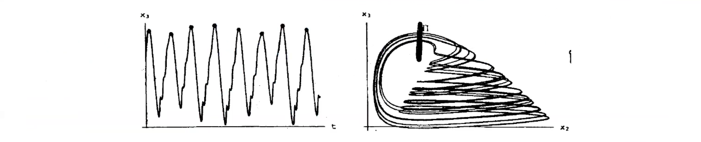
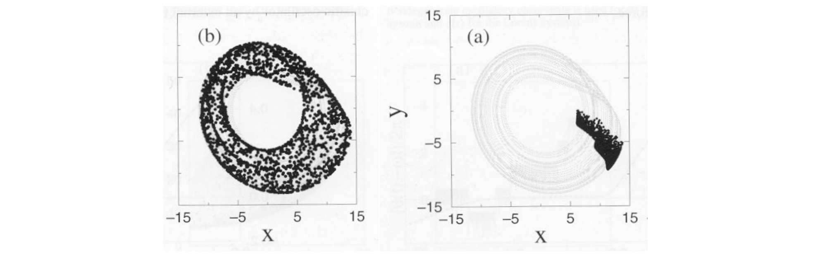
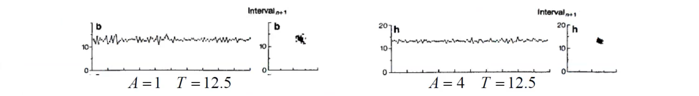
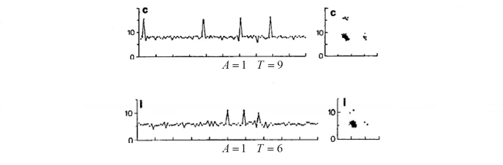

# Synchronization

Synchronization is the adjustment of the rhythms of two (or more) **oscillators** due to their weak interaction.

Synchronization can happen with a very small $\epsilon$ (coupling strength) but it requires a smaller difference in frequencies.

The phase $\Phi(t)$ of an oscillator with period $T$ is defined as:

$$\Phi(t)=\frac{2\pi t}T+\mathrm{const}=\omega t+\mathrm{const}$$

The oscillator is synchronized with the **forcing input** (phase synchronization, or phase locking) when

$$\Phi(t)-\Phi_u(t)=\mathrm{const}$$

Two periodic oscillators are synchronized when their frequencies are equal ($\omega_1 = \omega_2$). Same $\omega_1 = \omega_2$ means also they are in phase: $\Phi_1(t)-\Phi_2(t)=\mathrm{const}$ .

We can also define **synchronization of order $n:m$** when $n\omega_1 = m\omega_2$ : which means that the oscillators counts $n$ periods for each $m$ periods of the forcing input:

$$n\Phi_u(t)\mathrm{-}m\Phi(t)=\text{const}$$

## Chaotic oscillators

A chaotic oscillator's path is non-periodic: it never passes through the same point twice. If it did, based on the differential equation of the Cauchy problem, it would imply that the system is periodic, which contradicts the chaotic nature of the oscillator. 

First problem is to just represent the curve with a function. 
Three methods:

First method: We do a parameterization in a monotonic way of the trajectory:

$$\omega=\lim_{t\to\infty}\frac{\Phi(t)}t$$

A second method: when the attractor has a suitable geometric structure we can define a vector centered in $0$, formally called "the projector of the attractor". 

$$\Phi(t)=\arctan \frac{y(t) - \tilde{y}}{x(t) - \tilde{x}}$$

where $x(t)$ and $y(t)$ are the coordinates of the oscillator and $\tilde{x}$, $\tilde{y}$  are the coordinates of a reference point. 
But often is not possible to define a vector (module and direction) $\Phi(t)$ which monotonically increase .
A third method: to find the parametrization which defines me a phase is to define the **crossings of a suitably Poincaré section**.

$$\Phi(t)=2\pi\frac{t-t_k}{t_{k+1}-t_k}+2\pi k,\quad t_k\leq t<t_{k+1}$$

$\Phi(t)$ is defined to (linearly) increase of $2\pi$ between two consecutive crossings of a suitably defined Poincaré section $\Pi$ . Basically we define a section and every time the oscillator passes through that section we increase by $2\pi$ the phases.

This last method is useful when we may not fully understand a system, but by measuring and analysing a time series local maximums, we can comprehend the phase variable.

This can be beneficial in various applications. By detecting this variable's maximum peaks, we are essentially observing its intersection with a cross section at its peak, a powerful tool. Even without deep knowledge of the system or its components, this allows us to track the system's movement and define a monotonically increasing phase.

Example: prey-predator system (Rosenzweig-MacArthur)

### Synchronization of a chaotic oscillators

#### By a periodic forcing input

The synchronization of a chaotic oscillator by a periodic forcing input. 
The two are considered synchronized when their phase difference is **limited**, unlike the scenario with two periodic oscillators where we wanted that their difference is constant.

$$|\Phi(t)-\Phi_u(t)| < \text{const}$$

if and only if $\Omega=\omega$, meaning the synchronization is achieved only when the chaotic oscillator's average frequency equals the periodic oscillator's frequency.

**Stroboscopic diagrams** can be used to discuss the states of synchronization, with dots representing the state value at time intervals that are multiples of $2\pi/\omega$. 
In an unsynchronized state, dots are scattered throughout the attractor, indicating a distributed phase between $-\pi$ and $\pi$. 
However, during synchronization, the dots converge within a narrow phase interval. 

#### Between two chaotic oscillators

The two chaotic oscillators are synchronized (in phase and frequency) when

$$\begin{vmatrix}\Phi_1(t)-\Phi_2(t)\end{vmatrix}<\mathrm{const}\quad\quad\text{that is}\quad\omega_1=\omega_2$$

But remember that $\omega_i$ are not numbers but are defined like:

$$\omega_{i}=\operatorname*{lim}_{t\rightarrow\infty}\frac{\Phi_{i}(t)}{t}$$

### Halobacterium salinarium example

Example: imperfect synchronization in the locomotion of Halobacterium Salinarium. 
It is a **ciliated bacterium** moving in a fluid, which changes direction every few seconds.

> Prof: "... and here the level of perversion of the experimenter rises, which is already (in my opinion) quite high. Let's shoot him periodically flashes of light."

Under periodic light stimuli (flash sequences) of intensity/amplitude $A$, the commuting intervals tend to synchronize with the period $T$ of the stimuli.

An interesting finding was that synchronization led to an adaptation to the forcing **rhythm**, reducing both longer and shorter intervals, causing the mean commuting interval to gravitate towards the stimuli period. 
However, for some $(A,T)$, some flashes **fail** to induce commutation:

For $T = 9$ and $T = 6$ we can clearly see **imperfect synchronization**: long intervals of "apparent" synchronization (=the bacterium commutes with the frequency of the input) are interrupted by sudden "phase jumps" (=the bacterium commutes only once for two flashes).

## Complete synchronization

Two systems $\Sigma_1$ and $\Sigma_2$ are completely synchronized if are:

$$\lim_{t\to\infty}\lvert x^{\prime}(t)-x^{\prime\prime}(t)\rvert=0$$

- The definition implies that the synchronized state $x^{\prime}(t)=x^{\prime\prime}(t)$ must be asymptotically stable at least locally.
- Contrasting with phase synchronization, which only requires the same average frequency (with uncorrelated amplitudes), complete synchronization necessitates perfect coincidence in both frequency and amplitude of the behaviours of the two systems.
- For achieving complete synchronization, the interaction between the systems may need to be strong, as opposed to weak interactions.
- Interestingly, complete synchronization maintains the chaotic nature of the individual systems.

More generally, the systems need not be identical but merely similar (e.g., having the same state equations but slightly different parameters). In such cases, the criterion for synchronization is relaxed to $|x^{\prime}(t)-x^{\prime\prime}(t)|<$ constant, allowing for some degree of difference in their evolution.

## Synchronization of networked oscillators

The **Kuramoto Model**, created by Yoshiki Kuramoto in 1984, is a key framework for studying synchronization with interconnected oscillators. 
The Kuramoto Model is particularly notable for its ability to describe the shift from disorder to order in a system of oscillators that are linked together, providing important information about the critical points where this transition occurs. 

There is nonlinear coupling between the rotors, denoted by $V(i)$ which represents the neighbours of rotor $i$. The equation describing the coupling is given by:

$$\frac{\mathrm{d}\phi_i}{\mathrm{d}t}=\omega_i+K\sum_{j\in V(i)}\sin(\phi_j-\phi_i)$$

To quantify synchronization, we introduce the "order parameter" $r(t)$ which represents the centre of mass of the oscillators.

$$r(t)\mathrm{e}^{\mathrm{i}\psi(t)}=\frac{1}{N}\sum_{j=1}^{N}\mathrm{e}^{\mathrm{i}\phi_j(t)}$$

The behaviour of $r(t)$ determines the degree of synchronization:

- If $r(t)\to0$, there is no synchronization.
- If $r(t)\to1$, all rotors are synchronized, meaning they have identical $\frac{\mathrm{d}\phi_i}{\mathrm{d}t}$ values.
- If $r(t)$ tends to a nonzero value, a fraction of the oscillators is synchronized.

We have $N$ oscillators on a complete network with coupling strength $K=\frac{K^0}{N}$. The dynamics of each oscillator is described by the equation $\frac{\mathrm{d}\phi_i}{\mathrm{d}t}=\omega_i+\frac{K^0}{N}\sum_j\sin(\phi_j-\phi_i)$.

By combining this with the equation $r(t)\mathrm{e}^{\mathrm{i}\psi(t)}=\frac{1}{N}\sum_{j=1}^{N}\mathrm{e}^{\mathrm{i}\phi_j(t)}$, we can derive:

$$\frac{\mathrm{d}\phi_i}{\mathrm{d}t}=\omega_i+K^0r\sin(\psi-\phi_i)$$

Note that the coupling term depends on the "mean phase" $\psi$. The coupling strength, $K^0$$r$ increases with $r$. This is called positive feedback, where the more synchronized oscillators there are, the greater the chance of capturing the remaining ones.

At the end the results are:

- $K^0<K_c$: no synchronization $(r(t)\to0)$
- $K^0>K_c:$ synchronization of larger and larger fractions of oscillators $(r(t)\to1$ as $K^0\to\infty)$
- when $r(t)\to r<1$, the de-synchronized oscillators are those with largest detuning $|\omega_i-\Omega|.$

On complex network we can also give a value to the threshold $K_c$ :

- Regular lattices: $K_c \to \infty$ (no synchronization)
- Small-world networks: $K_c$ decreases with $p$ probability of rewiring (so basically we are moving from a regular lattices to a random network)
- Heterogeneous networks: $K_c = \frac{\langle k \rangle}{\langle k^2 \rangle}$ 

### Generalization of complete synchronization

Let's formulate better the problem: 

- we have a system consisting of isolated nodes represented by $i$ (where $i = 1, 2, ..., N$)
- Each node represents an identical, autonomous, n-dimensional dynamical system.
- When each node is isolated, its behaviour is (periodic or chaotic) **oscillatory**. 
- The state of each node $i$ is denoted by $x^{(i)}$ in $\mathbb{R}^n$, and its isolated dynamics are governed by the equation:

$$\dot{x} = f(x), \quad x \in \mathbb{R}^n$$

When the nodes are coupled, their dynamics change. 
The coupling between the nodes is linear and diffusive, described by the equation:

$$\dot{x}^{(i)} = f(x^{(i)}) + \sum_{j:a_{ij}=1}d\Big(H(x^{(j)}-x^{(i)})\Big)$$

where: 

- $d \geq 0$ represents the coupling strength between the nodes. 
- $H$ is a nonnegative $n \times n$ matrix called the **diffusion profile**, which determines which variables interact among the nodes. A diagonal $H$ matrix indicates the specific components or species that disperse and their relative dispersal rates. $H$ represents different dispersion rates in the diffusion for each component/variable.

At synchronization all the interaction terms $d\Big(H(x^{(j)}-x^{(i)})\Big)$ vanish and $\bar x (t)$ must be a solution of the isolated system $\dot{x}=f(x)$ . 

