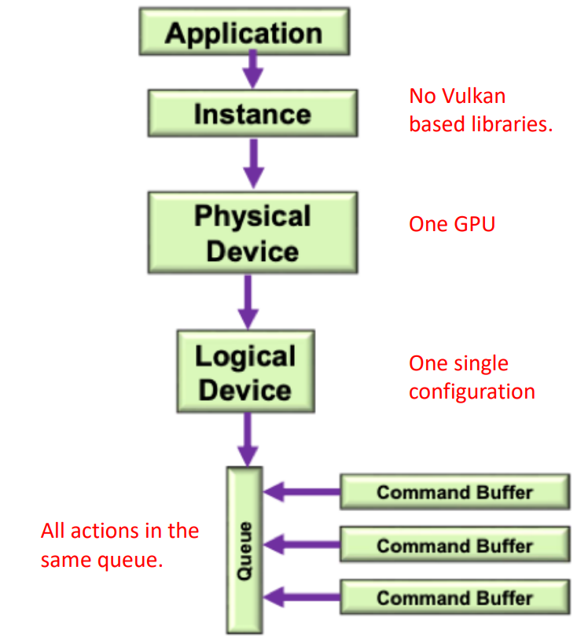

https://vulkan.lunarg.com/sdk/home

https://vulkan-tutorial.com/Development_environment

https://github.com/glfw/glfw

https://vulkan-tutorial.com/

https://web.engr.oregonstate.edu/~mjb/vulkan/ 

After installing the Vulkan SDK on Linux, you can find the SDK files in the installation directory. The default installation directory is `/usr/share/vulkan`

Vulkan SDK includes several tools and libraries that you can use to develop Vulkan applications, such as:

-   `vulkaninfo`: A command-line tool that displays information about the Vulkan implementation and the available graphics devices.
    
-   `GLFW`: A library that provides a simple API for creating windows, contexts, and handling input. It also includes support for Vulkan.
    
-   `Vulkan Memory Allocator`: A library that provides an easy-to-use interface for managing Vulkan memory.
    
-   `SPIRV-Tools`: A set of tools for working with SPIR-V shader modules.

To get started with developing Vulkan applications using VS Code, you can follow these steps:
	
1.  Install the C/C++ extension for VS Code.
2.  Create a new C/C++ project and configure it to use the Vulkan SDK.
3.  Write your Vulkan application code and build it using a build system such as CMake.
4.  Run your application and test it on your Vulkan-capable graphics device.


Following the tutorial on:
https://vulkan-tutorial.com/Development_environment
Install your own Vulkan development environment.


There are two Makefiles, one that compiles the shaders and doesn't do it. Just copy the needed one into the _Makefile_ file. Then just change _DIR_ and _NAME_ with the directory name and the main file name of the assignment (ex. DIR=A01, NAME=Assignment01). Then open a terminal and type:

make

The Makefile works by using the `make` command to read the rules and dependencies defined in the Makefile and then executing the commands necessary to build the program. When `make` is run, it compares the timestamps of the source files and the build artifacts to determine which files need to be recompiled and which ones can be reused, which can help save time and avoid unnecessary recompilation.

One of the main benefits of using a Makefile is that it can automate the build process and make it easier to manage complex projects with multiple files and dependencies. It can also help ensure that the build process is consistent across different platforms and configurations.

Linux: 

```shell
DIR=./A00
NAME=A00

ifndef DIR
$(error DIR is not set)
endif

ifndef NAME
$(error NAME is not set)
endif

FILEPATH=$(DIR)/$(NAME)
CFLAGS = -std=c++17 -O3
INCLUDE = -I$(DIR)/headers
LDFLAGS = -lglfw -lvulkan -ldl -lpthread -lX11 -lXxf86vm -lXrandr -lXi

all: clean build test  

build: $(FILEPATH).cpp
	g++ $(CFLAGS) -o $(FILEPATH) $(FILEPATH).cpp $(INCLUDE) $(LDFLAGS)

test: $(FILEPATH)
	cd $(DIR) && "./$(NAME)"

clean:
	rm -f $(FILEPATH)
```

Windows, Cmakefile:

```
set($ENV{VULKAN_SDK} "C:/VulkanSDK/1.3.239.0") # Vulkan SDK  
set(GLFW "C:/VulkanSDK/libs/glfw-3.3.8.bin.WIN64") # GLFW  
set(GLM "C:/VulkanSDK/libs/glm") # GLM  
list(APPEND INCLUDE_DIRS "${GLFW}/include" ${GLM} ../A03/headers)  
list(APPEND LINK_LIBS "${GLFW}/lib-mingw-w64/libglfw3.a")  
set(PROJ_NAME A06)  
set(MAIN A06.cpp)  
#########################################################  
  
cmake_minimum_required(VERSION 3.24)  
project(${PROJ_NAME} LANGUAGES CXX)  
set(CMAKE_CXX_STANDARD 17)  
add_executable(${PROJ_NAME} ${MAIN})  
find_package(Vulkan REQUIRED)  
foreach(dir IN LISTS Vulkan_INCLUDE_DIR INCLUDE_DIRS)  
    target_include_directories(${PROJ_NAME} PUBLIC ${dir})  
endforeach()  
  
target_compile_features(${PROJ_NAME} PRIVATE cxx_std_17)  
foreach(lib IN LISTS Vulkan_LIBRARIES LINK_LIBS)  
    target_link_libraries(${PROJ_NAME} ${lib})  
endforeach()
```


--- 


GLFW is an Open Source, multiplatform library for OpenGL and Vulkan development. It provides an API for creating windows, receiving input and events. GLFW is written in C and supports Windows, macOS and Linux.

Whenever a window is created, a `GLFWwindow*` object is returned. Such object must be stored in a variable that will be used in subsequent calls to the library. 

```cpp
window = gIfwCreateWindow(WIDTH,HEIGHT,"Vulkan", nuttptr, nullptr);
```

Key presses can be detected using the ``glfwGetKey(window, GLFW_KEY_xxx)`` function. It returns ``true`` if the requested key has been pressed since the last call to the same method. 

````cpp
if(glfwGetKey(window, GLFW_KEY_ESCAPE)) {  
   glfwSetWindowShouldClose(window, GL_TRUE);  
}
````


```cpp
if (glfwGetKey(window, GLFW_KEY_D)) {
    CamPos += MOVE_SPEED * glm::vec3(CamDir[0]) * deltaT;
}
if (glfwGetKey(window, GLFW_KEY_A)) {
    CamPos -= MOVE_SPEED * glm::vec3(CamDir[0]) * deltaT;
}
if (glfwGetKey(window, GLFW_KEY_F)) {
    CamPos -= MOVE_SPEED * glm::vec3(CamDir[1]) * deltaT;
}
if (glfwGetKey(window, GLFW_KEY_R)) {
    CamPos += MOVE_SPEED * glm::vec3(CamDir[1]) * deltaT;
}
if (glfwGetKey(window, GLFW_KEY_S)) {
    CamPos += MOVE_SPEED * glm::vec3(CamDir[2]) * deltaT;
}
if (glfwGetKey(window, GLFW_KEY_W)) {
    CamPos -= MOVE_SPEED * glm::vec3(CamDir[2]) * deltaT;
}
```


Here all possible keycodes in glfw: 

https://www.glfw.org/docs/3.3/group__keys.html

To convert the mouse motion into two axis values (i.e. in the `[-1..+1]` range), a simple difference with the previous location, divided by a larger value representing the movement resolution, can be implemented. This should depend on the size of the window, but in simpler applications can be a constant.

INSERT CODE HERE

Although `GLFW` has functions for accessing the system clock, `C++` has a standard interface called that can be used to read the current time in high resolution.

`#include<chrono> ` 

# Cpp recalls with Vulkan

typedef glm::mat4 mat;

using namespace glm;


## Static variable 

When a variable is declared as static, space for **it gets allocated for the lifetime of the program**. Even if the function is called multiple times, space for the static variable is allocated only once and the value of variable in the previous call gets carried through the next function call.


# Vulkan study 


Vulkan prioritizes resource optimization, making it a powerful tool for users. However, this comes with the disadvantage of increased setup complexity. In order to fully utilize Vulkan features in an application, several essential steps are required. 

````cpp
void run() {
	initWindow(); //create the O.S. window
	initVulkan(); //set up Vulkan resources
	initApp(); //loads and set up app. elements
	mainLoop(); //the update / render cycle of the app.
	cleanup(); //release all the resources
}
````

In a desktop system, such as MS Windows, MacOS or Linux, the presentation surface will always be contained inside a Window.
GLFW allows to open window in a host independent way. Before opening a window, GLFW should be initialized. 

````cpp
glfwInit();
glfwWindowHint(GLFW_CLIENT_API,GLFW_NO_API);
window=glfwCreateWindow(WIDTH,HEIGHT,"Title",nullptr,nullptr);
````


## Vulkan architecture 

Vulkan can support AI computation as well as computer graphics. It allows for multiple instances to be run within a single application, each optimized for a specific purpose. These instances can utilize different software libraries simultaneously, with each library exploiting the GPUs through Vulkan. This enables each library to function independently from the others.


TO WATCH: https://www.youtube.com/watch?v=DRl-3c3OJLU 

GPUs (physical devices) are represented by physical devices. If a system has multiple GPUs, an application can use them in parallel or pick the most suitable one. Logical devices enable different GPU configurations for various purposes, so that different settings can coexist for the same device. 
But most of the times just one physical device is enough. 

{width=50%}

To increase parallelization, Vulkan employs queues for all operations. As a result, processes for creating a new image can begin even before the previous one ends. Users can ask for as many queues as they like and manage their synchronization. Vulkan operations are stored in Command Buffers, which are transferred into GPU memory. Each queue may handle several command buffers, to allow different threads running on separate cores recording commands in parallel, and to reduce the CPU to GPU memory transfer to only parts that need to be updated.


A specific Vulkan deployment can add a set of **Extension Layers**, that can be used to expose O.S. specific or device specific functions. These functions allow Vulkan to work in a given environment, or to access special hardware features.


Most of the Vulkan procedures use the same pattern: they require a pointer to a data structure containing the parameters (first parameter), and return another pointer to a structure containing the result (last parameter).


The minimal loop just waits for the user to close the window with the glfwWindowShouldClose(…) and the repeatedly calls the glfwPollEvents() command to check if there has been some input from the user

````cpp
void mainLoop() { 
	while (!glfwWindowShouldClose(window)){ 
		glfwPollEvents(); 
	}
}
````


## Vulkan presentation surface


| Instance | Vulkan on your system | VkInstance |
| :--- | :--- | :--- |
| Window Surface | A window of your OS | VkSurfaceKHR |
| Physical Device | A hardware device (GPU) | VkPhysicalDevice |
| Queue |Received commands to be executed on a physical device | VkQueue |
| Logical Device | Main interface to a physical device (active configuration)| VkDevice |
| Swap Chain | Sends images to a monitor and provides images to render into | VkSwapchainKHR |


---

12-04 lesson 


The Vulkan Loader is a key component that acts as an intermediary between the application and the GPU drivers. It provides a unified interface for applications to interact with different GPU vendors' drivers without having to worry about vendor-specific details.
The Installable Client Devices (ICDs) are essentially driver libraries provided by GPU vendors that implement the Vulkan API specification.


#### Goals of the Loader

The loader was designed with the following goals in mind:

1.  Support one or more Vulkan-capable drivers on a user's system without them interfering with one another.
2.  Support Vulkan Layers which are optional modules that can be enabled by an application, developer, or standard system settings.
3.  Keep the overall overhead of the loader to the minimum possible.


In Vulkan API, extensions are additional features that can be added to the core functionality of the API. These extensions may not be supported by all implementations of Vulkan and may vary between different vendors.
To check which instance extensions are available on a system, developers can use the 

```cpp
// Provided by VK_VERSION_1_0
VkResult vkEnumerateInstanceExtensionProperties(
    const char* pLayerName,
    uint32_t* pPropertyCount,
    VkExtensionProperties* pProperties); 
```

Usually the procedure is called twice: first to count the extensions, then a buffer of the suitable size is allocated, and with the second call it is filled with the retrieved extensions names.


Why we are talking about extensions? Because they are needed to make an instance creation. 

To create an instance `VkInstance`, specify:

- Requested extensions
- Name and features of the application

```cpp
VkResult vkCreateInstance(
    const VkInstanceCreateInfo* pCreateInfo,
    const VkAllocationCallbacks* pAllocator,
    VkInstance* pInstance);
```

````cpp
VkInstance instance;

VkApplicationInfo appInfo{};
appInfo.sType = VK_STRUCTURE_TYPE_APPLICATION_INFO;
appInfo.pApplicationName = "Assignment 12";
appInfo.applicationVersion = VK_MAKE_VERSION(1, 0, 0);
appInfo.pEngineName = "No Engine";
appInfo.engineVersion = VK_MAKE_VERSION(1, 0, 0);
appInfo.apiVersion = VK_API_VERSION_1_0;

VkInstanceCreateInfo createInfo{};
createInfo.sType = VK_STRUCTURE_TYPE_INSTANCE_CREATE_INFO;
createInfo.pApplicationInfo = &appInfo;
createInfo.enabledExtensionCount = glfwExtensionCount;
createInfo.ppEnabledExtensionNames = glfwExtensions;
createInfo.enabledLayerCount = 0;

VkResult result = vkCreateInstance(&createInfo, nullptr, &instance);

if(result != VK_SUCCESS) {
	throw std::runtime_error("failed to create instance!");
}
````

All data structures contain a field called `sType` which is used to identify the type of object. Also often structures are nested. 


The minimal main loop: 

````cpp
void mainLoop(){ 
	while (!glfwWindowShouldClose(window)){ 
		glfwPollEvents(); 
	}
}
````

Instance should be released at the end: 

````cpp
void cleanup(){ 
	vkDestroyInstance(instance, nullptr); 
	glfwDestroyWindow(window); 
	glfwTerminate(); }
````


Each device is characterized by [properties](https://www.khronos.org/registry/vulkan/specs/1.3-extensions/man/html/VkPhysicalDeviceProperties.html), [features](https://www.khronos.org/registry/vulkan/specs/1.3-extensions/man/html/VkPhysicalDeviceFeatures.html), memory types and heaps, and supported queue families. These define the manufacturer details, supported shaders/commands/data types/memory options and operations that can be performed on a particular device.
The Properties structure, has a field called [limits](https://www.khronos.org/registry/vulkan/specs/1.3-extensions/man/html/VkPhysicalDeviceLimits.html), where the maximum sizes of the supported objects is shown. 
Queues are grouped into Families, each one supporting different type of operations they can execute. 
As basically everything in Vulkan API, families supported by a Physical Device can be enumerated with the two-calls patterns to the function `vkGetPhysicalDeviceQueueFamilyProperties()`: 

````cpp
// Queues
uint32_t queueFamCount = -1;
vkGetPhysicalDeviceQueueFamilyProperties(physicalDevice, &queueFamCount, nullptr);
std::cout << "\n\tQueue Families found: " << queueFamCount << "\n";
std::vector<VkQueueFamilyProperties> queues(queueFamCount);
vkGetPhysicalDeviceQueueFamilyProperties(physicalDevice, &queueFamCount, queues.data());
````

Types of operations for Queues:

- Graphics
- Compute
- Transfer
- Sparse Memory Management
- Presentation

Logical devices are created together with their queues in using the `vkCreateDevice()` . 

````cpp
VkDevice device;

VkPhysicalDeviceFeatures deviceFeatures{};
VkDeviceCreateInfo createInfo{};
createInfo.sType = VK_STRUCTURE_TYPE_DEVICE_CREATE_INFO;
createInfo.pQueueCreateInfos = queueCreateInfos.data(); // ueee
createInfo.queueCreateInfoCount = static_cast<uint32_t>(queueCreateInfos.size()); //ueee
createInfo.pEnabledFeatures = &deviceFeatures;
createInfo.enabledExtensionCount = 0;
createInfo.ppEnabledExtensionNames = nullptr;
createInfo.enabledLayerCount = 0;

result = vkCreateDevice(physicalDevice, &createInfo, nullptr, &device);

if (result != VK_SUCCESS) {
	throw std::runtime_error("failed to create logical device!");
}

````

As highlighted with `ueee`, queues that must be created and they can be either one single or two different queues for graphics and presentation.

### Application

### Instance

### Physical Device 

### Logical Device 

### Queues 

### Command buffer 

Command buffers are objects that contain a sequence of commands for the GPU to execute. These commands can include operations such as drawing geometry, updating buffer data or executing compute shaders.
Command buffers are allocated from larger groups called Command Pools (created with the `vkCreateCommandPool()`), which is strictly connected to the Queue families it uses.

Command Buffers are created from the pools with the `vkAllocateCommandBuffers()` function, and their handle is returned in a `VkCommandBuffer` object. 


## Swap Chain 

CPU, GPU and screen visualization run at different speeds which can cause issues such as flickering or tearing. To solve this problem, Vsync and double or triple buffering techniques are used. 

- Vsync signal is sent from the gpu to the cpu whenever it finishes tracing the screen
- Double buffering limits the frame rate to that of the monitor and creates locks in the application 
- triple buffering allows for complete independence between application and presentation but requires more memory. 
- Frame skipping is used to discard frames not used

In Vulkan, Screen Synchronization is handled with a generic circular queue called **Swap Chain**. This helps ensure that images are presented on-screen in a synchronized manner by allowing multiple buffers to be queued up for display while others are being rendered by the GPU. 

Swap Chain properties depends on the Surface / Physical Device combination.


Swap chains are created by filling the `VkSwapchainKHR` structure: 

```cpp
VkSwapchainKHR swapChain;

VkSwapchainCreateInfoKHR SCcreateInfo{};
SCcreateInfo.sType = VK_STRUCTURE_TYPE_SWAPCHAIN_CREATE_INFO_KHR;
SCcreateInfo.surface = surface;
SCcreateInfo.minImageCount = imageCount;
SCcreateInfo.imageFormat = surfaceFormat.format;
SCcreateInfo.imageColorSpace = surfaceFormat.colorSpace;
SCcreateInfo.imageExtent = extent;
SCcreateInfo.imageArrayLayers = 1;
SCcreateInfo.imageUsage = VK_IMAGE_USAGE_COLOR_ATTACHMENT_BIT;

SCcreateInfo.preTransform = SCcapabilities.currentTransform;
SCcreateInfo.compositeAlpha = VK_COMPOSITE_ALPHA_OPAQUE_BIT_KHR;

SCcreateInfo.presentMode = presentMode;
SCcreateInfo.clipped = VK_TRUE;
SCcreateInfo.oldSwapchain = VK_NULL_HANDLE;
```

and calling the `vkCreateSwapchainKHR` command: 

```cpp
if (vkCreateSwapchainKHR(device, &createInfo, nullptr, &swapChain) != VK_SUCCESS) {
    throw std::runtime_error("failed to create swap chain!");
}
```

Each buffer of the swap chain, is considered by Vulkan as a generic image which is identified by `VkImage` objects: 

```cpp
//as always two calls pattern
std::vector<VkImage> swapChainImages;
vkGetSwapchainImagesKHR(device, swapChain, &imageCount, nullptr);

swapChainImages.resize(imageCount);

vkGetSwapchainImagesKHR(device, 
						swapChain, 
						&imageCount,
						swapChainImages.data());
```


To summarize:

1. You create one or more DescriptorSetLayouts which define the structure and types of descriptors.
2. You allocate DescriptorSets from pools based on their corresponding layouts.
3. You bind actual resources (buffers or images) to individual descriptors within each DescriptorSet.
4. When recording CommandBuffers, you bind these allocated DescriptorSets at specific binding points in your shaders using their associated layouts.
5. Finally, when executing CommandBuffers during rendering operations, these bound descriptor sets will provide access to the specified resources for use by shaders.
